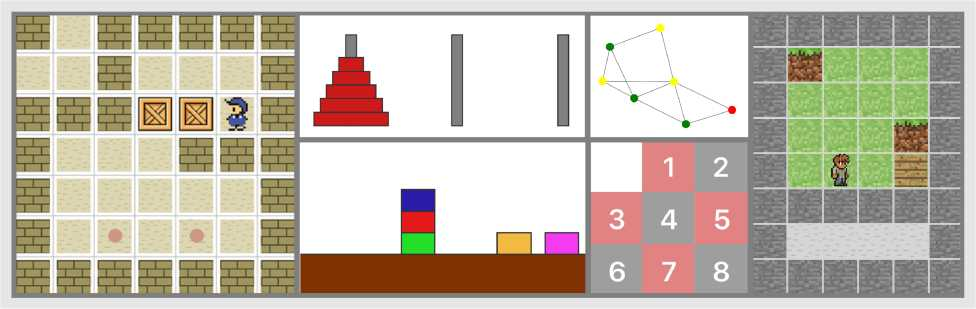
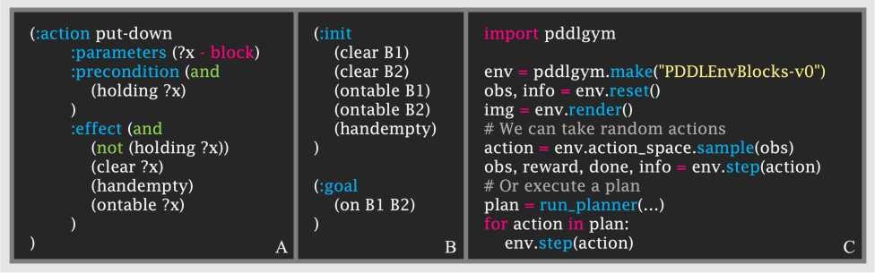
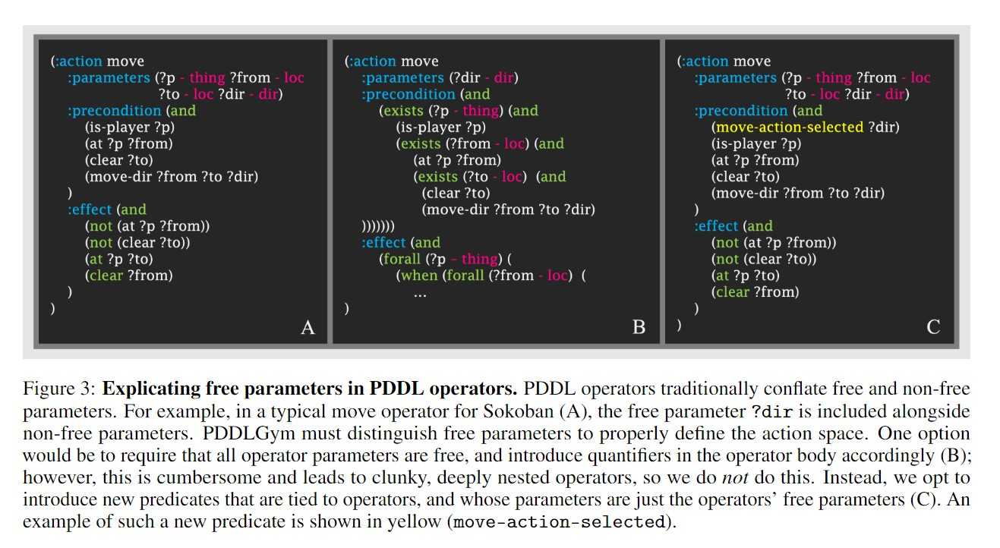
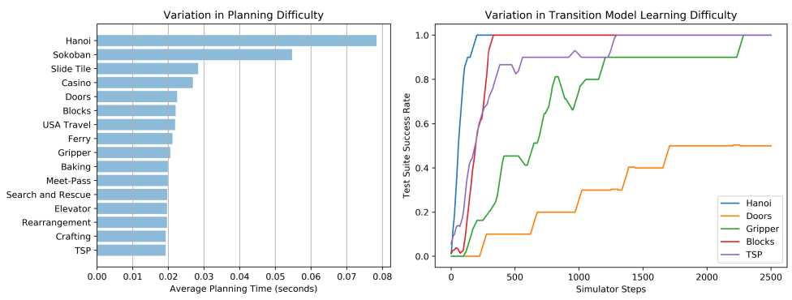

[TOC]

# PDDLGYM

[PDDLGym: Gym Environments from PDDL Problems](https://arxiv.org/abs/2002.06432)

https://github.com/tomsilver/pddlgym

https://github.com/ronuchit/pddlgym_planners

# PDDLGYM : GYMENVIRONMENTS FROMPDDL PROBLEMS

麻省理工学院计算机科学与人工智能实验室（tslvr，[ronuchitj@mit.edu](mailto:ronuchitj@mit.edu)

2020年9月17日

**abstract**

我们介绍了PDDLGym，这是一个从PDDL域和问题自动构建OpenAI Gym环境的框架。PDDLGym中的观察和动作是关系性的，这使得该框架特别适合于关系强化学习和关系顺序决策的研究。PDDLGym还可用作通用框架，用于通过简洁，熟悉的规范语言快速构建众多多样的基准。我们讨论了设计决策和实施细节，并根据规划和模型学习难度说明了20种内置环境之间的经验差异。我们希望PDDLGym将促进强化学习社区（Gym的诞生）和AI规划社区（产生PDDL）之间的桥梁。

## **1引言**

基准的建立往往加速了人工智能的各个子域的研究进展[[1，](#bookmark3)[2，](#bookmark4)[3\] ](#bookmark5)。在顺序决策任务中，诸如OpenAI Gym [[4\]中](#bookmark6)的环境和国际计划大赛（IPC）[[5\]中](#bookmark7)的计划任务之类的基准推动了巨大的进步。Gym定义了代理与环境交互的标准化方法，从而可以轻松比较各种强化学习算法。IPC提供了一组计划域和用计划域定义语言（PDDL）[[6\]](#bookmark8)编写的问题，从而可以轻松比较各种符号计划器。

在这项工作中，我们介绍了PDDLGym，这是一个将Gym和PDDL的元素结合在一起的开源框架。**PDDLGym是一个Python库，可****根据****PDDL域和问题文件****自动创建Gym环境****。**

该库位于[https://github.com/tomsilver/pddlgym。](https://github.com/tomsilver/pddlgym)拉请求是欢迎的！

与Gym一样，PDDLGym允许代理与环境之间发生周期性的闭环交互。特工会从环境中接收到一个观察结果，并做出行动，重复此循环直到情节结束。像在PDDL中一样，PDDLGym从根本上是相关的：观察是对象上的地面关系集（例如，在（盘子，桌子上）），动作是与对象一起接地的模板（例如pick（盘子））。因此，PDDLGym特别适合用于关系学习和顺序决策研究。有关当前在PDDLGym中实现的某些环境的渲染，请参见图[1](#bookmark9)；对于代码示例，请参见图[2](#bookmark10)。

强化学习中使用的Gym API定义了代理与环境之间的硬性界限。特别是，代理*仅*通过采取行动并接收观察结果来与环境交互。环境执行一个功能步骤，该功能步骤使代理赋予的操作使状态前进；步骤定义环境的过渡模型。同样，PDDL域通过其运算符对转换模型进行编码。但是，在典型用法中，PDDL被理解为完全存在于代理的“思想”中。然后，一个单独的过程负责将计划转变为代理可以在世界范围内执行的动作。

PDDLGym违反了这一约定：在PDDLGym中，PDDL域和问题牢固地位于代理程序-环境边界的环境侧。环境使用PDDL文件来实现步骤功能，该功能可在给定操作的情况下提升状态。因此，最好*将*PDDLGym理解为PDDL的目的。在实现方面，此用途具有微妙但重要的含义，在（[§2.2）中进行](#bookmark11)了讨论。

图1：**在PDDLGym中实现的一些环境示例。**从左上方：推箱子，河内，街区，旅行推销员（TSP），滑瓦和手工制作。

图2：**PDDLGym代码示例。**PDDLGym环境的特征在于PDDL域文件和PDDL问题文件列表。（A）PDDL域文件中的一个操作符。（B）一段简单的PDDL问题文件的摘录。（C）在使用PDDL域和问题文件注册名称为“ PDDLEnvBlocks-v0”的环境之后，我们只需几行Python就可以与此PDDLGym环境进行交互。

PDDLGym具有三个主要用途：

*（1）促进为关系域中的顺序决策创建众多多样的基准。* PDDLGym允许在PDDL中定义任务，从而根据PDDL文件自动构建Gym环境。PDDL提供了一种用于描述域的紧凑型符号语言，否则直接通过Gym API进行定义可能会很繁琐且重复。

（2）   *桥梁加固学习与规划研究。*PDDLGym使计划研究人员和机器学习研究人员可以轻松地在完全相同的一组基准上测试他们的方法，并且可以利用这两种方法的优势来开发技术。此外，由于PDDLGym包含内置的域和问题，因此执行Apple到Apple的比较很简单，而不必从不同的来源收集第三方代码（另请参见[[7\]](#bookmark12)）。

（3）   *促进关系领域中顺序决策的研究。*在我们自己的研究中，我们发现PDDLGym在研究探索提升操作员学习[[8\]](#bookmark13)，分层目标条件策略学习[[9\]](#bookmark14)和状态抽象[[10\]时](#bookmark15)非常有用。其它可以使用PDDLGym受益开放研究的问题包括：关系强化学习[[11，](#bookmark16)[12，](#bookmark17)[13\] ](#bookmark18)，学习运营商的符号描述[[11，](#bookmark16)[14，](#bookmark19)[15\] ](#bookmark20)，发现相关的转换规则进行有效的规划[[16，](#bookmark21)[17\] ](#bookmark22)，和学习取消选择[[18，19 ](#bookmark23)[，](#bookmark24)[20，](#bookmark25)[21\] ](#bookmark26)。

本文的其余部分安排如下。（[第2节）](#bookmark27)讨论了PDDLGym的设计决策和实现细节。在（[§3）中](#bookmark28)，我们概述了内置的PDDLGym域，并提供了基本的经验结果，以说明它们在规划和学习难度方面的多样性。最后，在（[§4）中](#bookmark29)，我们讨论了扩展和改进PDDLGym的途径。

Gym API使用三种基本方法将环境定义为Python类：

__init__，用于初始化环境；

**reset**，开始新的情节并返回观察值；

**step**（步骤1），它从代理采取行动，前进当前状态，并返回观察值，奖励，指示情节是否完成的布尔值以及可选的调试信息。

API还包括其他次要方法，例如，处理渲染和随机种子。

最后，需要在Gym环境中实现一个**action_space**（代表可能的动作的空间）和一个**observation_space**（代表可能的观察的空间）。

接下来，我们将简要概述PDDL文件，然后描述如何在PDDLGym中定义动作和观察空间。

再者，我们将讨论三种基本方法的实现。有关PDDLGym中使用的主要数据结构的实现细节，请参见代码中的**structs.py**。

### **2.1背景：PDDL域和问题文件**

PDDL文件有两种类型：域文件和问题文件。单个*基准测试*的特征是一个域文件和多个问题文件。

PDDL域文件包括*谓词*（带有占位符变量（例如，在？x？y上）的命名关系）和*运算符。*算子由名称，参数列表，描述算子5 s前提的参数上的一阶逻辑公式和描述算子5 s效果的参数上的一阶逻辑公式组成。前提条件和效果公式的形式通常受PDDL版本的限制。PDDL的早期版本仅允许地面谓词的连接[[22\]](#bookmark31)；更高版本也允许析取和量词[[23\]](#bookmark32)。有关PDDL运算符的示例，请参见图[2A](#bookmark10)。

PDDL问题文件包括一组*对象*（命名实体），*初始状态*和*目标。*初始状态是一组带有对象的谓词。根据封闭世界的假设，任何不在状态中的地面谓词都被假定为假。目标是对象上的一阶逻辑公式（目标的形式受PDDL版本的限制，例如运算符，前提条件和效果）。请注意，PDDL（和PDDLGym）还允许*键入*对象和变量*。*有关PDDL问题文件的部分示例，请参见图[2B](#bookmark10)。

### **2.2观察和行动空间**

PDDLGym中的每个观察对象obs具有三个组件，它们镜像了PDDL问题文件的组件：obs.objects是包含问题中存在的所有对象的集合；obs.goal包含问题目标；obs.literals是在当前状态下为true的所有基础谓词的集合。这些观察完全封装了环境状态，即完全观察了PDDLGym环境。观察空间是所有可能的地面谓词以及静态对象和目标的幂集。这种功率集通常是巨大的。幸运的是，通常不需要显式地计算它。观察空间也可以视为离散空间，其大小等于此幂集的大小；因为这个空间很大，

PDDLGym环境的操作空间是整个框架中更微妙的方面之一，有两种可能的选择。在资源库中提供了同时服用途径说明，自述中，在“第3步：注册健身房环境”一节。

如果只想将现成的PDDL文件与PDDLGym一起使用，则第一种方法是合适的。可以通过在环境注册中将operator_as_actions设置为True来做到这一点，这告诉PDDLGym PDDL域文件中存在的运算符本身应被视为环境中的动作，并由这些运算符的参数进行参数化。

建议使用第二种途径进行更认真的研究，这是由于经典AI计划中的“操作员”与强化学习中的“动作”之间的语义差异。在AI规划中，动作通常等同于地面操作员，即其参数绑定到对象的操作员。但是，在大多数PDDL域中，只有一些操作员参数是*空闲的*（就控制代理而言）。其余参数包含在运算符中，因为它们是前提条件/效果表达式的一部分，但可以从当前状态或自由参数的选择中得出。PDDL本身不区分自由参数和非自由参数。例如，考虑图[3A](#bookmark34)中所示的推箱子的运营商。此运算符表示玩家（？p）从某个单元格（？from）向另一个单元格（？to）沿某个方向（？dir）移动的规则。在真实的推箱子游戏中，代理商做出的唯一选择是移动的方向-只有？dir参数是自由的。玩家的？p总是相同的，？from是由代理在当前状态下的位置定义的，？to可以从？from和代理对？dir的选择中得出。为了正确地为PDDLGym环境定义动作空间，我们必须明确地将自由参数与non-free ones区分。

图3：**在PDDL运算符中复制free operators。**传统上，PDDL运算符将自由和非自由参数混合在一起。例如，在推箱子（A）的典型移动运算符中，自由参数？dir与非自由参数一起被包括在内。PDDLGym必须区分自由参数以正确定义操作空间。一种选择是要求所有操作员参数都是自由的，并在操作员主体中相应地引入量词（B）；但是，这很麻烦，并且会导致笨拙，深度嵌套的运算符，因此我们*不*这样做。相反，我们选择引入与运算符相关的新谓词，它们的参数只是运算符的自由参数（C）。这种新谓词的示例以黄色显示（已选择移动动作）。

一种选择是要求操作员参数全部free。然后可以使用量词将非自由参数折叠为前提条件和效果[[23\]](#bookmark32)；有关示例，请参见图[3B](#bookmark34)。但是，这很麻烦，并且导致笨拙，深度嵌套的运算符。相反，我们选择引入代表操作符的谓词，这些谓词的变量就是这些操作符的自由参数。然后，我们将这些谓词包括在各个运算符的前提中；见图[3C](#bookmark34)举个例子 这样做只需要对现有PDDL文件进行最小的更改，并且不会影响可读性，但是需要添加有关代理程序-环境边界的域知识。请注意，此领域知识等同于定义一个动作空间，这在强化学习中很常见，并不是一个强有力的假设。在这种情况下，PDDLGym环境的动作空间是新引入谓词的所有可能基础上的离散空间。

从PDDLGym环境的动作空间进行采样时，PDDLGym将仅自动采样*有效*动作，即满足某些操作员先决条件的动作。使用Fast Downward的翻译器[[24\]](#bookmark35)进行有效性检查，可以在大型问题实例中增加不可忽略的开销。

### **2.3初始化和重置环境**

PDDLGym环境由PDDL域文件和PDDL问题文件列表来参数化。为了便于研究，每个PDDLGym环境都与该环境的*测试*版本相关联，其中域文件是相同的，但问题文件是不同的（例如，它们可以对更复杂的计划任务进行编码，以衡量可概括性）。在环境初始化期间，所有的PDDL文件都被解析为Python对象。

为此，我们使用了自定义PDDL解析器。调用reset时，将随机选择一个问题实例[。](#bookmark37)[1](#bookmark38) 该问题实例的初始状态是环境的状态。

为了方便起见，reset还返回（在调试信息中）指向当前情节的PDDL域和问题文件的路径。这使用户可以轻松地使用符号计划器并在环境中执行生成的计划。

有关使用Fast-Forward [[25\]](#bookmark39)的示例，请参见PDDLGym [Github存储库中](https://github.com/tomsilver/pddlgym)的自述文件 。

### **2.4实施**step方法

PDDLGym环境的step方法采取一个动作，更新环境状态，并返回观察，奖励，完成的布尔值和调试信息。为了确定状态更新，PDDLGym检查给定当前状态和操作是否满足任何PDDL运算符的先决条件。请注意，不可能“意外地匹配”不想要的运算符：每个运算符都有一个唯一的前提条件，如图[3C](#bookmark34)所示，该前提条件是根据传入的动作自动生成的。由于操作与运算符不同（第[2.2节）](#bookmark11)，因此

**precondition satisfaction check** is nontrivial；non-free parameters must be bound. 。我们已经实现了两个推理后端来执行此检查。

第一个是类型化SLD解析的Python实现，当查询仅涉及连接时，这是默认选择。

第二个是SWI Prolog [[26\]](#bookmark41)的包装，它使我们能够处理涉及析取和量词的更复杂的前提条件。后者比前者更慢，但更通用。当没有操作员前提满足给定操作时，默认情况下状态保持不变。在某些应用中，如果没有先决条件，则可能会引发错误；可选的初始化参数raise_error_on_invalid_action允许此行为。

PDDLGym中的奖励是稀疏的和二进制的。特别地，当达到问题目标时，奖励为1.0，否则为0.0。同样，达到目标时，布尔布尔值为True，否则为False。（实际上，通常使用最大情节长度。）

如果基础的PDDL域具有概率效应，如PPDDL [[27\]](#bookmark42)，则步进方法将对此进行适当解析，并根据给定的概率分布选择一种效应。如果给定的概率之和不为1，则会添加默认的琐碎效果。

### **2.5发展状况**

在代码行方面，大部分PDDLGym专用于PDDL文件的解析和推断（在步骤中使用）。我们将继续开发这两种功能，以便支持更广泛的PDDL域。

PDDLGym支持的PDDL 1.2的方面包括STRIPS，分层类型，等式，量词，常量和派生谓词。不支持的值得注意的功能包括条件效果和操作成本。不支持更高版本的PDDL（例如数字流利）。

我们的短期目标是为PDDL 1.2提供全面支持。我们发现，PDDLGym已经很好地支持了许多标准PDDL域。参见（第[3](#bookmark28)节[）](#bookmark28)以获得概述。我们欢迎通过Github页面或电子邮件上创建的问题来请求功能和扩展。本文顶部提供了作者5个电子邮件地址。

## **3 PDDLGym按数字**

在本节中，我们从更新本报告的最后日期（2020年9月17日）开始，概述PDDLGym中内置的域。然后，我们提供一些实验结果，从而根据规划和模型学习难度来深入了解这些领域之间的差异。所有实验都是在一台具有32GB RAM和2.9GHz Intel Core i9处理器的笔记本电脑上进行的。

### **3.1环境概述**

目前，PDDLGym中内置了20个域。大多数域都改编自现有的PDDL存储库；其余的是我们发现自己的研究中有用的基准。我们已经为11个域实现了自定义呈现（示例请参见图[1](#bookmark9)）。表[1](#bookmark46)列出了所有环境，其来源以及它们的每秒平均帧数（FPS）的列表，这些数据是通过对10个时间步长的100个情节执行随机策略而计算的，没有任何渲染。

### **3.2环境难度的变化**

现在，我们提供一些结果，说明内置在PDDLGym中的域之间的差异。我们研究了两个变化轴：计划难度和学习过渡模型的难度。

图[4](#bookmark48)（左）显示了快进[[25\]](#bookmark39)所花费的平均时间。在每个确定性环境中找到计划，并在所有问题实例中平均。结果显示计划时间范围很大，最困难的区域（仓库，为清晰起见从图中省略）比最简单的区域（TSP）需要两个数量级的时间。结果还表明，从现代计划的角度来看，许多包含的域相对“容易”。但是，即使在这些简单的领域中，也要解决许多有趣的挑战，例如从交互数据中学习真正的PDDL运算符，或者定义适合于学习的良好状态抽象。如果需要，人们总是可以提出更大的问题实例，以突破现代计划者的极限。

图[4](#bookmark48)（右）提供了在某些环境中学习过渡模型的难度的见解。对于每种环境，代理都会针对25级地平线执行随机策略。观察到的过渡将用于学习过渡模型，然后将其用于一系列测试问题的计划。所报告的已解决测试问题的比例被报告为学习的过渡模型的指标。为了学习过渡模型，我们使用一阶逻辑决策树（FOLDT）学习[[32\]](#bookmark49)。为了清楚起见，对五个域进行了可视化；在其余的几个中，可比的

图4：**PDDLGym环境之间的差异。**PDDLGym中内置的PDDL域和问题在计划难度（左）和模型学习难度（右）方面有很大不同。有关详细信息，请参见文本。为了清晰起见，省略了其中一个领域Depot，但比最简单的领域（TSP）需要多两个数量级的计划时间。

对于所示的方法，但其他方法（包括烘焙，仓库和推箱子）对于我们的学习方法来说比较困难：FOLDT学习无法在合理的时间内找到适合数据的模型。当然，模型学习的难度因学习方法和探索策略的不同而有很大差异。我们在这里实施了简单的策略来显示这些结果，但是这些将来的研究途径正是我们希望通过PDDLGym实现的那种途径。

我们介绍了PDDLGym，这是一个开放源代码的Python框架，可以从PDDL域和问题文件自动创建OpenAI Gym环境。我们的经验结果表明，内置环境之间存在相当大的差异。我们在关系顺序决策和强化学习的研究中一直积极使用PDDLGym。我们还希望将PDDLGym与其他相关的开源框架（尤其是Planning.domains [[7\]中](#bookmark12)的PDDL集合和工具）进行接口连接，以便用户只需指定指向PDDL文件存储库的URL（以及有关自由参数的一些特定于域的信息）。

我们期待着收集社区的反馈，并相应地扩展可用环境和功能的集合。

相关[^LOGIC]和文献[^POMC]。

**参考**

[^LOGIC]: GICystems

[^POMC]: Checking

