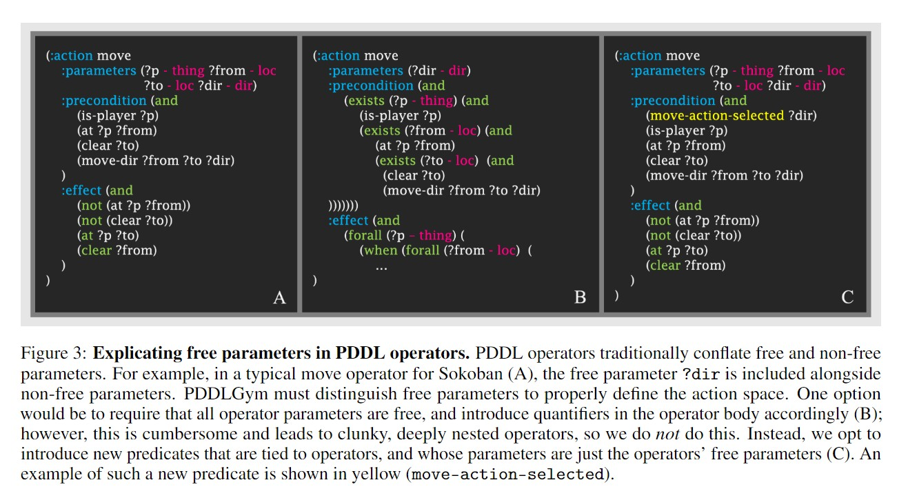

[TOC]

# PDDLGYM

[PDDLGym: Gym Environments from PDDL Problems](https://arxiv.org/abs/2002.06432)

https://github.com/tomsilver/pddlgym

https://github.com/ronuchit/pddlgym_planners

## PDDLGym：基于PDDL问题的Gym环境

麻省理工学院计算机科学与人工智能实验室（tslvr，[ronuchitj@mit.edu](mailto:ronuchitj@mit.edu)）

2020年9月17日

**摘要**

	本文提出PDDLGym，一个能够依据PDDL（规划域定义语言，Planning Domain Definition Language）域文件与问题文件自动构建OpenAI Gym环境的开源框架。在PDDLGym中，观察与动作均以关系性表征呈现，从而使其特别适用于关系强化学习及关系序列决策的相关研究。与此同时，PDDLGym亦可作为一种通用框架，借助简洁且规范的描述语言快速构建多样化的基准测试集。本文详细阐述了该框架的设计决策与实现细节，并基于规划难度与模型学习难度两个维度，对内置的20种环境之间的经验性差异进行了深入分析。我们期望PDDLGym能够架设起强化学习社区（催生Gym之领域）与AI规划社区（催生PDDL之领域）之间的桥梁。

## **1 引言**

基准测试的建立往往能够加速人工智能各子领域的研究进程[[1，](#bookmark3)[2，](#bookmark4)[3\] ](#bookmark5)。在序列决策任务中，诸如OpenAI Gym [[4\]](#bookmark6)中的环境与国际规划大赛（IPC）[[5\]](#bookmark7)中的规划任务等基准，极大地推动了相关领域的蓬勃发展。Gym定义了智能体与环境交互的标准化接口，从而便于对各种强化学习算法进行对比评估。IPC则提供了一组采用规划域定义语言（PDDL）[[6\]](#bookmark8)编写的规划域与问题实例，进而便于对不同符号规划器展开系统性的比较分析。

在本项工作中，我们介绍PDDLGym，一个融合Gym与PDDL元素的开源框架。**PDDLGym是一个Python库，能够根据PDDL域文件与问题文件自动创建Gym环境。**

该库托管于[https://github.com/tomsilver/pddlgym。](https://github.com/tomsilver/pddlgym)欢迎提交拉取请求（Pull Request）！

与Gym类似，PDDLGym支持智能体与环境之间进行周期性的闭环交互：智能体从环境接收观察结果，执行动作，如此循环直至情节终止。与PDDL一致，PDDLGym在本质上是关系性的：观察结果是基于对象的具体化关系集合（例如，on(盘子, 桌子上)），动作则是与对象绑定的模板化操作（例如，pick(盘子)）。因此，PDDLGym特别适用于关系学习与序列决策的相关研究。关于当前PDDLGym中部分环境的可视化渲染效果，参见图[1](#bookmark9)；代码示例参见图[2](#bookmark10)。

强化学习中所使用的Gym API定义了智能体与环境之间的明确界限。具体而言，智能体*仅*通过执行动作与接收观察结果来与环境进行交互。环境执行一个步进函数（step），该函数根据智能体施加的动作推进状态；该函数定义了环境的转移模型。类似地，PDDL域通过其运算符对转移模型进行编码。然而，在典型用法中，PDDL被理解为完全存在于智能体的"思维"之中，随后由独立的过程负责将规划转化为智能体在现实世界中可执行的动作序列。

PDDLGym打破了这一惯例：在PDDLGym中，PDDL域与问题被牢固地置于智能体-环境边界的环境一侧。环境利用PDDL文件实现步进（step）功能，从而在给定动作的条件下推进状态。因此，将PDDLGym理解为对PDDL用途的一种重构更为恰当。在实现层面，这一用途具有微妙但重要的含义，相关讨论参见第[2.2节](#bookmark11)。

图1：**PDDLGym中实现的部分环境示例。** 从左上角起依次为：推箱子（Sokoban）、河内塔（Towers of Hanoi）、积木世界（Blocks World）、旅行商问题（TSP）、数字华容道（Sliding Puzzle）以及手工制作（Crafting）。

图2：**PDDLGym代码示例。** PDDLGym环境由PDDL域文件与PDDL问题文件列表共同定义。（A）PDDL域文件中的一个操作符示例。（B）一段简洁的PDDL问题文件摘录。（C）在使用PDDL域文件与问题文件注册名为"PDDLEnvBlocks-v0"的环境后，仅需数行Python代码即可与此PDDLGym环境进行交互。

PDDLGym具有三个主要用途：

**（1）促进为关系域中的序列决策创建多样化的基准测试集。** PDDLGym允许在PDDL中定义任务，从而依据PDDL文件自动构建Gym环境。PDDL提供了一种用于描述域的紧凑符号语言，而直接通过Gym API进行定义则可能显得繁琐且冗余。

**（2）搭建强化学习与规划研究之间的桥梁。** PDDLGym使规划研究人员与机器学习研究人员能够在完全相同的基准集上测试各自的方法，并可融合两种方法的优势开发新技术。此外，由于PDDLGym包含内置的域与问题，因此进行同类比较（Apple-to-Apple comparison）时无需从不同来源收集第三方代码（另参见[[7\]](#bookmark12)）。

**（3）促进关系域中序列决策的研究。** 在我们自身的研究实践中，我们发现PDDLGym在探索驱动的操作符学习[[8\]](#bookmark13)、分层目标条件策略学习[[9\]](#bookmark14)以及状态抽象[[10\]](#bookmark15)等方面具有重要价值。其他可能受益于PDDLGym的开放性研究问题包括：关系强化学习[[11，](#bookmark16)[12，](#bookmark17)[13\] ](#bookmark18)，操作符符号描述的自动学习[[11，](#bookmark16)[14，](#bookmark19)[15\] ](#bookmark20)，发现相关转移规则以促进高效规划[[16，](#bookmark21)[17\] ](#bookmark22)，以及选择性学习（learning unselecting）[[18，19](#bookmark23)[，](#bookmark24)[20，](#bookmark25)[21\] ](#bookmark26)。

本文的其余部分组织结构如下。第[2节](#bookmark27)讨论PDDLGym的设计决策与实现细节。第[3节](#bookmark28)概述内置的PDDLGym域，并提供基础性经验结果，以阐明这些域在规划难度与学习难度方面的多样性。最后，第[4节](#bookmark29)探讨扩展与改进PDDLGym的潜在途径。

Gym API通过三种核心方法将环境定义为Python类：

- **__init__**：用于初始化环境；
- **reset**：开始新的情节（episode）并返回观察值；
- **step**：从智能体接收动作，推进当前状态，并返回观察值、奖励、指示情节是否完成的布尔值以及可选的调试信息。

该API还包含其他辅助方法，例如处理渲染与随机种子的相关方法。

最后，Gym环境需要实现一个**action_space**（用以表示可能的动作空间）与一个**observation_space**（用以表示可能的观察空间）。

接下来，我们将简要概述PDDL文件的基本结构，然后详细阐述PDDLGym中动作空间与观察空间的定义方式。

随后，我们将讨论上述三种基本方法的具体实现。关于PDDLGym中主要数据结构的实现细节，可参阅代码中的**structs.py**文件。

### **2.1背景：PDDL域与问题文件**

PDDL文件分为两种类型：域文件与问题文件。单个*基准测试*由一个域文件与多个问题文件共同定义。

PDDL域文件包含*谓词*（带有占位符变量的命名关系，例如 on(?x, ?y)）与*运算符*。运算符由名称、参数列表、描述运算符前提条件的一阶逻辑公式（作用于参数）以及描述运算符效果的一阶逻辑公式（作用于参数）构成。前提条件与效果公式的形式通常受PDDL版本的限制。PDDL的早期版本仅允许基础谓词的合取[[22\]](#bookmark31)；更高版本则支持析取与量词[[23\]](#bookmark32)。PDDL运算符的示例参见图[2A](#bookmark10)。

PDDL问题文件包括一组*对象*（命名实体）、*初始状态*与*目标*。初始状态是一组带有对象的谓词。依据封闭世界假设（Closed-World Assumption），任何不在状态中的基化谓词均被视为假。目标是对象上的一阶逻辑公式（目标的形式受PDDL版本的限制，例如运算符、前提条件与效果）。值得注意的是，PDDL（以及PDDLGym）还允许对对象与变量进行*类型化*。有关PDDL问题文件的部分示例，请参见图[2B](#bookmark10)。

### **2.2观察和行动空间**

PDDLGym中的每个观察对象 obs 包含三个组件，这些组件镜像了PDDL问题文件的组成结构：obs.objects 是问题中所有对象的集合；obs.goal 包含问题目标；obs.literals 是在当前状态下为真的所有基化谓词的集合。上述观察结果完全封装了环境状态，即PDDLGym环境被完全观察。观察空间是所有可能的基化谓词以及静态对象与目标的幂集。该幂集通常规模庞大，但幸运的是，通常无需对其进行显式计算。观察空间亦可视为离散空间，其大小等于该幂集的基数。

PDDLGym环境的动作空间是框架中较为微妙的方面之一，存在两种可选方案。代码仓库的README文档中，在"第3步：注册Gym环境"一节提供了这两种途径的详细说明。

如果仅希望将现成的PDDL文件与PDDLGym配合使用，则第一种方法较为适宜。具体而言，在环境注册时将 operator_as_actions 设置为 True，此举告知PDDLGym：PDDL域文件中的运算符本身应被视为环境中的动作，并由这些运算符的参数进行参数化。

建议采用第二种途径以开展更为严谨的研究，这是由于经典AI规划中的"操作符"与强化学习中的"动作"之间存在根本性的语义差异。在AI规划中，动作通常等同于基化操作符，即其参数绑定到具体对象的操作符。然而，在大多数PDDL域中，仅有一部分操作符参数是*自由的*（就控制智能体而言）。其余参数之所以包含在操作符中，是因为它们是前提条件或效果表达式的组成部分，但其取值可从当前状态或自由参数的选择中推导得出。PDDL本身并不区分自由参数与非自由参数。例如，考虑图[3A](#bookmark34)所示的推箱子操作符。该操作符表示玩家(?p)从某一单元格(?from)向另一单元格(?to)沿某个方向(?dir)移动的规则。在实际的推箱子游戏中，智能体做出的唯一选择是移动方向——仅 ?dir 参数是自由的。玩家 ?p 始终保持不变，?from 由智能体在当前状态下的位置决定，?to 则可从 ?from 与智能体对 ?dir 的选择中推导得出。为了正确定义PDDLGym环境的动作空间，我们必须明确区分自由参数与非自由参数。

图3：**PDDL操作符中自由参数的显式化。** 传统上，PDDL操作符将自由参数与非自由参数混合在一起。例如，在推箱子（Sokoban）（A）的典型移动操作符中，自由参数 ?dir 与非自由参数共同包含在内。PDDLGym必须区分自由参数以正确定义动作空间。一种方案是要求所有操作符参数均为自由参数，并在操作符体中相应引入量词（B）；但该方法操作繁琐，且导致笨拙且深度嵌套的操作符结构，因此我们*不*采纳此方案。相反，我们选择引入与操作符相关联的新谓词，其参数仅为操作符的自由参数（C）。此类新谓词的示例以黄色高亮显示（已选中移动动作）。

一种备选方案是要求操作符参数全部为自由参数，随后利用量词将非自由参数折叠为前提条件与效果[[23\]](#bookmark32)；相关示例参见图[3B](#bookmark34)。然而，这种方法操作繁琐，且会导致笨拙且深度嵌套的操作符结构。因此，我们并未采用该方案。相反，我们选择引入代表操作符的谓词，这些谓词的变量即为操作符的自由参数。随后，我们将这些谓词包含在各个操作符的前提条件之中；参见图[3C](#bookmark34)的示例。此做法仅需对现有PDDL文件进行最小程度的修改，且不影响可读性，但需要添加关于智能体-环境边界的领域知识。需要注意的是，该领域知识实质上等同于定义动作空间，这在强化学习中是一种常见操作，并非强假设。在此情况下，PDDLGym环境的动作空间即为新引入谓词的所有可能基化结果所构成的离散空间。

当从PDDLGym环境的动作空间进行采样时，PDDLGym将仅自动采样*有效*动作，即满足某些操作符前提条件的动作。借助Fast Downward的翻译器[[24\]](#bookmark35)进行有效性检查，在大型问题实例中可能引入不可忽略的计算开销。

### **2.3初始化和重置环境**

PDDLGym环境由PDDL域文件与PDDL问题文件列表共同参数化。为便于研究，每个PDDLGym环境均关联一个*测试*版本，其中域文件保持不变，但问题文件有所差异（例如，可对更复杂的规划任务进行编码，以衡量泛化能力）。在环境初始化期间，所有PDDL文件均被解析为Python对象。

为此，我们采用自定义PDDL解析器。调用 reset 时，将随机选择一个问题实例[。](#bookmark37)[1](#bookmark38)该问题实例的初始状态即作为环境的初始状态。

为方便起见，reset 还会在调试信息中返回指向当前情节的PDDL域文件与问题文件的路径。这使得用户可以便捷地使用符号规划器，并在环境中执行所生成的规划方案。

关于使用 Fast-Forward [[25\]](#bookmark39) 的示例，请参见PDDLGym [GitHub存储库](https://github.com/tomsilver/pddlgym)中的README文档。

### **2.4 步进（step）方法的实现**

PDDLGym环境的 step 方法接收一个动作，更新环境状态，并返回观察结果、奖励、表示情节是否完成的布尔值以及调试信息。为确定状态更新，PDDLGym检查在当前状态下，给定动作是否满足任一PDDL操作符的前提条件。值得注意的是，不可能”意外匹配”到不期望的操作符：每个操作符均具有唯一的前提条件（如图[3C](#bookmark34)所示），该前提条件根据传入的动作自动生成。由于动作与操作符并非一一对应（参见第[2.2节）](#bookmark11)，前提条件满足性检查并非平凡问题——非自由参数必须被绑定。我们已实现两个推理后端以执行此检查。

第一个是基于类型化SLD解析的Python实现，当查询仅涉及合取时，此为默认选择。

第二个是SWI Prolog [[26\]](#bookmark41)的封装，它使我们能够处理涉及析取与量词的更为复杂的前提条件。后者虽比前者速度慢，但更具通用性。当没有操作符前提条件满足给定动作时，默认情况下状态保持不变。在某些应用场景中，如果无前提条件可满足，则可引发错误；可选的初始化参数 raise_error_on_invalid_action 用于控制此行为。

PDDLGym中的奖励是稀疏且二进制的。具体而言，当达到问题目标时奖励为1.0，否则为0.0。类似地，当达到目标时完成布尔值为 True，否则为 False（实际使用中通常会设置最大情节长度）。

如果底层PDDL域具备概率性效应（如PPDDL [[27\]](#bookmark42)），step 方法将对此进行适当解析，并根据给定的概率分布选择一种效应。若给定概率之和不为1，则添加默认的平凡效应。

### **2.5 开发现状**

从代码行数的角度来看，PDDLGym的大部分代码专用于PDDL文件的解析与推断（在 step 方法中使用）。我们将持续开发这两种功能，以便支持更广泛的PDDL域。

PDDLGym目前支持的PDDL 1.2特性包括：STRIPS、分层类型、等式、量词、常量以及派生谓词。值得注意的不支持特性包括条件效应与操作成本。此外，更高版本的PDDL（如数值流函数）亦不在支持范围之内。

我们的短期目标是为PDDL 1.2提供全面支持。目前，PDDLGym已较好地支持众多标准PDDL域，概述参见第[3节](#bookmark28)。我们欢迎通过GitHub页面或电子邮件提交功能请求与扩展建议。本文顶部提供了作者的联系邮箱。

## **3 PDDLGym的量化分析**

在本节中，我们首先概述PDDLGym中内置的域（截至本文最新更新日期2020年9月17日）。随后，我们呈现一系列实验结果，以揭示这些域在规划难度与模型学习难度两个维度上的差异性。所有实验均在一台配备32GB RAM与2.9GHz Intel Core i9处理器的笔记本电脑上完成。

### **3.1 环境概述**

目前，PDDLGym中内置了20个域。其中大部分域改编自现有的PDDL存储库；其余域则是我们在自身研究过程中发现具有实用价值的基准测试。我们已经为其中11个域实现了自定义渲染（示例参见图[1](#bookmark9)）。表[1](#bookmark46)列出了所有环境及其来源，以及它们的平均每秒帧数（FPS）——该数据通过对10个时间步长的100个情节执行随机策略（无渲染）计算得出。

### **3.2 环境难度的差异性**

现在，我们提供一系列结果，以阐明PDDLGym内置域之间的差异性。我们考察了两个变化维度：规划难度与转移模型学习的难度。

图[4](#bookmark48)（左）展示了Fast-Forward[[25\]](#bookmark39)在每个确定性环境中寻找规划方案所花费的平均时间，并在所有问题实例上进行平均。结果显示规划时间的分布范围极广：最难区域（Depot，为清晰起见从图中省略）的规划时间比最简单区域（TSP）高出两个数量级。结果同时表明，从现代规划器的视角来看，许多内置域相对”简单”。然而，即便在这些简单的域中，依然存在诸多有趣的挑战，例如从交互数据中学习真正的PDDL操作符，或定义适用于学习的良好状态抽象。如有必要，研究者始终可以构造规模更大的问题实例，以挑战现代规划器的极限。

图[4](#bookmark48)（右）揭示了在某些环境中学习转移模型难度的相关信息。对于每种环境，智能体针对地平线为25的情节执行随机策略。观测到的转移将被用于学习转移模型，随后将该模型应用于一系列测试问题的规划求解。已解决的测试问题比例被报告为所学转移模型的性能指标。为学习转移模型，我们采用一阶逻辑决策树（FOLDT）学习算法[[32\]](#bookmark49)。为清晰起见，仅对五个域进行了可视化呈现；其余域展现出了可比较的结果模式。

图4：**PDDLGym环境之间的差异性。** PDDLGym中内置的PDDL域与问题在规划难度（左图）与模型学习难度（右图）方面展现出显著差异。详细信息请参见正文。为清晰起见，Depot域被省略，但其规划时间比最简单的域（TSP）高出两个数量级。

对于图示的方法而言，其他域（包括Baking、Depot与Sokoban）对我们的学习方法而言较为困难：FOLDT学习算法无法在合理的时间内找到适配数据的模型。当然，模型学习的难度因学习方法与探索策略的不同而存在显著差异。我们在此采取简单策略以展示这些结果，但上述未来的研究方向正是我们期望通过PDDLGym所推动的。

本文介绍了PDDLGym，一个能够依据PDDL域文件与问题文件自动创建OpenAI Gym环境的开源Python框架。我们的经验结果表明，内置环境之间存在相当显著的差异性。我们在关系序列决策与强化学习的研究中一直积极使用PDDLGym。我们还期望将PDDLGym与其他相关开源框架（尤其是Planning.domains [[7\]](#bookmark12)中的PDDL集合与工具）进行对接，使用户仅需指定指向PDDL文件存储库的URL（以及关于自由参数的部分领域特定信息）即可使用。

我们期待收集社区的反馈意见，并据此持续扩展可用的环境与功能集合。

相关文献请参见 [^LOGIC] 与 [^POMC]。

**参考**

[^LOGIC]: GICystems

[^POMC]: Checking

