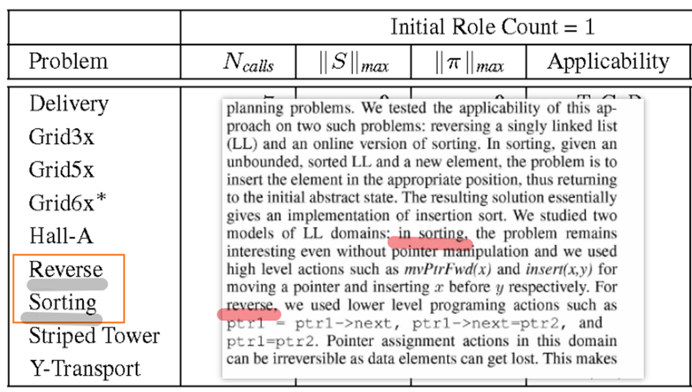
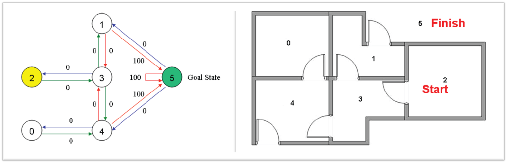

# qnp2ast2program

A QNP Problem is an AOV network,like transitive system迁移系统.policy ：state action。
Samillar to turing machine = algorithm.
Model checking,descripe it in logic like ATL* .
Actually ,many paper use FOND because it is easier.
Maybe a new logic.


1. QNP

```pddl
domain.pddl
probelm_p.pddl
```


2. MyND之类/辣个改进的granphplanner 


2. solution graph (data flow controllor chart)


2. AST


2. Program


Read QNP first paper:
LL domain plan problem  <--->linked list program problem 


Extended LL Domain



```c
c++,java等模板元编程，gennerator
```

- Imperative programming language
Parser tree LLVM:IR C-like program 


- Coq-extraction
Functional problem :OCAML/HASKELL
Why tool

6. CP编译原理知识中，对解析器parser之后AST抽象语法树，进行“类型检查/有效性分析”。甚至现在已经有程序终止性测试软件。
  Maybe using many technology in IC3/nuSMV,format 程序验证/program with branches and loop 终止性测试.https://zybuluo.com/sangyy/note/128535


- 分支：RL Solver交互沟通，就像pddlgym项目一样的qnpgym？**Find an path in the AOV network.
**

下图可以改造为经典Gripper问题

马尔可夫markov无记忆，state--> action,

有论文可以做到有记忆的trajectory --> action，记忆变量就是qnp的数值变量,比如《Reinforcement Learning with Non-Markovian Rewards》

近两年来有一些工作是把深度学习方法用于求解规划问题的,2020 ICAPS main page。
https://icaps20subpages.icaps-conference.org/workshops/prl/
>从概率推理的角度理解强化学习和控制(一） - stone的文章 https://zhuanlan.zhihu.com/p/339881664
Generalized planning with deep reinforcement learning 
Symbolic Plans as High-Level Instructions for Reinforcement Learning。
Learning Neural Search Policies for Classical Planning
近两年来有一些工作是把深度学习方法用于求解规划问题的。
人们普遍认为确定性策略的RL不存在，直到2014年Silver在Derterministic policy gradient algorithm中提出确定性策略。
2015，DeepMind+DQNDDPG算法（continuous control with deep reinforcement learning）

- 分支：iasabelle,Coq辅助证明|"推理"出终止性，modelchecking，软件系统可信性那套

- 逻辑公式演算，谓词等天然形成的Golog类似逻辑式命令式程序运行在prolog上
- 逻辑公式演算还天然形成自然生成OCAML等“函数式编程语言”，具体已经实现的有：Coq 的Extraction 
- DSL，编译原理前端的“语法分析词法分析等形成中间表达”，通过AST等效转换为c-like 程序。（这个没看到在做的论文）


