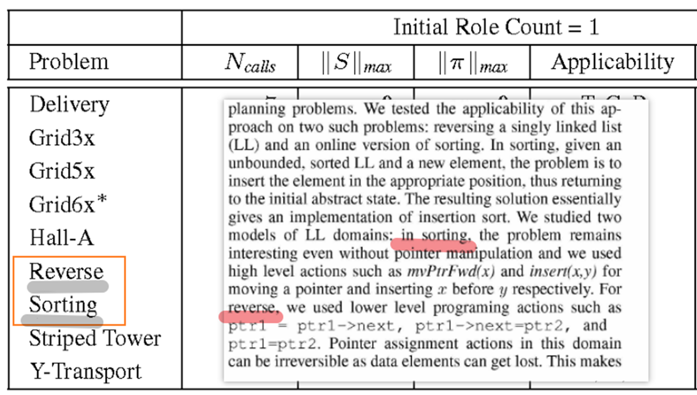
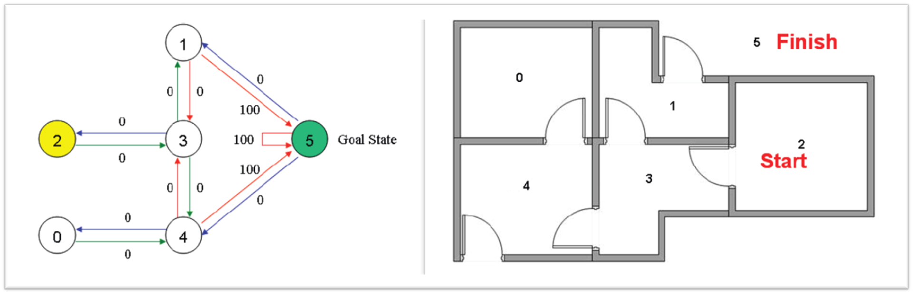

# QNP 到 AST 再到程序生成

一个QNP（Qualitative Numeric Planning）问题本质上构成一个AOV网络（Activity-on-Vertex Network），类似于迁移系统（Transition System），其策略（Policy）定义了从状态到动作的映射关系。这一范式与图灵机模型在算法表示层面具有结构上的相似性。

模型检测（Model Checking）试图以诸如ATL\*（Alternating-time Temporal Logic）之类的逻辑语言来描述此类系统。然而在实际研究中，大量文献采用FOND（Fully Observable Non-Deterministic）框架进行建模，其原因在于FOND相对易于处理。尽管如此，或许有必要探索一种全新的逻辑体系以更精准地刻画QNP问题的本质特性。

---

## 1. QNP 定义

```pddl
domain.pddl
problem_p.pddl
```

## 2. 求解器与规划框架

### 2.1 MyND 类规划器及其改进型 GraphPlanner

MyND 规划器及其改进型的图规划器（GraphPlanner）可用于求解 QNP 问题。

### 2.2 解图（Solution Graph）——数据流控制图（Data Flow Controller Chart）

规划解可以表示为解图（Solution Graph）的形式，其结构类似于数据流控制图。

### 2.3 抽象语法树（AST）

解图可进一步转化为抽象语法树（Abstract Syntax Tree, AST），以便进行结构化分析与程序生成。

### 2.4 程序生成（Program）

基于AST可生成可执行程序，实现从规划到代码的端到端转换。

---

## 3. QNP 原始论文与扩展领域

阅读QNP原始论文可发现，LL领域规划问题与链表程序问题（Linked List Program Problem）之间存在对应关系。

**扩展LL领域（Extended LL Domain）：**



## 4. 程序生成技术路线

### 4.1 命令式编程语言路线

通过解析树（Parser Tree）生成LLVM中间表示（IR），进而翻译为C风格程序。

```c
C++、Java等模板元编程技术，生成器（Generator）
```

### 4.2 函数式编程语言路线

利用Coq的Extraction机制，可将函数式问题提取为OCAML或HASKELL代码。此外，Why工具亦可用于辅助程序验证。

## 5. 类型检查与有效性分析

依据编译原理的相关知识，在对解析器（Parser）生成的抽象语法树（AST）进行处理时，需进行"类型检查"与"有效性分析"。当前学术界已存在针对程序终止性进行判定与测试的软件工具。

可借鉴IC3 / nuSMV等[形式化验证领域的技术](https://zybuluo.com/sangyy/note/128535)，对包含分支与循环的程序进行形式化验证与终止性分析。

## 6. 研究方向分支

### 6.1 强化学习与规划环境的交互

PDDLGym项目构建了强化学习求解器与规划环境之间的交互通信范式。类似地，是否可以构建 QNPGym？其核心目标可概括为：**在AOV网络中寻找一条可行的路径。**



马尔可夫过程具有无记忆性（Memoryless Property），即状态到动作的映射关系（state --> action）。现有文献已实现具有记忆能力的轨迹到动作映射（trajectory --> action），其中记忆变量对应QNP中的数值变量。代表性工作如《Reinforcement Learning with Non-Markovian Rewards》。

近年来，将深度学习方法应用于规划问题求解已成为一个重要的研究方向，详见 [ICAPS 2020 PRL Workshop](https://icaps20subpages.icaps-conference.org/workshops/prl/)。

相关重要文献包括：
- Generalize Planning with Deep Reinforcement Learning
- Symbolic Plans as High-Level Instructions for Reinforcement Learning
- Learning Neural Search Policies for Classical Planning

此外，从概率推理角度理解强化学习与控制的讨论可参考知乎专栏文章：[从概率推理的角度理解强化学习和控制(一）](https://zhuanlan.zhihu.com/p/339881664)。

学术界曾普遍认为确定性策略的强化学习（Deterministic Policy RL）并不存在，直至2014年Silver等人在《Deterministic Policy Gradient Algorithm》中提出确定性策略梯度方法。2015年，DeepMind将深度Q网络（DQN）与确定性策略梯度相结合，提出了DDPG算法（Continuous Control with Deep Reinforcement Learning）。

### 6.2 定理证明与模型检测

Isabelle / Coq辅助定理证明系统可通过"推理"手段判定程序终止性，结合模型检测（Model Checking）技术，构建软件系统可信性验证框架。

### 6.3 逻辑公式与程序生成

- 逻辑公式演算与谓词逻辑天然形成类似Golog的逻辑式命令式程序，运行于Prolog推理引擎之上。
- 逻辑公式演算亦天然适用于生成OCAML等函数式编程语言，这方面的具体实现包括Coq的Extraction机制。
- 领域特定语言（DSL）可借助编译原理前端的"语法分析与词法分析"形成中间表示，进而通过AST等价转换为C风格程序（此方向目前尚缺乏公开的学术论文加以探索）。
