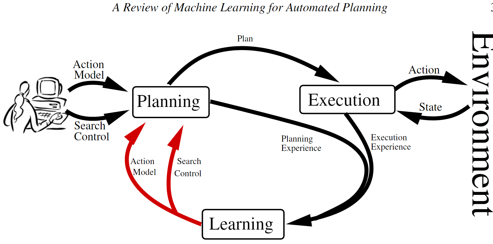

[TOC]

[IPC——国际规划竞赛](https://www.icaps-conference.org/competitions/)

# 机器学习在自动化规划中的应用综述

自动化规划（Automated Planning, AP）作为人工智能的重要分支，致力于研究执行给定任务所需有序行动集合的计算综合问题。AP于20世纪50年代末期诞生，其理论基础源于对状态空间搜索、定理证明及控制理论的系统研究，旨在回应机器人技术与自动演绎领域的实际应用需求。斯坦福研究院开发的问题求解器STRIPS（Fikes与Nilsson, 1971）最终演进为自主机器人Shakey的规划控制组件（Nilsson, 1984），这一发展历程完美诠释了上述多学科交叉影响的协同作用。自Shakey时代延续至今，AP领域已建立起表征规划任务的公认标准规范，并发展出解决此类任务的高效算法体系（Ghallab等, 2004）。

## 学习规划动作模型与搜索控制

自动规划系统需要对规划任务进行精确的形式化描述。此类描述涵盖环境中可执行动作的模型、环境状态的规范说明以及待实现的目标。在现实世界中，执行某一动作可能引发多重结果，环境状态的信息可能不完整，而目标亦可能未被完全定义。对于大多数实际问题而言，预先构建规划任务的精确定义在实际操作中并不可行。

现有规划器通常难以有效扩展规模，或无法提供高质量的解决方案。一般而言，AP中寻找解的过程属于*PSpace-完全*问题（Bylander, 1991, 1994）。当前最先进的规划器试图通过以下策略应对这一计算复杂性：（1）基础化操作（grounding operations），以及（2）在领域无关启发式方法的引导下，通过可达性分析执行搜索过程。然而，当问题中对象数量庞大时，难以在合理时间内遍历所生成的基础搜索树。此外，在启发式信息较为匮乏的情境下（例如某些子目标之间存在强交互作用的领域），该类分析可能产生误导性结果。已有研究表明，特定领域的搜索控制知识能够有效提升规划器在上述情境中的可扩展性（Bacchus与Kabanza, 2000; Nau等, 2003）。定义搜索控制知识通常比定义规划任务本身更具挑战性，因其不仅要求解决规划任务，更需具备领域专门知识。

自AP研究发轫之初，机器学习（Machine Learning, ML）便已成为克服上述两个知识获取难题的有力工具。文献（Zimmerman与Kambhampati, 2003）提供了对受益于ML的AP系统的全面综述。

近年来，利用机器学习改进规划性能的研究兴趣再度兴起。2005年，首届国际规划系统知识工程竞赛（ICKEPS）成功举办；2008年，国际规划竞赛（IPC）正式开设了基于学习的规划器竞赛赛道。此外，国际自动规划与调度会议（ICAPS）亦定期组织关于规划与学习的专题研讨。本综述虽涵盖用于规划与学习的经典系统，但主要聚焦于介绍AP机器学习领域的最新方法与进展。

AP的终极目标是开发能够在面对不同类型问题时自主选择求解策略的求解器。AP所生成的求解器利用环境动力学模型对不同情境中的各类任务进行推理。AP任务由两个核心要素定义：

> The domain, that consists of the set of states of the environment S together with the set of actions A that indicates the transitions between these states.
>
> The problem, that consists of the set of facts s0 ∈ S that indicates the initial state of the environment and the set of facts G ⊆ S that indicates the goals of the AP task.

当AP任务得到正确定义后，从状态转换图中搜索路径似乎是一项经过充分研究且易于解决的问题。然而，在AP领域中，此**状态转换图（state-transition graph）**的规模往往异常庞大，致使搜索过程极为困难。求解此类问题的算法复杂性随状态数量的增长而增加，而状态数量又与问题变量数目（即问题中的对象和谓词数量）呈指数关系。在20世纪90年代中期之前，规划器无法在可接受的时间范围内合成包含十多个动作的规划方案。

20世纪90年代后期，**可达性规划图（reachability planning graph）**（Blum与Furst, 1995）的出现带来了规划领域的重大突破。这一发现使得开发能够在多项式时间内计算的强大领域无关启发式算法成为可能（Hofmann与Nebel, 2001a; Bonet与Geffner, 2001）。后续的里程碑式发现，如搜索地标的自动提取（Porteous与Sebastia, 2004）和符号模式数据库的自动构建（Edelkamp, 2002），进一步提升了规划器的求解速度与解质量。运用这些技术的规划器通常能够在数秒内合成包含上百个动作的规划方案，然而，即便在诸如*Blocksworld*等经过深入研究的经典领域中，AP的可扩展性瓶颈依然存在。

当问题中的对象相对较多时，规划器面临的挑战显著加剧。一方面，当前与领域无关的启发式算法计算代价高昂。在启发式方法具有误导性的领域中，这一问题尤为突出。在这些领域中，规划器将大部分规划时间耗费在无效节点的评估计算上。另一方面，鉴于这些领域无关的技术建立在动作基础化之上，当问题对象和操作参数的数量达到一定规模时，搜索树的规模将变得难以驾驭。这些问题严重制约了领域无关规划器在实际问题中的广泛应用。

物流应用场景需要同时处理数百个对象，涉及数百台车辆和地理位置（Florez等, 2010），这使得在每个搜索节点计算评估函数变得不可行。**机器学习在捕获领域无关技术所忽略的有用控制知识（即捕获有效策略所对应的控制结构）中扮演着重要角色。**

### 关键要素

1. **知识表示。**首先，必须明确机器学习过程将要习得的知识类型。本文聚焦于AP中ML的两个不同目标：为规划器服务的动作模型，以及指导规划器搜索解空间的搜索控制知识。其次，必须决定所学知识的表示方式。在此方面，需做出两个代表性的决策：
   - （a）*表示语言。*用于对目标概念和经验进行编码的表示法。由于AP任务通常以谓词逻辑进行描述，因此这成为最常用的AP概念编码表示语言。此外，描述逻辑或时序逻辑等其他语言也得到了一定程度的应用。
   - （b）*特征空间。*ML算法所考虑的一组用于学习目标概念的特征。在AP中，这些特征通常是用于定义AP任务的动作、状态和目标的领域谓词。

2. **经验获取。**学习样本的收集方式。在AP场景下，学习样本可由规划系统自主收集，亦可由外部智能体（如人类专家）提供。实现学习样本的自主收集机制是一个复杂的过程。使用规划器收集经验面临着尚未解决的难题，主要在于确保使用给定领域模型解决AP问题的可解性与原始AP任务本身同样困难。随机探索策略往往导致AP任务的状态和动作空间采样不足。AP动作通常设有前置条件，这些条件只能由特定的动作序列满足，而此类特定动作序列在随机选择过程中被选中的概率极低。

3. **学习算法。**如何从收集的经验中捕获模式。不同的方法论可用于提取这些模式。归纳学习通过对观测实例进行概括而构建模式；分析学习则利用先验知识和演绎推理构建模式，以解释学习样本中的信息；混合归纳-分析学习结合了上述两种学习技术的优势，兼具两者之长：在先验知识可用时实现更高精度的泛化，同时利用观测学习数据弥补先验知识的不足。在设计用于AP归纳学习的学习算法时，最常用的技术是归纳逻辑编程（ILP），然而，基于AP任务的领域定义，分析和混合方法亦被用于构建对收集学习样本的解释。

4. **所学知识的应用。**自动系统如何从习得的知识中受益。上述三个问题的每个决策都影响着所学知识的质量。若所学知识不完善，则必须通过保证可靠利用的机制加以应用。对于AP而言，知识的不完善可能源于多种情况：某些表示选择可能不足以表达给定领域的相关知识；收集学习经验的策略可能遗漏目标知识的关键样本；学习算法可能陷入局部最优解，或在合理的时间和内存约束内无法捕获目标知识的模式。在这些情况下，直接应用所学知识可能反而破坏规划过程。因此，规划与学习系统需要配备多样化机制，以确保即使在所学知识存在缺陷的情况下，仍能尽可能鲁棒地进行规划。

## 学习规划动作模型

AP算法需要正确且完整的动作模型，以指示世界的状态转换。从头开始构建规划动作模型既困难又耗时，即使对于AP领域的专家而言亦是如此。另一种可行方案是利用机器学习技术，以避免手动编写动作模型的需求。本节回顾了用于自动定义AP动作模型的ML技术，并根据动作效果的随机性和环境状态的可观察性对技术进行分类。

1. **动作效果。**在许多规划任务中，无法假设确定性的世界动态。这在包含随机过程（如抛硬币或掷骰子）或不确定性结果（如现实世界中的机器人导航）的规划领域中尤为典型。
2. **状态可观察性。**在许多规划任务中，处理完整且准确的环境状态描述是不切实际的。由于传感器故障或无法完全感知外部世界，当前状态的某些部分可能存在模糊性或缺失。例如，在现实世界中控制机器人时，这一情况尤为突出。

因此，我们为AP建模定义了四类范式：

- 完全可观察环境中的确定性动作；
- 部分可观察环境中的确定性动作；
- 完全可观察环境中的随机性动作；
- 部分可观察环境中的随机性动作。

尽管存在其他分类可能性，例如根据学习目标进行分组（前置条件、效果、条件效果、结果的概率分布等），但本文认为该分类对于规划目的具有显著价值，因为每一类别对应着不同的规划范式。下表通过列举若干实现示例，总结了规划动作建模系统的分类。该表并非详尽无遗，表中的系统仅作为示例性说明。

| 模型 | 特征 | | 实现方式 |
| --- | --- | --- | --- |
| | 优势 | 劣势 | |
| 确定性效果+完全状态可观察性 | 学习复杂性在理论上可控；高效的规划算法；完整覆盖学习样本 | 表现力欠佳 | LIVE（Shen与Simon, 1989），EXPO（Gil, 1992），OBSERVER（Wang, 1994） |
| 确定性效果+部分状态可观察性 | 完整覆盖学习样本 | 表现力欠佳；规划算法效率低下 | ARMS（Yang等, 2007），（Amir与Chang, 2008），（Mourao等, 2008），LOCM（Cresswell等, 2009） |
| 概率性效果+完全状态可观察性 | 丰富的表现力；高效的规划算法 | 在线学习尚未实现 | （Oates与Cohen, 1996），TRAIL（Benson, 1997），LOPE（Garcia-Martinez与Borrajo, 2000），（Pasula等, 2007），PELA（Jimenez等, 2008） |
| 概率性效果+部分状态可观察性 | 表现力丰富 | 规划和学习的复杂性较高 | （Yoon与Kambhampati, 2007） |

用于规划动作建模的系统实现。

- **完全可观察环境中的确定性动作**（学习任务与实现）

> 重要！和程序生成有关，QNP之类的也是确定性规划，问题假设条件已经给完整，不需要sensor探测不断扩充，不需要探索，不需要走一步看一步。就像围棋一样规则已经定下来。当然也可以实例中学习抽象通用方法，重用已有的不断扩充。

- **部分可观察环境中的确定性动作**（学习任务与实现）

> 不关心

- **完全可观察环境中的随机性动作**（学习任务与实现）

> 不关心

- **部分可观察环境中的随机性动作**（学习任务与实现）

> 不关心

## 学习规划搜索控制知识（类比TF计算图）

学习AP搜索控制知识的四种不同方法：宏动作、广义策略、广义启发式函数和层次分解方法。

### 学习宏动作

1. **知识表示。**宏动作被表示为动作模型中的新动作，因此遵循AP动作的*谓词逻辑*表示。动作*ai*与*aj*组合为一个宏动作。
2. **学习实例。**学习示例是解决方案规划p，该规划由实例化操作序列组成，这些实例化操作对应于状态转换序列，从而完成从初始状态I到目标状态G的变迁。

| 模型 | 特征 | | 实现方式 |
| --- | --- | --- | --- |
| | 优势 | 劣势 | |
| Macro-actions | 对错误的学习知识具有较强鲁棒性；适用于不同的规划器 | 效用问题（Utility problem） | REFLECT（Dawson与Silklossly, 1977），MORRIS（Korf, 1985），MacroFF（Botea等, 2005a），Marvin（Coles与Smith, 2007），（Newton等, 2007） |
| Generalized Policies | 标准关系分类算法 | 整合不同搜索算法和领域无关启发式方法需要工程投入 | （Minton, 1988），PRIAR（Kambhampati与Hendler, 1992），HAMLET（Borrajo与Veloso, 1997），（Khardon, 1999），（Martin与Geffner, 2000），DISTILL（Winner与Veloso, 2003），OBTUSEWEDGE（Yoon等, 2007），CABALA（de la Rosa等, 2007），ROLLER（de la Rosa等, 2008） |
| Generalized Heuristics | 标准关系回归算法；易于集成不同的搜索算法和启发式方法 | 可读性欠佳 | （Yoon等, 2006），（Xu等, 2007） |
| Decomposition Methods | 表现力丰富 | 尚未实现全自动学习 | CAMEL（Ilghami等, 2002），HDL（Ilghami等, 2006），HTNMAKER（Hogg等, 2008） |

Overview of AP systems that benefit from ML for the extraction of domain-specific search control.

3. **学习算法。**学习宏动作的算法从解决方案中提取动作子序列，并通过统计其出现频次以捕获最有用的子序列。通常，提取动作子序列的过程定义了两个参数：
   - *l*，宏动作的长度。*l*的最小值为*2*，因为宏动作至少应包含两个动作。*l*的最大值为学习示例中最长解决方案的长度。实际应用中，该值必须保持较小以具有实用价值。
   - *k*，可从解决方案规划中跳过的操作数。该参数允许学习系统提取宏动作，而宏动作最多可从解决方案中忽略*k*个不相关的中间动作。实践表明，*k*的较小值可减少宏动作的数量，但*k*值过小可能导致遗漏有价值的宏动作发生。
   
   对于这些参数，从具有*n*个动作的规划中提取长度为*l*的宏动作的复杂度为（...）。第一个因素是在大小为*l+k*的窗口内枚举长度为*l*的宏动作的计算成本。第二个因素是在解决方案规划上滑动窗口的成本。类似的方法亦可从部分有序规划中提取宏动作（Botea等, 2005b）。

4. **所学知识的应用。**宏动作可被任何现成的规划器直接使用，因为宏动作可作为标准动作包含在动作模型中。然而，包含宏动作可能对原始动作模型的时间性能和解质量产生负面影响。当宏动作导致搜索深度减小而无法弥补分支因子的增加时，即产生**效用问题（utility problem）**。当前学习宏动作的系统通过实验评估该问题。例如，它们定义一组与目标问题相似的AP问题，如果学习到的宏动作能够改善规划器在这些问题上的表现，则认为将宏动作注入动作模型是一个恰当的选择。这种解决效用问题的方法最初是在学习控制规则的系统中引入的（Minton, 1988）。

#### 实现宏动作

自AP研究起步以来，宏动作便得到了广泛应用。第一个宏动作学习系统是STRIPS（Fikes等, 1972），它利用先前的解决方案规划作为宏动作来解决后续问题，并监控现实世界中规划的执行情况。随后，MORRIS（Korf, 1985）通过添加过滤启发式方法来修剪所生成的宏动作集合，从而扩展了该方法的适用范围。该方法区分了两种类型的宏动作：在搜索过程中频繁出现的S宏，以及发生频率不高但对启发式方法的弱点具有弥补作用的T宏。REFLECT系统（Dawson与Silklossly, 1977）则采用了一种替代方法，基于领域预处理生成宏动作——所有合理的动作组合均被视为宏动作，并通过基本的修剪规则进行过滤。

传统上，宏动作系统在使用宏动作之前，采用离线方法生成和过滤宏动作。然而，某些系统已尝试利用ML在搜索过程中动态过滤宏动作。在（McCluskey, 1987）的研究中，作者使用了块结构；在（Garcia-Duran等, 2006）的工作中，他们运用控制规则来决定宏动作的触发时机。

近期的研究工作成功地将宏动作与最新的启发式搜索规划器进行了集成。这些工作包括IPC-2004的参赛系统Macro FF（Botea等, 2005a, 2007）。该系统通过识别静态连接的抽象组件来提取部分排序的宏动作，然后利用离线过滤技术修剪宏动作列表。同为IPC-2004参赛系统的*Marvin*（Coles与Smith, 2007）采用动作序列记忆技术在线生成宏动作，使规划器无需进行大量探索即可逃离搜索高原。Wizard（Newton等, 2007）运用遗传算法生成并过滤独立于基线规划器的宏动作集合。近来，分析法也被用于学习启发式规划器FF的宏动作（Muise等, 2009）。

### 广义策略

广义策略（Generalized Policies）将规划上下文（有时亦称为元状态）映射至待在该上下文中应用的首选动作。规划上下文通常包含当前状态以及目标集合。通过对每个规划上下文重复应用首选动作，一个精确的广义策略能够在无需任何搜索的情况下解决给定领域中的任意问题。

#### 学习广义策略

**知识表示。**表示规划上下文时，关键问题在于选择**特征空间**。特征空间是用于学习过程的谓词集合。该集合必须足够通用以捕获领域相关的知识，同时必须足够具体以便于学习。在AP中，特征空间通常由描述规划任务当前状态和目标的谓词构成。PRODIGY系统通过引入称为**元谓词（metapredicates）**的额外谓词丰富了特征空间（Minton, 1988）。*元谓词*捕获关于规划上下文的有用知识，例如当前可应用的算子或仍需实现的目标。近期关于学习广义策略的研究已扩展了元谓词的定义，纳入来自启发式规划的理念，例如用于捕获当前状态中*松弛规划的动作*（Yoon等, 2008），或捕获当前状态中*有益动作*集合（de la Rosa等, 2008）。

表示广义策略主要有两种方法：

1. 广义策略可表示为一组规则集合，这些规则捕获了在给定规划上下文中应应用的首选动作。在此框架下，广义策略被形式化定义为元组n = <*L*, *R*>，其中*L*用于描述不同规划环境的一组文字，定义了学习期间使用的特征空间；*R*是一组规则，规则的结论是要应用的动作，而规则前提是一组描述应在何种规划环境下应用该动作的谓词。

2. 广义策略亦可表示为一组带有距离度量的检索实例，通过检索相似实例进行决策。这是基于案例推理（Case-Based Reasoning, CBR）规划器所遵循的表示方法。尽管该表示能够捕获更具体的领域规则性，但其固有缺陷在于需要适当的相似性度量。在处理大量决策实例集合时，效用问题亦十分突出，因为随着集合的增大，搜索相似实例所需的计算时间也随之增加。

广义策略的第二种表示形式被形式化定义为元组n = <*L*, *I*, *D*>，其中*L*用于描述规划环境的一组文字，定义了**特征空间**；*I*是一组元组*i* = <*ci*, *ai*>，其中*ci*是实例化的规划上下文，*ai*是在*ci*中应用的实例化操作；*D*是计算两个不同规划上下文之间距离的距离度量。给定新规划上下文*c*，策略通过计算*I*中最接近的元组并返回其关联动作*ai*来决定要执行的动作*ai*：

$\pi(c) = arg_{a_i} \mathop{min}\limits_{<c_i,a_i>\in I} D(c,c_i)$

两种方法通常以谓词逻辑表示规划上下文，这是因为谓词逻辑是AP任务的自然编码方式。谓词逻辑提供了定义额外谓词的机制，从而能够丰富规划环境的描述。作为这类额外谓词的一个示例，以下展示了Blocksworld领域中wellplaced(Block)谓词的定义（Khardon, 1999）。该概念不在*Blocksworld*领域的原始编码中，但对于定义紧凑的广义策略具有重要价值。

在谓词逻辑中学习此类谓词仍然是一个悬而未决的问题，因此必须对其进行人工编码。使用其他表示语言的规划系统已成功学习到这些概念。研究表明，用于描述对象类别的语言为学习这些概念提供了有用的偏置。这些语言包括**概念语言**（Martin与Geffner, 2000）和**分类语法**（Mcallester与Givan, 1989），它们提供了定义谓词上递归概念的算子，例如闭包算子。例如，在*Blocksworld*领域中，可以运用这些语言以极为紧凑的方式定义*已放置妥当*的块这一有用概念。

使用**时序逻辑**表达规划知识亦被证明是有效的。TLPLAN（Bacchus与Kabanza, 2000）便是这方面的典型案例。遗憾的是，在*时序逻辑中*学习规划知识的问题尚未得到解决。

**学习实例。**学习示例来自针对训练问题的解决方案。学习示例包括元组<*ci*, *oi*+*i*>，其中*ci*是规划上下文，而*oi*+*i*是在上下文*ci*上应用的操作。

**学习算法。**当策略由一组规则构成时，学习任务与归纳逻辑编程（ILP）任务高度相关。学习广义策略可定义为对领域内每个动作的逻辑程序进行归纳。该逻辑程序捕获该动作何时适用。逻辑程序中规则的头由动作名称和参数构成，主体是规划上下文中最能覆盖学习示例的文字子集。该学习任务可通过学习示例的覆盖率实现为启发式搜索。当策略由一组相关实例构成时，学习任务则转变为存储和管理该实例集合。在此情况下，学习大量实例可能适得其反，因为存储和管理它们面临困难，且在确定使用哪个实例解决特定问题时亦存在挑战。解决此问题的一种方法是对存储的实例进行后处理，仅保留最相关的实例。例如，REPLICA（Garcia-Duran等, 出版中）从实例中提取一组原型，而DISTILL（Winner与Veloso, 2003）通过归纳和合并解决方案规划来构建高度压缩的实例库。

**所学知识的应用。**广义策略可用于直接选择在给定规划上下文中应用的动作。然而，当学到的广义策略不完善时，其应用可能无法解决此类早期系统中的问题。那些系统学习了控制规则以指导搜索树的探索。控制规则是IF-THEN规则，用于在树探索过程中进行节点选择、剪枝或排序。一组控制规则可视为*部分*广义策略，因其并未针对所有可能的规划环境提供动作建议。当给定的控制规则建议不完善时，通常会导致规划器无法找到解决方案。为了更有效地利用广义策略，近期的研究工作已将学习到的策略用作Beam-Search或Limited Discrepancy Search等搜索算法中的评估函数。这些搜索算法允许规划器将学习知识提供的指导与其他建议来源（如领域无关的启发式方法）相结合。

#### 实现广义策略

存在一组系统能够归纳学习控制规则，其中归纳逻辑编程（ILP）是最为流行的学习技术。Grasshopper系统（Leckie与Zukerman, 1991）使用FOIL（Quinlan与Cameron-Jones, 1995）来学习指导PRODIGY规划器的控制规则。此外，分析系统也有相关实践：PRODIGY/EBL模块（Minton, 1988）从规划器的正确和错误决策示例中学习搜索控制规则。STATIC（Etzioni, 1993）在无需解决任何问题的情况下获取控制规则，仅利用基于解释的学习（Explanation-Based Learning, EBL）分析动作前提条件与效果之间的关系。为克服纯归纳法和纯分析法的局限性，部分研究者尝试将两者结合：基于该原理的开创性系统是LEX-2（Mitchell等, 1982）和Meta-Lex（Keller, 1987）。AxA-EBL（Cohen, 1990）结合了EBL与归纳法，首先利用EBG学习控制规则，然后通过学习示例对其进行精化。Dolphin（Zelle与Mooney, 1993; Estlin与Mooney, 1996）是AxA-EBL的扩展，采用FOIL作为归纳学习模块。HAMLET（Borrajo与Veloso, 1997）系统将演绎与归纳相结合，首先使用EBL学习通常过于具体或过于笼统的控制规则，然后采用归纳法对规则进行泛化和特化。EvoCK（Aler等, 2002）使用**遗传编程**来进化HAMLET所学习的规则，并生成更有效的搜索控制知识。

学习广义策略的问题最早由Roni Khardon进行研究。Khardon的L2ACT（Khardon, 1999）通过将决策列表学习算法（Rivest, 1987）扩展到关系环境，为*Blocksworld*和*Logistics*领域引入了广义策略。该方法存在两个重要缺陷：（1）依赖人类定义的背景知识来表达关键领域特征，例如Blocksworld上的谓词(b1, b2)或wellplaced(block)；（2）所学习的策略在问题规模增大时泛化能力欠佳。Martin与Geffner通过将广义策略的表示语言从谓词逻辑更改为**概念语言**来学习递归概念，从而解决了*Blocksworld*领域中的上述限制（Martin与Geffner, 2000）。

近年，广义策略学习的适用范围已在多个领域中显著扩展，使得该方法能够与最新的规划器相竞争。这一成就归因于两个新思路：（1）在策略表示语言中包含额外谓词，以捕获更有效的特定领域知识；（2）所学习的策略并非贪婪地直接应用，而是在启发式搜索算法的框架内使用。一个突出的实例是OBTUSEWEDGE系统（Yoon等, 2007），它是IPC-2008学习赛道的最佳学习者。该系统通过松弛规划图丰富当前状态的知识，并利用学习到的策略在最佳优先搜索（Best-First Search）中生成前瞻状态。ROLLER（de la Rosa等, 2008）将学习广义策略的问题定义为两步标准分类过程。第一步，分类器捕获要在不同规划上下文中应用的首选算子；第二步，另一个分类器在给定领域的各种规划上下文中捕获每个算子的首选绑定。这些上下文由从给定状态的松弛规划图中提取的有用操作集、尚未实现的目标以及规划任务的静态谓词定义构成。

此外，还存在通过规划实例集合表示广义策略的系统，即AP领域的CBR系统。基于实例的AP系统通常在各种领域中不具备竞争力，因其固有缺陷在于必须定义在不同类型领域中均能有效工作的适当相似性度量。PRIAR系统（Kambhampati与Hendler, 1992）提出将规划修改与规划生成相结合。OBTUSEWEDGE/ANALOGY（Veloso与Carbonell, 1993）介绍了将派生类比应用于规划的方法。该系统存储规划轨迹，以避免在未来解决问题时重蹈失败路径。为检索相似的规划轨迹，OBTUSEWEDGE/ANALOGY使用最弱前提条件为其建立索引以实现一组目标。基于案例的规划系统PARIS（Bergmann与Wilke, 1996）提出引入抽象技术来组织案例，并将其存储在分层存储器中。该技术提升了案例修改的灵活性，从而增加了单个案例的覆盖范围。DISTILL（Winner与Veloso, 2003）将示例规划合并到称为*dsPlanner*的结构中。DISTILL将规划转换为参数化的if语句，并搜索已存储在*dsPlanner*中的每个if语句以进行合并。若学习到的*dsPlanner*足够精确，则无需搜索即可直接用于解决领域中的任何问题。CABALA（de la Rosa等, 2007）在启发式规划的搜索过程中，利用以对象为中心的解决方案规划（称为类型序列）对节点进行排序。另一位基于实例的学习者REPLICA采用受关系数据挖掘中度量启发的距离度量，实现了**最近原型学习**（Garcia-Duran等, 出版中）。OAKPlan（Serina, 2010）使用紧凑的图结构对规划问题进行编码，该结构提供了规划问题拓扑的详细描述，并允许学习者基于核函数定义选择性检索过程。

在（de la Rosa等, 2009）中，研究者描述了一种能够从以规则或实例为代表的广义策略中受益的规划系统。该系统查询策略以修复**松弛规划**的缺陷，然后将最终松弛规划用作**最佳优先搜索**中的基础宏操作。

## 广义启发式函数

在AP中，启发式函数用于将解决方案规划的搜索聚焦于最具潜力的搜索节点。AP中的启发式函数计算从给定搜索节点到满足目标的节点之间距离的估计值。可从松弛任务的解决方案成本中直接导出与领域无关的AP启发式函数。

AP任务最常见的松弛方法是**忽略操作的删除效果**。当前，大多数启发式规划器依赖该思想实现其启发式方法。由于该方法与领域无关，因此无法捕获规划领域的特异性。

本节阐述如何利用机器学习获取捕获特定领域知识的AP启发式方法，并重点探讨AP中最流行的搜索方法——**前向状态空间搜索**的启发式算法。

### 学习广义启发式函数

**知识表示。**广义启发式函数是从状态s出发，基于动作模型*A*和目标集合*G*，估计从s开始使用*A*中的动作实现目标*G*所需成本的函数*H(s; A; G)*。*谓词逻辑*是编码AP启发式函数的自然选择，因其表达了关于AP任务当前状态、目标和动作的知识。此外，聚焦于对象属性的表示语言，如**分类语法**，亦被采用。

#### 实现广义启发式函数

**学习实例。**学习示例由元组<*si*, *ci*, *gi*>组成，其中*si*是当前状态，*ci*是从状态*si*实现目标*gi*的实际成本。

**学习算法。**学习算法的目标在于泛化学习示例中捕获的成本值。由于需要从学习示例中泛化的目标概念是数值型的，该学习任务对应为回归任务。当学习实例以谓词逻辑表示时，可采用标准的关系回归算法，例如学习关系回归树（Blockeel等, 1998）。

**所学知识的应用。**该方法的主要优势在于，学习到的知识可直接与AP中其他标准指导资源（如领域无关的启发式方法）结合使用。然而，所学知识对人类而言较难理解。

在（Yoon等, 2006）的研究中，作者通过线性回归构建了广义启发式函数。他们学习针对特定领域的校正量 $\Delta(s; A; G) = \sum_i w_i \cdot f_i(s; A; G)$，以修正FF规划器提出的**松弛规划启发式** $RPH(s; A; G)$（Hoffmann与Nebel, 2001b）。这些校正表示为特征的加权线性组合，其中*w_i*是权重，*f_i*表示规划上下文的不同特征。回归示例包括对通过FF规划器获得的不同状态到目标实际距离的观测。由此产生的启发式函数

$H(s; A; G) = RPH(s; A; G) + \Delta(s; A; G)$

提供了更为精确的估计，从而能够捕获特定领域的规则性。

前述方法在搜索算法中使用时忽略了启发式方法的实际性能。即使它在搜索过程中提供了良好的指导，也可能试图学习对启发式方法的校正。在（Xu等, 2007）的研究中，他们提出了一种替代方法，仅在启发式方法在给定搜索策略下具有误导性时才考虑学习。通过该方法学到的启发式函数

$H(s; A; G) = \sum_i w_i \cdot f_i(s; A; G)$

仅致力于很好地区分优良状态与不良状态以在**波束搜索**过程中找到目标，而非精确建模到目标的距离。该方法实现了以下权重学习策略：对于学习问题解决方案中的每个状态*sj*，如果*sj*未包含在搜索的波束中，则存在搜索错误。此时，权重像感知机中的权重一样被更新，使得状态*sj*将被启发式方法优先考虑，并保留在未来的搜索情节的波束中。

## 层次分解方法

将问题分解为更简单的子问题是解决复杂问题可扩展性问题的有效策略。当找到有效的分解方式时，解决子问题的成本之和小于直接解决原始问题的成本。层次任务网络（Hierarchical Task Network, HTN）是对AP任务分解进行建模的最为成熟的研究方法之一。HTN方法结合了规划任务的分层特定领域表示形式以及用于解决问题的领域无关搜索策略。

HTN规划器的输入包括一个动作模型（对一组**原始动作**进行编码，类似于经典规划中使用的STRIPS动作）和一个**任务模型**。任务模型定义了一组**方法**，描述了如何在特定领域中将任务分解为子任务。HTN规划器的工作在于利用任务模型将给定的规划任务分解为更简单的子任务，直到生成一系列原始操作为止。

当前的HTN规划器，如SHOP2（Nau等, 2003），能够超越最先进的领域无关规划器，并为诸多实际应用（如灭火（Castillo等, 2006）、疏散规划（Munoz-Avila等, 1999）和游戏（Nau等, 1998））提供自然的建模框架。然而，定义有效的**分解方法**仍然十分复杂，因为这些方法反映了对领域的深入理解。

### 学习层次分解方法

1. **知识表示。**HTN方法是描述如何将**非原始**任务分解为**原始**任务或更简单的**非原始**任务的过程。一个方法*m*被形式化定义为三元组*m* = <*head*, *preconds*, *subtasks*>，其中*head*表示待分解任务的名称和参数，*preconds*是表示方法前置条件的逻辑公式，*subtasks*是子任务的偏序序列。如果*head(m)*匹配*t*且*preconds(m)*在状态*s*下得到满足，则方法*m*适用于状态*s*和任务*t*。在状态*s*和任务*t*上应用方法*m*的结果是子任务序列*subtasks(m)*。

2. **学习实例。**学习示例包括一组规划问题，即一组<s0, *G*>对以及相应的解决方案 *p* = (*a1, a2, ..., an*)。这些解决方案规划可由人类专家提供，亦可由经典规划器生成。

3. **学习算法。**第3节中介绍的学习动作模型前提条件的算法也可应用于学习HTN方法的前提条件。可通过使用宏的分层抽象来简化HTN方法分解的版本。按照该方法诱导的分解无法充分利用HTN的全部表达能力，包括替代分解、递归概念或循环的定义。目前，尚未存在能够从HTN的全部表达能力中受益的全自动子任务分解学习算法。部分算法需要从人类部分指定的*分解方法*开始，另一些需要分层规划（意味着预先指定的方法），还有一些则需要某些任务（称为**标注任务**）来规定在AP问题的经典版本中定义HTN任务和目标集合*G*的等价关系。

4. **所学知识的应用。**所学知识的泛化水平是使给定HTN描述具有可选择性（可选）的关键问题。学习过于通用的分解方法可能在问题求解时产生无限递归，从而降低HTN规划相对于传统规划的优势。另一方面，学习过于具体的HTN方法则难以有效分解新问题。解决这一折中问题的当前方法是基于针对一系列测试问题测量学习模型的性能。

#### 实现层次分解方法

CAMEL（Ilghami等, 2002）使用**版本空间**算法（Mitchell, 1997）学习HTN*分解方法*及其在平面轨迹上的前提条件。CAMEL被设计用于规划器接收每个任务的多个方法结构域而非它们的前提条件。此处层次结构是事先已知的，学习任务试图确定不同层次结构在何种条件下适用。该方法需要大量规划轨迹才能完全收敛（即完全确定所有方法的前提条件）。CAMEL++（Ilghami等, 2005）使规划器能够在完全了解方法前提条件之前开始进行规划，从而允许规划器使用较少的训练示例即开始解决规划问题。CAMEL和CAMEL++均要求每个输入规划轨迹包含额外信息，以便学习者能够获取模型。在每个分解点，学习者需要拥有所有适用的方法实例，而不仅仅是实际使用的方法实例。

HTN领域学习（HDL）算法（Ilghami等, 2006）在开始时没有任何关于方法的先验信息。它检查由专家问题解决者生成的分层规划轨迹。对于轨迹中的每个分解点，HDL检查是否已存在负责的方法。若不存在，HDL将创建一个新方法并初始化一个新的**版本空间**以捕获其前提条件。实际用于分解相应任务的方法作为正例，而与任务匹配但前提条件失败的方法则作为相应版本空间的负例。

HTN-Maker（Hogg等, 2008）从STRIPS领域模型、STRIPS规划器生成的规划集合*p*以及**标注任务**集合中生成HTN领域模型。**标注任务**是一个三元组 (*n*, *Pre*, *Effects*)，其中*n*是任务，*Pre*是一组称为前提条件的原子公式，*Effects*是一组称为效果的原子公式。HTN-Maker首先通过从初始状态s0开始应用规划*p*中的动作生成状态列表*s* = (*s0*, ..., *sn*)。然后，它遍历这些状态，若存在标注任务的效果匹配状态*si+n*且其前提条件与状态*si+n*匹配，则通过（1）先前学习的方法或（2）若无先前学习的方法则执行原始任务来（向后标注任务的效果）进行分解。

## 不确定性领域中的搜索控制学习

> 用不上

## 强化学习

强化学习（Reinforcement Learning, RL）智能体通过与环境的交互收集经验，并运用适当的算法对这些经验进行处理以生成最优策略（Kaelbling等, 1996; Sutton与Barto, 1998）。构建RL智能体所涉及的决策与AP学习中的决策类似：表示（如何对智能体的环境和行为进行编码）；学习实例（智能体收集经验的策略）；学习算法（何种算法在指定任务上性能最佳）；以及所学知识的利用（智能体如何从所学知识中受益）。与大多数AP学习方法不同，RL为知识获取和知识开发提供了紧密集成的解决方案。这些集成解决方案中的核心问题在于确定何时尝试新动作（探索）以及何时利用已知动作（利用）。这即为著名的**探索-利用困境（exploration-exploitation dilemma）**，其中探索被定义为尝试新的动作，而利用被定义为应用过去已经成功过的动作。

总体而言，对探索-利用困境的良好解答需考虑允许的试验次数。试验次数越多，过早收敛到已知动作（这些动作可能并非最优）的负面影响就越小。有关有效探索-利用策略的综述，请参见（Wiering, 1999; Reynolds, 2002）。

### 基于模型与无模型RL

RL主要关注在环境模型未知的情况下获得最优策略，但实际中存在两种不同的实现路径。**基于模型的RL**需要一个由转移模型和奖励模型构成的环境模型。*基于模型的*RL通常依赖标准的**动态规划**算法（Bellman与Kalaba, 1965; Bertsekas, 1995）来寻找能够提供最优策略的价值/启发式函数。在*基于模型的*RL中，学习被理解为**实时启发式搜索**（Korf, 1990; Bulitko与Lee, 2006; Hernandez与Meseguer, 2007），即利用从仿真中获得的信息对价值/启发式函数进行局部更新。

**无模型RL**不需要环境模型。以下介绍实现*无模型*RL任务的两种不同方法：

- **将学习动作模型与基于模型的RL相结合。**该方法学习环境的转移模型，并应用标准的**动态规划**算法来寻找有效策略。

- **纯无模型的RL。**在不确定性较大的领域中，学习实现目标比学习环境模型更为可行。*纯无模型的*RL算法不将决策建模为状态的函数（如*值/启发式函数*），而是使用<*状态*, *动作*>对的**函数**（称为**动作值函数**）。**Q函数**为在状态s下采取动作*a*的预期回报提供了度量，是*动作值函数*的一个典型实例。**Q学习**（Watkins, 1989）是一种著名的*纯无模型*RL算法，它更新*Q函数*与每个观测到的元组<s, a, s', r>（其中s'代表新状态，r代表获得的奖励）。*Q学习*利用**贝尔曼方程**完成*Q函数*的更新，其中α是学习率，决定了新获取信息对旧信息的覆盖程度。当α = 0时，智能体不学习任何新信息；当α = 1时，智能体仅考虑最新信息。γ是决定未来奖励重要性的折扣因子。γ = 0的因子使智能体变得**贪婪**（智能体只考虑当前奖励），而接近1的因子则使智能体努力争取长期的高回报。

*纯无模型的*RL也包括**蒙特卡洛**方法（Barto与Duff, 1994）。大部分*无模型*RL方法能够保证找到最优策略，且每次观测只需很少的计算时间。然而，它们通常无法有效利用收集到的观测，并且需要丰富的经验才能实现优良的性能。

鉴于RRL使用的知识表示与AP学习中的知识表示具有相似性，本节将回顾关系强化学习（Relational Reinforcement Learning, RRL）（Dzeroski等, 2001; Otterlo, 2009）。本节专注于*纯无模型的*RRL，因为第3节已经讨论了学习关系动作模型的技术。关于基于模型的RRL的更多说明，请参见（Boutilier等, 2001; Wang等, 2007; Sanner与Kersting, 2010），相关研究亦被称为关系、符号或一阶动态规划。

1. **知识表示。**所学知识以**一阶策略π: S → A**的形式表示，该策略将以谓词逻辑编码的关系状态映射到首选动作，进而应用该动作实现一组**一阶目标**。与针对AP的广义策略不同，RRL策略不包含关于不同目标的信息。RRL策略仅捕获如何解决特定任务或一组特定任务（例如具有不同对象数量的同一任务）。因此，当目标的性质发生变化时，RRL要求从头开始学习，或至少需要某种**迁移学习**（Taylor与Stone, 2007; Mehta等, 2008）。

   **一阶策略**可被隐式地表示为**一阶Q函数Q(S, A) = R**，该函数将状态-动作对*S-A*映射到其预期回报*R*。这种表示与AP中使用的启发式函数概念密切相关，后者用于将状态映射到实现目标所需成本（负回报）的估计值。

2. **学习实例。**学习示例由元组<*si*, *ai*, *si+1*, *ri*>组成，其中*ai*是在状态*si*处施加的动作，*si+1*是结果状态，*ri*是获得的奖励。RRL中的学习示例通常从随机探索中生成。

3. **学习算法。**无模型RRL存在不同的方法：
   - *Q值函数的关系学习。*该方法使用关系回归来泛化值函数。
   - *最优策略的关系学习。*另一种方法是直接学习策略。该方法需要**关系分类**而非**关系回归**。该方法优势在于，一般而言，与理解结构化领域的价值函数相比，理解策略更为直观。

#### 实现

关于关系*Q函数*的学习，已有多种关系回归算法的尝试：

- 关系回归树（Dzeroski等, 2001）。对于每一对*(动作, 关系目标)*，从一组形式为*(state, q-value)*的示例中构建回归树。
- 具有关系距离的基于实例的算法（Driessens与Ramon, 2003）。该方法实现了k近邻预测，为收集的示例的*Q值*计算加权平均值。
- 关系核方法（Gartner等, 2003）。这些方法使用可增量学习的**高斯过程**进行贝叶斯回归，以将*(状态, 动作)*对映射为*Q值*。

对于直接学习关系策略，（Dzeroski等, 2001）采用关系决策树来确定在实现特定任务时，何种行为在不同状态下是最优的。

RL的目的与AP的学习目的紧密相关。然而，RL在解决AP问题时通常表现出两种缺陷：

- **可扩展性。**符号规划问题的状态空间通常极为庞大。该空间随对象和谓词数量的增长呈指数级膨胀。许多RL算法（如*Q学习*）需要维护一张为状态空间中每个状态提供条目的*表*，从而限制了它们对AP问题的适用性。
- **泛化能力。**RL专注于实现特定目标的学习。每次目标变更时，RL智能体都需要从头开始学习，或至少需要经过**迁移学习**过程。RRL并非完全如此。假设RRL使用一阶谓词表示目标，RRL智能体可以在具有不同对象的任务中进行操作，而无需重新调整其学习策略，尽管可能需要额外的训练才能达到最优（甚至可接受的）性能水平。

尽管RRL取得了显著进展，但将RRL应用于规划问题仍然是一个尚未解决的问题。在像*Blocksworld*这样复杂的规划任务中，RRL智能体花费大量时间探索动作却未学到任何东西，因为未遇到任何奖励（目标状态）。目前，两种方法可缓解RRL中随机探索的局限性。第一种使用人类定义的**合理策略**的轨迹为学习提供一些正面奖励（Driessens与Matwin, 2004）。第二种将迁移学习应用于关系环境（Croonenborghs等, 2007a）。

综上所述，RRL专注于针对特定目标的学习策略，例如*Blocksworld*中的*on(X, Y)*，但**无法解决**必须实现交互目标的问题，例如*on(X, Y), on(Y, Z), on(Z, W)*。在传统上由AP解决的此类问题中，特定目标的实现可能使先前满足的目标失效。必须以特定的顺序实现此类目标（如同**Sussman异常**中所发生的情况）。据我们所知，目前尚无RRL方法具备自动捕获关于目标交互的知识的机制。

### 讨论

在20世纪90年代中期之前的五年间，ML尽数用于AP，旨在提高规划器的搜索控制知识性能。在此期间，规划器实施了无信息的搜索算法，因此ML帮助规划器在许多领域中实现了更优的性能。20世纪90年代后期，规划界对ML的兴趣有所下降，原因有二：强大的领域无关启发式方法的出现提高了规划器的性能，使得评估ML收益的基准发生了显著变化；同时，现有的关系学习算法效率低下，在多个领域中的表现欠佳。

如今，受AP在实际问题中的应用以及关系学习技术的成熟所鼓舞，对规划学习的兴趣再次兴起。2005年，国际规划系统知识工程竞赛（ICKEPS）拉开帷幕；2008年，IPC开设了学习赛道。在自动规划与调度国际会议上也定期举办了关于规划与学习的讲习班。ML似乎再次成为应对AP挑战的核心解决方案之一。

## 结论

本文重点阐述了AP面临的两大挑战：定义有效的AP动作模型，以及定义搜索控制知识以提升规划器性能。针对第一个挑战，我们回顾了学习具有多种形式前提条件和效果的动作模型的系统。这些系统通常在收集适当学习示例时能够提供有效的学习算法，然而，如何在AP中自动收集高质量的学习示例集仍不明确。当学习导致动作模型不完善时，几乎不存在用于诊断模型或算法缺陷以进行鲁棒规划的机制。

针对第二个挑战，我们回顾了不同形式的搜索控制知识，旨在改进现成的规划器。已有研究表明，此类知识能够提升特定领域中规划器的表现。鉴于不同的规划领域可能呈现截然不同的结构，在一系列领域中学习有效的搜索控制知识仍然充满挑战。我们还回顾了针对HTN规划器的搜索控制学习，这是一种更具表现力的控制知识形式，它利用基于特定领域问题分解的不同规划范式。在此规划范式中，搜索控制知识和动作模型在领域理论的定义中并无明确区分。

本文还回顾了RRL的技术——一种类似于AP的RL形式，它使用谓词逻辑表示状态和动作。尽管当前的RRL技术能够解决关系任务，但与AP技术的学习相比，它们专注于实现一组特定的目标，并存在泛化能力的局限性。此外，在解决类似AP中传统解决的复杂任务时，RRL在积累充分经验方面存在问题，因为在这些任务中，实现特定目标可能使先前达到的目标失效。

### 未解决的问题

以下我们列出了一份清单，概述了我们认为AP学习中尚未解决的问题或未来的研究方向。根据本文的四个主要主题对这些问题进行划分：知识表示、学习示例、学习算法以及所学知识的利用：

- **知识表示。**在领域中寻找AP的可选知识表示形式仍然是一个未解决的问题。若所选表示形式无法在给定领域中表达关键知识，则学习算法将无法为该领域生成有效的AP知识。例如，在*Blocksworld*领域中**已放置妥当**的块的概念，或在*Logistics*领域中**最终城市**的概念，均是此类关键知识的典型实例（Khardon, 1999）。进一步的研究需要归纳给定领域的关键知识是什么，以及表达它的合适表示形式。

  另一个潜在相关的研究方向是表示语言如何影响学习有效知识的能力。在（Martin与Geffner, 2000; Cresswell等, 2009）中，作者展示了使用对象中心表示进行AP学习的影响，但尚未对诸如SAS+（Helmert, 2009）等**较新的标准表示替代PDDL**进行详细研究。

  更具表现力的形式化表示形式，如**程序**，已经展示了使用时序公式或层次表示来描述抽象结构的潜力，这些抽象结构（如循环或层次结构）构成了许多AP领域的有效知识。然而，学习这些表示的大多数方法需要额外的标注，例如标记抽象任务的注释、循环的开始和结束、结束条件等。此类标注无法轻易地从观测的执行过程中自动获得。现成的规划器无法直接使用此类知识，需要能够利用这种知识的专门规划系统。

- **学习实例。**实施自动收集AP学习示例的机制仍然是一个悬而未决的问题。随机探索通常导致AP状态和动作空间的欠采样。AP动作呈现的前提条件只有特定的动作序列才能满足，而这些特定的动作序列在随机选择中被选中的可能性微乎其微。学习示例可以从AP训练问题的解决方案中提取。传统上，这些训练问题由带有若干参数的随机生成器生成，以调节问题的难度。此方法存在两个局限性：（1）保证AP问题的可解性并非易事。证明从给定的初始状态可达目标状态与解决原始AP任务同样困难。（2）AP问题生成器的参数具有领域特异性。不同的AP领域中，世界对象的数量和类型各不相同，调整这些参数以生成高质量的学习示例需要领域专门知识。

  在（Fern等, 2004）的研究中，随机游走被引入，因其无需领域专业知识即可获得良好的学习实例。然而，在复杂度取决于世界对象数量的领域中，此方法尚显不足。另一种方法是使用从先前状态开始的主动学习方法产生训练问题（Fuentetaja与Borrajo, 2006）。在这种情况下，学习过程受到上述问题的影响，但可对复杂度取决于世界对象数量的领域中难度不断增加的问题进行随机探索。必须开展进一步研究以提出更通用的解决方案。

- **学习算法。**AP中新颖ML算法的应用与组合仍然是一个未解决的问题。ML领域持续涌现新的学习算法，这些算法具有潜在应用于AP的可能性。在关系学习的情况下，AP目前仅受益于**分类和回归**算法，但现有的关系学习算法几乎涵盖了所有机器学习任务。AP中尚未探索用于**关系聚类或关联规则推断**的算法（Raedt, 2008）。命题数据的ML算法亦可适应AP中使用的关系设置（Mourao等, 2010）。

  将新ML算法应用于AP的另一个示例是使用核函数高效匹配规划实例（Serina, 2010）。尽管存在所有这些新的ML技术，学习算法仍然存在影响学习过程的偏置。AP的ML研究可以探索新的方向，研究不同学习算法的组合，以减少给定算法偏置的负面影响（Kittler, 1998）。

- **所学知识的利用。**AP学习中的这些开放性问题经常导致所学知识的不完善。如IPC-2008学习赛道所示，直接应用有缺陷的学习知识可能损害AP的过程性能。所学知识的应用越贪婪，AP算法对所学知识缺陷的敏感性就越高。在规划与学习系统的开发方面，近期有一条工作线致力于建立即使在学习到有害知识的情况下也能确保鲁棒规划的机制。这些系统不仅关注学习过程本身，更关注所学知识的鲁棒应用。将学到的知识与领域无关的启发式方法相结合，产生了一个在众多领域中与最新规划器竞争的规划系统（Yoon等, 2007, 2008）。另一个有趣的研究方向是开发评估所学领域控制知识质量的机制。此类机制对于定义不同的利用策略具有重要价值。当前，可用于评估所学知识的唯一机制是经验性的，即使用所学知识解决一组训练示例以估计其性能。除竞争之外，在AP中利用所学知识的另一种方法是与最终用户进行交互。混合主动规划系统（Ferguson等, 1996; Bresina等, 2005; Cortellessa与Cesta, ...）

  本次综述聚焦于学习AP过程的两个核心输入——**动作模型和搜索控制知识**。此外，还存在全套技术旨在捕获关于AP过程第三个输入的信息。规划识别技术（Charniak与Goldman, 1993; Bui等, 2002）试图通过观测智能体的行为来推断其目标和计划。传统上，规划识别任务假定存在一个包含易被识别计划的库，但近期的研究工作不再依赖此类库。这些研究（Ramirez与Geffner, 2009; Ramirez与Geffner, 2010）也可使用略微修改的规划算法来计算观测示例的目标。需要进行进一步的研究，以分析规划识别技术与AP学习技术之间的内在关联。

## 参考

- Relational reinforcement learning (RRL) (Dzeroski et al., 2001): 使用关系函数逼近器实现Q学习，在Blocksworld领域展示了良好的实证结果。
- Zimmerman, T., & Kambhampati, S. (2003). Learning-Assisted Automated Planning: A Survey. *Proceedings of the ICAPS*.
- Ghallab, M., Nau, D., & Traverso, P. (2004). *Automated Planning: Theory and Practice*. Morgan Kaufmann.
- Bylander, T. (1991, 1994). Complexity results for planning.
- Blum, A., & Furst, M. (1995). Fast planning through planning graph analysis. *IJCAI*.
- Hoffmann, J., & Nebel, B. (2001). The FF planning system: Fast plan generation through heuristic search. *JAIR*.
- Bonet, B., & Geffner, H. (2001). Planning as heuristic search. *Artificial Intelligence*.
- Fikes, R., & Nilsson, N. (1971). STRIPS: A new approach to the application of theorem proving to problem solving. *Artificial Intelligence*.
