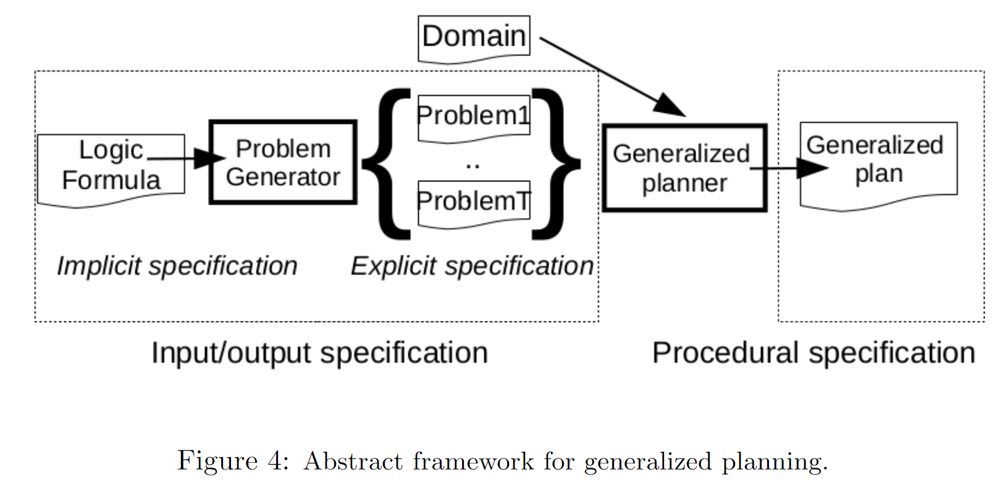

[TOC]


# A review of generalized planning

自动化计划（AP）可以通过利用代理及其环境的模型来解决高度结构化环境中的复杂协商任务，Traditionally the solutions generated by automated planners are tied to aparticular planning instance and hence, do not generalize.（**classical plan**）

>A **generalized plan** is an algorithm-like solution that is valid for a given setof planning instances.

近年来，由于计划 的 表示representation 解决方案系列的新颖形式主义以及计算此类解决方案的新算法的出现，这些进步揭示了广义规划技术的潜力，并鼓励将规划应用到计算机科学的各个领域，例如*program  synthesis,autonomous  control,datawranglingorform recognition[^Syntax-guided synthesis][^Inductive  programming].

广义规划中的这些最新进展，并与现有形式主义相关,针对自动化规划中的通用性，例如*planning with domain control knowledgeand different approachesforplanning under uncertainty*不同方法。

首先，本文提供了自动化计划的背景，将广义计划任务形式化，并介绍了我们对广义计划工作进行审查的标准。

其次，本文讨论了用于表示 计划任务 的不同知识表示推理方法。

第三，本文调查了各种代表形式主义，以分析其优缺点。

第四，研究了用于计算广义计划的当前算法。

最后，本文结束了讨论不同的实现方式并确定了开放的研究问题以鼓励未来的研究。


## 表示和推理
classical planning(the vanilla model in AP),

在*经典规划模型*是自动规划最常见的模型，是基于以下假设：

1.要解决的计划任务具有有限且可完全观察的状态空间。

2.动作是确定性的，并导致瞬时状态转换。

经典计划实例的解决方案是一系列可应用的操作，这些操作将给定的初始状态转换为目标状态，即满足先前指定的一组目标条件的状态。

A classical planning frame is a tuple Φ =〈F,A〉, where F is a set of fluents and A is a set of actions. 

Given  a  frame  Φ  =〈F,A〉,  a **classical  planning**  instance is  a  tuple P=〈F,A,I,G〉,  where I∈ L(F) is an initial state (i.e.|I|=|F|) andG∈ L(F)is a goal condition. 

The  Planning  Domain  Definition  Language  **(PDDL)**  [59]  is  the  input  language for the International Planning Competition (IPC) [95] and the standard  for  representing  classical  planning  instances.   

Besides  classical  planning,  PDDL can represent more expressive planning models such as *temporal planning or planning with path constraints and preferences [27, 33].

Generalized plans are generative models that may have diverse forms. 每种形式都具有自己的表达能力以及计算和验证复杂性。


Generalized  plans  range  from  programs  [97,  83]  and generalized polices[57] to Finite State Controllers(FSCs) [10, 84], AND/OR graphs, formal grammars [77] or HTNs [66]. 

可以根据广义计划specification of *the action to apply next*对其进行分类：

- Fully  specified solutions,  that  unambiguously  capture  the  action  to  ap-ply next, for solving every instance in a given generalized planning task.可以明确捕获接下来要应用的操作，用于解决给定的广义计划任务中的每个实例。程序，通用策略或确定性FSC属于此类。如果我们认为，一致的，偶然的或POMDP计划也属于此类，则可能的初始状态代表不同的经典计划实例，它们共享相同的状态变量，动作和目标[42]。**我认为非确定的图的解图policy=确定性=可以写成program**
- Non  specified(我认为是每个实例都没规律需要classical planner 额外规划).带有domain model的经典计划器是广义计划的一种形式。这样的计划非常笼统（涵盖了用古典计划器的输入语言表示的任何实例），但是执行机制效率低下（运行古典计划器以针对广义计划任务中的每个实例生成完全指定的解决方案）。 
- Partially specified.  共享两者要素的通用计划。使用*特定于域的控制知识*进行*规划*的不同方法属于此类，因为仍然需要规划人员针对特定实例生成完全指定的解决方案，但是要利用限制可能解决方案的常识。此类包括部分指定的程序，不确定的FSC，形式语法，AND / OR图或HTN。**认为这就是QNP/FOND可以搜索“policy-->解子图”**

The execution of a generalized plan  $\Pi$  in a classical planning instance P=〈F,A,I,G〉is a classical plan,



The *problem generator* box refers to a generative model of the instances inthe generalized planning task.  广义计划任务包括一组要解决的单独计划任务。这组计划任务可以是有限的或无限的。同样，可以用不同的方式来指定它，例如，对经典计划实例的显式枚举或通过使用逻辑公式，概率分布，问题生成程序等隐式地指定。当提供了对计划任务的显式说明时，将跳过问题生成。

The **generalized  planner** box  refers  to  an  algorithm  d  with  aninput-outputspecification of the instances to solve and that generates a solutionto  these  instances.  其中包含要解决的实例的*输入-输出*规范，并为这些实例生成解决方案。

广义计划的算法范围从纯粹的**top-down**(我理解为MyND启发式图搜索子图，或者是FOND-SAT全空间搜索)*自上而下的*方法（在广义计划的空间中搜索一个涵盖所有输入实例的解决方案）

到*自下而上**botton-up***(我理解为PRP,FF planner，开创者从实例中学习的方法)（为单个实例计算一个解决方案，对其进行概括和合并）以前找到的解决方案，以逐步扩大广义计划的范围。最后，*广义计划*可以看作是广义计划任务中计划实例的过程表示。


通用GP规划就像经典规划classical plan，传统求解方法有：

1. 在经典规划中，规划师仅接收单个和地面规划实例作为输入

2. 经典规划的最新算法是在状态空间中进行启发式搜索[37，30]或编译为其他形式的问题解决方法，例如SAT [78]
3. 经典计划是一系列动作，经典计划的执行和验证在计划的长度上都是线性的。然而，具有条件影响，变量和控制流结构的动作可以用来更紧凑地表示经典计划任务的解决方案[52，81]。

## Representing Sets of Planning Tasks

different formalisms for representing sets of planning taskswithin generalized planning.7

- Representing Actions

（RL强化学习结合）一个例子是在**ATARI**视频游戏中使用的以代理人为中心的行为模型[62]，其中18种可能的行为根据视频游戏的当前状态具有不同的效果。在这里，我们回顾了经典计划行为模型的扩展，这些扩展旨在使计划任务和计划解决方案更紧凑，更通用。

- Conditional effects=preconditions+conditional  effects

Conditional effects cannot be compiled away if plan size should grow only linearly [67].  

PDDL supports the definition of conditional effects with the  **when** keyword。In PDDL the condition of a given conditional effect has the same expressivenessas action preconditions and goals, so it can either be a negation, a conjunction,a disjunction or a quantified formula, as defined in the ADL formalism [71, 27].

- Update formulas and high-level state features

The  series  of  work  by  **Srivastava**  et  al.  [90]  on  generalized  planning  encodesthe effects of actions with update formulas.  An update formula is an arbitrary FOL formula that includestransitive closure, defining the new value of a givenpredicate after an action application. 

等效地

Arbitrary FOL formulae that include *transitive  closure* can be representedin PDDL using **derived  predicates** that can later be included in action precon-ditions,  conditional  effects  and  goals. 

```
(:derived (above ?x ?y - block)
	(or (on ?x ?y)
		(exists (?z - block)
			(and (on ?x ?z) (above ?z ?y)))))
```

this is how  PDDL  defines  theabovederived predicate that models whether a block?xisaboveanother block?yin ablocksworld tower*派生谓词*可以表示表达性状态查询，包括状态变量和递归的层次结构[92]。事实证明，这对于紧凑地表示计划任务和更有效的计划很有用[45]。

除派生谓词外，各种形式主义已用于表示计划中的状态查询，范围从一阶子句[96]到描述逻辑公式[57]甚至LTL公式[20]来定义有关状态序列的查询。

- Sensing and non-deterministic actions

当状态是**FOND**完全可观察的fully observable时，考虑到任何状态信息都是通过状态查询获得的，则不需要显式的感知动作。因此，传感动作适合在**POMDP**部分可观察性下进行计划，并且它们不模拟状态转换，而是对来自当前状态的某些信息进行观察，而这些信息*未知*。当缺乏有关当前状态的信息使计划者无法制定出可以肯定地实现目标的计划时，计划者便会采用感知行动。

如果我们假设关于当前状态的不确定性单调减少（即一旦*知道*状态变量的值就可以改变，但不能再次变得*未知*），则可以将感测动作编码为非确定性动作[65]。

PPDDL（PDDL的概率版本[100]）可用概率效应进行编码，使用概率动作进行的计划成为*优化*任务，计划者旨在使达到目标的可能性最大化。非确定性和概率性动作也可以编码非确定性状态转换，例如在完全可观察的非确定性（FOND）或MDP规划中[58，32]。


- Representing Initial and Goal States

  可以显式定义一组状态，枚举该组中的每个状态，或者隐式定义一个状态必须满足的约束（传递闭包）才能属于该组。还可以明确指定广义计划任务中的实例集，枚举广义计划任务中的各个经典计划实例。

different  formalisms  for  representing  a  set  of  planning  in-stances according to the language used for specifying these constraints:

- - **Propositional logic.** 在这种情况下，可能的初始状态和目标状态的集合仅使用文字和三个基本的逻辑连接词表示（并表示文字的合取或表示文字的析取而不表示否定）。用命题逻辑表示的计划实例集的示例是一致的，或有的或POMDP的计划任务，这些任务定义了任务的不同可能初始状态，作为对问题字面量的分离（而目标是为计划中所有可能的初始状态共享的）任务）[10]。
  - First-order logic一阶逻辑约束可以包含量化变量，包括传递闭包并表示无限制状态集。这些特征使一阶公式可以实现计划实例集的紧凑表示，以及无限制规模的计划任务[90]。对于给定的有限对象集，可以将一阶表示形式直接转换为命题逻辑表示形式。
  - Constraint Programming.  In this case sets of states are defined by a set offinite domain variablesX={x1,...,xn}(where each variablexi,1< i < nhas  an  associated  finite  domainD(xi))  and  a  set  of  constrains C that determines  when  a  state  is  part  of  the  set.   除了约束编程语言的表示灵活性外，在这种情况下，可以使用现成的CSP求解器来解决广义的计划任务[74]。
  - Three-valued  logic.  在此逻辑语言中，存在三个真值1（真），0（假）或1（未知）。Srivastava等。使用三值逻辑进行状态抽象，以紧凑地表示无边界的具体状态集[90]。三值逻辑对于表示和解决一致和偶然的任务也很有用[72，69，1]。

确定一组计划实例**specify a set of planning instances**  ：除了用初始状态和目标状态集之外，未来还可以使用其他信息，例如*领域不变量*[90]甚至是分类的执行历史记录，包括*正*例和*负*例[43]，类似于在归纳逻辑编程（ILP）[75]。


generalized plans have two benefits,*compactness* and *generality*. 


- Control-flowstructures augment the flexibility of generalized plans with respectto classical plans:

- - Branching:   计划的执行根据当前状态下给定表达式的求值结果进行分支。具有分支结构的计划解决方案的示例是AND / OR树状 *或有计划*[^1]或*K-Fault容忍计划*[^22]。
  - Loops:  重复执行计划段，直到给定条件保持当前状态。具有循环的规划解决方案的示例包括用于表示MDP解决方案*的类似策略的*规划[49]，以及FOND规划任务[^64]。

仅包含分支构造的解决方案计划的大小在可能的状态观察次数中可能是指数级的。合并*分支*和*循环*通常有助于压缩广义计划。在某些解决方案表示中，例如DSPlanners [^97][^98]，分支和循环对应于不同的控制流构造，但是通常，它们使用相同的构造（例如条件转换）实现，以保持解决方案空间的可管理性。这是在*有限状态控制器*（FSC）[10]，*广义策略*[57]或*计划程序中*使用的*条件getos* [83]中发生的情况。

- Variables（循环控制变量、数值变量）

**DSPlanners** address this issue representing solutions with quantified variables[^97]. 解决了代表*量化变量的*解决方案的问题[^97]。

A DSplanner is a domain-specific program that can contain **if-then-else & while**constructs.也就是说，在包含分支循环的控制流图中进行与或树搜索 规划任务搜索解子图


[^1]: Alexandre  Albore,  H ́ector  Palacios,  and  Hector  Geffner.   A  translation-based approach to contingent planning.  InIJCAI, 2009

[^22]: Carmel Domshlak. Fault tolerant planning:  Complexity and compilation.InICAPS, 2013.
[^64]: Christian   Muise,   Sheila   A.   McIlraith,   and   Vaishak   Belle.Non-deterministic planning with conditional effects.  InICAPS, 2014
[^97]: Elly Winner and Manuela Veloso.  Distill:  Learning domain-specific plan-ners by example.  InICML, 2003.
[^98]: Elly Winner and Manuela Veloso.  Loopdistill:  Learning looping domain-specific planners from example plans.  InICAPS, Workshop on ArtificialIntelligence Planning and Learning, 2007
[^P]: Allen Newell, JC Shaw, and Herbert A Simon. A general problem-solvingprogram for a computer.Computers and Automation, 8(7):10–16, 1959.
[^P]: C

**量化变量**Quantified variables 使识别具有特定特征的对象成为可能，并对选择的对象应用选择性操作。

Existential  variables**存在变量**。A universal variable asserts that a given property orrelation holds for all the possible variable values.通用变量断言，给定的属性或关系对于所有可能的变量值均成立。除了DSPlanners 之外，存在变量还出现在选择操作中*[90]，即在计划执行过程中实例化的操作以及在当前状态下评估FOL公式的结果。另一个例子是*广义策略，其规则包含要与当前状态统一的变量[48]。PDDL可以代表具有派生谓词的策略[45]

Universal variables**通用变量**。通用变量断言，给定的属性或关系适用于所有可能的变量值

评估定量变量上给定表达式的派生谓词的使用也适用于其他形式的广义计划，例如FSC。


**栈递归调用** 尽管仅使用基本控制流和变量就可以显式地对调用栈进行编码，但是更紧凑的解决方案通常是通过调用栈获得的（例如，具有递归解决方案的任务[84]）。用于访问二叉树的所有节点的通用计划，该计划实现了具有一个过程参数的递归深度优先搜索（DFS）。指令**call（0，***node* **）**是递归调用，将参数*node* 分配给程序的唯一参数，并从其第一行重新开始执行，


**实现递归DFS以遍历任意大小的二叉树的通用计划**

**hierarchical generalized plans [83]对任意大小的数字列表选择排序算法**


# **执行和验证**


广义计划可以分支，循环并具有变量，因此在特定经典计划实例上执行广义计划需要特定的机制，这不同于传统上在传统计划中使用的机制：

•   *分支。*具有不同可能执行分支的通用计划的执行需要一种机制，用于根据状态变量的当前值选择相应的执行分支。可以将分支的几个通用计划（例如HTN，AND / OR树状计划或策略）的执行编译为经典计划[3，1，45]。如第3节所述，可以通过*条件效应*有效地建模根据状态变量的不同值执行的不同可能执行结果[67]。

•   *循环。*执行明确表示循环的通用计划，例如程序（或FSC），需要跟踪当前程序行（或控制器状态）。通过将相应的自动机（其状态和可能的转换）编码为额外的状态变量，可以**将FSC和程序的执行编译为经典计划**[^7，83，84]。

•   *变量。*如果广义计划包含量化变量，则计划执行需要统一机制，这些机制将可能的值分配给这些变量。早期计划系统实施了变量绑定算法来匹配控制规则[96]。如今，Fast-Downward 使用实现*标记算法的*量化变量评估派生谓词 [37]。一种不同的方法是利用外部求解器（例如*答案集编程*[45]或CSP [29]求解器）来量化变量。还遵循编译方法在*连接查询中*绑定存在变量[55]并使用传递闭包[73]来评估FOL状态查询。不幸的是，当前大多数现成的计划者仅有效地支持简单条件，因为命题原子的连接和汇编存在的量化公式具有成倍的代价[28]。

在给定计划实例上执行广义计划的最简单的期望属性是**终止性测试、验证**，在文献中也称为*停机问题。*在最坏的情况下，广义计划执行的动作数的上限由广义计划的可能状态的总数给出。然后可以检测无限循环，对计划执行期间的操作数进行计数，并检查该计数是否超过了先前的上限[6]。

[^7]: Jorge A Baier, Christian Fritz, and Sheila A McIlraith. Exploiting proce-dural domain control knowledge in state-of-the-art planners.  InICAPS,2007

[^83]: Javier Segovia-Aguas, Sergio Jim ́enez, and Anders Jonsson.  Generalizedplanning with procedural domain control knowledge.  InICAPS, 2016
[^84]: Javier Segovia-Aguas, Sergio Jim ́enez, and Anders Jonsson.  Hierarchicalfinite state controllers for generalized planning.  InIJCAI, 2016
[^P]: C
[^P]: C
[^P]: C
[^P]: C

执行广义计划的第二个属性是保证计划能够解决给定实例。测试此属性称为**验证、有效性验证** 证明验证包含终止证明，并且作为计划生成的一部分是隐含的。经典计划中的计划验证非常简单，因为可以通过从经典计划任务的初始状态开始*执行* 计划来获得验证证明或失败证明。VAL [41]，在3中引入第三国际计划竞赛（IPC）是用于经典计划的标准计划验证工具。在广义计划的情况下，计划可以分支，循环和包含变量，计划验证更为复杂。在给定计划实例中执行广义计划可能无法解决该实例，因为：

1.计划*不健全：*广义计划由于进入无限循环而无法满足*终止*条件。

2.计划*不完整。*当前状态没有下一步要执行的操作（例如，在当前状态没有适用规则的策略）。

如果可以将广义计划的执行编译为经典计划任务[7、83、84]，则可以使用现成的经典计划器来有效地检查先前的验证条件。当行动具有不确定性影响时，计划验证将变得更加复杂，因为它需要证明所有可能的计划执行都可以达到目标[14]。在这种情况下，*模型检查*[16]和*非确定性计划*是合适的方法[38]。

与经典计划不同，经典计划与特定计划实例相关联，广义计划也可以在一组不同的计划实例上执行。验证通用计划任务上的通用计划需要在任务中包含的所有实例中执行计划，并验证该计划已解决所有问题。这意味着在给定实例中对给定的广义计划的验证应该是有效的计划大小的多项式。可以通过两种不同的方法来实施一组计划实例中的一般计划的执行：

• *顺序的，*即在每个实例中一个接一个地执行通用计划。这是使用经典计划程序执行广义计划所遵循的方法，该计划器在给定的广义计划任务中包含的每个单独计划实例中依次执行计划[83]。

•   *并行。*广义计划是在广义计划任务的实例集中同时执行的（例如按照一致，或然或POMDP计划，其中动作的执行会进展到一组状态[32]）。

*顺序*方法的实现较为简单，但其实用性受到实例数的限制。在*平行*方法允许处理更大的实例的集合（或实例与未结合的对象的数量），但它需要精细的状态进展的技术，如信念跟踪[8]或行动最新信息抽象状态[90]中的应用。在并行执行中，评估表达目标或衍生的流利性变得更加复杂，因为这意味着对状态集进行公式评估[32]。验证广义计划的第三种方法是显示执行前后的某些属性，例如在使用***Hoare三元组的*程序验证**中[82]。


## 实验等评价指标


### **评估**

给定一组计划实例，不同的广义计划可以与其*保持一致*，例如，图11、12和14中所示的不同的广义计划可以将任何高度的砌块塔堆叠起来。然后有必要定义一种方法，该方法可以量化给定的广义计划的能力，以阐明可能的解决方案之间的偏好。

可以针对不同的指标评估广义计划的能力：

•   *覆盖范围。*可以将广义计划的*域覆盖范围*评估为广义计划可以解决的大小为*n* 的问题实例的数量除以相同大小的可解决问题实例的总数的比率[90]。在实践中，知道这些数字意味着要解决大量计划任务，因此通常很棘手。统计机器学习（ML）技术根据解决方案在域实例的*代表性* 样本（称为*测试集）*上的执行效果来估算解决方案的质量[61]。在通用计划中，还可以定义一组测试实例，并计算解决方案涵盖了多少实例。如果我们将古典规划师视为广义规划的一种特殊形式，这就是在国际规划竞赛（IPC）[95]的顺序最优轨道上进行的工作，在该竞赛中，规划师根据他们解决的未见实例的数量获得奖励。

•   *复杂性。*由于广义计划是类似于算法的解决方案，因此可以从理论上评估其复杂性，例如，使用渐进分析来表征其运行时间和空间需求如何根据输入任务的大小而增长。实际上，可以通过在给定的输入实例上执行计划所产生的动作序列的长度来量化广义计划的复杂性。然后，当给定实例的序列长度对于该实例*最小时*，通用计划是*最佳*的。这在某种程度上与IPC [95]的顺序令人满意的轨迹有关，在该轨迹中，计划者的最终价值被报告为测试集实例中解决方案的累积质量。

• *简洁。*可以根据计划行数，控制器状态，策略规则或量化变量来评估给定广义计划的大小。在ILP系统中已经引入了类似的度量标准，以量化解决方案的*紧凑性*和*可读性*，并且更喜欢规则数量最少的模型和规模最小的规则[63]。注意，在经典计划中，计划的执行复杂度直接与其规模相对应。


## Solver


计算广义计划的两种主要方法，并回顾了不同的*计划重用*技术，以避免从头开始计算广义计划。本节最后回顾了针对通用计划的不同方法的特定实现。

在*自上而下的*广义规划的搜索方法的解决方案，覆盖了所有在广义规划任务的实例。另一方面，*自下而上的*方法为单个实例（或广义计划任务中的实例子集）计算解决方案，并扩大了解决方案的覆盖范围，直到涵盖了广义计划任务中的所有实例。对于机器学习，自上而下的方法与*离线*机器学习算法有关，该算法计算模型以在一次迭代中覆盖整个输入实例集，例如决策树的归纳[^61]。自下而上的方法与*在线相关* 版本的ML算法，随着更多输入实例的出现，迭代地递增地适应模型[^94]。

[^61]: Thomas M Mitchell.Machine  Learning.  McGraw-Hill,  Inc.,  New York,NY, USA, 1 edition, 1997.
[^94]: Paul E Utgoff. Incremental induction of decision trees.Machine learning,4(2):161–186, 1989.

用于广义计划的自*顶向下*算法通常在可能的广义计划中搜索解决方案。此搜索的初始状态是 *空的*通用计划，搜索操作员在通用计划中建立一个步骤（例如，向程序添加指令，向FSC添加新状态或向FSC过渡，向策略添加新规则等） 。搜索的目标状态集包括构建的广义计划可以解决给定实例集的任何状态。

这种方法的示例是将通用计划编译为其他形式的问题解决方案，例如***经典计划*[^46]，*一致计划*[^10]，*CSP* [^74]或*Prolog程序*[^43]**。这些编译实现了如上所述的搜索空间，并受益于现成的求解器（具有高效的搜索算法和启发式方法），可以完成对通用计划的搜索。编译方法的主要限制是可伸缩性。在实践中，通常为了限制搜索范围，限制可能的广义计划的大小（例如，程序行，控制器状态，策略规则或量化变量的最大数量）。这类似于在SATPLAN方法中完成的方法，该方法确定最大计划长度[78]，然后迭代地增加直到找到解决方案为止。

[^46]: Sergio Jim ́enez and Anders Jonsson. Computing Plans with Control Flowand Procedures Using a Classical Planner.  InSOCS, 2015.
[^10]: Blai Bonet, H ́ector Palacios, and Hector Geffner. Automatic derivation offinite-state machines for behavior control.  InAAAI, 2010
[^74]: C ́edric Pralet, G ́erard Verfaillie, Michel Lemaˆıtre, and Guillaume Infantes.Constraint-based  controller  synthesis  in  non-deterministic  and  partiallyobservable domains.  InECAI, 2010
[^43]: Yuxiao Hu and Giuseppe De Giacomo. A generic technique for synthesiz-ing bounded finite-state controllers.  InICAPS, 2013.
[^P]: C

如果我们认为可能的初始状态代表不同的共享相同目标的计划实例，则针对意外情况[1]，一致[69]和POMDP规划[32]的离线算法也可以理解为自*顶向下*的广义规划算法。在这种情况下，通常不是在可能的概括计划的范围内而是在可到达的*信念状态的范围内*进行对解决方案的搜索*。*在这里，可伸缩性限制来自以下事实：可到达的信念状态集合快速增长（然后，利用降低不确定性的技术以使可能的状态集合易于处理是关键）以及难以定义有效的启发式方法以提供*有用的* 估计值信念状态。

*自下而上的*广义计划是一种迭代和增量方法，其中（1）选择单个计划实例（或广义计划任务中实例的子集），（2）计算其解决方案，（3）广义最后（4），与先前找到的通用解决方案合并。重复此四步过程，直到涵盖了通用计划任务中的所有实例。在*自下而上*的方法是与*计划修复*[26]，*基于案例的规划*[11]和*迁移学习* [70]，因为它还需要一些机制来确定为什么给定解决方案不涵盖给定实例（在这种情况下，适用于通用计划的验证机制适合在给定计划[97]中查找断言失败的原因）以及适应给定解决方案以适应新场景的机制（在控制知识不完善的情况下进行规划时也存在这种适应机制[99]）。

虽然*自上而下的*方法可以作为汇编其他形式解决问题来实现，*自下而上的*方法需要以提升和合并计划的具体技术。另一方面，*自下而上的*方法提供了随时随地的行为，并且可能能够自动构建一小组实例以实现泛化[91]。

[^]: 

[^P]: C
[^P]: C
[^P]: C
[^P]: C
[^P]: C
[^P]: C


### 重用广义计划Srivastava的方法

从头开始计算广义计划的另一种方法是重用现有解决方案。即使某个通用计划不正确（从某种意义上说它无法解决给定实例）或不完整（它没有定义要在给定实例*上应用的动作*），它也可能包含有用的知识。例如，计划可能能够解决给定的广义计划任务的子问题或类似实例（例如，这是一个解决方案，但针对不同类型的对象），或者在调整控件中的条件后解决新实例流结构。在这些情况下，采用先前存在的广义计划可以取得回报。

在这方面，*自下而上的*通用计划方法配备了使计划适应未知案例并逐步增加其覆盖范围的机制[91]。另一方面，*自上而下的*方法可以从部分指定的解决方案开始，而不是从*空的*广义计划开始。这表明缩小搜索空间和/或集中搜索过程很有用，从而有可能解决更具挑战性的广义计划任务[83，84]。

接下来，我们回顾重用先前找到的计划的不同技术：

•   *编译。*当现有的广义计划具有广义策略的形式时，可以将其编译为一组PDDL派生的谓词，策略中的每个规则都包含一个谓词，该谓词捕获应采取行动的不同情况[45]。图13说明了此方法，该方法显示了PDDL派生谓词的示例，该谓词表示用于堆叠塔式塔的2规则策略。我们还解释说，通过**We  also  explained  that  existinggeneralized plans in the form of programs, FSCs or AND/OR graphs, canbe encoded into a classical PDDL planning task by computing the crossproduct  between  the  corresponding  automata  and  the  original  planningtask [^7, 83, 77]计算相应自动机与原始计划任务之间的叉积，可以将程序，FSC或AND / OR图形式的现有广义计划编码为经典PDDL计划任务**。[7，83，77] 。在这种情况下，新的额外状态变量将添加到原始计划任务中，以表示与程序，FSC或AND / OR图相对应的自动机的状态和转换。

•   *计划行动*经典计划中的动作不仅代表原始动作，而且还可以代表广义计划本身。图20显示了一个经典的计划动作，该动作对应于一个通用计划，该通用计划用于将一个blockworld中的任何block堆叠起来，即解决任何blockworld实例的通用解决方案中的第一步。

[^7]: Jorge A Baier, Christian Fritz, and Sheila A McIlraith. Exploiting proce-dural domain control knowledge in state-of-the-art planners.  InICAPS,2007.
[^83]: Javier Segovia-Aguas, Sergio Jim ́enez, and Anders Jonsson.  Generalizedplanning with procedural domain control knowledge.  InICAPS, 2016.
[^77]: Miquel Ramirez and Hector Geffner.  Heuristics for planning, plan recog-nition and parsing.arXiv preprint arXiv:1605.05807, 2016
[^P]: C

#### **计算宏动作**

*宏观行动*是计算有效解决不同计划任务的常识的最早建议之一[25]。文献中有多种方法可用于计算宏动作[12，18，47，13]，但是最常见的方法是：

（1）解决一组经典规划实例的训练集，这些实例共享相同的领域理论，但现成的经典计划程序和

（2）在解决方案计划中确定经常一起使用的动作的子序列。

宏动作的优势在于它们具有标准经典计划动作的形式，因此可以将它们直接添加到域理论中，而无需额外的状态变量。这使*宏动作*成为重用一般计划知识的实用而强大的方法：一方面，使用宏动作进行计划或执行和验证包含宏动作的计划都不需要特定的算法。另一方面，添加不完整或不正确的宏操作将不会阻止计划者找到可解决任务的解决方案，因为计划者总是可以使用原始操作来构建解决方案。

定义总体计划策略的宏动作的主要限制是其顺序执行流程，该流程过于严格。即使将宏操作参数化，涉及宏的解决方案也可能不适用于其他问题。

[^P]: C
[^P]: C

#### **计算广义策略**
*广义策略*是一组规则，它定义状态和目标的映射，成优选*动作接下来要执行。*像宏动作一样，广义策略也允许参数，并且可以从共享相同域理论的经典规划实例的一组解决方案中得出[^57][^99][^21]。但是，通用策略比宏动作更灵活，因为它们可以定义带有分支和循环的执行流。

[^57]: Mario  Mart ́ın  and  Hector  Geffner.   Learning  generalized  policies  fromplanning examples using concept languages.Applied Intelligence, 20(1):9–19, 2004.
[^99]: Sungwook Yoon, Alan Fern, and Robert Givan.  Learning control knowl-edge for forward search planning.The Journal of Machine Learning Re-search, 9:683–718, 2008.
[^21]:  Tomas De la Rosa, Sergio Jim ́enez, Raquel Fuentetaja, and Daniel Bor-rajo. Scaling up heuristic planning with relational decision trees.Journalof Artificial Intelligence Research, 40:767–813, 2011.


#### **计算有限状态控制器**


*有限状态控制器*（FSC）可以用有限数量的内存来泛化策略[^9]。具有单一状态的FSC表示策略，即无内存控制器。FSC的附加控制器状态为它们提供了内存，允许在给定相同观察值的情况下采取不同的操作。FSC形式主义也可以通过*调用堆栈*进行扩展，以表示分层和递归解决方案[^84]。

现有的用于计算用于广义规划的FSC的算法遵循*自上而下的*方法，该方法将对FSC 进行*编程*与验证相交错，因此它们紧密地集成了规划和归纳。为了使FSC的计算易于处理，它们限制了可能的解决方案的空间，从而限制了FSC的最大大小。另外，他们强加实例来解决共享问题，不仅是领域理论（动作和谓词方案），而且是流利的集合[^83]或*可观察*流利的子集[^10]。

用于广义计划的FSC的计算包括将广义计划任务编译为另一种问题解决形式的工作，因此它们将从现成求解器的最新进展中受益（例如，*经典计划*[^83]，*一致计划*[^10]，*CSP* [^74]或*Prolog程序*[^43]）。最后一种情况需要FSC的行为规范，该规范包括以下分类的执行历史记录：（1）接受所有导致目标达到满意状态的合法执行历史记录；（2）拒绝包含重复配置的事件执行历史（表明无限循环），并且无法扩展（指示死角）[43]。


[^9]: Blai  Bonet  and  Hector  Geffner.   Policies  that  generalize:  Solving  manyplanning problems with the same policy.IJCAI, 2015.
[^84]:  Javier Segovia-Aguas, Sergio Jim ́enez, and Anders Jonsson.  Hierarchicalfinite state controllers for generalized planning.  InIJCAI, 2016.

[^10]: Blai Bonet, H ́ector Palacios, and Hector Geffner. Automatic derivation offinite-state machines for behavior control.  InAAAI, 2010.
[^43]: Yuxiao Hu and Giuseppe De Giacomo. A generic technique for synthesiz-ing bounded finite-state controllers.  InICAPS, 2013.
[^74]:  C ́edric Pralet, G ́erard Verfaillie, Michel Lemaˆıtre, and Guillaume Infantes.Constraint-based  controller  synthesis  in  non-deterministic  and  partiallyobservable domains.  InECAI, 2010.


#### **计算程序**

程序提高了FSC的可读性，它们将控制流结构与原始动作分开。像FSC一样，程序也可以按照*自上而下的*方法进行计算，例如，利用对状态和动作空间相同的实例进行编程并验证程序的编译[^83]。
[^83]: Javier Segovia-Aguas, Sergio Jim ́enez, and Anders Jonsson.  Generalizedplanning with procedural domain control knowledge.  InICAPS, 2016.
由于这些 *自上而下的*方法在解决方案的空间中进行搜索，因此限制不同的控制流指令集很有帮助。例如，仅使用既可以实现分支又可以实现循环的*条件getos* [^46]。

*DSPlanners* [^97][^98] 是将程序概括为计划的最早尝试之一。一个*DSPlanner* 是可以包含的if-then-else和while结构域的具体方案。这些构造根据关于当前状态和/或计划任务目标的FOL查询分支和循环程序的执行控制流。
[^46]: Sergio Jim ́enez and Anders Jonsson. Computing Plans with Control Flowand Procedures Using a Classical Planner.  InSOCS, 2015.
[^97]: Elly Winner and Manuela Veloso.  Distill:  Learning domain-specific plan-ners by example.  InICML, 2003.
[^98]:  Elly Winner and Manuela Veloso.  Loopdistill:  Learning looping domain-specific planners from example plans.  InICAPS, Workshop on ArtificialIntelligence Planning and Learning, 2007.


该算法计算DSPlanners被称为提炼并实现了一种*自下而上*的一组共享同一个域理论古典的规划实例的方法。给定一个实例，提炼计算该实例并整合其部分有序规划到现有DSPlanner如下。首先，Distill 提起部分订购的计划，选择与现有DSPlanner 相匹配的参数。如果不存在这样的参数化，则Distill 将变量名称随机分配给计划中的对象。然后Distill 尝试确定*语句*和展开的*循环迭代* 解决方案中将其替换为相应的控制流结构。

Srivastava等人在广义规划方面的工作。在程序中引入了一种强大而紧凑的结构，称为*选择动作，*该结构将存在变量和控制流结合在一起[^90][^91]。这项工作中的输入实例被表示为带有传递闭包的抽象FOL表示形式。这种形式主义允许用无限多个对象来表示计划任务，并保证此类任务的解决方案具有普遍性。

Srivastava等人的广义规划算法。实施*自下而上的*策略。该算法从一个空的广义计划开始，然后通过识别它无法解决的实例，调用经典计划器来解决该实例，将获得的解决方案归纳并将其合并回广义计划中，从而逐步增加其覆盖范围。重复该过程，直到生成一个涵盖整个期望类实例的广义计划（或达到计算资源的预定义限制时）。

程序和FSC都可以编入平面领域理论[^7][^83][^84]。就像政策一样，当给定程序（或FSC）正确时，这种编译是*安全的*（不会将可解决的计划实例转化为不可解决的）。

表1总结了一般计划的已审查方法。该表指示给定的解决方案表示形式是否允许使用 **变量**，**控制流的类型**以及解决方案的**执行**是否需要特定的机制。
[^90]: Siddharth  Srivastava,  Neil  Immerman,  and  Shlomo  Zilberstein.   A  newrepresentation and associated algorithms for generalized planning.Artifi-cial Intelligence, 175(2):615 – 647, 2011.
[^91]:  Siddharth Srivastava, Neil Immerman, Shlomo Zilberstein, and TianjiaoZhang.  Directed search for generalized plans using classical planners.  InICAPS, 2011.
[^7]: Jorge A Baier, Christian Fritz, and Sheila A McIlraith. Exploiting proce-dural domain control knowledge in state-of-the-art planners.  InICAPS,2007.
[^83]: Javier Segovia-Aguas, Sergio Jim ́enez, and Anders Jonsson.  Generalizedplanning with procedural domain control knowledge.  InICAPS, 2016
[^84]: Javier Segovia-Aguas, Sergio Jim ́enez, and Anders Jonsson.  Hierarchicalfinite state controllers for generalized planning.  InIJCAI, 2016.


根据解的表示方法分类Summary of the 

### diverse approaches for generalized planning 

according to the solution representations：

|   | Variables	  | Control-flow	  | Execution  |
| -------  | -------  | -----  | ------  |
|Classical plan     | ------ | ------ | Ground actions  |
|Macro-Actions  |   Action parameters  | ------ | Lifted actions    |
| Generalized Policy | Rule parameters  | Branching and loops  | Lifted  rules  |
|DSPlanners | Existential | Branching and loops | Lifted predicatesand lifted actions |
| FSCs | Quantified| Branching and loops| Derived predicates|
| Hierarchical FSCs  | Quantified and parameters | Branching, loops and call stack |Derived predicates and Parameter passing|
| Programs| Quantified and parameters| Branching, loops and call stack| Derived predicates and Parameter passing|

### **部分可观察性下的计划：一致，偶然和POMDP计划**

*符合计划*可计算一系列与不同初始状态一致的动作序列[69]。与经典计划模型的不同之处在于初始状态中的不确定性，这通过条款来描述。一个*符合的计划*是一系列的操作，解决了全部由一套满足这些条款可能的初始状态给出了经典规划任务。因为动作具有条件影响，所以执行相同动作序列可以为不同的初始状态产生不同的结果。符合计划的主要方法是：

•   *减少不确定性。*将符合计划编制为经典计划以进行计算：

\1. 消除所有相关不确定性的计划*前缀*。换句话说，在前缀应用之后，只有一个状态（或与实现目标相关的状态变量子集的至少一个局部状态）是可能的[69]。

2.计划*后缀*，该*后缀*将状态（或部分状态）（已消除相关不确定性的状态）转换为实现一致计划任务目标的状态。

•   *信仰传播。*在信念状态空间中搜索，其中： *根*信念状态表示可能的初始状态的集合，*目标* 是信念状态st，信念状态中的所有可能状态都满足计划任务的目标条件[39，15] 。尽管先前的方法利用了经典的计划机制，但此方法需要（1）紧凑表示和更新信念状态的机制，以及（2）有效的启发式方法来指导在信念状态空间中进行搜索。

*偶然性计划*通过感知模型扩展了一致的计划模型。该感测模型是一种功能，可以将状态操作对（系统的真实状态和最后完成的操作）映射到一组非空的观察值中[1，2]。观察仅提供有关系统真实状态的部分信息，因为相同的观察可能处于不同的状态。一个*偶然的计划*必须满足：

•它的执行以有限的步骤达到目标信念状态（信念中的所有状态都满足计划任务的目标条件）。

•分支和循环的条件是指观察值（或可观察到的状态变量的子集）。

像广义计划一样，或有计划可以具有不同的形式，例如策略，AND / OR图，FSC或程序[10]。

*POMDP规划*扩展了偶然性规划模型，该模型允许通过概率分布对不确定性进行编码，而不是使用可能的初始状态集和可能的观察值集[32]。就这一点而言， *贝叶斯*规则用于在动作应用之后或观察当前状态之后更新信念状态。POMDP解决方案的目的是使目标的预期成本最大化，因此POMDP规划成为优化任务。

最佳的一致性/临时/ POMDP计划是在最坏的情况下将实现目标的成本最小化的计划。广义规划可以看作是特遣队/ POMDP规划的一个特定示例，其中：（1）要解决的实例具有相同的目标，（2）实例的初始状态是一组可能的初始状态中的一个状态。 （3）有充分的可观察性，因此分支和循环的条件可以引用任何状态变量的值。

### **6.2具有控制知识的计划**

自从计划研究开始以来，*控制知识*已显示出有效的方法来提高计划者的可扩展性[5，66]。IPC-2002证明了这一点，在该计划中，利用**领域特定控制知识（DCK）**的计划者比最新的计划者要快几个数量级[54]。

DCK [7]的类似于算法的表示形式与广义计划非常相似。实际上，DCK和广义计划都代表了适用于解决不同计划实例的通用策略。尽管它们之间的区别很小，但可以声称广义计划是一种*完全指定的解决方案，*不需要在特定情况下应用计划程序。另一方面，DCK对应于*部分指定的解决方案* （包含非确定性构造和计划者在生成计划时要确定的缺失/未完成部分）。因此，DCK要求计划人员针对给定的经典计划实例提供**完全指定的**解决方案。

定义DCK的另一种方法是使用已解决实例的数据库。

实际上，广义计划的另一种观点是作为一个紧凑的计划库。 *基于案例的计划*（CBP）是一种自动化计划的方法，旨在通过重用以前找到的解决方案来节省计算量[11]。

CBP系统实现了识别与要解决的实例相似的实例的*检索*机制，以及修复了所检索解决方案中的缺陷以使其适用于另一个实例的*适应*机制。CBP的检索和适应机制与*自下而上*有关广义规划的算法，因为它们可以识别给定的广义规划何时不覆盖实例，并对其进行调整以覆盖实例[97，90]。遵循独立于域的方法为大型案例库开发此类机制仍然是一个挑战。

表示和利用DCK的另一种形式主义是***分层计划***。与经典计划一样，分层计划处理确定性和完全可观察的计划任务，但使用不同的任务表示形式。在传统的计划行动中，其动作的前提条件是后继条件，而计划者的选择和排序是由计划者自动计算的，而 *层级计划则*指定了解决方案的草图，其中包含有关（1）要追求的子目标的额外信息[87]，和/或（2）可以采取哪些行动来实现给定的子目标[66]。

在分层计划中，要解决的任务的表示形式与解决方案之间的分离并不像传统计划中那么清晰。层次计划任务可以理解为部分指定的广义计划（或特定于领域的计划者），其中，通过运行层次计划器可以确定计划的缺失部分。古典计划者的目的是计算将给定的初始状态转换为目标状态的一系列适用动作，而分级计划者则计算出以下的适用动作的序列：（1）将给定的初始状态转换为目标状态，以及（2） ，此转换符合给定的层次结构。

[^P]: C
[^P]: C
[^P]: C
[^P]: C
[^P]: C
[^P]: C

### **GOLOG**

在Golog系列动作语言已被证明是对自主代理[^53]的高级控制一个有用的平均值。除了条件，循环和递归过程外，Golog 程序的一个有趣功能是它们可以包含不确定的部分。甲果洛程序不需要表示完全指明的解决方案，但它的一个草图，其中非确定性部分是间隙要由系统被填充。此功能使Golog 程序员可以灵活地在以下各项之间选择合适的平衡点：

•确定预定义的行为，这通常意味着较大的程序。

•通过搜索保留系统要解决的某些部分，这通常意味着更长的计算时间。

基本的Golog 解释器使用PROLOG回溯机制来解析搜索。这种机制基本上相当于盲目搜索，因此，在解决计划任务时，除了最小的实例大小之外，它很快就变得不可行了。IndiGolog [80]扩展了Golog，使其包含许多内置的计划机制。此外，可以利用Golog和PDDL之间的语义兼容性[^79]，并且可以嵌入PDDL规划器[^17]来解决本质上是组合的子问题。

[^53]: Hector J Levesque, Raymond Reiter, Yves Lesp ́erance, Fangzhen Lin, andRichard  B  Scherl.   Golog:   A  logic  programming  language  for  dynamicdomains.The Journal of Logic Programming, 31(1-3):59–83, 1997.
[^80]: Sebastian Sardina, Giuseppe De Giacomo, Yves Lesp ́erance, and Hector JLevesque.   On  the  semantics  of  deliberation  in  indigologfrom  theory  toimplementation.Annals of Mathematics and Artificial Intelligence, 41(2-4):259–299, 2004.
[^79]: Gabriele  R ̈oger,  Malte  Helmert,  and  Bernhard  Nebel.   On  the  relativeexpressiveness of adl and golog:  The last piece in the puzzle. InKR, 2008
[^17]: Jens Claßen, Viktor Engelmann, Gerhard Lakemeyer, and Gabriele R ̈oger.Integrating  golog  and  planning:    An  empirical  evaluation.InNon-Monotonic Reasoning Workshop, 2008


### **6.4程序综合**

程序综合是自动生成满足给定高级规范的程序的任务。该研究领域的许多想法都与广义规划有关，但是由于广义规划遵循领域无关的方法并针对状态，动作和目标处理其自己的特定表示形式，因此它们并不立即适用。在这里，我们回顾了两种最成功的程序综合方法：

•  **示例编程**（PbE），计算与一组给定的输入输出示例一致的程序集。输入-输出示例对于非程序员来说很直观，可以创建程序，这种类型的规范使程序综合比对抽象程序状态进行推理更容易处理。PbE技术已在现实世界中部署，并且是Office 2013中Excel 的Flash Fill 功能的一部分，该功能可生成用于字符串转换的程序[^35]。在这种情况下，使用称为**version space algebras** 版本空间代数[^60]的数据结构以受限的特定领域语言（DSL）简洁地表示了一组合成程序。使用实现分而治之方法的特定领域搜索来计算程序。

•在“ **通过草图进行编程**（PbS）”中，程序员提供了部分指定的程序，即表示一种实现的高级结构但留下未定义细节的低级细节的程序，该细节由合成器确定[^89]。这种形式的程序综合依靠一种称为**SKETCH**的编程语言来绘制部分程序。PbS在由两个通信的SAT解算器（归纳合成器和验证器）构建的合成验证循环上实现了反例驱动的迭代，以自动生成测试输入并确保程序满足它们。尽管在最坏的情况下，程序的合成比NP的完成困难，但这种反例驱动的搜索仅在解决了少数SAT实例后就终止了许多实际问题[^50]。


以前的工作是*通过示例*进行 *编程的*从输入/输出示例中合成解析器的技术[^51]。

[^35]: Sumit Gulwani. Automating string processing in spreadsheets using input-output examples. InACM SIGPLAN Notices, volume 46, pages 317–330.ACM, 201
[^60]: Thomas  M  Mitchell.   Generalization  as  search.Artificial  intelligence,18:203–226, 1982.
[^89]: Armando  Solar-Lezama,  Liviu  Tancau,  Rastislav  Bodik,  Sanjit  Seshia,and Vijay Saraswat.  Combinatorial sketching for finite programs.ACMSIGOPS Operating Systems Review, 40:404–415, 2006
[^50]: Brenden  M  Lake,  Ruslan  Salakhutdinov,  and  Joshua  B  Tenenbaum.Human-level  concept  learning  through  probabilistic  program  induction.Science, 350(6266):1332–1338, 2015.
[^51]: Alan Leung, John Sarracino, and Sorin Lerner. Interactive parser synthesisby example. InACM SIGPLAN Notices, volume 50, pages 565–574. ACM,2015
[^P]: C

# 总结


广义计划能够解决经典计划范围之外的计划任务：它们可以解决包含多个实例或对象数量不受限制的计划任务，以及具有部分可观察性和不确定性动作的计划任务[10，44， 91，43]。广义规划

这是解决问题的一种有希望的范例，但是需要进一步研究以有效解决任意计划任务。

•   ***广义计划任务的表示**。*隐式表示允许处理大量计划实例。但是，这些表示需要特定的状态演进机制以及测试目标和操作前提条件的机制，这些机制与现成的计划程序中传统实现的机制不同。

除了表示形式主义之外，广义计划任务中给定的实例集还会影响用于计算广义计划的不同方法的性能。有时，可以使用*极端案例*构建少量代表性实例*。*极端情况将状态变量推到其最小值或最大值，因此仅在那些特定状态下才考虑计划行为，而不是考虑所有可能的输入实例。对于一般情况，如此频繁地自动识别少量代表性实例很复杂，因此仍然需要手动完成对通用计划任务中代表性实例的选择。

自动确定实例以计算通用解决方案的第一步是表征将策略通用化为其他问题的条件[9]。这种方法为自动生成计算概括化解决方案所需的最简单实例集的方法的开发打开了大门。

•   *广义计划的计算。*当前用于广义规划的算法只能解决相对较小的任务。进一步研究广义规划的特定启发式方法，自动识别相关状态变量（例如，查找可能出现在循环和分支条件下的状态变量的子集）或目标的自动序列化，可以帮助提高概括计划者。

特定领域的分解还可以解决更具挑战性的广义计划任务[83]。不幸的是，这些分解目前是手工完成的，如何从广义计划任务的表示中自动计算它们仍然是一个悬而未决的问题。考虑到这一点，*规划地标*可能是一个有趣的研究方向[40]。另一种提高广义规划者可扩展性的工作线是探索将给定规划任务转换为较小的任务的方法，该任务（1）可通过相同的广义计划解决，而（2）具有更易于处理的搜索空间[9]。

关于通用计划的重用，关键问题是针对给定计划实例的给定通用计划的适用性评估（例如*基于案例的计划的*相似性度量*），*以及不完整或不正确的通用计划的重用。在这种情况下，将现有的广义计划用作*特定*于*领域的试探法*或*首选项*是一种更安全的方法，该方法迫使每个时刻都遵循广义计划。

• ***广义计划的表示**。*与仅包含一系列地面行动的计划相比，包含变量和控制流的通用计划需要更复杂的执行机制，但它们可能能够代表更多任务。对于完全指定的解决方案，相同的主张也适用于部分指定的解决方案（其执行更为复杂，因为需要计划者）。对于一般的计划任务，确定更适合解决该问题的解决方案的类型也是一个未解决的问题。

广义计划的计算受广义计划任务中给定的实例的约束，但也受给定状态，动作和目标编码的表示形式的约束。自动生成替代表示以允许更有效地计算广义计划是一个有前途的研究方向，与以前有关AI的研究（例如ILP *谓词发明*[19]或ML中的*特征生成）*有多个链接。

最后但并非最不重要的一点是，广义计划是生成型模型，可以解决计划之外的任务。例如，给定通用计划和执行跟踪，可以将*解析任务*定义为确定是否可以使用给定的通用计划生成该执行跟踪的任务。

这种方法对于对象分类[55]有用，但对目标识别[76]和任务分类[86]也有用。此外，可以使用与用于广义计划的计算非常类似的技术来实现这些任务的解决方案。出于同样的考虑，以前的工作是*通过示例*进行 *编程的*从输入/输出示例中合成解析器的技术[^51]。对于小上下文无关文法的经典规划已经解决了该任务[85]，但是，必须做进一步的研究以构建更具挑战性的解析器。


**参考**

[^Syntax-guided synthesis]: Rajeev Alur, Rastislav Bodik, Garvit Juniwal, Milo MK Martin, MukundRaghothaman, Sanjit A Seshia, Rishabh Singh, Armando Solar-Lezama,Emina Torlak, and Ab hishek Udupa.  Syntax-guided synthesis.Depend-able Software Systems Engineering, 40:1–25, 2015.

[^Inductive  programming]: Sumit Gulwani, Jose Hernandez-Orallo, Emanuel Kitzelmann, Stephen HMuggleton,  Ute  Schmid,  and  Benjamin  Zorn.   Inductive  programming meets the real world.Communications of the ACM, 58:90–99, 2015.

[^solver-aided languages]: Emina Torlak and Rastislav Bodik.  Growing solver-aided languages with rosette.  InACM international symposium on New ideas, new paradigms,and reflections on programming & software, pages 135–152. ACM, 2013.

[^P]: C
[^P]: C
[^P]: C
[^P]: C
[^P]: C
[^P]: C
[^P]: C
[^P]: C
[^P]: C
[^P]: C
[^P]: C
[^P]: C
[^P]: C
[^P]: C
[^P]: C
[^P]: C
[^P]: C
[^P]: C
[^P]: C
[^P]: C


