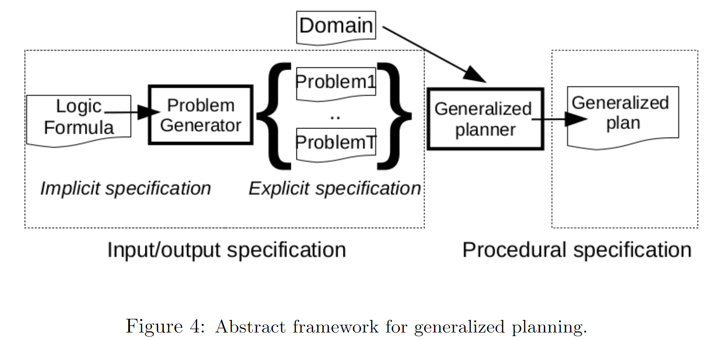

[TOC]


# A review of generalized planning

自动化规划（Automated Planning, AP）能够借助智能体（agent）及其环境的模型，在高度结构化的环境中解决复杂的推理性任务。然而，传统上由自动规划器生成的解决方案往往局限于特定的规划实例，因而缺乏泛化能力，此即**经典规划**（classical planning）的固有局限。

> **广义规划**（generalized plan）是一种类算法的解决方案，其有效性涵盖给定的一组规划实例。

近年来，由于规划表示方面的新颖形式主义以及计算此类解决方案的新型算法相继涌现，这些学术进展揭示了广义规划技术的巨大潜力，并推动规划方法在计算机科学诸领域中的应用，例如*程序合成（program synthesis）、自主控制（autonomous control）、数据整理（data wrangling）以及形式识别（form recognition）*[^Syntax-guided synthesis][^Inductive programming]。

本文梳理了广义规划领域的最新进展，并将其与现有的形式主义相关联，聚焦于自动化规划中的通用性问题，例如*结合领域控制知识的规划*以及*不确定性条件下的规划*等不同方法。

首先，本文提供自动化规划的背景知识，形式化地定义广义规划任务，并介绍本文对广义规划工作进行评估的标准。

其次，本文探讨用于表示规划任务的不同知识表示与推理方法。

第三，本文调查多种代表性形式主义，分析其各自的优势与不足。

第四，本文研究当前用于计算广义规划的算法。

最后，在讨论不同实现方法的基础上，本文指出有待深入探索的开放性研究问题，以激励未来的研究工作。


## 表示和推理
classical planning(the vanilla model in AP),

在*经典规划模型*——自动规划中最常见的模型——中，其基本假设如下：

1. 待求解的规划任务具有有限且完全可观察的状态空间。

2. 动作具有确定性，并导致瞬时状态转换。

经典规划实例的解决方案是一系列可应用的动作，这些动作将给定的初始状态转换为目标状态，即满足先前指定的目标条件集合的状态。

A classical planning frame is a tuple Φ =〈F,A〉, where F is a set of fluents and A is a set of actions. 

Given  a  frame  Φ  =〈F,A〉,  a **classical  planning**  instance is  a  tuple P=〈F,A,I,G〉,  where I∈ L(F) is an initial state (i.e.|I|=|F|) andG∈ L(F)is a goal condition. 

规划领域定义语言**（PDDL）**[59] 是国际规划竞赛（IPC）[95] 的输入语言，也是表示经典规划实例的标准格式。除经典规划外，PDDL 还能够表示更具表达力的规划模型，例如*时序规划以及带有路径约束和偏好的规划*[27, 33]。

广义规划是生成式模型（generative model），其形式多种多样。每种形式均具有自身的表达能力以及计算与验证复杂性。


广义规划的范围涵盖程序 [97, 83]、广义策略 [57]、有限状态控制器（FSCs）[10, 84]、AND/OR 图、形式文法 [77] 以及 HTN [66] 等多种形式。

可以根据广义规划对*下一步要执行的动作*的规范程度对其分类：

- **完全指定的解决方案**（Fully specified solutions），能够明确捕获接下来要执行的动作，以解决给定的广义规划任务中的每个实例。程序、广义策略或确定性 FSC 均属于此类。若我们将一致的（conformant）、或有的（contingent）或 POMDP 规划也归入此类，则可能的初始状态代表不同的经典规划实例，它们共享相同的状态变量、动作和目标 [42]。**我认为非确定的图的解图 policy=确定性=可以写成 program**
- **未指定的解决方案**（Non specified，我认为是每个实例都没规律需要 classical planner 额外规划）。带有领域模型的经典规划器是广义规划的一种形式。此类规划极为通用（涵盖了能用经典规划器输入语言表示的任何实例），但执行机制效率低下（需要针对广义规划任务中的每个实例运行经典规划器以生成完全指定的解决方案）。
- **部分指定的解决方案**（Partially specified）。共享上述两类要素的广义规划。使用*特定于领域的控制知识*进行*规划*的不同方法属于此类，因为仍需要规划人员针对特定实例生成完全指定的解决方案，但可利用约束可能解决方案的常识。此类包括部分指定的程序、非确定性 FSC、形式文法、AND/OR 图或 HTN。**认为这就是 QNP/FOND 可以搜索 "policy-->解子图"**

The execution of a generalized plan  $\Pi$  in a classical planning instance P=〈F,A,I,G〉is a classical plan,



The *problem generator* box refers to a generative model of the instances inthe generalized planning task.  广义规划任务包含一组待求解的独立规划任务。这组规划任务可以是有限的或无限的，并且可以用不同的方式加以描述，例如对经典规划实例进行显式枚举，或通过使用逻辑公式、概率分布、问题生成程序等方式进行隐式指定。当提供规划任务的显式说明时，可跳过问题生成步骤。

The **generalized  planner** box  refers  to  an  algorithm  d  with  aninput-outputspecification of the instances to solve and that generates a solutionto  these  instances.  其中包含待求解实例的*输入-输出*规范，并为这些实例生成解决方案。

广义规划算法涵盖从纯粹的**自上而下**（top-down，我理解为 MyND 启发式图搜索子图，或 FOND-SAT 全空间搜索）方法——即在广义规划空间中搜索涵盖所有输入实例的解决方案——

到**自下而上**（bottom-up，我理解为 PRP、FF planner，开创者从实例中学习的方法）的方法——即为单个实例计算解决方案，然后通过概括和合并先前找到的解决方案逐步扩大广义规划的覆盖范围。最终，*广义规划*可被视为广义规划任务中规划实例的过程性表示。


通用 GP 规划类似于经典规划，传统求解方法包括：

1. 在经典规划中，规划器仅接收单个且具象的规划实例作为输入。
2. 经典规划的最新算法是在状态空间中进行启发式搜索 [37, 30]，或将其编译为其他形式的问题求解方法（例如 SAT [78]）。
3. 经典规划是一系列动作，其执行和验证在规划长度上呈线性复杂度。然而，具有条件效应、变量和控制流结构的动作可用于更紧凑地表示经典规划任务的解决方案 [52, 81]。

### Representing Sets of Planning Tasks

different formalisms for representing sets of planning taskswithin generalized planning.

- Representing Actions

（RL 强化学习结合）一个示例是在 **ATARI** 视频游戏中使用的以智能体为中心的行为模型 [62]，其中 18 种可能的行为根据视频游戏的当前状态具有不同效果。在此，我们回顾了经典规划行为模型的扩展，这些扩展旨在使规划任务和规划解决方案更加紧凑且更具通用性。

- Conditional effects=preconditions+conditional  effects

Conditional effects cannot be compiled away if plan size should grow only linearly [67].  

PDDL supports the definition of conditional effects with the  **when** keyword。In PDDL the condition of a given conditional effect has the same expressivenessas action preconditions and goals, so it can either be a negation, a conjunction,a disjunction or a quantified formula, as defined in the ADL formalism [71, 27].

- Update formulas and high-level state features

**Srivastava** 等人 [90] 在广义规划方面的一系列工作采用更新公式（update formulas）对动作效果进行编码。更新公式是任意的 FOL 公式，包含传递闭包（transitive closure），用于定义给定谓词在应用动作后的新值。

等效地

包含传递闭包的任意 FOL 公式可以在 PDDL 中使用**派生谓词**（derived predicates）来表示，这些派生谓词随后可纳入动作前提条件、条件效应以及目标之中。

```
(:derived (above ?x ?y - block)
		(or (on ?x ?y)
			(exists (?z - block)
				(and (on ?x ?z) (above ?z ?y)))))
```

this is how  PDDL  defines  theabovederived predicate that models whether a block?xisaboveanother block?yin ablocksworld tower*派生谓词*能够表示表达性的状态查询，涵盖状态变量和递归层次结构 [92]。事实证明，这对于紧凑地表示规划任务以及实现更高效的规划具有重要价值 [45]。

除派生谓词外，多种形式主义已用于表示规划中的状态查询，其范围从一阶子句 [96] 到描述逻辑公式 [57]，乃至 LTL 公式 [20]，以定义关于状态序列的查询。

- Sensing and non-deterministic actions

当状态在 **FOND** 下完全可观察（fully observable）时，考虑到任何状态信息均可通过状态查询获取，因此无需显式的感知动作。相应地，传感动作适用于 **POMDP** 部分可观察性下的规划，它们不模拟状态转换，而是对当前状态中*未知*的信息进行观测。当缺乏有关当前状态的信息导致规划器无法制定出确保实现目标的计划时，规划器便会采用感知动作。

若我们假设关于当前状态的不确定性是单调递减的（即一旦*知道*状态变量的值，该值可以改变，但不会再次变得*未知*），则可将感测动作编码为非确定性动作 [65]。

PPDDL（PDDL 的概率版本 [100]）可用概率效应进行编码，采用概率动作进行的规划成为*优化*任务，规划器的目标是最大化达到目标的可能性。非确定性和概率性动作也可以编码非确定性状态转换，例如在完全可观察的非确定性（FOND）或 MDP 规划中 [58, 32]。


- Representing Initial and Goal States

可以显式定义一组状态——枚举该集合中的每个状态，或者隐式定义一个状态必须满足的约束（例如传递闭包）才能属于该集合。也可以明确指定广义规划任务中的实例集，枚举其中的各个经典规划实例。

根据用于指定这些约束的语言，存在不同的形式主义来表示一组规划实例：

- - **Propositional logic.** 在此情况下，可能的初始状态和目标状态的集合仅使用文字和三个基本的逻辑连接词表示（即表示文字的合取或表示文字的析取，而不包含否定）。用命题逻辑表示的规划实例集的示例包括一致的、或有的或 POMDP 的规划任务，这些任务将任务的不同可能初始状态定义为问题文字的析取（而目标为规划任务中所有可能的初始状态所共享）[10]。
  - **First-order logic.** 一阶逻辑约束可以包含量化变量，包括传递闭包，并表示无限制的状态集。这些特性使一阶公式能够实现规划实例集的紧凑表示以及无限制规模的规划任务 [90]。对于给定的有限对象集，一阶表示形式可直接转换为命题逻辑表示形式。
  - **Constraint Programming.** 在此情况下，状态集由一组有限域变量 X={x1,...,xn}（其中每个变量 xi，1 < i < n 具有关联的有限域 D(xi)）以及一组约束 C 来定义，约束 C 决定状态何时属于该集合。除约束编程语言的表示灵活性外，在此情况下可以使用现成的 CSP 求解器来解决广义规划任务 [74]。
  - **Three-valued logic.** 在此逻辑语言中，存在三个真值：1（真）、0（假）或 1（未知）。Srivastava 等人使用三值逻辑进行状态抽象，以紧凑地表示无边界的具体状态集 [90]。三值逻辑对于表示和解决一致任务和或然任务也颇具价值 [72, 69, 1]。

确定一组规划实例：除使用初始状态和目标状态集外，未来还可以利用其他信息，例如*领域不变量*[90] 甚至分类的执行历史记录，包括*正*例和*负*例 [43]，类似于归纳逻辑编程（ILP）[75] 中的做法。


广义规划具有两大优势，即*紧凑性*（compactness）和*通用性*（generality）。

- Control-flow structures augment the flexibility of generalized plans with respectto classical plans:

- - **Branching（分支）:** 计划的执行根据当前状态下给定表达式的求值结果进行分支。具有分支结构的规划解决方案的示例包括 AND/OR 树状*或有计划*[^1] 或*K-Fault 容忍计划*[^22]。
  - **Loops（循环）:** 重复执行规划段，直到给定条件在当前状态下成立。具有循环的规划解决方案的示例包括用于表示 MDP 解决方案*的策略类*规划 [49]，以及 FOND 规划任务 [^64]。

仅包含分支构造的解决方案规划的大小在可能的状态观察次数中可能呈指数级增长。合并*分支*和*循环*通常有助于压缩广义规划。在某些解决方案表示中，例如 DSPlanners [^97][^98]，分支和循环对应于不同的控制流构造，但通常它们使用相同的构造（例如条件转移）实现，以保持解空间的可管理性。在*有限状态控制器*（FSC）[10]、*广义策略*[57] 或*规划程序*[83] 中使用的*条件 goto* 即属此类情况。

- Variables（循环控制变量、数值变量）

**DSPlanners** address this issue representing solutions with quantified variables[^97]. 解决了使用*量化变量*表示解决方案的问题 [^97]。

A DSplanner is a domain-specific program that can contain **if-then-else & while**constructs.也就是说，在包含分支循环的控制流图中进行与或树搜索，以搜索规划任务的解子图。


[^1]: Alexandre  Albore, H ́ector  Palacios,  and  Hector  Geffner.   A  translation-based approach to contingent planning.  InIJCAI, 2009

[^22]: Carmel Domshlak. Fault tolerant planning:  Complexity and compilation.InICAPS, 2013.
[^64]: Christian   Muise,   Sheila   A.   McIlraith,   and   Vaishak   Belle.Non-deterministic planning with conditional effects.  InICAPS, 2014
[^97]: Elly Winner and Manuela Veloso.  Distill:  Learning domain-specific plan-ners by example.  InICML, 2003.
[^98]: Elly Winner and Manuela Veloso.  Loopdistill:  Learning looping domain-specific planners from example plans.  InICAPS, Workshop on ArtificialIntelligence Planning and Learning, 2007
[^P]: Allen Newell, JC Shaw, and Herbert A Simon. A general problem-solvingprogram for a computer.Computers and Automation, 8(7):10–16, 1959.
[^P]: C

**量化变量**（Quantified variables）使得识别具有特定特征的对象并对其应用选择性操作成为可能。

**存在变量**（Existential variables）。通用变量（Universal variable）断言，给定的属性或关系对于所有可能的变量值均成立。除 DSPlanners 外，存在变量还出现在选择操作中 [90]，即在规划执行过程中实例化的操作以及在当前状态下评估 FOL 公式的结果。另一个示例是*广义策略*，其规则包含要与当前状态统一的变量 [48]。PDDL 可以表示具有派生谓词的策略 [45]。

**通用变量**（Universal variables）。通用变量断言，给定的属性或关系适用于所有可能的变量值。

在定量变量上评估给定表达式的派生谓词的使用也适用于其他形式的广义规划，例如 FSC。


**栈递归调用**。尽管仅使用基本控制流和变量就可以显式地对调用栈进行编码，但通常可以通过调用栈获得更紧凑的解决方案（例如具有递归解决方案的任务 [84]）。用于访问二叉树所有节点的通用规划实现了具有一个过程参数的递归深度优先搜索（DFS）。指令 **call（0，***node* **）** 是递归调用，将参数 *node* 分配给程序的唯一参数，并从其第一行重新开始执行。


**实现递归 DFS 以遍历任意大小的二叉树的通用规划**

**hierarchical generalized plans [83]对任意大小的数字列表选择排序算法**


### **执行和验证**


广义规划可以具有分支、循环以及变量，因此在特定经典规划实例上执行广义规划需要特定的机制，这不同于传统规划中传统使用的机制：

•   *分支。*具有多个可能执行分支的广义规划的执行需要一种机制，用于根据状态变量的当前值选择相应的执行分支。可以将具有分支结构的若干广义规划（例如 HTN、AND/OR 树状规划或策略）的执行编译为经典规划 [3, 1, 45]。如第 3 节所述，可以通过*条件效应*有效地建模根据状态变量不同值而执行的不同可能执行结果 [67]。

•   *循环。*执行显式表示循环的广义规划（例如程序或 FSC）需要跟踪当前程序行（或控制器状态）。通过将相应的自动机（其状态和可能的转换）编码为额外的状态变量，**可以将 FSC 和程序的执行编译为经典规划**[^7, 83, 84]。

•   *变量。*如果广义规划包含量化变量，则规划执行需要统一机制，以将可能的值分配给这些变量。早期规划系统实现了变量绑定算法以匹配控制规则 [96]。如今，Fast-Downward 使用实现了*标记算法*的量化变量评估派生谓词 [37]。另一种不同的方法是利用外部求解器（例如*答案集编程*[45] 或 CSP [29] 求解器）来量化变量。同样存在编译方法，在*连接查询*中绑定存在变量 [55] 并使用传递闭包 [73] 来评估 FOL 状态查询。不幸的是，当前大多数现成的规划器仅有效地支持简单条件，因为命题原子的连接和汇编存在量化公式产生指数级代价 [28]。

在给定规划实例上执行广义规划的最简单的期望属性是**终止性测试**或**验证**，在文献中也称为*停机问题*。在最坏情况下，广义规划执行的动作数上限由广义规划的可能状态总数决定。随后可以通过对规划执行期间的动作数进行计数，并检查该计数是否超过先前的上限来检测无限循环 [6]。

[^7]: Jorge A Baier, Christian Fritz, and Sheila A McIlraith. Exploiting proce-dural domain control knowledge in state-of-the-art planners.  InICAPS,2007

[^83]: Javier Segovia-Aguas, Sergio Jim ́enez, and Anders Jonsson.  Generalizedplanning with procedural domain control knowledge.  InICAPS, 2016
[^84]: Javier Segovia-Aguas, Sergio Jim ́enez, and Anders Jonsson.  Hierarchicalfinite state controllers for generalized planning.  InIJCAI, 2016
[^P]: C
[^P]: C
[^P]: C
[^P]: C

执行广义规划的第二个属性是保证规划能够解决给定实例。检验此属性称为**验证**或**有效性验证**。证明验证包含终止证明，并且作为规划生成的一部分是隐式的。经典规划中的规划验证较为简单，因为可以通过从经典规划任务的初始状态开始*执行*规划来获得验证证明或失败证明。VAL [41] 在第三届国际规划竞赛（IPC）中引入，是用于经典规划的标准规划验证工具。在广义规划的情况下，规划可以具有分支、循环和变量，规划验证因而更为复杂。在给定规划实例中执行广义规划可能无法解决该实例，原因如下：

1. 规划*不健全*（unsound）：广义规划由于进入无限循环而无法满足*终止*条件。
2. 规划*不完整*（incomplete）：当前状态没有下一步要执行的动作（例如，在当前状态下没有适用规则的策略）。

如果可以将广义规划的执行编译为经典规划任务 [7, 83, 84]，则可以使用现成的经典规划器来有效检查先前的验证条件。当动作具有不确定性影响时，规划验证变得更加复杂，因为它需要证明所有可能的规划执行均能达到目标 [14]。在此情况下，*模型检查*[16] 和*非确定性规划*是合适的方法 [38]。

与经典规划不同——经典规划与特定规划实例相关联——广义规划也可以在一组不同的规划实例上执行。在广义规划任务上验证广义规划需要在任务包含的所有实例中执行规划，并验证该规划已解决所有问题。这意味着在给定实例中对给定的广义规划的验证应在规划大小的多项式时间内完成。可以通过两种不同的方法在规划实例集中实施广义规划的执行：

• *顺序执行*，即在每个实例中逐一执行广义规划。这是使用经典规划器执行广义规划所遵循的方法，该规划器在给定的广义规划任务所包含的每个单独规划实例中依次执行规划 [83]。

• *并行执行*。广义规划在广义规划任务的实例集中同时执行（例如按照一致、或然或 POMDP 规划，其中动作的执行会进展到一组状态 [32]）。

*顺序*方法的实现较为简单，但其实用性受限于实例数量。*并行*方法允许处理更大的实例集合（或对象数量不受限的实例），但它需要精细的状态进展技术，如信念跟踪 [8] 或动作在抽象状态上的应用 [90]。在并行执行中，评估表达目标或派生谓词变得更加复杂，因为这意味着对状态集进行公式评估 [32]。验证广义规划的第三种方法是展示执行前后的某些属性，例如在使用 ***Hoare 三元组*** 的*程序验证*中 [82]。


### 实验等评价指标


#### **评估**

给定一组规划实例，不同的广义规划可以与其*保持一致*。例如，图 11、12 和 14 中所示的不同的广义规划可以将任意高度的积木塔堆叠起来。因此有必要定义一种方法，能够量化给定广义规划的能力，以阐明可能的解决方案之间的偏好。

可以针对不同的指标评估广义规划的能力：

•   *覆盖范围*。可以将广义规划的*领域覆盖范围*评估为广义规划可以解决的大小为 *n* 的问题实例数量除以相同大小的可解决问题实例总数的比率 [90]。在实践中，获知这些数值意味着要解决大量规划任务，因而通常较为棘手。统计机器学习（ML）技术根据解决方案在领域实例的*代表性*样本（称为*测试集*）上的执行效果来估算解决方案的质量 [61]。在广义规划中，还可以定义一组测试实例，并计算解决方案涵盖了多少实例。如果将经典规划器视为广义规划的一种特殊形式，那么在国际规划竞赛（IPC）[95] 的顺序最优轨道上就是如此操作的，在该轨道中，规划器根据其解决的未见实例的数量获得奖励。

•   *复杂性*。由于广义规划是类算法的解决方案，可以从理论上评估其复杂性，例如，使用渐进分析来表征其运行时间和空间需求如何根据输入任务的大小而增长。实际上，可以通过在给定的输入实例上执行规划所产生的动作序列的长度来量化广义规划的复杂性。当给定实例的序列长度对该实例*最小*时，广义规划是*最优*的。这与 IPC [95] 的顺序满意度轨道有一定关联，在该轨道中，规划器的最终分值报告为测试集实例中解决方案的累积质量。

• *简洁性*。可以根据规划行数、控制器状态、策略规则或量化变量来评估给定广义规划的大小。在 ILP 系统中已引入类似的度量标准，以量化解决方案的*紧凑性*和*可读性*，并且倾向于规则数量最少的模型和规模最小的规则 [63]。需要注意的是，在经典规划中，规划的执行复杂度直接与其规模相对应。


### Solver


计算广义规划的两种主要方法，并回顾了不同的*规划重用*技术，以避免从头开始计算广义规划。本节最后回顾了针对广义规划的不同方法的具体实现。

在*自上而下的*广义规划搜索方法中，解决方案涵盖广义规划任务中的所有实例。另一方面，*自下而上的*方法为单个实例（或广义规划任务中的实例子集）计算解决方案，并扩大解决方案的覆盖范围，直至涵盖所有实例。就机器学习而言，自上而下的方法与*离线*机器学习算法有关，该类算法在一次迭代中计算模型以覆盖整个输入实例集，例如决策树的归纳 [^61]。自下而上的方法与*在线*版本的 ML 算法相关，该类算法随着更多输入实例的出现，迭代地、增量地适应模型 [^94]。

[^61]: Thomas M Mitchell.Machine  Learning.  McGraw-Hill,  Inc.,  New York,NY, USA, 1 edition, 1997.
[^94]: Paul E Utgoff. Incremental induction of decision trees.Machine learning,4(2):161–186, 1989.

用于广义规划的*自上而下*算法通常在可能的广义规划空间中搜索解决方案。此搜索的初始状态是*空*广义规划，搜索算子逐步在广义规划中建立步骤（例如，向程序添加指令、向 FSC 添加新状态或过渡、向策略添加新规则等）。搜索的目标状态集包括所构建的广义规划能够解决给定实例集的任何状态。

此类方法的示例包括将广义规划编译为其他形式的问题求解方案，例如***经典规划***[^46]、***一致规划***[^10]、***CSP***[^74] 或 ***Prolog 程序***[^43]。这些编译实现了如上所述的搜索空间，并受益于现成求解器（具有高效的搜索算法和启发式方法）来完成对广义规划的搜索。编译方法的主要限制在于可扩展性。在实践中，通常为了限制搜索范围，会限制可能的广义规划的大小（例如，程序行、控制器状态、策略规则或量化变量的最大数量）。这类似于 SATPLAN 方法中所采用的做法，该方法确定最大规划长度 [78]，然后迭代增加直到找到解决方案为止。

[^46]: Sergio Jim ́enez and Anders Jonsson. Computing Plans with Control Flowand Procedures Using a Classical Planner.  InSOCS, 2015.
[^10]: Blai Bonet, H ́ector Palacios, and Hector Geffner. Automatic derivation offinite-state machines for behavior control.  InAAAI, 2010
[^74]: C ́edric Pralet, G ́erard Verfaillie, Michel Lemaˆıtre, and Guillaume Infantes.Constraint-based  controller  synthesis  in  non-deterministic  and  partiallyobservable domains.  InECAI, 2010
[^43]: Yuxiao Hu and Giuseppe De Giacomo. A generic technique for synthesiz-ing bounded finite-state controllers.  InICAPS, 2013.
[^P]: C

如果我们认为可能的初始状态代表不同的共享相同目标的规划实例，则针对意外情况 [1]、一致情况 [69] 和 POMDP 规划 [32] 的离线算法也可以理解为*自上而下*的广义规划算法。在此情况下，通常不是在可能的广义规划空间中搜索解决方案，而是在可到达的*信念状态*空间中进行搜索。在此，可扩展性限制源于以下事实：可到达的信念状态集合快速增长（因此，利用降低不确定性的技术以使可能的状态集合易于处理至为关键），同时难以定义有效的启发式方法以提供对信念状态的*有用*估计。

*自下而上的*广义规划是一种迭代且增量的方法，其中（1）选择单个规划实例（或广义规划任务中的实例子集），（2）计算其解决方案，（3）对解决方案进行泛化，最后（4）与先前找到的广义解决方案合并。重复此四步过程，直至涵盖广义规划任务中的所有实例。*自下而上的*方法与*规划修复*[26]、*基于案例的规划*[11] 和*迁移学习*[70] 相关，因为它也需要一些机制来确定为什么给定解决方案不涵盖给定实例（在此情况下，适用于广义规划的验证机制适合于查找给定计划中断言失败的原因 [97]），以及使给定解决方案适应新场景的机制（在不完善的控制知识下进行规划时也存在这种适应机制 [99]）。

虽然*自上而下的*方法可以作为编译为其他形式的问题求解方案来实现，但*自下而上的*方法需要具体的技术来提升和合并计划。另一方面，*自下而上的*方法提供了随时可得的行为，并且可能能够自动构建小规模实例集以实现泛化 [91]。

[^]: 

[^P]: C
[^P]: C
[^P]: C
[^P]: C
[^P]: C
[^P]: C


#### 重用广义规划 Srivastava 的方法

从头计算广义规划的另一种方法是重用现有解决方案。即使某个广义规划不正确（从某种意义上说它无法解决给定实例）或不完整（它未定义要在给定实例上应用的动作），它也可能包含有用的知识。例如，规划可能能够解决给定广义规划任务的子问题或类似实例（即一个解决方案但针对不同类型的对象），或者在调整控制流结构中的条件后解决新实例。在这些情况下，采用先前存在的广义规划可以取得回报。

在这方面，*自下而上的*广义规划方法配备了使规划适应未知案例并逐步增加其覆盖范围的机制 [91]。另一方面，*自上而下的*方法可以从部分指定的解决方案开始，而不是从*空*广义规划开始。这表明缩小搜索空间和/或集中搜索过程十分有用，从而有可能解决更具挑战性的广义规划任务 [83, 84]。

接下来，我们回顾重用先前找到的规划的不同技术：

•   *编译*。当现有的广义规划具有广义策略的形式时，可以将其编译为一组 PDDL 派生谓词，策略中的每个规则都包含一个谓词，该谓词捕获应采取行动的不同情况 [45]。图 13 说明了此方法，该图显示了 PDDL 派生谓词的示例，该谓词表示用于堆叠积木塔的 2 规则策略。我们还解释说，通过**We  also  explained  that  existinggeneralized plans in the form of programs, FSCs or AND/OR graphs, canbe encoded into a classical PDDL planning task by computing the crossproduct  between  the  corresponding  automata  and  the  original  planningtask [^7, 83, 77]计算相应自动机与原始规划任务之间的叉积，可以将程序、FSC 或 AND/OR 图形式的现有广义规划编码为经典 PDDL 规划任务**。[7, 83, 77] 在此情况下，新的额外状态变量将添加到原始规划任务中，以表示与程序、FSC 或 AND/OR 图相对应的自动机的状态和转换。

•   *规划动作*。经典规划中的动作不仅代表原始动作，还可以代表广义规划本身。图 20 显示了一个经典规划动作，该动作对应于一个广义规划，该规划用于将一个积木世界中的任意积木堆叠起来，即解决任意积木世界实例的广义解决方案中的第一步。

[^7]: Jorge A Baier, Christian Fritz, and Sheila A McIlraith. Exploiting proce-dural domain control knowledge in state-of-the-art planners.  InICAPS,2007.
[^83]: Javier Segovia-Aguas, Sergio Jim ́enez, and Anders Jonsson.  Generalizedplanning with procedural domain control knowledge.  InICAPS, 2016.
[^77]: Miquel Ramirez and Hector Geffner.  Heuristics for planning, plan recog-nition and parsing.arXiv preprint arXiv:1605.05807, 2016
[^P]: C

###### **计算宏动作**

*宏动作*（macro-actions）是计算有效解决不同规划任务的常识性知识的最早建议之一 [25]。文献中有多种方法可用于计算宏动作 [12, 18, 47, 13]，但最常见的方法是：

（1）求解一组共享相同领域理论但使用现成经典规划器的经典规划实例训练集，以及

（2）在解决方案规划中确定经常一起使用的动作的子序列。

宏动作的优势在于它们具有标准经典规划动作的形式，因此可以直接添加到领域理论中，而无需额外的状态变量。这使得*宏动作*成为重用广义规划知识的实用而强大的方法：一方面，使用宏动作进行规划或执行和验证包含宏动作的规划都不需要特定的算法；另一方面，添加不完整或不正确的宏动作不会阻止规划器找到可解决问题的解决方案，因为规划器始终可以使用原始操作来构建解决方案。

定义总体规划策略的宏动作的主要限制在于其顺序执行流程过于严格。即使将宏动作参数化，涉及宏的解决方案也可能不适用于其他问题。

[^P]: C
[^P]: C

### **计算广义策略**
*广义策略*是一组规则，它定义了从状态和目标到*下一步要执行*的优选动作的映射。与宏动作类似，广义策略也允许参数化，并且可以从共享相同领域理论的经典规划实例的一组解决方案中推导得出 [^57][^99][^21]。然而，广义策略比宏动作更具灵活性，因为它们可以定义带有分支和循环的执行流。

[^57]: Mario  Mart ́ın  and  Hector  Geffner.   Learning  generalized  policies  fromplanning examples using concept languages.Applied Intelligence, 20(1):9–19, 2004.
[^99]: Sungwook Yoon, Alan Fern, and Robert Givan.  Learning control knowl-edge for forward search planning.The Journal of Machine Learning Re-search, 9:683–718, 2008.
[^21]:  Tomas De la Rosa, Sergio Jim ́enez, Raquel Fuentetaja, and Daniel Bor-rajo. Scaling up heuristic planning with relational decision trees.Journalof Artificial Intelligence Research, 40:767–813, 2011.


#### **计算有限状态控制器**

*有限状态控制器*（FSC）可以使用有限的内存来泛化策略 [^9]。具有单一状态的 FSC 表示策略，即无内存控制器。FSC 的附加控制器状态为其提供了内存，允许在相同观察情况下采取不同的动作。FSC 形式主义也可以通过*调用栈*进行扩展，以表示层次化和递归解决方案 [^84]。

现有的用于计算广义规划 FSC 的算法遵循*自上而下的*方法，该方法将对 FSC 的*编程*与验证相交替，因此它们紧密地集成了规划与归纳。为了使 FSC 的计算易于处理，它们限制了可能的解决方案空间，从而限制了 FSC 的最大大小。此外，它们要求实例不仅共享领域理论（动作和谓词方案），还共享流利集 [^83] 或*可观察*流利的子集 [^10]。

用于广义规划的 FSC 的计算包括将广义规划任务编译为其他形式的问题求解方案的工作，因此它们将从现成求解器的最新进展中受益（例如，*经典规划*[^83]、*一致规划*[^10]、*CSP* [^74] 或 *Prolog 程序*[^43]）。最后一种情况需要 FSC 的行为规范，该规范包括分类的执行历史记录：（1）接受所有导致目标到达满意状态的合法执行历史记录；（2）拒绝包含重复配置的执行历史记录（表明无限循环），并且无法扩展（指示死锁）[43]。


[^9]: Blai  Bonet  and  Hector  Geffner.   Policies  that  generalize:  Solving  manyplanning problems with the same policy.IJCAI, 2015.
[^84]:  Javier Segovia-Aguas, Sergio Jim ́enez, and Anders Jonsson.  Hierarchicalfinite state controllers for generalized planning.  InIJCAI, 2016.

[^10]: Blai Bonet, H ́ector Palacios, and Hector Geffner. Automatic derivation offinite-state machines for behavior control.  InAAAI, 2010.
[^43]: Yuxiao Hu and Giuseppe De Giacomo. A generic technique for synthesiz-ing bounded finite-state controllers.  InICAPS, 2013.
[^74]:  C ́edric Pralet, G ́erard Verfaillie, Michel Lemaˆıtre, and Guillaume Infantes.Constraint-based  controller  synthesis  in  non-deterministic  and  partiallyobservable domains.  InECAI, 2010.


#### **计算程序**

程序提高了 FSC 的可读性，它们将控制流结构与原始动作相分离。与 FSC 类似，程序也可以按照*自上而下的*方法进行计算，例如利用对状态和动作空间相同的实例进行编程并验证程序的编译 [^83]。
[^83]: Javier Segovia-Aguas, Sergio Jim ́enez, and Anders Jonsson.  Generalizedplanning with procedural domain control knowledge.  InICAPS, 2016.
由于这些*自上而下的*方法在解决方案空间中进行搜索，因此限制不同的控制流指令集大有裨益。例如，仅使用既能实现分支又能实现循环的*条件 goto*[^46]。

*DSPlanners* [^97][^98] 是将程序泛化为规划的最早尝试之一。*DSPlanner* 是可以包含 if-then-else 和 while 结构的领域特定规划方案。这些构造根据关于当前状态和/或规划任务目标的 FOL 查询来分支和循环程序的执行控制流。
[^46]: Sergio Jim ́enez and Anders Jonsson. Computing Plans with Control Flowand Procedures Using a Classical Planner.  InSOCS, 2015.
[^97]: Elly Winner and Manuela Veloso.  Distill:  Learning domain-specific plan-ners by example.  InICML, 2003.
[^98]:  Elly Winner and Manuela Veloso.  Loopdistill:  Learning looping domain-specific planners from example plans.  InICAPS, Workshop on ArtificialIntelligence Planning and Learning, 2007.


该算法计算 DSPlanners 被称为提炼（Distill）并实现了一种*自下而上的*方法，用于一组共享同一领域理论的经典规划实例。给定一个实例，提炼计算该实例的解决方案，并将其部分有序规划整合到现有 DSPlanner 中，具体如下：首先，Distill 提取部分有序的规划，选择与现有 DSPlanner 相匹配的参数。如果不存在这样的参数化，则 Distill 将变量名称随机分配给规划中的对象。然后 Distill 尝试确定*语句*和展开的*循环迭代*，在解决方案中将其替换为相应的控制流结构。

Srivastava 等人在广义规划方面的工作在程序中引入了一种强大而紧凑的结构，称为*选择动作*，该结构将存在变量和控制流结合在一起 [^90][^91]。这项工作中的输入实例被表示为带有传递闭包的抽象 FOL 表示形式。这种形式主义允许用无限多个对象来表示规划任务，并保证此类任务的解决方案具有普遍性。

Srivastava 等人的广义规划算法实施*自下而上的*策略。该算法从空的广义规划开始，然后通过识别其无法解决的实例，调用经典规划器来解决该实例，将获得的解决方案进行归纳并将其合并回广义规划中，从而逐步增加其覆盖范围。重复该过程，直到生成一个涵盖整个期望类实例的广义规划（或达到计算资源的预定义限制时为止）。

程序和 FSC 都可以被编入平面领域理论 [^7][^83][^84]。与策略类似，当给定程序（或 FSC）正确时，这种编译是*安全的*（不会将可解决的规划实例转化为不可解决的）。

表 1 总结了广义规划的已审查方法。该表指示给定的解决方案表示形式是否允许使用 **变量**、**控制流的类型**以及解决方案的**执行**是否需要特定的机制。
[^90]: Siddharth  Srivastava,  Neil  Immerman,  and  Shlomo  Zilberstein.   A  newrepresentation and associated algorithms for generalized planning.Artifi-cial Intelligence, 175(2):615 – 647, 2011.
[^91]:  Siddharth Srivastava, Neil Immerman, Shlomo Zilberstein, and TianjiaoZhang.  Directed search for generalized plans using classical planners.  InICAPS, 2011.
[^7]: Jorge A Baier, Christian Fritz, and Sheila A McIlraith. Exploiting proce-dural domain control knowledge in state-of-the-art planners.  InICAPS,2007.
[^83]: Javier Segovia-Aguas, Sergio Jim ́enez, and Anders Jonsson.  Generalizedplanning with procedural domain control knowledge.  InICAPS, 2016
[^84]: Javier Segovia-Aguas, Sergio Jim ́enez, and Anders Jonsson.  Hierarchicalfinite state controllers for generalized planning.  InIJCAI, 2016.


根据解的表示方法分类Summary of the 

### diverse approaches for generalized planning 

according to the solution representations：

|   | Variables	  | Control-flow	  | Execution  |
| -------  | -------  | -----  | ------  |
|Classical plan     | ------ | ------ | Ground actions  |
|Macro-Actions  |   Action parameters  | ------ | Lifted actions    |
| Generalized Policy | Rule parameters  | Branching and loops  | Lifted  rules  |
|DSPlanners | Existential | Branching and loops | Lifted predicatesand lifted actions |
| FSCs | Quantified| Branching and loops| Derived predicates|
| Hierarchical FSCs  | Quantified and parameters | Branching, loops and call stack |Derived predicates and Parameter passing|
| Programs| Quantified and parameters| Branching, loops and call stack| Derived predicates and Parameter passing|

### **部分可观察性下的规划：一致、或然和 POMDP 规划**

*一致规划*（conformant planning）可计算一系列与不同初始状态一致的动作序列 [69]。其与经典规划模型的不同之处在于初始状态中的不确定性，这种不确定性通过子句来描述。*一致规划*是一系列动作，它能够解决由满足这些子句的一组可能初始状态所给出的全部经典规划任务。由于动作具有条件效应，执行相同的动作序列可以为不同的初始状态产生不同的结果。一致规划的主要方法包括：

•   *减少不确定性*。将一致规划编译为经典规划以进行计算：

\1. 消除所有相关不确定性的规划*前缀*。换句话说，在前缀应用之后，只有一个状态（或与实现目标相关的状态变量子集的至少一个局部状态）是可能的 [69]。

2. 规划*后缀*，该*后缀*将状态（或已消除相关不确定性的部分状态）转换为实现一致规划任务目标的状态。

•   *信念传播*。在信念状态空间中进行搜索，其中：*根*信念状态表示可能的初始状态的集合，*目标*信念状态是指信念状态中的所有可能状态都满足规划任务的目标条件 [39, 15]。尽管前述方法利用了经典规划机制，但此方法需要（1）紧凑表示和更新信念状态的机制，以及（2）有效的启发式方法来指导在信念状态空间中的搜索。

*或然规划*（contingent planning）通过感知模型扩展了一致规划模型。该感知模型是一种函数，可以将状态-动作对（系统的真实状态和最后完成的操作）映射到一组非空的观测值中 [1, 2]。观测仅提供有关系统真实状态的部分信息，因为相同的观测可能对应不同的状态。*或然规划*必须满足：

• 其执行以有限步骤达到目标信念状态（信念中的所有状态都满足规划任务的目标条件）。

• 分支和循环的条件是指观测值（或可观察到的状态变量的子集）。

与广义规划类似，或然规划可以具有不同的形式，例如策略、AND/OR 图、FSC 或程序 [10]。

*POMDP 规划*扩展了或然规划模型，该模型允许通过概率分布对不确定性进行编码，而非使用可能的初始状态集和可能的观测值集 [32]。就此而言，*贝叶斯*规则用于在应用动作之后或观测当前状态之后更新信念状态。POMDP 解决方案的目标是最大化目标的期望收益，因此 POMDP 规划成为优化任务。

最优的一致性/或然/POMDP 规划是在最坏情况下将实现目标的成本最小化的规划。广义规划可以看作是或然/POMDP 规划的一个特定示例，其中：（1）待求解的实例具有相同的目标，（2）实例的初始状态是一组可能的初始状态中的一个状态，（3）具有完全可观察性，因此分支和循环的条件可以引用任何状态变量的值。

### **6.2 具有控制知识的规划**

自从规划研究开始以来，*控制知识*已显示出有效提升规划器可扩展性的能力 [5, 66]。IPC-2002 证明了这一点，在该竞赛中，利用**领域特定控制知识（DCK）** 的规划器比当时的先进规划器快多个数量级 [54]。

DCK [7] 的类算法表示形式与广义规划非常相似。实际上，DCK 和广义规划都代表了适用于解决不同规划实例的通用策略。尽管它们之间的区别很小，但可以认为广义规划是一种*完全指定的解决方案*，不需要在特定情况下应用规划器。另一方面，DCK 对应于*部分指定的解决方案*（包含非确定性构造以及规划器在生成规划时需要确定的缺失/未完成部分）。因此，DCK 要求规划器针对给定的经典规划实例提供**完全指定的**解决方案。

定义 DCK 的另一种方法是使用已解决实例的数据库。

实际上，广义规划的另一种观点是将其视为一个紧凑的规划库。*基于案例的规划*（CBP）是一种自动化规划方法，旨在通过重用以前找到的解决方案来节省计算量 [11]。

CBP 系统实现了识别与待求解实例相似实例的*检索*机制，以及修复检索到的解决方案中的缺陷以使其适用于另一实例的*适应*机制。CBP 的检索和适应机制与*自下而上的*广义规划算法相关，因为它们可以识别给定的广义规划何时不覆盖某实例，并对其进行调整以覆盖该实例 [97, 90]。遵循领域无关的方法，为大型案例库开发此类机制仍然是一个开放挑战。

表示和利用 DCK 的另一种形式主义是***层次规划***。与经典规划类似，层次规划处理确定性和完全可观察的规划任务，但使用不同的任务表示形式。在传统规划动作中，动作的前提条件和后置条件由规划器自动计算选择和排序，而*层次规划*则指定了解决方案的草图，其中包含关于（1）要追求的子目标 [87] 和/或（2）哪些动作可以实现给定子目标 [66] 的额外信息。

在层次规划中，待求解任务的表示与解决方案之间的界限不如传统规划那样清晰。层次规划任务可以理解为部分指定的广义规划（或领域特定的规划器），其中通过运行层次规划器可以确定规划的缺失部分。经典规划器的目标是计算将给定初始状态转换为目标状态的一系列适用动作，而层次规划器则计算以下动作序列：（1）将给定初始状态转换为目标状态，并且（2）此转换符合给定的层次结构。

[^P]: C
[^P]: C
[^P]: C
[^P]: C
[^P]: C
[^P]: C

### **GOLOG**

Golog 系列动作语言已被证明是自主智能体 [^53] 高级控制的有效工具。除条件、循环和递归过程外，Golog 程序的一个有趣特性是它们可以包含非确定性的部分。Golog 程序不一定表示完全指定的解决方案，而是一个草图，其中非确定性部分是需要由系统填补的空白。此功能使 Golog 程序员能够在以下两者之间灵活地选择合适的平衡点：

• 预定义行为的确定性，这通常意味着较大的程序。

• 通过搜索保留系统需要解决的某些部分，这通常意味着更长的计算时间。

基本的 Golog 解释器使用 PROLOG 回溯机制来解决搜索。这种机制本质上相当于盲目搜索，因此，在解决规划任务时，除最小规模的实例外，它很快变得不可行。IndiGolog [80] 扩展了 Golog，使其包含多种内置规划机制。此外，可以利用 Golog 和 PDDL 之间的语义兼容性 [^79]，并且可以嵌入 PDDL 规划器 [^17] 来解决本质上属于组合性的子问题。

[^53]: Hector J Levesque, Raymond Reiter, Yves Lesp ́erance, Fangzhen Lin, andRichard  B  Scherl.   Golog:   A  logic  programming  language  for  dynamicdomains.The Journal of Logic Programming, 31(1-3):59–83, 1997.
[^80]: Sebastian Sardina, Giuseppe De Giacomo, Yves Lesp ́erance, and Hector JLevesque.   On  the  semantics  of  deliberation  in  indigologfrom  theory  toimplementation.Annals of Mathematics and Artificial Intelligence, 41(2-4):259–299, 2004.
[^79]: Gabriele  R ̈oger,  Malte  Helmert,  and  Bernhard  Nebel.   On  the  relativeexpressiveness of adl and golog:  The last piece in the puzzle. InKR, 2008
[^17]: Jens Claßen, Viktor Engelmann, Gerhard Lakemeyer, and Gabriele R ̈oger.Integrating  golog  and  planning:    An  empirical  evaluation.InNon-Monotonic Reasoning Workshop, 2008


### **6.4 程序综合**

程序综合是自动生成满足给定高级规范的程序的任务。该研究领域的许多理念与广义规划相关，但由于广义规划遵循领域无关的方法并针对其自身特定的状态、动作和目标表示形式，因此它们并非直接适用。在此，我们回顾了两种最成功的程序综合方法：

• **示例编程**（PbE），计算与一组给定的输入输出示例一致的程序。输入输出示例对于非程序员来说直观易懂，可以用于创建程序；这种类型的规范使程序综合比基于抽象程序状态的推理更易于处理。PbE 技术已在现实世界中部署，并且是 Office 2013 中 Excel 的 Flash Fill 功能的一部分，该功能可生成用于字符串转换的程序 [^35]。在此情况下，使用称为**版本空间代数**（version space algebras）[^60] 的数据结构以受限的领域特定语言（DSL）简洁地表示一组合成程序。程序的计算采用实现分治策略的领域特定搜索方法。

• **通过草图编程**（PbS），程序员提供部分指定的程序，即表示实现的高级结构但留下由合成器确定的未定义细节的程序 [^89]。这种形式的程序综合依赖一种称为 **SKETCH** 的编程语言来绘制部分程序。PbS 在由两个通信的 SAT 求解器（归纳合成器和验证器）构建的合成验证循环上实现反例驱动的迭代，以自动生成测试输入并确保程序满足它们。尽管在最坏情况下，程序的合成比 NP 完全更困难，但这种反例驱动的搜索在仅解决少数 SAT 实例后就终止了许多实际问题 [^50]。

先前的工作包括*通过示例进行编程*从输入/输出示例中合成解析器的技术 [^51]。

[^35]: Sumit Gulwani. Automating string processing in spreadsheets using input-output examples. InACM SIGPLAN Notices, volume 46, pages 317–330.ACM, 201
[^60]: Thomas  M  Mitchell.   Generalization  as  search.Artificial  intelligence,18:203–226, 1982.
[^89]: Armando  Solar-Lezama,  Liviu  Tancau,  Rastislav  Bodik,  Sanjit  Seshia,and Vijay Saraswat.  Combinatorial sketching for finite programs.ACMSIGOPS Operating Systems Review, 40:404–415, 2006
[^50]: Brenden  M  Lake,  Ruslan  Salakhutdinov,  and  Joshua  B  Tenenbaum.Human-level  concept  learning  through  probabilistic  program  induction.Science, 350(6266):1332–1338, 2015.
[^51]: Alan Leung, John Sarracino, and Sorin Lerner. Interactive parser synthesisby example. InACM SIGPLAN Notices, volume 50, pages 565–574. ACM,2015
[^P]: C

### 总结


广义规划能够解决经典规划范围之外的规划任务：它们可以解决包含多个实例或对象数量不受限制的规划任务，以及具有部分可观察性和不确定性动作的规划任务 [10, 44, 91, 43]。广义规划

这是解决问题的一种有前景的范例，但仍需进一步研究以有效解决任意规划任务。

• ***广义规划任务的表示**。隐式表示允许处理大量规划实例。但是，这些表示需要特定的状态演进机制以及测试目标和动作前提条件的机制，这与现成规划器中传统实现的机制不同。

除了表示形式主义之外，广义规划任务中给定的实例集也会影响用于计算广义规划的不同方法的性能。有时，可以使用*极端情况*构建少量代表性实例。*极端情况*将状态变量推到其最小值或最大值，因此仅在那些特定状态下才考虑规划行为，而非考虑所有可能的输入实例。对于一般情况而言，自动识别少量代表性实例非常复杂，因此仍然需要手动完成对广义规划任务中代表性实例的选择。

自动确定实例以计算通用解决方案的第一步是表征将策略泛化为其他问题的条件 [9]。这种方法为自动生成计算泛化解决方案所需的最简单实例集的方法开发打开了大门。

• *广义规划的计算*。当前用于广义规划的算法只能解决相对较小的任务。进一步研究广义规划的特定启发式方法、自动识别相关状态变量（例如，查找可能出现在循环和分支条件下的状态变量的子集）或目标的自动序列化，有助于提升广义规划器的能力。

特定领域的分解还可以解决更具挑战性的广义规划任务 [83]。不幸的是，这些分解目前需要手工完成，如何从广义规划任务的表示中自动计算它们仍然是一个悬而未决的问题。考虑到这一点，*规划地标*可能是一个有趣的研究方向 [40]。另一种提高广义规划器可扩展性的工作方向是探索将给定规划任务转换为更小任务的方法，该任务（1）可通过相同的广义规划解决，且（2）具有更易于处理的搜索空间 [9]。

关于广义规划的重用，关键问题在于针对给定规划实例评估给定广义规划的适用性（例如*基于案例的规划中的相似性度量*），以及不完整或不正确的广义规划的重用。在此情况下，将现有的广义规划用作*领域特定的启发式方法*或*偏好*是一种更安全的方法，该方法强制在每个时刻遵循广义规划。

• ***广义规划的表示**。与仅包含一系列具象动作的规划相比，包含变量和控制流的广义规划需要更复杂的执行机制，但它们可能能够代表更多任务。对于完全指定的解决方案，相同的主张也适用于部分指定的解决方案（其执行更为复杂，因为需要规划器）。对于一般的规划任务，确定更适合解决该问题的解决方案类型也是一个未解决的问题。

广义规划的计算受广义规划任务中给定的实例约束，但也受给定的状态、动作和目标编码表示形式的约束。自动生成替代表示以允许更有效地计算广义规划是一个有前途的研究方向，与先前 AI 研究（例如 ILP *谓词发明*[19] 或 ML 中的*特征生成*）有多处关联。

最后但同样重要的是，广义规划是生成式模型，可以解决规划之外的任务。例如，给定广义规划和执行轨迹，可以将*解析任务*定义为确定是否可以使用给定的广义规划生成该执行轨迹的任务。

这种方法对于对象分类 [55] 有用，对目标识别 [76] 和任务分类 [86] 也颇具价值。此外，实现这些任务的解决方案可以使用与广义规划计算非常类似的技术。出于同样的考虑，先前的工作包括*通过示例进行编程*从输入/输出示例中合成解析器的技术 [^51]。对于小上下文无关文法的经典规划已经解决了该任务 [85]，但必须开展进一步研究以构建更具挑战性的解析器。


**参考**

[^Syntax-guided synthesis]: Rajeev Alur, Rastislav Bodik, Garvit Juniwal, Milo MK Martin, MukundRaghothaman, Sanjit A Seshia, Rishabh Singh, Armando Solar-Lezama,Emina Torlak, and Ab hishek Udupa.  Syntax-guided synthesis.Depend-able Software Systems Engineering, 40:1–25, 2015.

[^Inductive  programming]: Sumit Gulwani, Jose Hernandez-Orallo, Emanuel Kitzelmann, Stephen HMuggleton,  Ute  Schmid,  and  Benjamin  Zorn.   Inductive  programming meets the real world.Communications of the ACM, 58:90–99, 2015.

[^solver-aided languages]: Emina Torlak and Rastislav Bodik.  Growing solver-aided languages with rosette.  InACM international symposium on New ideas, new paradigms,and reflections on programming & software, pages 135–152. ACM, 2013.

[^P]: C
[^P]: C
[^P]: C
[^P]: C
[^P]: C
[^P]: C
[^P]: C
[^P]: C
[^P]: C
[^P]: C
[^P]: C
[^P]: C
[^P]: C
[^P]: C
[^P]: C
[^P]: C
[^P]: C
[^P]: C
[^P]: C
[^P]: C
[^P]: C
[^P]: C
[^P]: C
[^P]: C
[^P]: C
[^P]: C
[^P]: C
[^P]: C
[^P]: C
[^P]: C
[^P]: C
[^P]: C
[^P]: C
[^P]: C
[^P]: C
[^P]: C
[^P]: C
[^P]: C
[^P]: C
[^P]: C
[^P]: C
[^P]: C
[^P]: C
[^P]: C
[^P]: C
[^P]: C
[^P]: C
[^P]: C
[^P]: C
[^P]: C
[^P]: C
[^P]: C
[^P]: C
[^P]: C
[^P]: C
[^P]: C
