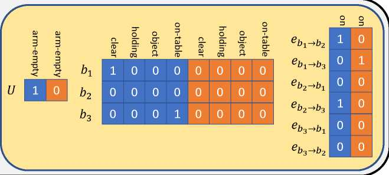
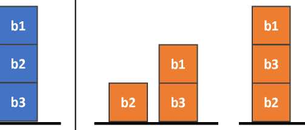
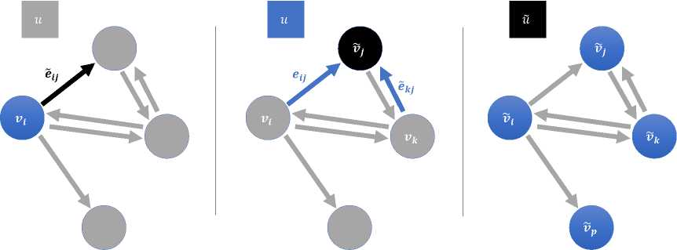
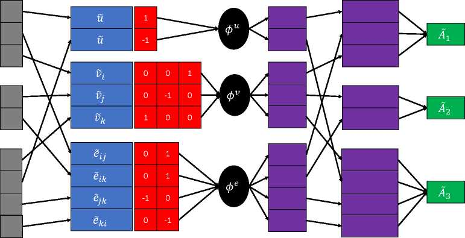
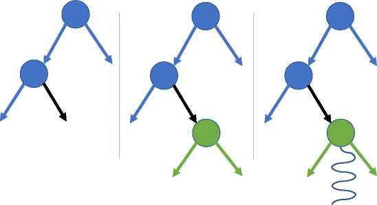
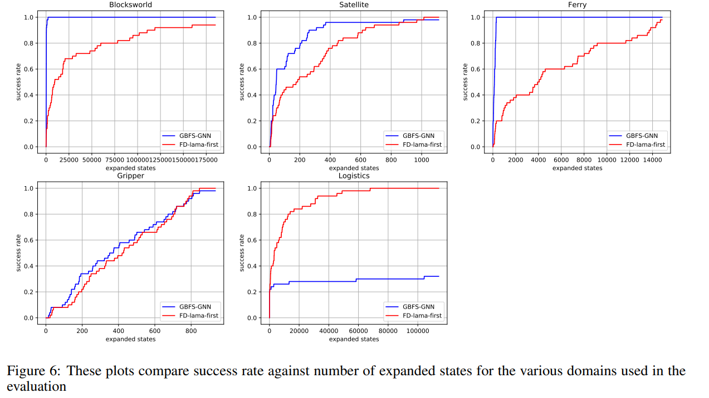
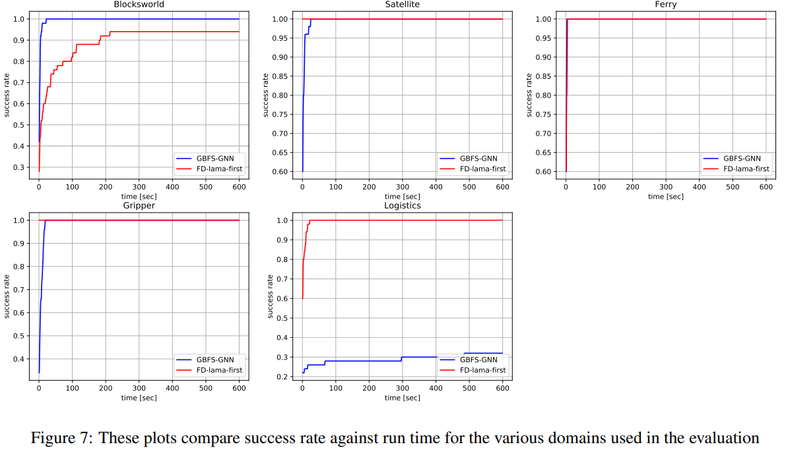

[TOC]

# 1. Generalized Planning With Deep Reinforcement Learning

深度强化学习和图神经网络的使用，以学习此类广义策略，并证明它们可以推广到实例上，这些实例比在其上进行训练的实例大几个数量级

古典计划与查找计划或动作序列有关，当将这些计划或动作序列应用于一组逻辑谓词所指定的某些初始条件时，会将环境带入满足一组目标谓词的状态。这通常是通过某种启发式搜索过程执行的，生成的计划仅适用于已解决的特定实例。但是，可能会有更好的结果是找到某种更高级别的计划，该计划可以解决许多属于同一域的实例，从而共享一个基础结构。可以发现这种更高级别计划的方法的研究称为通用计划。通用计划不一定适用于所有经典计划领域，但是在仅希望找到目标令人满意的解决方案的情况下，针对可能的领域找到此类解决方案可以避免执行计算密集型搜索的需求。为了给出这样一个广义计划的例子，让我们考虑一个简化的Blocksworld域。在这个领域中，有一些独特的块可以相互堆叠或散布在地板上，并且目标是堆叠和堆叠块，以便我们从初始配置中得出目标配置。寻找一个可以以最佳步骤做到这一点的计划通常很难做到 在这个领域中，有一些独特的块可以相互堆叠或散布在地板上，并且目标是堆叠和堆叠块，以便我们从初始配置中得出目标配置。寻找一个可以在最佳步骤中完成的计划通常很难做到 在这个领域中，有一些独特的块可以相互堆叠或散布在地板上，并且目标是堆叠和堆叠块，以便我们从初始配置中得出目标配置。寻找一个可以以最佳步骤做到这一点的计划通常很难做到[[10\]](#bookmark5)，但是可以通过以下方式在多项式时间内找到一个可以满足目标且不考虑成本的计划：

1.拆开所有积木，使其散落在地板上

2.根据目标配置，从较低的块开始堆叠块

这种策略不是最佳方法，因为我们可能会根据目标规范对已经放置在适当位置的块进行堆叠，但是对于简化后的Blocksworld域中的每个实例，它都会产生一个满足目标的计划。这样的笼统策略也可以被认为是一种策略，它增加了通过强化学习它的可能性。

学习。机器学习理论通常假设我们的训练数据分布可以代表测试数据分布，从而证明我们的期望是我们的模型可以很好地推广到测试数据。在一般的计划中，情况并非如此，因为我们的测试实例可能比训练实例大得多，因此远远超出了训练范围。在这项工作中，我们表明，以神经网络体系结构的形式具有**正确的**归纳偏差可以导致模型有效地学习类似于一般原理的策略，并且可以解决比训练过程中遇到的问题大几个数量级的问题。

## 1.1. **相关工作**

多年来，学习计划一直是研究的活跃话题，采用不同的方法尝试学习完整求解器的不同方面。一些工作尝试使用其他独立于域的启发式方法生成的特征来学习特定域的状态的启发式值，例如[[28\]](#bookmark39)，该功能通过回归来学习启发式值。[[7\]](#bookmark40)等最新作品通过使用RankSVM [[13\]](#bookmark41)学习对后继国家进行排名。。这些类型的方法没有从问题描述中明确使用状态或目标信息，而是学习使用手工制作的功能，此外，也没有针对可用操作学习明确的计划策略。与此相反，我们的方法学习针对明确状态和目标的计划策略，这些策略和策略直接选择要采取的行动。

其他工作，例如[[23\]](#bookmark42)，[[8\]](#bookmark43)和[[9\]](#bookmark44)，使用问题的实际状态作为输入和深度卷积神经网络，学习了针对操作的明确计划策略，但是依赖于对问题的直观表示。这将它们的使用限制为可以使用视觉表示的域。另一个局限性是[[23\]](#bookmark42)和[[8\]](#bookmark43)另外还依赖于计划算法生成的成功计划，并使用模仿学习来学习策略，而

[[9\]](#bookmark44)为此目的使用强化学习。我们的工作不依赖于视觉表示或通过规划算法生成的成功计划，而是通过**深度强化学习通过反复试验直接从PDDL表示中学习问题**。

一些工作已经开始研究状态图表示的使用以及不同种类的图神经网络在学习策略或启发式方法方面的用途。在[[24\]](#bookmark45)作者提出了一种独特的神经网络，称为动作模式网络（ASNet），该网络由交替的动作层和命题层组成，以学习计划策略。它们将状态表示为图形，在图形中对象和动作相互连接，并来回传播信息以最终输出动作的概率。他们通过模仿其他计划者生成的计划来训练自己的ASNet，并使用与领域无关的启发式值来增加输入，以提高性能。在他们的实验中，他们主要关注随机计划问题，并证明他们训练有素的策略可以推广到比训练有素的更大的实例。ASNet的局限性是其固定的接受领域，这限制了他们对长链进行推理的能力，而我们的工作无法分享这一点。

在最近的一篇论文中，[[20\]](#bookmark46)提出了[[4\]](#bookmark17)的扩展到超图，并用它来学习表示规划问题的删除松弛状态的超图的启发式方法。他们使用计划算法生成的最佳启发式值的有监督学习，然后将所得的神经网络用作搜索算法中的启发式函数。与此相反，我们的方法侧重于学习策略，因为在神经网络上需要进行一次正向传递才能在每种状态下做出决定，因此在评估过程中可以节省更多时间。使用启发式估计需要估计状态的所有后继状态，以便选择最佳操作，这可能会增加运行时间。另一个区别是我们的工作直接在状态上进行，而不是删除松弛，这可能会限制启发式方法的功能，因为省略了一些信息。[[15\]](#bookmark47)，[[29\]](#bookmark48)和[[5\]](#bookmark49)。

### 1.1.1. **2背景**

#### 1.1.1.1. **2.1经典规划**

古典计划使用从STRIPS建模语言[[6\]](#bookmark9)派生而来的正式描述语言，称为计划领域定义语言（PDDL）[[14\]](#bookmark8)，以定义问题领域及其相应的状态和目标。我们关注的是令人满意的计划任务，它可以由集合*（F，O，I，G）定义*，其中*F*是一组命题（或谓词），它们描述任务实例中存在的对象的属性及其关系，*O*是一组运算符（或操作类型），ICF是初始状态，而GCF是目标状态的集合。每个动作类型GO都由三元组*（Pre（o），Add（o），Del（o））定义，*其中前提为*Pre（o）*是一组谓词，这些谓词必须具有正确的值才能适用于该操作，*Add（o）*是一组谓词，在应用后该行为将变为真，而Del（o）是一组谓词，该行为将变为false根据申请。我们试图找到一个计划或一系列行动，这些行动或行动序列一旦应用，就会在一定时限或预定数量的步骤内导致状态为*G* C的状态。查找计划任务的计划通常是通过启发式搜索方法来完成的，但是，在这项工作中，我们专注于学习反应式计划策略，这些策略可以在特定领域的实例上进行训练，然后推广到同一领域中新的看不见的实例。

#### 1.1.1.2. **强化学习**

> 不同于常见的$<S,A,R,P,\gamma \text{折扣率}>$

强化学习（RL）是机器学习的一个分支，处理顺序决策问题的学习策略。RL算法最常假设可以将问题建模为马尔可夫决策过程（MDP），在有限水平情况下由元组（S，A，*R，P* ，*T* ，p）定义，其中*S*是状态，A是动作集合，*R*是将状态或状态动作映射到标量奖励的奖励函数，P是过渡概率函数，使得$p（s' | s,a）= P（s'，s， a）$**（确定性策略=1）**，T是任务范围，*p*是初始状态的分布。

在较大的状态和动作空间的情况下，我们不能希望将我们的策略表示为表格(**Q表格**)，因此被迫使用函数逼近器（**Deep Q network 的target network**）来表示带有某些参数*6*的策略*。*我们专注于随机策略，该策略映射状态和动作概率，例如p（a | s）-（a | s），并使用基于策略梯度的方法进行优化

我们的政策[[27\]](#bookmark11)。策略梯度方法使用蒙特卡洛采样估计目标函数相对于策略参数的梯度。在实施策略梯度方法时，我们可以通过使用样本轨迹计算出的“伪损失”的梯度来估算策略梯度

近端策略优化（PPO）[[19\]](#bookmark13)是一种基于策略梯度的算法，旨在通过对收集到的数据进行多次梯度更新，然后丢弃它来收集更多数据，从而更好地利用在学习过程中收集到的数据。为了避免可能因较大的策略更新而引起的稳定性问题，PPO使用特殊的裁剪目标来阻止当前策略与数据收集策略之间的差异，从而定义优化问题

### 1.1.2. **学习generalized policy

#### 1.1.2.1. **3.1状态表示**

我们选择将我们状态中的状态表示为图形，并使用特征编码给定状态中对象之间的属性和关系。我们的框架在PDDL建模语言指定的问题域上运行，在该问题域中，问题实例由对象列表和谓词列表定义，这些谓词描述这些对象的属性以及当前状态下它们之间的关系。我们将自己限制在谓词的Arity不超过2的域中，这并不是一个重大限制，因为在许多情况下，较高Arity谓词可以分解为几个较低Arity谓词。我们的图由全局特征，节点特征和边缘特征组成，如[[4\]所示](#bookmark17)。我们表示全局特征*U* ，节点V和边*E.*全局特征表示问题实例或实体的属性对于该域而言是唯一的，例如Blocksworld域中的指针，并由该域的0度谓词确定。节点特征表示域中对象的属性（例如它们的类型），并由1-arity谓词确定。最后，边缘特征代表对象之间的关系，并由2 arar谓词确定。

当生成PDDL实例状态的图形表示时，将为状态中的每个对象生成一个带有节点的完整图形。对于状态中的每个谓词，将对应的特征分配为二进制值1，并假定所有其他特征均为false，其值为0。为了将目标配置包括在神经网络的输入中，目标谓词几乎被视为另一个状态图，并且将这两个图连接在一起以形成状态目标的单个表示形式。状态图和目标图之间的区别在于，在目标图中，值为0的特征表示没有贡献目标；在状态图中，值为0的特征意味着谓词被分配了错误值。

在整个工作中使用的经典规划领域是确定性的和马尔可夫式的，这意味着当前状态拥有所有必需的信息以最佳地解决问题。尽管具有此属性，我们发现

除了当前状态外，过去的状态还有助于学习过程并提高对较大实例的泛化能力。尽管这不是严格必要的，但我们的实验表明，此步骤可以在一定程度上帮助政策缓解“来回”行为，这在政策更容易犯错误然后尝试尝试的较大情况下尤其有用。纠正它们。添加此历史记录很简单；我们只需将K个先前状态和当前状态的图连接起来，然后如前所述将目标图连接起来。我们测试了几个这样的历史视野，发现仅添加最后一个状态会带来总体上最佳的性能和通用性。在图[1中](#bookmark18)可以看到来自Blocksworld域的状态目标图的示例 和[2，](#bookmark19)显示具有3个块的实例。

#### 1.1.2.2. **3.2图形嵌入**

为了使用状态目标的图形表示来学习好的策略，我们首先使用图形神经网络（GNN）将图形的节点，边缘和全局特征嵌入到各自的潜在空间中。GNN在图的不同组件之间执行消息传递，从而允许有用的信息流动。我们使用两种不同类型的GNN块，每种块都在图内实施不同样式的信息流，因此比其他类型更适合某些问题领域。在这两种类型中，更新顺序相似，并采用以下常见形式：

1.使用先前的边缘和这些边缘的“原始”节点更新边缘。

2.使用先前的节点，传入的更新边和全局特征更新节点。

3.使用先前的全局变量和更新的节点的聚合来更新全局变量。

我们使用的第一种块类型类似于[[4\]中](#bookmark17)描述的块类型，因此我们将其命名为**Graph Network块**（GN块）。从数学上讲，此块执行以下操作

在以上表示中，^是非线性，例如整流线性单元，^是节点方式的最大池操作，并且W，*b*是各自的权重矩阵和偏差。在GN块中，节点不加选择地从其相邻节点接收消息，该消息很好地在整个图上传播一般信息，但在需要时更难传递特定的信息位。

第二种类型的块旨在解决GN块的缺点，并为此目的提供了一种关注机制。我们将第二个块命名为**Graph Network Attention块**（GNAT块），与[[26\]](#bookmark23)的Graph Attention Network不同，它使用的注意力机制类似于[[25\]](#bookmark24)的Transformer模型。该块执行以下操作：

在上面的表示中，^是按节点求和的操作，©是Hadamard乘积，*W*和*b*分别是权重矩阵和偏差。如上所述，通过赋予节点以专注于特定消息的能力，这种类型的块允许某些信息位以更有意的方式在图中传播。在构建我们的GNN模型时，我们可以堆叠这些类型的几个块（及其组合）以获得更深的图嵌入能力。在我们的大多数实验中，我们使用了两个块，两个连续的GN块，或者一个GNAT块，后跟一个GN块。正如我们将在实验部分中展示的那样，每种配置都擅长解决不同的问题。

#### 1.1.2.3. **3.3政策代表**

与常规的强化学习基准不同，在常规的强化学习基准中，一组动作是固定的，并且可以通过标准的神经网络体系结构方便地进行处理，而在经典的计划问题中，一组动作取决于状态，并且状态之间的大小不同。在PDDL中，每个域描述都定义了一组动作类型，可以通过将这些动作类型置于状态基础上进行实例化。每种动作类型都接收一组参数，并且为了适用，该动作的参数必须符合一组前提条件。例如，Blocksworld域具有一种称为“拾取”的动作类型，该动作类型将单个块对象作为参数。该块必须是“ clear”，“ on-table”且“ arm-empty”属性必须为true，此操作才适用。可以拾取符合这些前提条件的所有块，并代表唯一的动作。除了先决条件外，每种动作类型还具有在应用动作时引起状态的效果。其中一些影响可能是正面的（状态的某些谓词将采用真值），而某些负面影响（状态的谓词将采用假值）。

在计划的每个步骤中，后继状态生成器都会给出当前状态和适用动作的列表。为了以有意义的方式表示动作，使他们能够对其学习策略，我们选择按照动作的效果来描述动作，因为这些是做出决策所必需的要素。由于后继状态生成器在每个步骤都向代理提供了所有法律诉讼，因此我们忽略了前提条件（所有法律诉讼都满足了前提条件）。每个动作都由几种效果组成，每种效果都涉及状态的不同方面，可以是正面的也可以是负面的。根据效果的类型（全局效果，节点效果或边缘效果）将效果聚在一起，和表示为各个组成部分的嵌入和一个热向量的串联，该向量描述哪个谓词已更改以及其为正还是负。这个一元向量在相应输入分量的维度上*（d v*为例如节点效应）并包含1表示正作用或-1在适当的位置谓词的负面影响。每个效果都会根据其类型由多层感知器（MLP）进行转换，然后将已转换的效果分散回其原始动作。将每个动作的效果汇总在一起，以形成该动作的单个向量表示，最终将其馈送到策略神经网络。图[4](#bookmark26)说明了动作表示的过程。

最终策略是MLP，它为每个动作输出单个标量，然后通过softmax操作对这些标量进行归一化，以获取动作的离散分布。另外，另一个MLP提取图形的最终全局特征嵌入并输出状态的预测值，以用于RL算法中的优势估计。

#### 1.1.2.4. **3.4程序训练**

由于这项工作的重点是找到可行的计划，因此我们选择将问题建模为带有二元奖励的稀疏奖励问题。如果代理满足预定范围内的所有目标，则得到1的奖励，如果没有满足，则没有任何奖励。为了确定适当的时限，我们使用了常用的**hff**启发式方法[[12\]](#bookmark28)，它解决了线性时间问题的松弛形式（松弛问题没有负面影响）。我们采用松弛计划的长度，并将其乘以5的常数以获得地平线的长度。

为了训练我们的策略，我们选择使用近端策略优化（PPO）[[19\]，](#bookmark13)因为它简单易用且性能良好。为了解决稀疏奖励的问题，我们最初使用Hindsight Experience Replay DQN [[2\]](#bookmark29) 进行了实验，因为它具有解决稀疏目标达成问题的能力，但是发现它引入了很多偏见并导致性能不理想。为了让我们的政策能够从稀疏的二进制奖励中学习，我们采取了一种

更简单的方法 我们根据实例大小的分布生成了每个训练情节，实例大小的分布小到足以被随机初始化的策略解决。这样做可以使策略得以发展，最终解决分发中的所有实例大小，而无需手动调整课程表。尽管设置此分布需要手动完成，但我们发现通过使用随机未经训练的神经网络进行简单的试验和错误，可以非常轻松快捷地完成此任务。

我们对标准PPO算法进行了一些小调整，从而提高了本例的性能。许多RL算法的实现会在更新模型参数之前针对固定数量的步骤推出策略，通常会在过程完成之前终止情节，并使用诸如Generalized Advantage Estimation [[18\]](#bookmark30)和自举值估计之类的方法来估计收益[[16\] ]](#bookmark31)。我们发现这些元素会给我们的学习过程带来不必要的偏见，而是使用经验性回报而不是引导价值估算来计算优势，从而逐步推广每个情节直至终止。我们还发现，使用许多推广和大批量生产有助于稳定学习过程并获得更好的最终性能，因此我们进行了100集的推广，并使用结果数据在每次学习迭代时更新模型参数算法。

#### 1.1.2.5. **3.5推理过程中的计划**

为了提高通用策略在测试期间使用额外时间的能力，我们在搜索算法中使用了这些策略，就像[[21\]](#bookmark33)，[[3\]](#bookmark34)等其他许多作品中所做的那样。这种类型的合成在诸如Go和Chess [[22\]的](#bookmark35)零和游戏中获得了巨大的成功，其中深度神经网络策略与蒙特卡洛树搜索算法结合使用，这促使其他作者甚至对非游戏问题[[1\]](#bookmark36)。我们采用不同的方法，专门针对具有强反应性策略的确定性计划问题设计搜索算法。我们的算法以经典的贪婪最佳优先搜索（GBFS）算法为基础，但是以几种关键方式对其进行了扩充。在标准GBFS中，从根节点构建一个搜索树，并且在每次迭代时，从打开列表中提取启发式估计最佳的节点，进行扩展并将其子节点添加到打开列表中，并重复此过程直到找到目标节点或直到超时为止。我们的算法称为GBFS-GNN，它执行类似的过程，但是使用策略和值函数为每个节点计算启发式值，并为每个扩展节点执行完整部署。扩展节点的后代将添加到打开列表中，但是在转出过程中遇到的其余节点则不是，以避免大问题中内存消耗的快速增长。搜索树中的每个节点代表一个状态-动作对，我们对每个节点使用以下启发式估计

### 1.1.3. **5个实验**

#### 1.1.3.1. **5.1域**

我们评估了五个常见的经典规划领域的方法，这些领域是从IPC规划竞赛集合中选择的，其领域谓词不大于2：

•Blocksworld（4 op）：机械手必须从初始配置中移动积木，以便根据目标配置进行排列。

•卫星：一组卫星必须拍摄位置的图像，每个图像都具有指定类型的传感器。

•物流：必须将包裹运送到目标位置，使用飞机和卡车在城市和地点之间移动包裹。

•夹爪：双臂机器人必须将球从A室传送到B室。

•渡轮：渡轮必须将汽车从最初的位置运输到指定的目标位置。

这五个领域的共同点在于，可以为它们制定简单的通用计划，从而能够解决任意大的实例。我们希望证明我们的方法能够产生解决比实例大得多的实例的策略，从而自动发现这样的广义计划。有些领域比其他领域容易，并且在广义计划很容易描述的情况下，我们经常目睹该政策非常成功地推广。例如，Gripper域具有非常简单的策略（每次到B室都抓住2个球），实际上我们的神经网络学习了最佳策略，即使对于数百个球的实例，通常仍然表现最佳。为了证明我们的政策确实能很好地推广，

•对于Blocksworld域，我们在4个块的实例上训练了我们的策略，并在5-100个块的实例上进行了评估。

•对于“卫星”领域，我们对使用1-3颗卫星，每颗卫星1-3台仪器，1-3种仪器，2-3个目标的实例进行了政策培训，并针对使用1-14颗卫星，2-11台仪器的实例进行了评估每个卫星，1-6种仪器和2-42个目标。

•对于物流领域，我们针对使用2-3架飞机，2-3个城市，每个城市2-3个地点，1-2个包裹的实例训练了我们的策略，并评估了使用4-12架飞机，4-15个城市，1个实例的实例每个城市-6个地点和8-40个包裹。

•对于Gripper域，我们针对3个球的实例训练了我们的策略，并针对5-200个球的实例进行了评估。

•对于Ferry域，我们针对具有3-4个位置，2-3个汽车的实例训练了我们的策略，并针对具有4-40个位置和2-120个汽车的实例进行了评估。

#### 1.1.3.2. **5.2实验设定**

为了训练我们的策略，我们依靠实例生成器来产生随机的训练实例，因为我们的方法需要大量的训练数据。所有策略都经过1000次迭代训练，每个迭代有100个训练情节和多达20个渐变更新步骤。实验是在一台装有i7-8700K处理器和一个NVIDIA GTX 1070 GPU的计算机上进行的。我们对所有五个域使用了相同的训练超参数，但神经网络模型略有不同。我们使用了256个隐藏表示形式和ReLU激活，一个学习率0.0001，一个折现因子0.99，一个熵奖励0.01，一个剪切比0.2和一个KL发散角参数0.01。对于Blocksworld和Gripper域，我们使用了两层GNN，两层都是GN块类型，对于Satellite，渡轮和物流领域，我们使用了两层GNN，其中包含一个GNAT块和一个GN块。我们的代码是用Python实现的，而神经网络和学习算法是使用PyTorch实现的[[17\]](#bookmark53)。

#### 1.1.3.3. **5.3基准**

我们的评估重点是解决广义规划域的大型实例，并将我们的方法与经典规划器进行比较。其他基于学习的方法或者在撰写本文时没有可用的代码（例如 [[20\]](#bookmark46)），或者固有地在扩展到大问题时受到限制（例如[[24\]](#bookmark45)），因此我们选择了更通用的基准经典计划器的形式，如果有足够的时间和内存，它可以扩展到大问题。我们与**Fast-Downward**快速下降比较[[11\]](#bookmark55)，这是最新的框架。我们的方法使用Pyper plan作为模型和后继状态生成器，它是基于Python的框架。我们使用LAMA优先配置作为快速向下的设置，因为它是性能最高的竞争性满意计划算法。

#### 1.1.3.4. **5.4评估指标**

由于我们的工作集中在令人满意的计划上，因此我们将成功率用作主要指标。我们对每个域在一组50个伸出的评估实例上运行GBFS-GNN和快速向下，并针对每个实例在600秒的固定时间限制内运行每种方法，然后针对时间绘制每种方法的成功率限制和限制扩展状态的数量，以查看每种方法如何在给定的计算下进行缩放。根据广泛的分布生成评估实例，以便对大小实例进行采样。

#### 1.1.3.5. **5.5结果**

现在，我们介绍我们的结果。图[6](#bookmark58)显示了我们的方法与实验中使用的五个域的快速向下比较之间的比较。这些图显示了成功率与扩展状态数的函数关系，并表明与5个域中的4个领域的经典规划器相比，我们的方法的缩放比例确实有利。实际上，在我们的政策普遍推广的4个领域中，GBFS-GNN几乎不需要搜索。在这些领域中，除了最困难的情况外，只要贪婪地遵循策略即可找到解决方案。我们的搜索算法建立在这种泛化能力的基础上，并在搜索时使用了少量的完整策略部署。

在图[7中，](#bookmark59)我们比较了我们的方法和快速向下方法，并针对给定的运行时间绘制了成功率。我们可以看到，即使快速向下版本具有高度优化的C ++实现，并使用复杂的建模工具来有效地解决计划问题，我们的方法还是在一个领域（Blocksworld）中克服了它，而在其他三个领域中将其紧密匹配。尽管GBFS-GNN使用的后继状态和法律行动生成器的速度比快速向下的速度慢几个数量级，但我们的方法5的泛化能力使其与经典计划程序的最新实现方式相比具有竞争力。

关于我们的方法的泛化性能的一个明显例外是物流领域。我们的策略在训练实例上成功取得了良好的性能，但是未能推广到更大的实例尺寸，因此在该领域的快速降级远远超出了我们的策略。在域中，物流域在每个实例中的不同对象之间包含更紧密的耦合。例如，在“卫星”域中，从策略可以具有多个“半熟”目标并在它们之间进行切换而不会受到干扰的意义上说，校准仪器或对目标成像不会干扰其他卫星。在物流领域，这是不可能的，因为所有包裹都共享卡车和飞机，并且移动特定卡车来捡拾包裹可能会干扰原本打算在另一个位置捡拾的另一个包裹。不同的图神经网络体系结构可能会鼓励该策略在单个目标上保持“固定”，直到满足为止再转向另一个目标，从而有可能解决物流领域和其他类似类型的问题。

### 1.1.4. **结论与未来工作**

在这项工作中，我们研究了图神经网络和深度强化学习算法学习通用规划策略的能力，该规划策略可以解决比训练过程中遇到的实例大得多的实例，从而有效地推广了原理。与某些其他方法不同，我们的方法**不依赖于现有**计划人员提供的最佳解决方案，也**不依赖于启发式方法**来提高性能。我们进一步介绍GBFS-GNN，这是一种搜索算法，可利用高性能反应策略的可用性来快速找到超大型实例的解决方案。

我们的策略是通过强化学习从头开始学习的，并与GBFS-GNN结合使用，可以实现性能，在扩展状态方面超越了最先进的状态规划师的高度优化实现，并且在运行时间方面可以与之媲美。

相关[^LOGIC]和文献[^POMC]。

**参考**

[^LOGIC]: GICystems

[^POMC]: Checking

