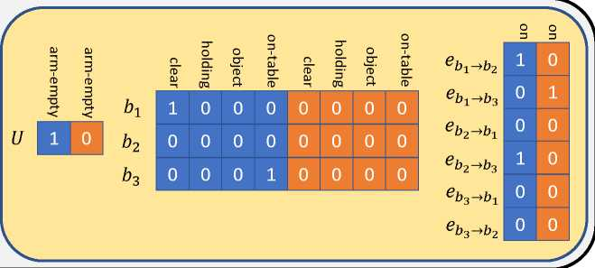
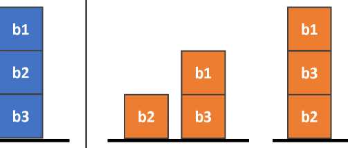
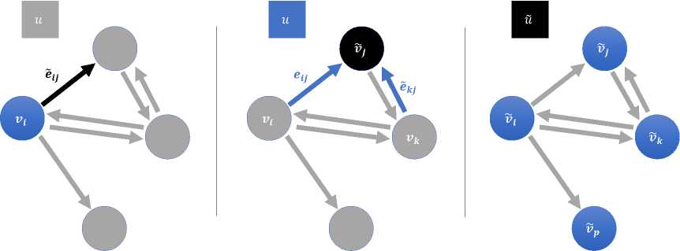
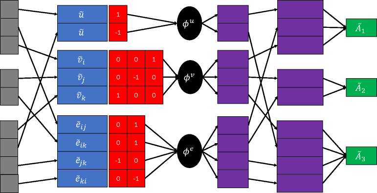
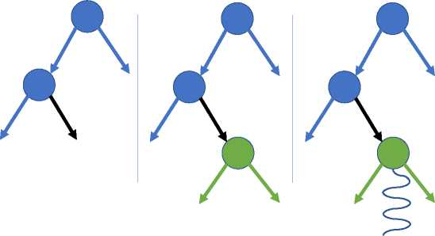
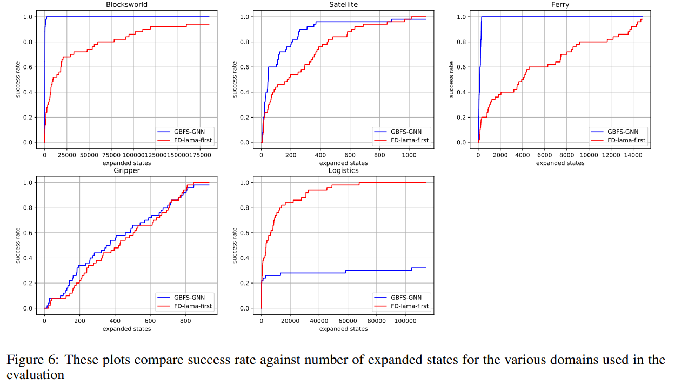
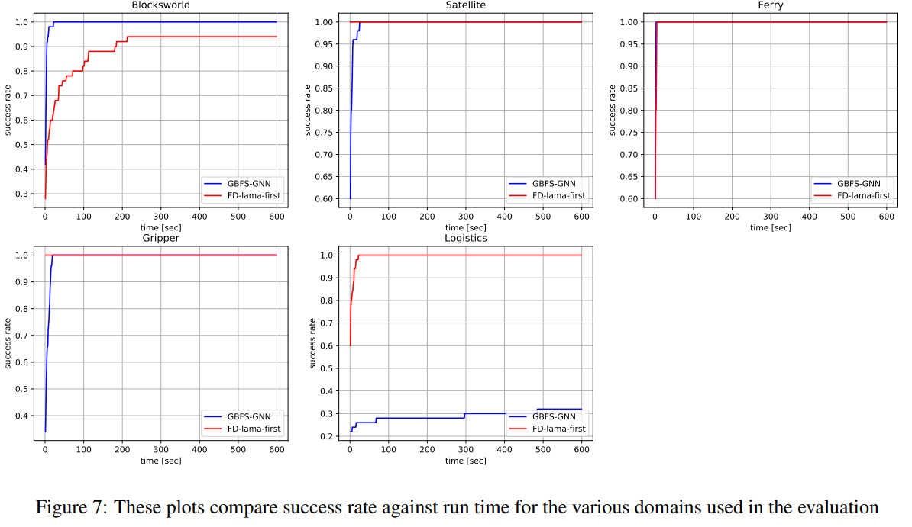

[TOC]

# 基于深度强化学习的广义规划

深度强化学习与图神经网络被用于学习此类广义策略，研究结果表明，这些策略能够泛化至比训练实例大数个数量级的未见实例。

经典规划关注于寻找规划方案或动作序列，当将这些规划方案或动作序列应用于由一组逻辑谓词所描述的初始条件时，能够将环境状态引导至满足一组目标谓词的状态。这一过程通常通过某种启发式搜索机制执行，所生成的规划方案仅适用于已解决的特定实例。然而，更为理想的目标在于发现某种更高层次的规划方案，它能够解决属于同一领域的众多实例——这些实例共享某种基础结构。这类能够发现高层次规划方案的研究方法被称为**广义规划（Generalized Planning）**。广义规划并非适用于所有经典规划领域，但在仅需寻找令人满意的目标解的情形下，针对可能的领域找到此类解可以避免执行计算密集型搜索的需求。为了阐述广义规划的基本概念，我们考察一个简化的Blocksworld领域。在该领域中，存在若干独特的积木，它们可相互堆叠或散落于桌面，目标是从初始配置出发，通过堆叠和拆除积木达到目标配置。寻找能够以最优步骤实现目标的规划方案通常极为困难，但以下方法可在多项式时间内找到一个能够满足目标且不计成本的规划方案：

1. 拆开所有积木，使其散落于桌面；
2. 根据目标配置，从底部积木开始逐层堆叠。

上述策略并非最优方案，因为根据目标规范，已处于适当位置的积木可能被不必要地拆解。然而，对于简化后Blocksworld领域中的每个实例，该策略均能生成满足目标的规划方案。这种广义策略亦可被视为一种策略，这为通过强化学习对其进行学习提供了可能性。

在机器学习理论中，通常假定训练数据的分布能够代表测试数据的分布，从而期望模型能够良好地泛化至测试数据。在广义规划中，情况并非如此，因为测试实例规模可能远大于训练实例，从而极大超出训练分布的范围。在本研究中，我们表明，以神经网络架构形式引入**正确的**归纳偏置能够使模型有效学习类似广义原理的策略，并解决比训练过程中所见问题大数个数量级的问题。

## 相关工作

学习规划多年来一直是研究的热点话题，研究者采用不同方法尝试学习完整求解器的不同方面。若干工作尝试使用由领域无关启发式方法生成的特征来学习特定领域状态的启发式值，例如通过回归学习启发式值的方法。最新研究通过使用RankSVM学习后继状态的排序。此类方法并未明确利用问题描述中的状态或目标信息，而是依赖人工设计的特征；此外，它们也未针对可用操作学习明确的规划策略。与之相对，我们的方法学习针对明确状态和目标的规划策略，这些策略直接选择待执行的动作。

其他研究将问题的实际状态作为输入，借助深度卷积神经网络学习明确的动作规划策略，但这些方法依赖对问题的视觉表示。这将其适用范围限制在可采用视觉表征的领域。另一个局限性在于，这些工作额外依赖由规划算法生成的成功规划，并使用模仿学习来学习策略，而另一些研究则为此目的采用强化学习。我们的研究既不依赖视觉表示，也不依赖经由规划算法生成的成功规划，而是**通过深度强化学习，以试错方式直接从PDDL表示中学习求解问题**。

若干研究已开始探索状态图表示以及不同类型的图神经网络在学习策略或启发式方法方面的应用。作者提出了一种名为动作模式网络（ASNet）的独特神经网络架构，该网络由交替的动作层和命题层构成，用于学习规划策略。他们将状态表示为图，其中对象和动作相互连接，并通过信息的双向传播最终输出动作的概率分布。他们通过模仿其他规划器生成的规划来训练ASNet，并使用领域无关的启发式值增强输入以提高性能。在他们的实验中，主要关注随机规划问题，并证明训练后的策略能够泛化至比训练实例更大的实例。ASNet的局限性在于其固定的感受野，这限制了其处理长距离推理链的能力，而我们的方法则不存在这一限制。

在最近的工作中，研究者将方法扩展到超图，并利用其学习超图的启发式方法，该超图表示规划问题的删除松弛状态。他们使用由规划算法生成的最优启发式值进行监督学习，然后将所得神经网络用作搜索算法中的启发式函数。与此相反，我们的方法侧重于学习策略，因为在神经网络上只需一次前向传播即可在每个状态下做出决策，从而在评估过程中能够大幅节省时间。使用启发式估计则需要评估状态的所有后继状态以选择最优动作，这可能导致运行时间显著增加。另一个区别在于，我们的方法直接在完整状态上进行操作，而非使用删除松弛——删除松弛可能因省略部分信息而限制启发式方法的表现力。

### 背景

#### 经典规划

经典规划使用从STRIPS建模语言派生而来的形式化描述语言——规划领域定义语言（PDDL）来定义问题领域及其相应的状态和目标。我们关注的是可满足的规划任务，此类任务可由元组 (*F*, *O*, *I*, *G*) 定义，其中 *F* 是一组命题（或谓词），描述任务实例中存在的对象属性及其相互关系；*O* 是一组算子（或动作类型）；*I* ⊆ *F* 是初始状态；*G* ⊆ *F* 是目标状态的集合。每个动作类型 *o* ∈ *O* 由三元组 (*Pre(o)*, *Add(o)*, *Del(o)*) 定义，其中 *Pre(o)* 是一组前提条件谓词，这些谓词必须具有真值才能应用该动作；*Add(o)* 是在应用动作后成为真值的一组谓词；*Del(o)* 则是应用动作后变为假值的一组谓词。我们试图寻找一个规划方案或动作序列，使其一经应用即可在规定的时间步数内导致状态满足 *G* ⊆ *F*。查找规划任务的规划方案通常通过启发式搜索方法完成；然而，在本研究中，我们专注于学习反应式规划策略，这些策略可在特定领域的实例上进行训练，随后推广至同一领域中未见的新实例。

#### 强化学习

> 不同于常见的 $<S, A, R, P, \gamma \text{折扣率}>$

强化学习（RL）是机器学习的一个重要分支，致力于研究序列决策问题中的策略学习。RL算法最常见的假设是将问题建模为马尔可夫决策过程（MDP），在有限时域情况下由元组 (*S*, *A*, *R*, *P*, *T*, *p*) 定义，其中 *S* 是状态集合，*A* 是动作集合，*R* 是将状态或状态-动作对映射到标量奖励的奖励函数，*P* 是转移概率函数（满足 $p(s' | s, a) = P(s', s, a)$，**确定性策略对应 P = 1**），*T* 是任务的时间范围，*p* 是初始状态的分布。

在状态和动作空间较大的情况下，我们无法期望将策略表示为表格形式（**Q表格**），因此必须采用函数逼近器（**Deep Q Network 的 target network**）来表示带有参数 *θ* 的策略 *π*。我们专注于随机策略，该策略将状态映射到动作的概率分布，例如 $p(a | s) = π(a | s)$，并使用基于策略梯度的方法进行优化。策略梯度方法通过蒙特卡洛采样估计目标函数相对于策略参数的梯度。在实施策略梯度方法时，我们可以利用由样本轨迹计算所得的"伪损失"的梯度来近似策略梯度。

近端策略优化（PPO）是一种基于策略梯度的算法，旨在通过在学习过程中对收集到的数据进行多次梯度更新（随后丢弃数据并收集更多数据）来更充分地利用所收集的数据。为避免因较大的策略更新而引发的稳定性问题，PPO采用特殊的裁剪目标来限制当前策略与数据收集策略之间的差异，从而定义优化问题。

## 学习广义策略

### 状态表示

我们选择将状态表示为图结构，并使用特征编码给定状态中对象之间的属性与关系。我们的框架基于PDDL建模语言指定的问题领域运行，在该框架中，问题实例由对象列表和谓词列表定义，这些谓词描述各对象的属性以及当前状态下它们之间的相互关系。我们将自身限制在谓词元数不超过2的领域内，这并非一个实质性限制，因为在许多情况下，高元数谓词可被分解为若干低元数谓词。我们的图由全局特征、节点特征和边缘特征构成。全局特征 *U* 表示问题实例或实体的属性，这些属性对该领域而言具有唯一性（例如Blocksworld领域中的指针），并由该领域的0元谓词确定。节点特征表示领域中对象的属性（例如它们的类型），并由1元谓词确定。最后，边缘特征代表对象之间的关系，并由2元谓词确定。

在生成PDDL实例状态的图表示时，将为状态中的每个对象生成一个包含节点的完整图。对于状态中的每个谓词，将对应的特征分配为二进制值1，并假定所有其他特征均为假，其值为0。为了将目标配置纳入神经网络的输入，目标谓词几乎被视为另一个状态图，并将这两个图拼接在一起，形成状态-目标的统一表示。状态图与目标图之间的区别在于：在目标图中，值为0的特征表示未能贡献目标；在状态图中，值为0的特征则意味着该谓词被赋予假值。

本研究使用的经典规划领域是确定性的且具有马尔可夫性质，这意味着当前状态包含解决问题所需的全部信息。尽管具备这一特性，我们发现除当前状态外，历史状态也有助于学习过程，并提升对较大实例的泛化能力。尽管这不是严格必要的，但我们的实验表明，这一步骤能够在某种程度上帮助策略缓解"来回振荡"的行为——这在策略更容易犯错而后尝试纠正的较大实例中尤为明显。添加历史信息十分简便：我们只需将K个先前状态与当前状态的图进行拼接，再如前所述与目标图进行拼接。我们测试了若干种历史视野长度，发现仅添加最后一个状态能够在整体性能和泛化能力之间取得最佳平衡。下图展示了来自Blocksworld领域的状态-目标图示例，显示了一个具有3个块的实例。

### 图嵌入

为了利用状态-目标的图表示学习有效的策略，我们首先使用图神经网络（GNN）将图的节点、边缘和全局特征嵌入到各自的潜在空间中。GNN在图的不同组件之间执行消息传递，从而促进有用信息的流动。我们采用两种不同类型的GNN模块，每种模块在图内实施不同风格的信息流机制，因此相较于另一种类型，更适用于某些特定问题领域。在这两种类型中，更新顺序相似，并采用以下通用形式：

1. 使用先前的边缘特征以及这些边缘的"原始"节点特征来更新边缘；
2. 使用先前的节点特征、传入的更新边缘特征以及全局特征来更新节点；
3. 使用先前的全局特征以及更新后节点的聚合信息来更新全局特征。

我们使用的第一种模块类型类似于图网络模块（Graph Network Block, GN Block）。数学上，该模块执行以下操作：

在上述表示中，σ 表示非线性激活函数（例如整流线性单元 ReLU），⊕ 表示节点级最大池化操作，而 *W* 和 *b* 分别为权重矩阵和偏置项。在GN模块中，节点不加区分地接收来自其相邻节点的消息，这有利于在整个图上传播一般性信息，但在需要传递特定信息位时则较为困难。

第二种模块类型旨在弥补GN模块的上述缺陷，并为此目的引入了一种注意力机制。我们将第二种模块命名为**图网络注意力模块（Graph Network Attention Block, GNAT Block）**。与图注意力网络不同，该模块采用的注意力机制类似于Transformer模型。该模块执行的操作赋予节点以聚焦于特定消息的能力，从而允许某些信息位以更具目的性的方式在图内传播。在构建GNN模型时，我们可以堆叠若干此类模块（或其组合），以获得更深的图嵌入能力。在大多数实验中，我们使用了两个模块——两个连续的GN模块，或者一个GNAT模块后接一个GN模块。正如实验部分所示，每种配置在解决不同类型的问题时各有所长。

### 策略表示

与常规的强化学习基准（其中动作集合是固定的，可通过标准神经网络架构便捷地处理）不同，在经典规划问题中，动作集合依赖于状态，且在不同状态之间规模各异。在PDDL中，每个领域描述定义了一组动作类型，这些动作类型可通过在状态基础上进行实例化获得。每种动作类型接收一组参数，并且为满足适用性条件，动作的参数必须符合一组前提条件。例如，Blocksworld领域包含一种名为"拾取"（pickup）的动作类型，该动作类型以单个积木对象作为参数。该积木必须同时满足"clear"、"on-table"且"arm-empty"属性为真，此动作方可适用。所有符合这些前提条件的积木均可被拾取，且每个积木代表一个唯一的动作。除前提条件外，每种动作类型还包含在应用动作时引起状态变化的效果。其中部分效果可能是正面的（状态中的某些谓词将采用真值），部分效果可能是负面的（状态中的某些谓词将采用假值）。

在规划的每个步骤中，后继状态生成器提供当前状态和适用动作的列表。为了以有意义的方式表示动作，使其能够被策略学习所利用，我们选择依据动作的效果来描述动作——因为效果是决策过程中不可或缺的要素。由于后继状态生成器在每个步骤都向智能体提供所有合法的动作，我们省略了前提条件（所有合法动作均已满足前提条件）。每个动作由若干效果组成，每种效果涉及状态的不同方面，可以是正面效果或负面效果。根据效果的类型（全局效果、节点效果或边缘效果），将效果聚合在一起，并将其表示为各个组成部分的嵌入向量与一个描述谓词变化及其正负方向的一维向量的拼接。此一维向量在相应输入分量的维度上（例如节点效应的维度 *dv*）包含1（表示正面效果）或-1（表示负面效果），置于适当谓词对应的位置。每种效果根据其类型由多层感知器（MLP）进行转换，然后将转换后的效果分散回其原始动作。将每个动作的效果聚合在一起，形成该动作的单一向量表示，最终馈入策略神经网络。下图展示了动作表示的过程。

最终的策略是一个多层感知器（MLP），它为每个动作输出一个标量值，然后通过softmax操作对这些标量进行归一化，以获得动作的离散概率分布。此外，另一个MLP提取图的最终全局特征嵌入，并输出状态的预测值，用于RL算法中的优势估计。

### 程序训练

由于本研究聚焦于寻找可行的规划方案，我们选择将问题建模为具有二元奖励的稀疏奖励问题。若智能体在预定时间范围内满足所有目标，则获得奖励1；否则不获得任何奖励。为确定适当的时限，我们采用常用的 **hff** 启发式方法，该方法在线性时间内求解问题的松弛形式（松弛问题不包含负面效果）。我们采用松弛规划的长度，并将其乘以常数5以获得规划时域的长度。

为训练策略，我们选择使用近端策略优化（PPO），因其简洁性、易用性及良好的性能表现。为解决稀疏奖励问题，我们最初尝试使用Hindsight Experience Replay DQN，因其在解决稀疏目标达成问题方面具有潜力，但发现该方法引入了大量偏置，导致性能欠佳。为使策略能够从稀疏的二元奖励中学习，我们采用了一种更为简洁的方法：我们根据实例大小的分布生成每个训练情节，实例大小的分布范围小到足以被随机初始化的策略解决。通过这一设计，策略得以逐步发展并最终解决分布中的所有实例规模，而无需手动调整课程安排。尽管设置此分布需要一定的手动操作，但我们发现通过使用随机未训练的神经网络进行简单的试错即可十分轻松快捷地完成此任务。

我们对标准PPO算法进行了若干微调，从而提升了本场景下的性能。许多RL算法的实现会在更新模型参数之前以固定步数推出策略，通常在此过程完成之前终止情节，并使用诸如广义优势估计和自举值估计等方法估计收益。我们发现这些元素可能给学习过程引入不必要的偏置，因此我们采用经验回报而非自举值估计来计算优势，从而使每个情节一直推广至终止。我们还发现，使用大量推广和大批量生产有助于稳定学习过程并获得更优的最终性能。因此，我们每轮进行100个情节的推广，并使用结果数据在每次学习迭代时更新模型参数。

### 推理过程中的规划

为了提升广义策略在测试期间利用额外时间的能力，我们在搜索算法中采用了这些策略，这与此领域的诸多其他研究一脉相承。此类合成方法在诸如围棋和国际象棋等零和游戏中取得了巨大成功，其中深度神经网络策略与蒙特卡洛树搜索算法相结合，这促使其他作者将其应用于非游戏问题。我们采用了一种不同的方法，专门针对具有强反应式策略的确定性规划问题设计了搜索算法。我们的算法以经典的贪婪最佳优先搜索（GBFS）为基础，但在若干关键方面进行了扩展。在标准GBFS中，从根节点构建搜索树；在每次迭代中，从开放列表中提取启发式估计最优的节点，进行扩展并将其子节点添加到开放列表中，重复此过程直至找到目标节点或超时。我们的算法——称为GBFS-GNN——执行类似的过程，但使用策略网络和值函数为每个节点计算启发式值，并为每个扩展节点执行完整的部署（rollout）。扩展节点的子节点被添加到开放列表中，但部署过程中遇到的其余节点则不被添加，以避免在大规模问题中内存消耗的快速增长。搜索树中的每个节点代表一个状态-动作对，我们对每个节点使用以下启发式估计：

## 实验

### 实验领域

我们评估了五个常见的经典规划领域，这些领域选自IPC规划竞赛集合，且其领域谓词的元数不超过2：

- **Blocksworld（4个操作）：** 机械臂必须根据目标配置，将积木从初始配置移动至目标配置。
- **卫星（Satellite）：** 一组卫星必须拍摄所需位置的图像，每颗卫星配备指定类型的传感器。
- **物流（Logistics）：** 必须将包裹运送至目标位置，使用飞机和卡车在城市与地点之间运输包裹。
- **夹爪（Gripper）：** 双臂机器人必须将球从A室运送至B室。
- **渡轮（Ferry）：** 渡轮必须将汽车从初始位置运输至指定的目标位置。

这五个领域的共同特征在于，可以为它们制定简洁的广义规划方案，从而能够解决任意大的实例。我们希望证明，我们的方法能够生成解决远比训练实例大的实例的策略，从而自动发现此类广义规划方案。某些领域相对简单，在广义规划方案易于描述的情况下，我们经常观察到策略能够极为成功地进行推广。例如，Gripper领域具有非常简单的策略（每次前往B室抓住2个球），实际上我们的神经网络学会了最优策略，即使对于包含数百个球的实例，通常仍能保持最优表现。为证明策略确实能够良好地推广，我们设置了以下实验条件：

- 对于Blocksworld领域，我们在4个块的实例上训练策略，并在5至100个块的实例上进行评估。
- 对于卫星领域，我们对使用1至3颗卫星、每颗卫星1至3台仪器、1至3种仪器类型、2至3个目标的实例进行策略训练，并针对使用1至14颗卫星、每颗卫星2至11台仪器、1至6种仪器类型、2至42个目标的实例进行评估。
- 对于物流领域，我们对使用2至3架飞机、2至3个城市、每个城市2至3个地点、1至2个包裹的实例进行策略训练，并针对使用4至12架飞机、4至15个城市、每个城市1至6个地点、8至40个包裹的实例进行评估。
- 对于Gripper领域，我们在3个球的实例上训练策略，并在5至200个球的实例上进行评估。
- 对于渡轮领域，我们对具有3至4个位置、2至3辆汽车的实例进行策略训练，并针对具有4至40个位置、2至120辆汽车的实例进行评估。

### 实验设置

为训练策略，我们依赖实例生成器产生随机的训练实例，因为我们的方法需要大量的训练数据。所有策略均经过1000次迭代训练，每次迭代包含100个训练情节和至多20个梯度更新步骤。实验在一台配备i7-8700K处理器和NVIDIA GTX 1070 GPU的计算机上进行。我们对所有五个领域使用了相同的训练超参数，但神经网络模型略有差异。我们使用了256维的隐藏表示和ReLU激活函数，学习率为0.0001，折扣因子为0.99，熵奖励为0.01，裁剪比率为0.2，KL散度目标参数为0.01。对于Blocksworld和Gripper领域，我们使用了两层GNN，均为GN模块类型；对于卫星、渡轮和物流领域，我们使用了两层GNN，包含一个GNAT模块和一个GN模块。我们的代码使用Python实现，神经网络和学习算法基于PyTorch。

### 基准

我们的评估聚焦于解决广义规划领域中的大规模实例，并将方法与经典规划器进行比较。其他基于学习的方法在本研究撰写之时，或无可用的公开代码，或在大规模问题扩展方面具有固有限制，因此我们选择了更为通用的基准——经典规划器，其在具备足够时间和内存的条件下可扩展至大规模问题。我们与 **Fast-Downward** 进行了比较，这是一个最先进的规划框架。我们的方法使用Pyperplan（一个基于Python的框架）作为模型和后继状态生成器。我们采用LAMA优先配置作为快速向下的设置，因为它是性能最优的竞争性可满足规划算法。

### 评估指标

由于本研究聚焦于可满足的规划方案，我们将成功率作为主要评估指标。对于每个领域，我们在一组50个预留的评估实例上运行GBFS-GNN和快速向下规划器，并针对每个实例设置600秒的固定时间限制。随后，我们针对时间限制和扩展状态数量分别绘制每种方法的成功率曲线，以观察在给定计算资源下各种方法的扩展行为。评估实例根据广泛的分布生成，以对大范围规模的实例进行采样。

### 实验结果

以下呈现我们的实验结果。下图展示了我们的方法与快速向下规划器在五个实验领域中的性能比较。这些图表显示了成功率随扩展状态数量的变化关系，表明在五个领域中的四个领域内，我们的方法与经典规划器相比确实具有更有利的扩展特性。实际上，在策略能够有效推广的四个领域中，GBFS-GNN几乎不需要任何搜索。在这些领域中，除最困难的情况外，仅需贪婪地跟随策略即可找到解决方案。我们的搜索算法在此基础上进一步发挥了泛化能力的优势，在搜索过程中只使用了少量的完整策略部署。

在另一张图中，我们针对给定的运行时间比较了我们的方法与快速向下规划器的成功率。可以看到，尽管快速向下规划器具备高度优化的C++实现，并采用复杂的建模工具来高效解决规划问题，我们的方法仍在一个领域（Blocksworld）中超越了它，并在另外三个领域中与其表现紧密相当。尽管GBFS-GNN所使用的后继状态和合法动作生成器的运行速度比快速向下慢数个数量级，但方法的泛化能力使其能够与经典规划器的最新实现展开竞争。

我们的方法在泛化性能方面的一个明显例外是物流领域。策略在训练实例上成功取得了良好的性能，但未能推广至更大规模的实例，因此在该领域中，快速向下规划器远远优于我们的方法。在物流领域中，每个实例的不同对象之间包含了更为紧密的耦合关系。例如，在卫星领域中，校准仪器或对目标成像不会干扰其他卫星，策略可以有多个"半满足"的目标并在它们之间切换而不会受到干扰。在物流领域中，这是不可行的，因为所有包裹共享卡车和飞机，移动特定卡车以拾取包裹可能干扰原本打算在另一地点拾取的另一包裹。不同的图神经网络架构可能促使策略在单个目标上保持"专注"直到满足为止，然后再转向下一个目标，从而有望解决物流领域及其他类似类型的问题。

## 结论与未来工作

在本研究中，我们探讨了图神经网络与深度强化学习算法学习广义规划策略的能力——这些策略能够解决比训练过程中遇到的实例大数个数量级的实例，从而有效地将原理性知识进行泛化。与某些其他方法不同，我们的方法**不依赖**现有规划器提供的最优解决方案，也**不依赖**启发式方法来提升性能。此外，我们介绍了GBFS-GNN——一种搜索算法，该算法利用高性能反应式策略的可用性，快速寻找超大规模实例的解决方案。

我们的策略通过强化学习从头开始学习，并与GBFS-GNN相结合，在扩展状态方面超越了最先进规划器的高度优化实现，在运行时间方面亦能与之媲美。

## 参考

- Groshev, E., Goldstein, M., Tamar, A., Srivastava, S., & Abbeel, P. (2018). Learning generalized reactive policies using deep neural networks. In *Proc. ICAPS*.
- Silver, T., & Chitnis, R. (2020). PDDLGym: Gym Environments from PDDL Problems. *arXiv preprint arXiv:2002.06432*.
- Dzeroski, S., De Raedt, L., & Driessens, K. (2001). Relational reinforcement learning. *Machine Learning, 43*(1), 7-52.
- Schulman, J., Wolski, F., Dhariwal, P., Radford, A., & Klimov, O. (2017). Proximal Policy Optimization Algorithms. *arXiv preprint arXiv:1707.06347*.
- Watkins, C. J. C. H. (1989). Learning from Delayed Rewards. *PhD Thesis, Cambridge University*.
- Sutton, R. S., & Barto, A. G. (1998). *Reinforcement Learning: An Introduction*. MIT Press.
