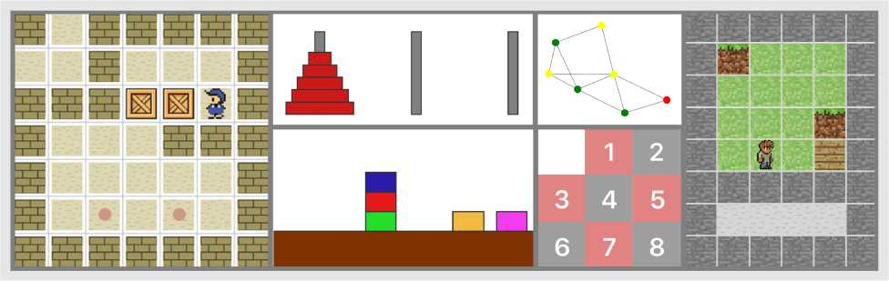
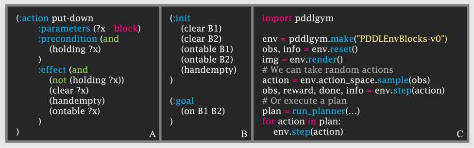
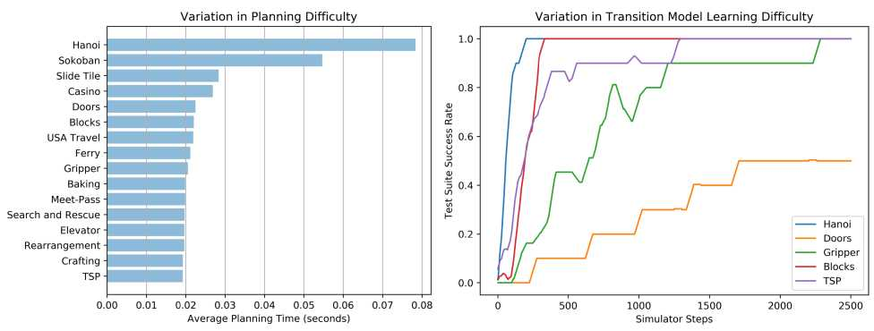

[TOC]
# 1. Survey of research literature-All 
several [recent research papers in that area](https://icaps20subpages.icaps-conference.org/workshops/prl/) constitute the current state of the art in this field. Readers are encouraged to click the URL for an in-depth exploration.

-----------------------------------------------------------

1. context and background

- A review of generalized planning通用规划背景发展情况

2. Research papers to be read closely and discussed .Additional research papers to be skimmed and briefly summarized.

- A Review of Machine Learning for Automated Planning综述自动规划发展情况(包含强化学习)
- Generalized Planning With Deep Reinforcement Learning简单介绍强化学习+通用规划基本方法

3. State Of Art

- PDDLGYM: GYM ENVIRONMENTS FROM PDDL PROBLEMS [code1](https://github.com/tomsilver/pddlgym), [code2](https://github.com/ronuchit/pddlgym_planners). 笔者认为，该研究代表了强化学习与PDDL交互的正确研究方向之一。详见文献 [PDDLGym: Gym Environments from PDDL Problems](https://arxiv.org/abs/2002.06432)

## 2. A review of generalized planning

自动化规划（Automated Planning, AP）能够利用智能体及其环境的模型，在高度结构化的环境中解决复杂的协商任务。然而，Traditionally the solutions generated by automated planners are tied to a particular planning instance and hence, do not generalize.（即**经典规划**，classical planning）

>A **generalized plan** is an algorithm-like solution that is valid for a given setof planning instances.

近年来，由于规划表示（representation）领域涌现了一系列新颖的形式化体系，以及用于计算此类解决方案的新算法不断问世，上述进展揭示了广义规划技术的巨大潜力，并推动了规划理论在计算机科学各领域的广泛渗透，例如程序综合（program synthesis）、自主控制（autonomous control）、数据整理（data wrangling）及模式识别（form recognition）。本文将梳理广义规划领域的最新研究进展，并将其与现有形式化体系相关联，着重探讨自动化规划中的通用性问题，涵盖*具有领域控制知识的规划（planning with domain control knowledge）*以及*不确定性条件下的多种规划方法（different approaches for planning under uncertainty）*等不同路径。

### 2.1.1. classical planning

*经典规划模型*是自动规划最常见的模型，基于以下假设：

1.要解决的计划任务具有有限且可完全观察的状态空间。

2.动作是确定性的，并导致瞬时状态转换。

经典计划实例的解决方案是一系列可应用的操作，这些操作将给定的初始状态转换为目标状态，即满足先前指定的一组目标条件的状态。

A classical planning frame is a tuple Φ =〈F,A〉, where F is a set of fluents and A is a set of actions. 

Given  a  frame  Φ  =〈F,A〉,  a **classical  planning**  instance is  a  tuple P=〈F,A,I,G〉,  where I∈ L(F) is an initial state (i.e.|I|=|F|) andG∈ L(F)is a goal condition. 

Besides  classical  planning,  PDDL can represent more expressive planning models such as *temporal planning or planning with path constraints and preferences*

### 2.1.2. generalized planning

可根据广义规划对*下一步待执行动作（the action to apply next）*的规范方式对其进行分类：

- **完全指定（Fully specified）解决方案**：能够明确捕获下一步待执行的动作，从而解决广义规划任务中的每一个实例。程序（program）、通用策略（generalized policy）或确定性有限状态控制器（deterministic FSC）均属于此类别。如果认为一致规划（conformant planning）、偶然规划（contingent planning）或POMDP规划也属于此类，则可能的初始状态代表了不同的经典规划实例，它们共享相同的状态变量、动作和目标[42]。**笔者认为，非确定性图中的解图（policy）即具有确定性，可等价地表示为程序（program）**。
- **非指定（Non-specified）解决方案**：（笔者认为，每个实例均无规律可循，需依赖经典规划器额外求解的情形。）具备领域模型（domain model）的经典规划器构成了广义规划的一种形式。此类规划极为通用（涵盖可用经典规划器输入语言表示的任何实例），但其执行机制效率低下——需针对广义规划任务中的每个实例运行经典规划器以生成完全指定的解决方案。
- **部分指定（Partially specified）解决方案**：兼具上述两类要素的通用规划。使用*特定于领域的控制知识*进行*规划*的不同方法均属此类，因其仍需规划器针对特定实例生成完全指定的解决方案，但借助限制可能解空间的知识加以引导。此类方案包括部分指定的程序、非确定性FSC、形式文法、AND/OR图以及HTN。**笔者认为，这等价于QNP/FOND可搜索得到“policy——>解子图”的映射**

The execution of a generalized plan  $\Pi$  in a classical planning instance P=〈F,A,I,G〉is a classical plan,

The **generalized planner** box refers to an algorithm with an input-output specification of the instances to solve and that generates a solution to these instances. 该算法包含待求解实例的*输入-输出*规范，并负责为这些实例生成相应的解决方案。

广义规划算法的范围涵盖从纯粹的**自上而下（Top-down）**（笔者理解为MyND启发式图搜索子图，或FOND-SAT全空间搜索）方法——即在广义规划空间中搜索一个能够覆盖所有输入实例的解决方案——

到**自下而上（Bottom-up）**（笔者理解为PRP、FF planner等从实例中学习的方法）——即为单个实例计算解决方案，然后对其进行泛化与合并，以逐步扩大广义规划的覆盖范围。最终，*广义规划*可被视为广义规划任务中规划实例的过程性表示。

通用广义规划的求解类似于经典规划（classical planning），其传统求解方法包括：

1. 在经典规划中，规划器仅接收单个基例化（ground）规划实例作为输入。
2. 经典规划的最新算法是在状态空间中执行启发式搜索[37,30]，或将规划问题编译为其他形式的问题求解范式，例如SAT。
3. 经典规划的解是一系列动作序列，其执行与验证过程在规划长度上均呈线性复杂度。然而，具备条件效应、变量及控制流结构的动作能够以更为紧凑的方式表示经典规划任务的解决方案。

### 2.1.3. Reinforcement Learning

- Representing Actions

（强化学习相结合）一个典型例证是在**ATARI**视频游戏中采用的以智能体为中心的行为模型[62]，其中18种可能的行为根据视频游戏的当前状态展现出不同的效果。在此，我们回顾了经典规划行为模型的扩展，这些扩展旨在使规划任务和规划解决方案更为紧凑且更具通用性。

- Conditional effects=preconditions+conditional  effects

Conditional effects cannot be compiled away if plan size should grow only linearly [67].  

PDDL supports the definition of conditional effects with the  **when** keyword。

- Update formulas and high-level state features( series  of  work  by  Srivastava et al.  )

different  formalisms  for  representing  a  set  of  planning  in-stances according to the language used for specifying these constraints:

  - **命题逻辑（Propositional logic）**。在这种情况下，可能的初始状态和目标状态的集合仅使用文字和三个基本逻辑连接词表示（即表示文字的合取或表示文字的析取而不引入否定）。用命题逻辑表示的规划实例集的示例包括一致规划、偶然规划或POMDP规划任务，这些任务定义了不同的可能初始状态，作为对问题文字的析取（而目标则为规划任务中所有可能初始状态所共享）[10]。
  - **一阶逻辑（First-order logic）**。一阶逻辑约束可以包含量化变量，包括传递闭包，并表示无界状态集。这些特征使一阶公式能够实现规划实例集的紧凑表示，以及无规模限制的规划任务[90]。对于给定的有限对象集，一阶表示形式可直接转换为命题逻辑表示形式。
  - **约束规划（Constraint Programming）**。除约束编程语言的表示灵活性外，在此情形下，还可利用现成的CSP求解器来解决广义规划任务。
  - **三值逻辑（Three-valued logic）**。在此逻辑语言中，存在三个真值：1（真）、0（假）或U（未知）。Srivastava等人利用三值逻辑进行状态抽象，以紧凑地表示无边界的具体状态集。三值逻辑对于表示和解决一致规划及偶然规划任务同样具有重要意义。

**确定一组规划实例（specify a set of planning instances）**：除了使用初始状态集和目标状态集之外，未来还可利用其他信息，例如*领域不变量*[90]甚至是分类的执行历史记录，类似于归纳逻辑编程（ILP）中的做法。

本节阐述计算广义规划的两种主要方法，并回顾不同的*规划重用*技术，以避免从头开始计算广义规划。最后综述针对广义规划不同方法的具体实现。

- **自上而下的广义规划搜索方法**

自上而下的广义规划搜索方法旨在寻找能够覆盖广义规划任务中所有实例的解决方案。与之相对，自下而上的方法则为单个实例（或广义规划任务中的实例子集）计算解决方案，并逐步扩展解的范围，直至覆盖广义规划任务中的全部实例。在机器学习语境下，自上而下的方法与*离线*（offline）机器学习算法相关联，该类算法在一次迭代中计算出一个覆盖整个输入实例集的模型，例如决策树的归纳学习[^61]。自下而上的方法则与*在线*（online）版本的机器学习算法相对应，随着更多输入实例的出现，算法迭代地、增量式地调整模型[^94]。

[^61]: Thomas M Mitchell.Machine  Learning.  McGraw-Hill,  Inc.,  New York,NY, USA, 1 edition, 1997.
[^94]: Paul E Utgoff. Incremental induction of decision trees.Machine learning,4(2):161–186, 1989.

用于广义规划的*自顶向下*算法通常在可能的广义规划空间中搜索解决方案。该搜索的初始状态为*空*广义规划，搜索算子在广义规划中逐步构建一个步骤（例如，向程序添加指令、向FSC添加新状态或状态转移、向策略添加新规则等）。搜索的目标状态集包括构建的广义规划能够解决给定实例集的任何状态。

此类方法的一个典型范例是将广义规划编译为其他形式的问题解决方案，例如***经典规划*[^46]、*一致规划*[^10]、*CSP* [^74]或*Prolog程序*[^43]**。这些编译方法实现了如上所述的搜索空间，并借助现成求解器（配备高效的搜索算法和启发式方法）完成对广义规划的搜索。编译方法的主要局限性在于可扩展性。在实践中，通常通过限制可能的广义规划的大小来约束搜索范围（例如，程序行数、控制器状态数、策略规则数或量化变量的最大数量）。这种做法类似于SATPLAN方法中的策略——先确定最大规划长度[78]，然后逐步递增直至找到解决方案。

[^46]: Sergio Jim ́enez and Anders Jonsson. Computing Plans with Control Flowand Procedures Using a Classical Planner.  InSOCS, 2015.
[^10]: Blai Bonet, H ́ector Palacios, and Hector Geffner. Automatic derivation offinite-state machines for behavior control.  InAAAI, 2010
[^74]: C ́edric Pralet, G ́erard Verfaillie, Michel Lemaˆıtre, and Guillaume Infantes.Constraint-based  controller  synthesis  in  non-deterministic  and  partiallyobservable domains.  InECAI, 2010
[^43]: Yuxiao Hu and Giuseppe De Giacomo. A generic technique for synthesiz-ing bounded finite-state controllers.  InICAPS, 2013.

- **重用广义规划：Srivastava的方法**

在这方面，*自下而上的*广义规划方法配备了使规划适应未知案例并逐步增加其覆盖范围的机制[91]。另一方面，*自上而下的*方法则可以从部分指定的解决方案开始，而非从*空*的广义规划起步。这表明缩小搜索空间和/或集中搜索过程对于解决更具挑战性的广义规划任务具有重要价值[83,84]。

接下来，回顾重用先前找到的规划的不同技术：

•   **编译（Compilation）**。当现有的广义规划具有广义策略的形式时，可将其编译为一组PDDL派生谓词，策略中的每条规则对应一个捕获不同情境下应执行动作的谓词[45]。图13展示了此方法，其中显示了PDDL派生谓词的示例，该谓词表示用于堆叠塔式塔楼的2规则策略。进一步地，通过**计算相应自动机与原始规划任务之间的叉积（cross product），可以将程序、FSC或AND/OR图形式的现有广义规划编码为经典PDDL规划任务**[^7,83,77]。在此情况下，新的额外状态变量将被添加到原始规划任务中，以表示与程序、FSC或AND/OR图相对应的自动机的状态和转移。

•   **规划行动（Planning Actions）**。经典规划中的动作不仅代表原始动作，亦可代表广义规划本身。图20展示了一个经典规划动作，该动作对应于一个用于在积木世界中堆叠任意积木的广义规划，即解决任意积木世界实例的通用解决方案中的第一步。

[^7]: Jorge A Baier, Christian Fritz, and Sheila A McIlraith. Exploiting proce-dural domain control knowledge in state-of-the-art planners.  InICAPS,2007.
[^83]: Javier Segovia-Aguas, Sergio Jim ́enez, and Anders Jonsson.  Generalizedplanning with procedural domain control knowledge.  InICAPS, 2016.
[^77]: Miquel Ramirez and Hector Geffner.  Heuristics for planning, plan recog-nition and parsing.arXiv preprint arXiv:1605.05807, 2016

先前找到的规划的不同技术：

•   **编译（Compilation）**。当现有的广义规划具有广义策略的形式时，可将其编译为一组PDDL派生谓词，策略中的每条规则对应一个捕获不同情境下应执行动作的谓词[45]。图13展示了此方法，其中显示了PDDL派生谓词的示例，该谓词表示用于堆叠塔式塔楼的2规则策略。进一步地，通过**计算相应自动机与原始规划任务之间的叉积（cross product），可以将程序、FSC或AND/OR图形式的现有广义规划编码为经典PDDL规划任务**[^7,83,77]。在此情况下，新的额外状态变量将被添加到原始规划任务中，以表示与程序、FSC或AND/OR图相对应的自动机的状态和转移。

•   **规划行动（Planning Actions）**。经典规划中的动作不仅代表原始动作，亦可代表广义规划本身。

[^7]: Jorge A Baier, Christian Fritz, and Sheila A McIlraith. Exploiting proce-dural domain control knowledge in state-of-the-art planners.  InICAPS,2007.
[^83]: Javier Segovia-Aguas, Sergio Jim ́enez, and Anders Jonsson.  Generalizedplanning with procedural domain control knowledge.  InICAPS, 2016.
[^77]: Miquel Ramirez and Hector Geffner.  Heuristics for planning, plan recog-nition and parsing.arXiv preprint arXiv:1605.05807, 2016

 diverse approaches for generalized planning according to the solution representations：

|                    | Variables                 | Control-flow                    | Execution                                |
| ------------------ | ------------------------- | ------------------------------- | ---------------------------------------- |
| Classical plan     | ------                    | ------                          | Ground actions                           |
| Macro-Actions      | Action parameters         | ------                          | Lifted actions                           |
| Generalized Policy | Rule parameters           | Branching and loops             | Lifted rules                             |
| DSPlanners         | Existential               | Branching and loops             | Lifted predicatesand lifted actions      |
| FSCs               | Quantified                | Branching and loops             | Derived predicates                       |
| Hierarchical FSCs  | Quantified and parameters | Branching, loops and call stack | Derived predicates and Parameter passing |
| Programs           | Quantified and parameters | Branching, loops and call stack | Derived predicates and Parameter passing |

## 3. A Review of Machine Learning for Automated Planning

自动化规划（AP）是人工智能的一个分支，致力于研究执行给定任务的有序行动集合的计算综合。AP于20世纪50年代末期兴起，是对状态空间搜索、定理证明及控制理论研究的成果，旨在应对机器人技术与自动演绎领域的实际需求。斯坦福研究院的问题求解器STRIPS（Fikes and Nilsson, 1971）发展为控制自主机器人Shakey的规划组件（Nilsson, 1984），这一历程完美诠释了上述影响力的相互作用。从Shakey时代至今，AP领域已催生了规划任务的公认表示标准及其高效求解算法（Ghallab et al., 2004）。

1. **知识表示（Knowledge Representation）**。首先，必须界定机器学习过程将要学习的知识类型。在本文中，我们考虑了AP中机器学习的两个不同目标：为规划器提供服务的动作模型，以及指导规划器寻找解决方案的搜索控制知识。其次，必须决定如何表示所学知识，在此需做出两个代表性决策：

（a）   **表示语言（Representation Language）**。用于对目标概念和体验进行编码的表示法。由于AP任务通常以谓词逻辑描述，故该语言是最常用的AP概念编码语言。此外，描述逻辑或时间逻辑等语言亦有使用，尽管程度相对较小。

（b）   **特征空间（Feature Space）**。机器学习算法考虑学习目标概念时所采用的一组特征。在AP中，这些特征通常是用于定义AP任务的动作、状态和目标的领域谓词。

2. **经验获取（Experience Acquisition）**。如何收集学习样本。在AP情境下，学习样本可由规划系统自主收集，亦可由外部智能体（例如人类专家）提供。实现自主收集学习样本的机制是一个复杂的过程。利用规划器收集经验仍是一个开放问题，主要因为确保使用给定领域模型求解AP问题的可解性，与原始AP任务本身同样困难。随机探索常常导致AP任务的状态和动作空间采样不足。AP动作通常设置前提条件，这些前提条件只能由特定动作序列满足，而此类序列被偶然选中的概率极低。

3. **学习算法（Learning Algorithm）**。如何从收集的经验中捕获模式。不同的方法可从不同角度提取模式。归纳学习通过对观察实例进行泛化来构建模式；分析学习利用先验知识和演绎推理构建模式，以解释学习样本中的信息；混合归纳-分析学习则结合上述两种技术，兼收两者之长：当先验知识可用时，泛化的准确性得以提升；同时利用观测学习数据弥补先验知识的不足。在设计AP归纳学习算法时，最常用的技术是归纳法，但基于AP任务的领域定义，亦可采用分析和混合方法来构建对收集的学习样本的解释。

4. **所学知识的利用（Deploying Learned Knowledge）**。自动化系统如何从所学知识中获益。对于前述三个问题中每一个的决策，均会影响所学知识的质量。若所学知识不完善，则必须通过保障可靠利用的机制加以应用。对于AP而言，知识的不完善可能源于多种因素：某些表示选择可能不足以表达给定条件的相关知识；

收集学习经验的策略可能遗漏目标知识的大量样本；抑或学习算法可能陷入局部最优，无法在合理的时间和内存约束内捕获目标知识的模式。在这些情况下，直接使用所学知识可能会损害规划过程。规划与学习系统需配备各种机制，以确保即使所学习知识存在缺陷，系统仍能尽可能鲁棒地进行规划。

## 3.1. 四类AP model

AP建模定义了四类：

\- 完全可观察的环境中的确定性操作；

\- 在部分可观察的环境中的确定性动作；

\- 在完全可观察的环境中的随机动作；

\- 可观察部分环境中的随机动作。

尽管存在其他分类的可能性，例如根据学习目标进行分组（前提条件、效应、效应条件、结果的概率等），但本文认为这一分类对于规划目的具有显著价值，因为每个类别对应着不同的规划范式。下图通过给出若干示例实现，总结了规划动作建模系统的分类。该表并非穷尽性列举，故表中的系统仅作为示例呈现。

| **模型**                             | **特征**                                                     |                           | **实施方式**                                                 |
| ------------------------------------ | ------------------------------------------------------------ | ------------------------- | ------------------------------------------------------------ |
|                                      | **长处**                                                     | **弱点**                  |                                                              |
| **确定性**影响**完整的**状态可观察性 | •学习复杂性在理论上是有限的  •高效的计划算法  •完整涵盖学习示例 | •表现力差                 | LIVE（Shen and Simon，1989），EXPO（Gil，1992），OBSERVER（Wang，1994） |
| **确定性**影响**部分**状态的可观察性 | •完整涵盖学习示例                                            | •表现力差 •低效的计划算法 | ARMS（Yang等，2007），（Amir and Chang，2008），（Mourao等，2008），LOCM（Cresswell等，2009） |
| **概率**效应**完全**状态可观察性     | •丰富的表现力•高效的计划算法                                 | •不存在的在线学习         | （Oates and Cohen，1996），TRAIL（Benson，1997），LOPE（Garcla-Martlnez and Borrajo，2000），（Pasula et al。，2007），PELA（Jimenez等，2008） |
| **概率**效应**部分**状态可观察性     | •富有表现力                                                  | •高计划和学习复杂性       | （Yoon和Kambhampati，2007年）                                |

## 3.2. Learning Planning Search Control Knowledge 

学习规划图的控制结构知识（类比于TensorFlow计算图）

学习AP搜索控制知识的四种不同方法：宏动作（Macro-actions）、广义策略（Generalized Policies）、广义启发式函数（Generalized Heuristics）及层次分解方法（Decomposition Methods）

| **模型**                   | **特征**                                              |                                                              | **实施方式**                                                 |
| -------------------------- | ----------------------------------------------------- | ------------------------------------------------------------ | ------------------------------------------------------------ |
|                            | **长处**                                              | **弱点**                                                     |                                                              |
| Macro-actions              | •对错误的学习知识有较强的把握 •适用于不同的计划者     | •Utility problem                                             | REFLECT（Dawson and Silklossly，1977），MORRIS（Korf，1985），MacroFF（Botea等，2005a），Marvin（Coles and Smith，2007），（Newton et al。，2007） |
| Generalized Policies       | •标准关系分类算法                                     | •Engineering effort to整合不同的搜索算法和与领域无关的启发式方法 | （Minton，1988年），PRIAR（Kambhampati and Hendler，1992），HAMLET（Borrajo and Veloso，1997），（Khardon，1999），（Martin and Geffner，2000），DISTILL（WinnerandVeloso，2003），OBTUSEWEDGE（Yoon等人，2007），CABALA（de la Rosa等人，2007），ROLLER（de la Rosa等人，2008） |
| **Generalized Heuristics** | •标准关系回归算法 •轻松集成不同的搜索算法和启发式方法 | •可读性差                                                    | （Yoon等，2006），（Xu等，2007）                             |
| **Decomposition Methods**  | •富有表现力                                           | •无需全自动学习                                              | CAMEL（Ilghami等，2002），HDL（Ilghami等，2006），HTNMAKER（Hogg等，2008） |

Overview of AP systems that benefit from ML for the extraction of domain-specific search control

存在一组能够通过归纳学习控制规则的系统，其中归纳逻辑编程（ILP）是最为流行的学习技术。Grasshopper系统（Leckie and Zukerman, 1991）使用FOIL（Quinlan and Cameron-Jones, 1995）来学习指导PRODIGY规划器的控制规则。此外亦存在分析型系统：PRODIGY/EBL模块（Minton, 1988）从规划器的正确和错误决策示例中学习搜索控制规则。STATIC（Etzioni, 1993）无需解决任何问题即可获得控制规则，它仅使用基于解释的学习（EBL）来分析动作前提条件与效果之间的关系。为克服纯归纳法与纯分析法的局限性，部分研究者尝试将二者结合：基于此原理的先驱系统包括LEX-2（Mitchell et al., 1982）和Meta-Lex（Keller, 1987）。AxA-EBL（Cohen, 1990）融合了EBL与归纳法，首先使用EBG学习控制规则，然后通过实际学习示例对其进行完善。Dolphin（Zelle and Mooney, 1993; Estlin and Mooney, 1996）是AxA-EBL的扩展，采用FOIL作为归纳学习模块。Hamlet（Borrajo and Veloso, 1997）系统将演绎与归纳相结合，首先使用EBL学习通常过于具体或过于笼统的控制规则，随后利用归纳法对规则进行泛化与特化。EvoCK（Aler et al., 2002）采用*遗传编程*来演进Hamlet所学习的规则，从而产生更为高效的搜索控制。

学习广义策略的问题最早由Roni Khardon进行研究。Khardon的L2ACT系统（Khardon, 1999）通过将决策列表学习算法（Rivest, 1987）扩展到关系环境，为*Blocksworld*和*Logistics*领域引入了通用策略。该初始方法存在两个重要缺陷：（1）依赖人类定义的背景知识来表达领域的关键特征，例如Blocksworld中的谓词on（block1, block2）或inplace（block）；（2）所学策略在问题规模增大时泛化能力不足。Martin和Geffner通过将广义策略的表示语言从谓词逻辑转变为*概念语言*，解决了*Blocksworld*中的上述限制，进而学习递归概念（Martin and Geffner, 2000）。

最近，广义策略学习的范围已在多个领域中增加，从而使该方法可与最新的计划者竞争。这一成就归功于两个新思想：（1）策略表示语言中包含了额外的谓词，可以捕获更有效的特定领域知识；（2 ）学习策略不是贪婪地应用，而是在启发式搜索算法的框架内应用。一个突出的例子是O btuse W 边缘系统（Yoon等，2007），它是IPC-2008学习轨迹的最佳学习者。该系统通过宽松的计划图丰富了当前状态的知识，并使用学习到的策略在“最佳优先搜索”中生成超前状态。[R 奥勒（de la Rosa等，2008）将学习广义策略的问题定义为两步标准分类过程。第一步，分类器捕获要在不同计划上下文中应用的首选运算符。在第二个中，另一个分类器在给定域5的不同计划上下文中捕获每个操作员的首选绑定。这些上下文由从给定状态的宽松计划图中提取的有用操作集，仍未实现的目标以及计划任务5的静态谓词定义。

还存在通过规划实例的集合表示广义策略的系统，如AP的CBR系统。基于实例的AP系统通常在各种域中都不具有竞争力，因为它们存在必须定义在不同类型的域中都能很好工作的适当相似性度量的缺点。PRIAR系统（Kambhampati和Hendler，1992）建议将计划的修改与生成计划结合起来。天才/ 类比（Veloso and Carbonell，1993）介绍了将推导类比应用于规划。它存储了计划跟踪，以避免在将来解决问题时出现故障路径。要检索类似的计划痕迹，请神童/ 类比 使用最小前提条件为它们建立索引，以实现一组目标。基于案例的计划系统PARIS（Bergmann和Wilke，1996）提出引入抽象技术来将案例组织起来存储在分层存储器中。该技术提高了案件修改的灵活性，从而增加了单个案件的覆盖范围。DISTILL（Winner和Veloso，2003年）将示例计划合并到称为*dsPlanner* 的结构中*。*DISTILL将计划转换为参数化的if语句，并搜索已经存储在*dsPlanner* 中的每个if语句以合并它们。如果学到的*dsPlanner* 是准确的，则可以直接使用它来解决域中的任何问题，而无需进行搜索。卡巴拉（德拉罗莎等人，2007）使用启发式计划中的计划搜索过程中，以对象为中心的解决方案计划（称为类型序列）对节点进行排序。另一位基于实例的学习者REPLICA 使用受关系数据挖掘中使用的度量启发的关系距离，实现了“ 最近原型学习” （Garcia-Duran等人，ress）。OAKPlan（Serina，2010年）使用紧凑的图形结构来编码规划问题。该结构提供了规划问题拓扑的详细描述，并允许学习者基于内核功能定义选择性检索过程。

在（de la Rosa等人，2009）中，最近描述了一种计划系统，该系统能够从两种方法（规则或实例）中的任何一种所代表的广义政策中受益。该系统查询用于修复宽松计划缺陷的策略，然后将最终放松的计划用作“ 最佳优先搜索” 中的基础宏操作。

## 4. State Of Art实现Generalized Policies

本文选取两篇近期文献，介绍当前主要研究方法：
-   **Generalized Planning With Deep Reinforcement Learning**
该方法通过编码特征工程后，采用类似于Q-learning的决策动作网络进行策略学习（state→action），不依赖于视觉表示或由规划算法生成的成功计划，而是通过深度强化学习以试错方式直接从PDDL表示中学习问题求解。

- **PDDLGYM: GYM ENVIRONMENTS FROM PDDL PROBLEMS**
上一篇论文的可解释性相对有限，鲁棒性亦有不足，故引入此篇。笔者认为，PDDLGym这一利用规划器求解PDDL的框架，将成为打通AI规划与强化学习之间的桥梁。

## 5. Generalized Planning With Deep Reinforcement Learning

## 5.1. 前置知识

经典规划

经典规划使用从STRIPS建模语言派生而来的正式描述语言，即规划领域定义语言（PDDL），以定义问题领域及其相应的状态与目标。规划任务可由元组（F, O, I, G）定义，其中*F*是一组命题（或谓词），描述任务实例中对象的属性及其关系；*O*是一组算子（或动作类型）；I是初始状态；G是目标状态集合。每个动作类型o由三元组（Pre(o), Add(o), Del(o)）定义，其中前提Pre(o)为必须为其值方可应用该操作的一组谓词，Add(o)为应用该操作后变为真的一组谓词，Del(o)为应用该操作后变为假的一组谓词。求解规划任务旨在寻找一个动作序列，该序列一经应用，将在一定时限或预定步骤数内导致满足G的状态。规划任务的求解通常通过**启发式搜索方法**完成，然而，在本工作中，我们专注于学习反应式规划策略，此类策略可在特定领域的实例上进行训练，进而泛化至同一领域中未见的新实例。

强化学习

> 不同于常见的$<S,A,R,P,\gamma \text{折扣率}>$

强化学习（Reinforcement Learning, RL）是机器学习的一个分支，致力于研究顺序决策问题中的策略学习。

RL算法通常假设问题可建模为马尔可夫决策过程（MDP），在有限水平情形下由元组（S, A, R, P, T, p）定义，其中S为状态空间，A为动作集合，R为将状态或状态-动作映射为标量奖励的奖励函数，P为转移概率函数，满足$p(s' | s,a) = P(s', s, a)$（**确定性策略**），T为任务范围，p为初始状态分布。

在状态与动作空间较大的情况下，无法期望将策略表示为表格形式（**Q表格**），因此需采用函数逼近器（**Deep Q Network的target network**）来表示带有某些参数θ的策略。本文专注于随机策略，该策略建立从状态到动作概率的映射，并采用基于策略梯度的方法进行优化。策略梯度方法利用蒙特卡洛采样来估计目标函数相对于策略参数的梯度。在实施策略梯度方法时，可通过使用样本轨迹计算出的"伪损失"的梯度来估算策略梯度。

近端策略优化（Proximal Policy Optimization, PPO）是一种基于策略梯度的算法，旨在通过对收集到的数据进行多次梯度更新（而后丢弃以收集更多数据）来更充分地利用学习过程中收集的数据。为避免因较大的策略更新而引起的稳定性问题，PPO采用特殊的裁剪目标来约束当前策略与数据收集策略之间的差异，从而定义优化问题。

## 5.2. RL学习generalized policy

### 5.2.1. state 的表示

本文选择将状态表示为图结构，并使用特征编码给定状态中对象之间的属性与关系。该框架在PDDL建模语言所指定的问题域上运行，在此框架中，问题实例由对象列表和谓词列表定义，这些谓词描述了对象的属性以及当前状态下它们之间的关系。本文的研究范围限定为谓词元数（Arity）不超过2的领域，这并非重大限制，因为在许多情况下，较高元数的谓词可分解为若干较低元数的谓词。所构建的图由全局特征、节点特征和边缘特征组成，其中U表示全局特征，V表示节点，E表示边。

全局特征表示问题实例或该领域独有的实体的属性，例如Blocksworld域中的机械手（hand），由该域的0元谓词确定。

节点特征表示域中对象的属性（如它们所属的类型），由1元谓词确定。

最后，边缘特征表示对象之间的关系，由2元谓词确定。

### 5.2.2. graph embedding

为利用状态-目标的图表示来学习优质策略，首先采用图神经网络（Graph Neural Network, GNN）将图的节点、边缘和全局特征嵌入到各自的潜在空间中。GNN在图的不同组件之间执行消息传递（message passing），从而促进有用信息的流动。本文使用两种不同类型的GNN模块，每种模块在图内实现不同类型的信息流，因此不同模块类型在某些问题领域上具有比较优势。在两种类型中，更新顺序相似，均采用以下通用形式：

1. 使用先前的边缘及其"原始"节点更新边缘。

2. 使用先前的节点、传入的更新边和全局特征更新节点。

3. 使用先前的全局变量和更新后的节点聚合来更新全局变量。

本文将第一种类型命名为**图网络模块（Graph Network Block, GN Block）**。

第二种类型的模块旨在克服GN模块的局限性，为此引入了一种注意力机制。本文将第二个模块命名为**图网络注意力模块（Graph Network Attention Block, GNAT Block）**，与图注意力网络（Graph Attention Network）不同，其采用的注意力机制类似于Transformer模型的结构。

### 5.2.3. Policy 的表示

与常规强化学习基准（其中动作集是固定的，可通过标准神经网络架构方便地处理）不同，在经典规划问题中，动作集依赖于状态，且各状态之间的动作规模存在差异。在PDDL中，每个领域描述定义了一组动作类型，可通过将动作类型基于当前状态进行基例化（grounding）来实例化。每种动作类型接收一组参数，且为满足适用条件，动作参数必须符合一组前提条件。例如，Blocksworld域中存在一种称为"拾取"（pick-up）的动作类型，该类型以单个积木对象为参数，要求该积木必须为"clear"、"on-table"且"arm-empty"属性为真，此操作方可执行。所有符合这些前提条件的积木均可执行pick-up操作。除前提条件外，每种动作类型在应用时还具有引起状态变化的效应，其中部分效应可能是正面的（状态的某些谓词将取真值），部分效应则为负面的（状态的某些谓词将取假值）。

在规划的每一步中，后继状态生成器提供当前状态及适用动作列表。为以有意义的方式表示动作，便于策略学习，本文选择依据动作的效应来描述动作，因为效应是决策所必需的要素。由于后继状态生成器在每个步骤中已向智能体提供所有合法动作，因此前提条件可被忽略（所有合法动作均已满足前提条件）。每个动作由若干效应组成，每种效应涉及状态的不同方面，可正可负。根据效应的类型（全局效应、节点效应或边缘效应），将效应聚合在一起，并表示为各组成部分的嵌入与一个one-hot向量的串联，该向量描述哪个谓词已更改以及变化方向为正或负。该one-hot向量在相应输入分量的维度上，对应位置上的1表示正效应，-1表示负效应。每种效应根据其类型由多层感知器（MLP）进行转换，随后将转换后的效应分散回其原始动作。将每个动作的效应汇总，形成该动作的单一向量表示，最终馈入策略神经网络。

最终策略为一个MLP，该网络为每个动作输出一个标量，随后通过softmax操作对这些标量进行归一化，以获得动作的离散概率分布。

此外，另一个MLP提取图的最终全局特征嵌入，并输出状态的预测值，用于RL算法中的优势估计。

### 5.2.4. training

由于本工作的重点在于寻找可行的规划，因此选择将问题建模为具有二元奖励的稀疏奖励问题：若智能体在预定范围内满足所有目标，则获得奖励1，否则无奖励。为确定适当的时限，本文采用常用的hff启发式方法，该方法在多项式时间内求解问题的松弛形式（松弛问题不存在负面效应）。采用松弛规划的长度，并将其乘以常数5以获取时间范围（horizon）的长度。本文选择使用PPO进行策略训练。

更为简洁的方法是，根据实例大小的分布生成每个训练片段，实例大小的分布范围应小至足以被随机初始化的策略所解决。这一策略使得策略能够逐步演化，最终解决分布中的所有实例规模，而无需手动调整课程表。尽管设置此分布仍需人工干预，但实验发现，通过使用随机未经训练的神经网络进行简单的试错，可十分轻松快捷地完成此任务。

本文对标准PPO算法进行了一些微调，从而提升了本例的性能。诸多RL算法的实现会在更新模型参数前针对固定步数推出策略，通常会在过程完成前终止片段，并采用诸如广义优势估计（Generalized Advantage Estimation）和自举值估计（bootstrapping value estimation）等方法来估计奖励。

实验发现，这些元素会给学习过程引入不必要的偏差，故本文采用经验性回报而非引导式价值估算来计算优势，从而将每个片段完整推演至终止。此外，发现采用大量推演和大批量训练有助于稳定学习过程并获得更优的最终性能，因此每轮进行100个片段的推演，并使用所得数据在每次学习迭代时更新模型参数。

### 5.2.5. 实验

本文在五个常见的经典规划领域上评估了所提出的方法，这些领域选自IPC规划竞赛实例集合，且其领域谓词元数均不超过2：

• **Blocksworld（4个操作）**：机械手须从初始配置移动积木，以按照目标配置进行排列。

• **Satellite（卫星）**：一组卫星须对指定位置进行拍摄，每幅图像需采用特定类型的传感器。

• **Logistics（物流）**：须将包裹运送至目标位置，使用飞机和卡车在城市与地点之间转运包裹。

• **Gripper（夹爪）**：双臂机器人须将球从A室搬运至B室。

• **Ferry（渡轮）**：渡轮须将汽车从初始位置运输至指定的目标位置。

这五个领域的共同特征在于，可为它们制定简单的广义规划，从而能够求解任意规模的实例。

本文旨在证明所提出的方法能够产生可求解远大于训练实例的规划策略，从而自动发现此类广义规划。不同领域的难易程度存在差异，当广义规划易于描述时，常观察到策略极为成功地实现了泛化。例如，Gripper领域具有极其简单的策略（每次到B室抓取2个球），实际上神经网络学习了最优策略，即便面对数百个球的实例，通常仍能保持最优表现。为证明所学习策略确实具有良好的泛化能力，

•对于Blocksworld域，在4个块的实例上训练了的策略，并在5-100个块的实例上进行了评估。

•对于“卫星”领域，对使用1-3颗卫星，每颗卫星1-3台仪器，1-3种仪器，2-3个目标的实例进行了政策培训，并针对使用1-14颗卫星，2-11台仪器的实例进行了评估每个卫星，1-6种仪器和2-42个目标。

•对于物流领域，针对使用2-3架飞机，2-3个城市，每个城市2-3个地点，1-2个包裹的实例训练了的策略，并评估了使用4-12架飞机，4-15个城市，1个实例的实例每个城市-6个地点和8-40个包裹。

•对于Gripper域，针对3个球的实例训练了的策略，并针对5-200个球的实例进行了评估。

•对于Ferry域，针对具有3-4个位置，2-3个汽车的实例训练了的策略，并针对具有4-40个位置和2-120个汽车的实例进行了评估。

#### 5.2.5.1. 实验设定

为训练策略，本文依赖实例生成器产生随机训练实例，因所提方法需要大量训练数据。所有策略均经过1000次迭代训练，每轮迭代包含100个训练片段及最多20个梯度更新步骤。实验在一台配备i7-8700K处理器与NVIDIA GTX 1070 GPU的计算机上完成。所有五个领域采用相同的训练超参数，但神经网络模型略有差异。具体而言，使用256个隐藏单元和ReLU激活函数，学习率为0.0001，折扣因子为0.99，熵奖励系数为0.01，裁剪比率为0.2，KL散度参数为0.01。对于Blocksworld和Gripper领域，使用两层GNN，两层均为GN模块类型；对于Satellite、Ferry和Logistics领域，使用两层GNN，包含一个GNAT模块和一个GN模块。代码基于Python实现，神经网络及学习算法采用PyTorch框架。

评估聚焦于求解广义规划领域的大规模实例，并与经典规划器进行对比。本文选择了具有更广泛适用性的基准经典规划器，该类规划器在有足够时间和内存的条件下可扩展至大规模问题，具体与**Fast-Downward**框架进行对比——该框架为目前最先进的规划框架之一。本文方法采用Pyperplan作为模型和后继状态生成器，Pyperplan是基于Python的规划框架。使用LAMA-first配置作为Fast-Downward的设置，因其是性能最佳的竞争性满意规划算法。

#### 5.2.5.2. 实验结果

现在，介绍的结果。

图中与实验中使用的五个域的比较。这些图显示了成功率与扩展状态数的函数关系，并表明与5个域中的4个领域的经典规划器相比，方法确实有利。实际上，在的政策普遍推广的4个领域中，GBFS-GNN几乎不需要搜索。在这些领域中，除了最困难的情况外，只要贪婪地遵循策略即可找到解决方案。搜索算法建立在这种泛化能力的基础上，并在搜索时使用了少量的完整策略部署。

图中比较本文方法和FD planner方法，并针对给定的运行时间绘制了成功率。可以看到在一个领域（Blocksworld）中克服了它，而在其他三个领域中将其紧密匹配。尽管GBFS-GNN使用的后继状态和法律行动生成器的速度比快速向下的速度慢几个数量级，但的方法5的泛化能力使其与经典计划程序的最新实现方式相比具有竞争力。

方法的泛化性能的一个明显例外是物流领域。物流域在每个实例中的不同对象之间包含更紧密的耦合。例如，在“卫星”域中，从策略可以具有多个“半熟”目标并在它们之间进行切换而不会受到干扰的意义上说，校准仪器或对目标成像不会干扰其他卫星。在物流领域，这是不可能的，因为所有包裹都共享卡车和飞机，并且移动特定卡车来捡拾包裹可能会干扰原本打算在另一个位置捡拾的另一个包裹。

## 6. PDDLGYM: GYMENVIRONMENTS FROMPDDL PROBLEMS

## 6.1. abstract

本文介绍PDDLGym，这是一个能够从PDDL领域和问题文件自动构建OpenAI Gym环境的框架。PDDLGym中的观测与动作均具有关系性（relational）特征，这使得该框架特别适用于关系强化学习与关系性顺序决策的研究。PDDLGym还可作为通用框架，通过简洁且熟悉的规范语言快速构建多样化基准。本文讨论了其设计决策与实现细节，并根据规划难度和模型学习难度两方面，阐述了20种内置环境之间的经验差异。期望PDDLGym能够促进强化学习社区（Gym的发源地）与AI规划社区（PDDL的发源地）之间的桥梁构建。

PDDLGym是一个将Gym与PDDL元素有机结合的开源框架。**具体而言，PDDLGym是一个Python库，可根据PDDL领域文件和问题文件自动创建Gym环境。**

该库的代码仓库位于[https://github.com/tomsilver/pddlgym。](https://github.com/tomsilver/pddlgym)

与Gym类似，PDDLGym支持智能体与环境之间进行周期性的闭环交互。智能体从环境接收观测结果并执行动作，重复此循环直至片段结束。如PDDL的核心理念，PDDLGym从根本上具有关系性：观测结果为对象上的基例化关系集（例如，on(plate, table)），动作为与对象一同基例化的模板（例如，pick(plate)）。因此，PDDLGym特别适用于关系学习与顺序决策研究。

强化学习中所采用的Gym API定义了智能体与环境之间的严格边界。具体而言，智能体*仅*通过执行动作和接收观测来与环境交互。环境执行步骤（step）函数，该函数根据智能体赋予的动作推进状态；步骤函数定义了环境的转移模型。类似地，PDDL领域通过其算子对转移模型进行编码。然而，在典型使用场景中，PDDL被理解为完全存在于智能体的"思维"之中，随后由独立的过程负责将规划转化为智能体可在世界中执行的行动。

PDDLGym打破了这一惯例：在PDDLGym中，PDDL领域与问题文件牢固地位于智能体-环境边界的环境一侧。环境利用PDDL文件实现步骤功能，在给定动作的情况下推进状态。因此，将PDDLGym理解为对PDDL用途的一种重新诠释更为恰当。在实现层面，此用法具有微妙但重要的含义。

图1：**PDDLGym中实现的部分环境示例。**从左至右依次为：推箱子（Sokoban）、河内塔（Hanoi）、积木世界（Blocksworld）、旅行推销员问题（TSP）、滑动拼图（Sliding Puzzle）及手工制作（Crafting）。

图2：**PDDLGym代码示例。**PDDLGym环境的特征由PDDL领域文件与PDDL问题文件列表共同定义。（A）PDDL领域文件中的一个算子；（B）一段简洁的PDDL问题文件摘录；（C）在注册名称为"PDDLEnvBlocks-v0"的环境后，仅需数行Python代码即可与PDDLGym环境进行交互。

PDDLGym具有三个主要用途：

（1）促进关系领域中顺序决策的多样化基准创建

（2）搭建强化学习与规划研究之间的桥梁

（3）推动关系领域中顺序决策的研究进展

本文其余部分组织如下：第2节讨论PDDLGym的设计决策与实现细节，概述内置的PDDLGym领域，并提供基本的经验结果以说明各领域在规划难度与学习难度方面的多样性。最后，讨论PDDLGym的扩展与改进方向。

Gym API通过三种基本方法将环境定义为Python类：

- **__init__**：用于初始化环境；
- **reset**：开始新的片段并返回观测值；
- **step**：接收智能体的动作、推进当前状态，并返回观测值、奖励、表示片段是否完成的布尔值及可选的调试信息。

API还包含其他辅助方法，例如处理渲染和随机种子的功能。详见PDDLGym的[Github仓库](https://github.com/tomsilver/pddlgym)中的自述文件。

此外，需在Gym环境中实现**action_space**（表示可能动作的空间）和**observation_space**（表示可能观测的空间）。

接下来，将简要概述PDDL文件，随后描述如何在PDDLGym中定义动作空间与观测空间。继而，将讨论上述三种基本方法的实现。有关PDDLGym中主要数据结构的实现细节，请参见代码中的**structs.py**。

### 6.1.1. 初始化和重置环境

PDDLGym环境由PDDL领域文件和PDDL问题文件列表共同参数化。为便于研究，每个PDDLGym环境均与该环境的*测试*版本相关联，其中领域文件保持不变，而问题文件则有所差异（例如，可对更复杂的规划任务进行编码，以衡量泛化能力）。在环境初始化期间，所有PDDL文件均被解析为Python对象。

为此，本文采用自定义PDDL解析器。调用reset时，将随机选择一个训练问题实例。

为方便起见，reset还返回（在调试信息中）指向当前片段的PDDL领域文件和问题文件的路径。这使得用户可以便捷地使用符号规划器并在环境中执行生成的规划。

对于每种环境，智能体针对25级基线（baseline）执行随机策略。观测到的状态转移将被用于学习转移模型，随后将该模型应用于一系列测试问题的规划求解。所报告的成功求解测试问题的比例被作为学习到的转移模型性能的衡量指标。为学习转移模型，采用一阶逻辑决策树（FOLDT）学习方法。

### 6.1.2. 实施step方法

PDDLGym环境的step方法接收一个动作，更新环境状态，并返回观测值、奖励、完成标志及调试信息。为确定状态更新，PDDLGym检查在给定当前状态下，该动作是否满足某个PDDL算子的前提条件。

**前提条件满足检查（precondition satisfaction check）**并非平凡操作；非自由参数（non-free parameters）必须完成绑定。

本文实现了两个推理后端来执行此项检查。
第一个是基于类型化SLD解析的Python实现，当查询仅涉及合取时，此为默认选项。
第二个是SWI Prolog接口封装，使其能够处理涉及析取和量词的更为复杂的前提条件。后者运行速度较前者为慢，但具有更强的通用性。当没有任何算子前提满足给定动作时，状态默认保持不变。在某些应用中，若无满足的前提条件，可引发错误；可选的初始化参数raise_error_on_invalid_action支持此行为。

PDDLGym中的奖励为稀疏的二元奖励。具体而言，当达到问题目标时，奖励值为1.0，否则为0.0。类似地，当达到目标时，完成标志（done）为True，否则为False（实际应用中通常采用最大片段长度作为终止条件）。

### 6.1.3. 实验

若基础PDDL领域具有概率效应（如PPDDL），step方法将对此进行适当解析，并根据给定的概率分布选择一种效应。若给定概率之和不为1，则添加默认的空效应。

**PDDLGym环境之间的差异。**PDDLGym中内置的PDDL领域与问题在规划难度（左图）和模型学习难度（右图）方面存在显著差异。详情请参见正文。为清晰起见，省略了其中一个领域Depot，但其规划时间比最简单的领域（TSP）高出两个数量级。

对于图中所示的方法，其他领域（包括Baking、Depot和Sokoban）对于本文采用的学习方法而言较为困难：FOLDT学习无法在合理时间内找到适配数据的模型。当然，模型学习的难度因学习方法和探索策略的不同而存在很大差异。本文在此实施简单策略以展示上述结果，而这些未来的研究方向恰恰是PDDLGym所期望促进的探索路径。

综上所述，PDDLGym是一个开源的Python框架，能够根据PDDL领域与问题文件自动创建OpenAI Gym环境。实验结果表明，内置环境之间在规划难度与学习难度方面存在相当大的差异。