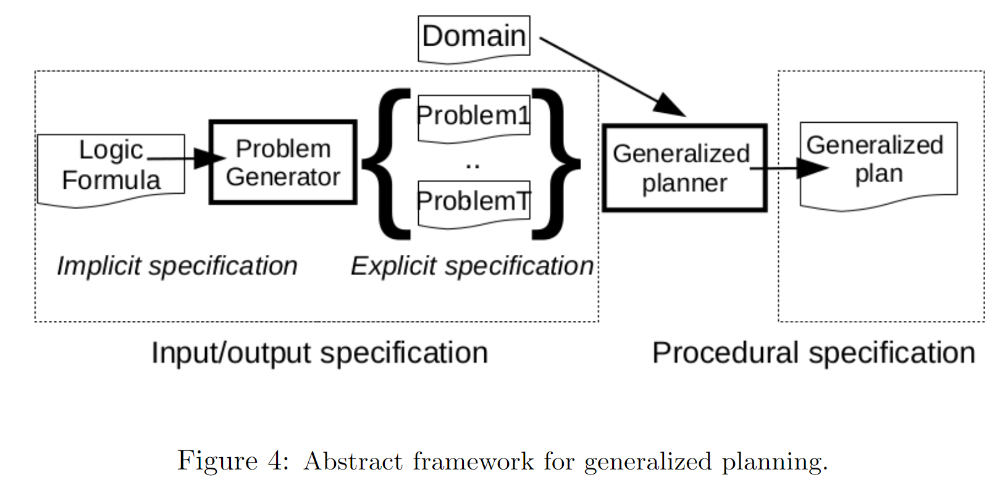
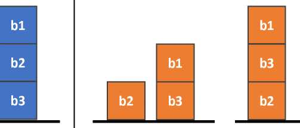
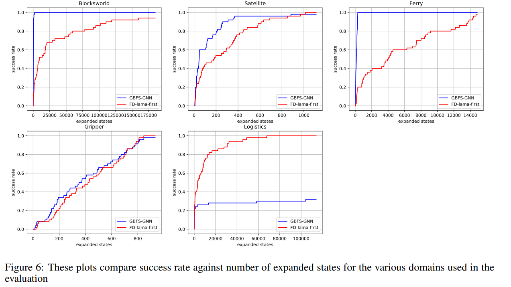
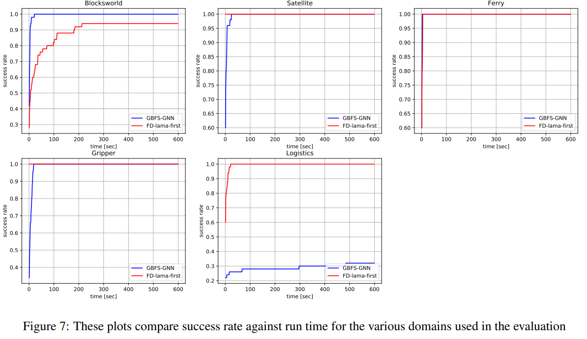

[TOC]
# 1. Survey of research literature 
several [recent research papers in that area](https://icaps20subpages.icaps-conference.org/workshops/prl/)，please please please click on this url and have a look,这些就是State Of Art。

-----------------------------------------------------------

1. context and background

- A review of generalized planning通用规划背景发展情况

2. Research papers to be read closely and discussed .Additional research papers to be skimmed and briefly summarized.

- A Review of Machine Learning for Automated Planning综述自动规划发展情况(包含强化学习)
- Generalized Planning With Deep Reinforcement Learning简单介绍强化学习+通用规划基本方法

3. State Of Art

- PDDLGYM: GYMENVIRONMENTS FROMPDDL PROBLEMS[code1](https://github.com/tomsilver/pddlgym),[code2](https://github.com/ronuchit/pddlgym_planners)我认为这篇是RL+pddl交互的正确研究路子之一。
[PDDLGym: Gym Environments from PDDL Problems](https://arxiv.org/abs/2002.06432)

# 2. A review of generalized planning

自动化计划（AP）可以通过利用代理及其环境的模型来解决高度结构化环境中的复杂协商任务，Traditionally the solutions generated by automated planners are tied to aparticular planning instance and hence, do not generalize.（**classical plan**）

>A **generalized plan** is an algorithm-like solution that is valid for a given setof planning instances.

近年来，由于计划 的 表示representation 解决方案系列的新颖形式主义以及计算此类解决方案的新算法的出现，这些进步揭示了广义规划技术的潜力，并鼓励将规划应用到计算机科学的各个领域，例如program  synthesis,autonomous  control,datawranglingorform recognition广义规划中的这些最新进展，并与现有形式主义相关,针对自动化规划中的通用性，例如*planning with domain control knowledgeand different approachesforplanning under uncertainty*不同方法。

### 2.1.1. classical planning

*经典规划模型*是自动规划最常见的模型，基于以下假设：

1.要解决的计划任务具有有限且可完全观察的状态空间。

2.动作是确定性的，并导致瞬时状态转换。

经典计划实例的解决方案是一系列可应用的操作，这些操作将给定的初始状态转换为目标状态，即满足先前指定的一组目标条件的状态。

A classical planning frame is a tuple Φ =〈F,A〉, where F is a set of fluents and A is a set of actions. 

Given  a  frame  Φ  =〈F,A〉,  a **classical  planning**  instance is  a  tuple P=〈F,A,I,G〉,  where I∈ L(F) is an initial state (i.e.|I|=|F|) andG∈ L(F)is a goal condition. 

Besides  classical  planning,  PDDL can represent more expressive planning models such as *temporal planning or planning with path constraints and preferences*

### 2.1.2. generalized planning

可以根据广义计划specification of *the action to apply next*对其进行分类：

- Fully  specified solutions,  that  unambiguously  capture  the  action  to  ap-ply next, for solving every instance in a given generalized planning task.可以明确捕获接下来要应用的操作，用于解决给定的广义计划任务中的每个实例。程序，通用策略或确定性FSC属于此类。如果认为，一致的，偶然的或POMDP计划也属于此类，则可能的初始状态代表不同的经典计划实例，它们共享相同的状态变量，动作和目标[42]。**我认为非确定的图的解图policy=确定性=可以写成program**。
- Non  specified(我认为是每个实例都没规律，需要classical planner 额外规划的情况).带有domain model的经典计划器是广义计划的一种形式。这样的计划非常笼统（涵盖了用古典计划器的输入语言表示的任何实例），但是执行机制效率低下（运行古典计划器以针对广义计划任务中的每个实例生成完全指定的解决方案）。 
- Partially specified.  共享两者要素的通用计划。使用*特定于域的控制知识*进行*规划*的不同方法属于此类，因为仍然需要规划人员针对特定实例生成完全指定的解决方案，但是要利用限制可能解决方案的常识。此类包括部分指定的程序，不确定的FSC，形式语法，AND / OR图或HTN。**认为这就是QNP/FOND可以搜索“policy-->解子图”**

The execution of a generalized plan  $\Pi$  in a classical planning instance P=〈F,A,I,G〉is a classical plan,

The **generalized  planner** box  refers  to  an  algorithm  d  with  aninput-outputspecification of the instances to solve and that generates a solutionto  these  instances.  其中包含要解决的实例的*输入-输出*规范，并为这些实例生成解决方案。

广义计划的算法范围从纯粹的**top-down**(我理解为MyND启发式图搜索子图，或者是FOND-SAT全空间搜索)*自上而下的*方法（在广义计划的空间中搜索一个涵盖所有输入实例的解决方案）

到*自下而上**botton-up***(我理解为PRP,FF planner，开创者从实例中学习的方法)（为单个实例计算一个解决方案，对其进行概括和合并）以前找到的解决方案，以逐步扩大广义计划的范围。最后，*广义计划*可以看作是广义计划任务中计划实例的过程表示。

通用GP规划就像经典规划classical plan，传统求解方法有：

1. 在经典规划中，规划师仅接收单个和地面规划实例作为输入
2. 经典规划的最新算法是在状态空间中进行启发式搜索[37，30]或编译为其他形式的问题解决方法，例如SAT
3. 经典计划是一系列动作，经典计划的执行和验证在计划的长度上都是线性的。然而，具有条件影响，变量和控制流结构的动作可以用来更紧凑地表示经典计划任务的解决方案。

### 2.1.3. Reinforcement Learning

- Representing Actions

（RL强化学习结合）一个例子是在**ATARI**视频游戏中使用的以代理人为中心的行为模型[62]，其中18种可能的行为根据视频游戏的当前状态具有不同的效果。在这里，回顾了经典计划行为模型的扩展，这些扩展旨在使计划任务和计划解决方案更紧凑，更通用。

- Conditional effects=preconditions+conditional  effects

Conditional effects cannot be compiled away if plan size should grow only linearly [67].  

PDDL supports the definition of conditional effects with the  **when** keyword。

- Update formulas and high-level state features( series  of  work  by  Srivastava et al.  )

different  formalisms  for  representing  a  set  of  planning  in-stances according to the language used for specifying these constraints:

- - Propositional logic. 在这种情况下，可能的初始状态和目标状态的集合仅使用文字和三个基本的逻辑连接词表示（并表示文字的合取或表示文字的析取而不表示否定）。用命题逻辑表示的计划实例集的示例是一致的，或有的或POMDP的计划任务，这些任务定义了任务的不同可能初始状态，作为对问题字面量的分离（而目标是为计划中所有可能的初始状态共享的）任务）[10]。
  - First-order logic一阶逻辑约束可以包含量化变量，包括传递闭包并表示无限制状态集。这些特征使一阶公式可以实现计划实例集的紧凑表示，以及无限制规模的计划任务[90]。对于给定的有限对象集，可以将一阶表示形式直接转换为命题逻辑表示形式。
  - Constraint Programming.   除了约束编程语言的表示灵活性外，在这种情况下，可以使用现成的CSP求解器来解决广义的计划任务。
  - Three-valued  logic.  在此逻辑语言中，存在三个真值1（真），0（假）或1（未知）Srivastava等。使用三值逻辑进行状态抽象，以紧凑地表示无边界的具体状态集。三值逻辑对于表示和解决一致和偶然的任务也很有用。

确定一组计划实例**specify a set of planning instances**  ：除了用初始状态和目标状态集之外，未来还可以使用其他信息，例如*领域不变量*[90]甚至是分类的执行历史记录，类似于在归纳逻辑编程（ILP）。

计算广义计划的两种主要方法，并回顾了不同的*计划重用*技术，以避免从头开始计算广义计划。本节最后回顾了针对通用计划的不同方法的特定实现。

- *自上而下的*广义规划的搜索方法

在*自上而下的*广义规划的搜索方法的解决方案，覆盖了所有在广义规划任务的实例。另一方面，*自下而上的*方法为单个实例（或广义计划任务中的实例子集）计算解决方案，并扩大了解决方案的覆盖范围，直到涵盖了广义计划任务中的所有实例。对于机器学习，自上而下的方法与*离线*机器学习算法有关，该算法计算模型以在一次迭代中覆盖整个输入实例集，例如决策树的归纳[^61]。自下而上的方法与*在线相关* 版本的ML算法，随着更多输入实例的出现，迭代地递增地适应模型[^94]。

[^61]: Thomas M Mitchell.Machine  Learning.  McGraw-Hill,  Inc.,  New York,NY, USA, 1 edition, 1997.
[^94]: Paul E Utgoff. Incremental induction of decision trees.Machine learning,4(2):161–186, 1989.

用于广义计划的自*顶向下*算法通常在可能的广义计划中搜索解决方案。此搜索的初始状态是 *空的*通用计划，搜索操作员在通用计划中建立一个步骤（例如，向程序添加指令，向FSC添加新状态或向FSC过渡，向策略添加新规则等） 。搜索的目标状态集包括构建的广义计划可以解决给定实例集的任何状态。

这种方法的示例是将通用计划编译为其他形式的问题解决方案，例如***经典计划*[^46]，*一致计划*[^10]，*CSP* [^74]或*Prolog程序*[^43]**。这些编译实现了如上所述的搜索空间，并受益于现成的求解器（具有高效的搜索算法和启发式方法），可以完成对通用计划的搜索。编译方法的主要限制是可伸缩性。在实践中，通常为了限制搜索范围，限制可能的广义计划的大小（例如，程序行，控制器状态，策略规则或量化变量的最大数量）。这类似于在SATPLAN方法中完成的方法，该方法确定最大计划长度[78]，然后迭代地增加直到找到解决方案为止。

[^46]: Sergio Jim ́enez and Anders Jonsson. Computing Plans with Control Flowand Procedures Using a Classical Planner.  InSOCS, 2015.
[^10]: Blai Bonet, H ́ector Palacios, and Hector Geffner. Automatic derivation offinite-state machines for behavior control.  InAAAI, 2010
[^74]: C ́edric Pralet, G ́erard Verfaillie, Michel Lemaˆıtre, and Guillaume Infantes.Constraint-based  controller  synthesis  in  non-deterministic  and  partiallyobservable domains.  InECAI, 2010
[^43]: Yuxiao Hu and Giuseppe De Giacomo. A generic technique for synthesiz-ing bounded finite-state controllers.  InICAPS, 2013.

- 重用广义计划Srivastava的方法中，

在这方面，*自下而上的*通用计划方法配备了使计划适应未知案例并逐步增加其覆盖范围的机制[91]。另一方面，*自上而下的*方法可以从部分指定的解决方案开始，而不是从*空的*广义计划开始。这表明缩小搜索空间和/或集中搜索过程很有用，从而有可能解决更具挑战性的广义计划任务[83，84]。

接下来，回顾重用先前找到的计划的不同技术：

•   *编译。*当现有的广义计划具有广义策略的形式时，可以将其编译为一组PDDL派生的谓词，策略中的每个规则都包含一个谓词，该谓词捕获应采取行动的不同情况[45]。图13说明了此方法，该方法显示了PDDL派生谓词的示例，该谓词表示用于堆叠塔式塔的2规则策略。还解释说，通过**We  also  explained  that  existinggeneralized plans in the form of programs, FSCs or AND/OR graphs, canbe encoded into a classical PDDL planning task by computing the crossproduct  between  the  corresponding  automata  and  the  original  planningtask [^7, 83, 77]计算相应自动机与原始计划任务之间的叉积，可以将程序，FSC或AND / OR图形式的现有广义计划编码为经典PDDL计划任务**。[7，83，77] 。在这种情况下，新的额外状态变量将添加到原始计划任务中，以表示与程序，FSC或AND / OR图相对应的自动机的状态和转换。

•   *计划行动。*经典计划中的动作不仅代表原始动作，而且还可以代表广义计划本身。图20显示了一个经典的计划动作，该动作对应于一个通用计划，该通用计划用于将一个blockworld中的任何block堆叠起来，即解决任何blockworld实例的通用解决方案中的第一步。

[^7]: Jorge A Baier, Christian Fritz, and Sheila A McIlraith. Exploiting proce-dural domain control knowledge in state-of-the-art planners.  InICAPS,2007.
[^83]: Javier Segovia-Aguas, Sergio Jim ́enez, and Anders Jonsson.  Generalizedplanning with procedural domain control knowledge.  InICAPS, 2016.
[^77]: Miquel Ramirez and Hector Geffner.  Heuristics for planning, plan recog-nition and parsing.arXiv preprint arXiv:1605.05807, 2016

先前找到的计划的不同技术：

•   *compilation*当现有的广义计划具有广义策略的形式时，可以将其编译为一组PDDL派生的谓词，策略中的每个规则都包含一个谓词，该谓词捕获应采取行动的不同情况[45]。图13说明了此方法，该方法显示了PDDL派生谓词的示例，该谓词表示用于堆叠塔式塔的2规则策略。还解释说，通过**We  also  explained  that  existinggeneralized plans in the form of programs, FSCs or AND/OR graphs, canbe encoded into a classical PDDL planning task by computing the crossproduct  between  the  corresponding  automata  and  the  original  planningtask [^7, 83, 77]计算相应自动机与原始计划任务之间的叉积，可以将程序，FSC或AND / OR图形式的现有广义计划编码为经典PDDL计划任务**。[7，83，77] 。在这种情况下，新的额外状态变量将添加到原始计划任务中，以表示与程序，FSC或AND / OR图相对应的自动机的状态和转换。

•   *计划行动*经典计划中的动作不仅代表原始动作，而且还可以代表广义计划本身。

[^7]: Jorge A Baier, Christian Fritz, and Sheila A McIlraith. Exploiting proce-dural domain control knowledge in state-of-the-art planners.  InICAPS,2007.
[^83]: Javier Segovia-Aguas, Sergio Jim ́enez, and Anders Jonsson.  Generalizedplanning with procedural domain control knowledge.  InICAPS, 2016.
[^77]: Miquel Ramirez and Hector Geffner.  Heuristics for planning, plan recog-nition and parsing.arXiv preprint arXiv:1605.05807, 2016

 diverse approaches for generalized planning according to the solution representations：

|                    | Variables                 | Control-flow                    | Execution                                |
| ------------------ | ------------------------- | ------------------------------- | ---------------------------------------- |
| Classical plan     | ------                    | ------                          | Ground actions                           |
| Macro-Actions      | Action parameters         | ------                          | Lifted actions                           |
| Generalized Policy | Rule parameters           | Branching and loops             | Lifted rules                             |
| DSPlanners         | Existential               | Branching and loops             | Lifted predicatesand lifted actions      |
| FSCs               | Quantified                | Branching and loops             | Derived predicates                       |
| Hierarchical FSCs  | Quantified and parameters | Branching, loops and call stack | Derived predicates and Parameter passing |
| Programs           | Quantified and parameters | Branching, loops and call stack | Derived predicates and Parameter passing |

# 3. A Review of Machine Learning for Automated Planning

自动化计划（AP）是人工智能的一个分支，负责研究执行给定任务的有序行动集合的计算综合。AP于50年代末出现，是对状态空间搜索，定理证明和控制理论进行研究的结果，旨在解决机器人技术和自动演绎的实际需求。斯坦福学院的问题求解器STRIPS（Fikes和Nilsson，1971年）发展成为控制自主机器人Shakey的计划组成部分（Nilsson，1984年），完美地说明了这些影响的相互作用。从Shakey时代到现在，AP已经产生了代表计划任务的公认标准以及解决这些问题的有效算法（Ghallab等，2004）。

1. *知识表示。*首先，必须定义机器学习过程将学习的知识类型。在本文中，考虑了AP的ML的两个不同目标，即为计划者提供服务的动作模型和指导计划者寻找解决方案的搜索控制。其次，必须决定如何表示所学知识。在这种情况下，必须做出两个代表决定：

（a）   *代表语言。*用于对目标概念和体验进行编码的一种表示法。因为AP任务通常以谓词逻辑描述，所以这是用于编码AP概念的最常用的表示语言。也就是说，虽然程度较小，但也使用其他语言，例如描述逻辑或时间逻辑。

（b）   *功能空间。*ML算法考虑学习目标概念的一组功能。在AP中，这些功能通常是用于定义AP任务的动作，状态和目标的域谓词。

2. *汲取经验。*如何收集学习示例。在AP的情况下，学习示例可以由计划系统自主收集，也可以由外部代理（例如人类专家）提供。实现一种自主收集学习示例的机制是一个复杂的过程。使用计划者收集经验是一个未解决的问题，主要是因为要确保使用给定的域模型来解决AP问题的可解决性与原始AP任务一样困难。随机探索经常使AP任务的状态和动作空间采样不足。AP动作通常会提供前提条件，这些前提条件只能由特定的动作序列来满足，这些特定的动作序列偶然被选择的可能性很小。

3. *学习算法。*如何从收集的经验中捕获模式。不同的方法可以提取这些模式。归纳学习通过对观察到的例子进行概括来构建模式。分析学习使用先验知识和演绎推理来构建模式，以解释学习示例中的信息。混合归纳分析学习结合了两种先前的学习技术，从而获得了两者的好处：当可获得先验知识时，泛化的准确性更高；使用观测到的学习数据来克服先验知识的不足。在设计用于AP归纳学习的学习算法时，最常用的技术是，但是基于AP任务的domain定义，也使用分析和混合方法来构建对收集的学习示例的解释。

4. *开发所学知识*。自动系统如何从学到的知识中受益。对前三个问题中的每一个做出的决定都会影响所学知识。如果学到的知识不完善，则必须通过保证可靠利用的机制加以应用。对于AP，知识的不完善可能是多种情况的结果：某些表示选择可能不足以表达给定条件的相关知识。

域; 收集学习经验的策略可能会遗漏目标知识的大量示例；否则学习算法可能会陷入局部最小值，或者无法在合理的时间和内存要求内捕获目标知识的模式。在这些情况下，直接使用所学知识可能会破坏计划过程。规划和学习系统需要配备各种机制，以使尽管学习到的知识存在缺陷，它们也可以尽可能强大地进行规划。

## 3.1. 四类AP model

AP建模定义了四类：

\- 完全可观察的环境中的确定性操作；

\- 在部分可观察的环境中的确定性动作；

\- 在完全可观察的环境中的随机动作；

\- 可观察部分环境中的随机动作。

尽管存在其他分类的可能，例如根据学习目标进行分组（前提条件，效果，效果条件，结果的概率...），但认为这一分类对于计划目的很有用，因为每个类别对应于不同的计划范式。图通过给出一些示例实现总结了计划行动建模系统的分类。该表并不是详尽的列举，因此表中的系统仅是示例。

| **模型**                             | **特征**                                                     |                           | **实施方式**                                                 |
| ------------------------------------ | ------------------------------------------------------------ | ------------------------- | ------------------------------------------------------------ |
|                                      | **长处**                                                     | **弱点**                  |                                                              |
| **确定性**影响**完整的**状态可观察性 | •学习复杂性在理论上是有限的  •高效的计划算法  •完整涵盖学习示例 | •表现力差                 | LIVE（Shen and Simon，1989），EXPO（Gil，1992），OBSERVER（Wang，1994） |
| **确定性**影响**部分**状态的可观察性 | •完整涵盖学习示例                                            | •表现力差 •低效的计划算法 | ARMS（Yang等，2007），（Amir and Chang，2008），（Mourao等，2008），LOCM（Cresswell等，2009） |
| **概率**效应**完全**状态可观察性     | •丰富的表现力•高效的计划算法                                 | •不存在的在线学习         | （Oates and Cohen，1996），TRAIL（Benson，1997），LOPE（Garcla-Martlnez and Borrajo，2000），（Pasula et al。，2007），PELA（Jimenez等，2008） |
| **概率**效应**部分**状态可观察性     | •富有表现力                                                  | •高计划和学习复杂性       | （Yoon和Kambhampati，2007年）                                |

## 3.2. Learning Planning Search Control Knowledge 

学习规划图的控制结构知识(类比tf计算图)

学习AP的搜索控制知识的四种不同方法（宏动作，广义策略，广义启发式函数和层次分解方法）

| **模型**                   | **特征**                                              |                                                              | **实施方式**                                                 |
| -------------------------- | ----------------------------------------------------- | ------------------------------------------------------------ | ------------------------------------------------------------ |
|                            | **长处**                                              | **弱点**                                                     |                                                              |
| Macro-actions              | •对错误的学习知识有较强的把握 •适用于不同的计划者     | •Utility problem                                             | REFLECT（Dawson and Silklossly，1977），MORRIS（Korf，1985），MacroFF（Botea等，2005a），Marvin（Coles and Smith，2007），（Newton et al。，2007） |
| Generalized Policies       | •标准关系分类算法                                     | •Engineering effort to整合不同的搜索算法和与领域无关的启发式方法 | （Minton，1988年），PRIAR（Kambhampati and Hendler，1992），HAMLET（Borrajo and Veloso，1997），（Khardon，1999），（Martin and Geffner，2000），DISTILL（WinnerandVeloso，2003），OBTUSEWEDGE（Yoon等人，2007），CABALA（de la Rosa等人，2007），ROLLER（de la Rosa等人，2008） |
| **Generalized Heuristics** | •标准关系回归算法 •轻松集成不同的搜索算法和启发式方法 | •可读性差                                                    | （Yoon等，2006），（Xu等，2007）                             |
| **Decomposition Methods**  | •富有表现力                                           | •无需全自动学习                                              | CAMEL（Ilghami等，2002），HDL（Ilghami等，2006），HTNMAKER（Hogg等，2008） |

Overview of AP systems that benefit from ML for the extraction of domain-specific search control

有一组系统可以归纳学习控制规则。其中归纳学习编程（ILP）是最流行的学习技术。G rasshopper 系统（Leckie和Zukerman，1991）使用F 油（Quinlan和Cameron-Jones，1995）来学习指导神童计划者的控制规则 。也有分析系统：神童/ EBL 模块（明顿，1988年）了解到搜索控制规则的PRODIGY 从正确和错误决策的几个例子规划师。小号tatic（Etzioni，1993）获得控制规则而没有解决任何问题。它仅使用基于解释的学习（EBL）来分析动作前提条件和效果之间的关系。为了克服纯归纳法和纯分析法的局限性，一些研究人员试图将它们结合起来：基于该原理的开拓性系统是LEX-2（Mitchell等，1982）和M eta -L ex （Keller，1987）。 ）。A x A-EBL（Cohen，1990）结合了EBL和归纳法。它首先使用EBG学习控制规则，然后通过学习示例对其进行完善。D olphin （Zelle and Mooney，1993; Estlin and Mooney，1996）是A x A-EBL 的扩展，它使用F 油作为归纳学习模块。H amlet （Borrajo和Veloso，1997）系统将演绎和归纳相结合。首先，它使用EBL学习通常过于具体或笼统的控制规则，然后使用归纳法对规则进行泛化和专门化。E vo CK（Aler et al。，2002）使用*遗传编程*来发展H amlet 学习的规则并产生更有效的搜索控制。

学习广义策略的问题最早由Roni Khardon研究。Khardon的L2A CT （Khardon，1999年）通过将决策列表学习算法（Rivest，1987年）扩展到关系环境，为*Blocksworld* 和*Logistics* 领域引入了通用策略。第一种方法存在两个重要的弱点：（1 ）它依靠人类定义的背景知识来表达关键特征软域，例如Blocksworld上的谓词（block1，block2）或i ^ place（block），以及（2）学习的策略没有当问题的规模增加时，可以很好地概括。Martin和Geffner解决了*Blocksworld中的*这些限制通过将广义策略的表示语言从谓词逻辑更改为*概念语言*来学习递归概念（Martin and Gef ^ er，2000）。

最近，广义策略学习的范围已在多个领域中增加，从而使该方法可与最新的计划者竞争。这一成就归功于两个新思想：（1）策略表示语言中包含了额外的谓词，可以捕获更有效的特定领域知识；（2 ）学习策略不是贪婪地应用，而是在启发式搜索算法的框架内应用。一个突出的例子是O btuse W 边缘系统（Yoon等，2007），它是IPC-2008学习轨迹的最佳学习者。该系统通过宽松的计划图丰富了当前状态的知识，并使用学习到的策略在“最佳优先搜索”中生成超前状态。[R 奥勒（de la Rosa等，2008）将学习广义策略的问题定义为两步标准分类过程。第一步，分类器捕获要在不同计划上下文中应用的首选运算符。在第二个中，另一个分类器在给定域5的不同计划上下文中捕获每个操作员的首选绑定。这些上下文由从给定状态的宽松计划图中提取的有用操作集，仍未实现的目标以及计划任务5的静态谓词定义。

还存在通过规划实例的集合表示广义策略的系统，如AP的CBR系统。基于实例的AP系统通常在各种域中都不具有竞争力，因为它们存在必须定义在不同类型的域中都能很好工作的适当相似性度量的缺点。PRIAR系统（Kambhampati和Hendler，1992）建议将计划的修改与生成计划结合起来。天才/ 类比（Veloso and Carbonell，1993）介绍了将推导类比应用于规划。它存储了计划跟踪，以避免在将来解决问题时出现故障路径。要检索类似的计划痕迹，请神童/ 类比 使用最小前提条件为它们建立索引，以实现一组目标。基于案例的计划系统PARIS（Bergmann和Wilke，1996）提出引入抽象技术来将案例组织起来存储在分层存储器中。该技术提高了案件修改的灵活性，从而增加了单个案件的覆盖范围。DISTILL（Winner和Veloso，2003年）将示例计划合并到称为*dsPlanner* 的结构中*。*DISTILL将计划转换为参数化的if语句，并搜索已经存储在*dsPlanner* 中的每个if语句以合并它们。如果学到的*dsPlanner* 是准确的，则可以直接使用它来解决域中的任何问题，而无需进行搜索。卡巴拉（德拉罗莎等人，2007）使用启发式计划中的计划搜索过程中，以对象为中心的解决方案计划（称为类型序列）对节点进行排序。另一位基于实例的学习者REPLICA 使用受关系数据挖掘中使用的度量启发的关系距离，实现了“ 最近原型学习” （Garcia-Duran等人，ress）。OAKPlan（Serina，2010年）使用紧凑的图形结构来编码规划问题。该结构提供了规划问题拓扑的详细描述，并允许学习者基于内核功能定义选择性检索过程。

在（de la Rosa等人，2009）中，最近描述了一种计划系统，该系统能够从两种方法（规则或实例）中的任何一种所代表的广义政策中受益。该系统查询用于修复宽松计划缺陷的策略，然后将最终放松的计划用作“ 最佳优先搜索” 中的基础宏操作。

# 4. State Of Art实现Generalized Policies

选择两篇最近的文章，介绍现有主要研究方法，其中
-   Generalized Planning With Deep Reinforcement Learning
通过编码特征工程，然后类似Q learning的决策动作网络进行policy（state--->action）
不依赖于视觉表示或通过规划算法生成的成功计划，而是通过深度强化学习通过反复试验直接从PDDL表示中学习问题。

- PDDLGYM: GYMENVIRONMENTS FROMPDDL PROBLEMS
上一篇论文感觉可解释性不强，不会很鲁棒，所以找到这篇，我认为pddlgym这个用规划期求解pddl会是打通AI plan和RL的正确桥梁。

# 5. Generalized Planning With Deep Reinforcement Learning

## 5.1. 前置知识

经典规划

古典计划使用从STRIPS建模语言派生而来的正式描述语言，称为计划领域定义语言（PDDL），定义问题领域及其相应的状态和目标。计划任务，它可以由集合（F，O，I，G）定义，其中*F*是一组命题（或谓词），它们描述任务实例中存在的对象的属性及其关系，*O*是一组运算符（或操作类型），ICF是初始状态，而GCF是目标状态的集合。每个动作类型GO都由三元组*（Pre（o），Add（o），Del（o））定义，*其中前提为*Pre（o）*是一组谓词，这些谓词必须具有正确的值才能适用于该操作，*Add（o）*是一组谓词，在应用后该行为将变为真，而Del（o）是一组谓词，该行为将变为false根据申请。试图找到一个计划或一系列行动，这些行动或行动序列一旦应用，就会在一定时限或预定数量的步骤内导致状态为*G*的状态。查找计划任务的计划通常是通过**启发式搜索方法**来完成的，但是，在这项工作中，专注于学习反应式计划策略，这些策略可以在特定领域的实例上进行训练，然后推广到同一领域中新的看不见的实例。

强化学习

> 不同于常见的$<S,A,R,P,\gamma \text{折扣率}>$

强化学习（RL）是机器学习的一个分支，处理顺序决策问题的学习策略。

RL算法最常假设可以将问题建模为马尔可夫决策过程（MDP），在有限水平情况下由元组（S，A，*R，P* ，*T* ，p）定义，其中*S*是状态，A是动作集合，*R*是将状态或状态动作映射到标量奖励的奖励函数，P是过渡概率函数，使得$p（s' | s,a）= P（s'，s， a）$**（确定性策略）**，T是任务范围，*p*是初始状态的分布。

在较大的状态和动作空间的情况下，不能希望将的策略表示为表格(**Q表格**)，因此被迫使用函数逼近器（**Deep Q network 的target network**）来表示带有某些参数*6*的策略*。*专注于随机策略，该策略映射状态和动作概率，并使用基于策略梯度的方法进行优化。策略梯度方法使用蒙特卡洛采样估计目标函数相对于策略参数的梯度。在实施策略梯度方法时，可以通过使用样本轨迹计算出的“伪损失”的梯度来估算策略梯度

近端策略优化（PPO）是一种基于策略梯度的算法，旨在通过对收集到的数据进行多次梯度更新，然后丢弃它来收集更多数据，从而更好地利用在学习过程中收集到的数据。为了避免可能因较大的策略更新而引起的稳定性问题，PPO使用特殊的裁剪目标来阻止当前策略与数据收集策略之间的差异，从而定义优化问题

## 5.2. RL学习generalized policy

### 5.2.1. state 的表示

选择将状态中的状态表示为图形，并使用特征编码给定状态中对象之间的属性和关系。的框架在PDDL建模语言指定的问题域上运行，在该问题域中，问题实例由对象列表和谓词列表定义，这些谓词描述这些对象的属性以及当前状态下它们之间的关系。将自己限制在谓词的Arity不超过2的域中，这并不是一个重大限制，因为在许多情况下，较高Arity谓词可以分解为几个较低Arity谓词。的图由全局特征，节点特征和边缘特征组成，U表示全局特征 ，节点V和边*E。

全局特征表示问题实例或对于该域而言是唯一的实体的属性，例如Blocksworld域中的hand，并由该域的0-arity 谓词确定。

节点特征表示域中对象的属性（例如它们的类型），并由1-arity谓词确定。

最后，边缘特征代表对象之间的关系，并由2 -arity 谓词确定。

当生成PDDL实例状态的图形表示时，将为状态中的每个对象生成一个带有节点的完整图形。对于状态中的每个谓词，将对应的特征分配为二进制值1，并假定所有其他特征均为false，其值为0。为了将目标配置包括在神经网络的输入中，目标谓词几乎被视为另一个状态图，并且将这两个图连接在一起以形成状态目标的单个表示形式。状态图和目标图之间的区别在于，在目标图中，值为0的特征表示没有贡献目标；在状态图中，值为0的特征意味着谓词被分配了错误值。

在整个工作中使用的经典规划领域是确定性的和马尔可夫式的，这意味着当前状态拥有所有必需的信息以最佳地解决问题。尽管具有此属性，发现除了当前状态外，过去的状态还有助于学习过程并提高对较大实例的泛化能力。尽管这不是严格必要的，实验表明，此步骤可以在一定程度上帮助政策缓解“频繁来来回回”行为。添加此历史记录很简单；只需将K个先前状态和当前状态的图连接起来，然后如前所述将目标图连接起来。测试了几个这样的历史视野，发现仅添加最后一个状态会带来总体上最佳的性能和通用性。

下图看到来自Blocksworld域的状态目标图 和具有3个块的实例。

### 5.2.2. graph embeding

为了使用状态目标的图形表示来学习好的策略，首先使用图形神经网络（GNN）将图形的节点，边缘和全局特征嵌入到各自的潜在空间中。GNN在图的不同组件之间执行消息传递，从而允许有用的信息流动。使用两种不同类型的GNN块，每种块都在图内实施不同样式的信息流，因此比其他类型更适合某些问题领域。在这两种类型中，更新顺序相似，并采用以下常见形式：

1.使用先前的边缘和这些边缘的“原始”节点更新边缘。

2.使用先前的节点，传入的更新边和全局特征更新节点。

3.使用先前的全局变量和更新的节点的聚合来更新全局变量。

使用的第一种类型，将其命名为**Graph Network块**（GN块）。

第二种类型的块旨在解决GN块的缺点，并为此目的提供了一种关注机制。将第二个块命名为**Graph Network Attention块**（GNAT块），与Graph Attention Network不同，它使用的注意力机制类似于Transformer模型。

### 5.2.3. Policy 的表示

与常规的强化学习基准不同，在常规的强化学习基准中，一组动作是固定的，并且可以通过标准的神经网络体系结构方便地进行处理，而在经典的计划问题中，一组动作取决于状态，并且状态之间的大小不同。在PDDL中，每个域描述都定义了一组动作类型，可以通过将这些动作类型置于状态基础上进行实例化。每种动作类型都接收一组参数，并且为了适用，该动作的参数必须符合一组前提条件。例如，Blocksworld域具有一种称为“拾取”的动作类型，该动作类型将单个块对象作为参数。该块必须是“ clear”，“ on-table”且“ arm-empty”属性必须为true，此操作才适用。可以pick-up符合这些前提条件的所有块，并代表唯一的动作。除了先决条件外，每种动作类型还具有在应用动作时引起状态的效果。其中一些影响可能是正面的（状态的某些谓词将采用真值），而某些负面影响（状态的谓词将采用假值）。

在计划的每个步骤中，后继状态生成器都会给出当前状态和适用动作的列表。为了以有意义的方式表示动作，使他们能够对其学习策略，选择按照动作的效果来描述动作，因为这些是做出决策所必需的要素。由于后继状态生成器在每个步骤都向代理提供了所有法律诉讼，因此忽略了前提条件（所有法律诉讼都满足了前提条件）。每个动作都由几种效果组成，每种效果都涉及状态的不同方面，可以是正面的也可以是负面的。根据效果的类型（全局效果，节点效果或边缘效果）将效果聚在一起，和表示为各个组成部分的嵌入和一个热向量的串联，该向量描述哪个谓词已更改以及其为正还是负。这个一元向量在相应输入分量的维度上*（d v*为例如节点效应）并包含1表示正作用或-1在适当的位置谓词的负面影响。每个效果都会根据其类型由多层感知器（MLP）进行转换，然后将已转换的效果分散回其原始动作。将每个动作的效果汇总在一起，以形成该动作的单个向量表示，最终将其馈送到策略神经网络。

最终policy是MLP，它为每个动作输出单个标量，然后通过softmax操作对这些标量进行归一化，以获取动作的离散分布。

另外，另一个MLP提取图形的最终全局特征嵌入并输出状态的预测值，以用于RL算法中的优势估计。

### 5.2.4. training

由于这项工作的重点是找到可行的计划，因此选择将问题建模为带有二元奖励的稀疏奖励问题。如果代理满足预定范围内的所有目标，则得到1的奖励，如果没有满足，则没有任何奖励。为了确定适当的时限，使用了常用的hff启发式方法，它解决了线性时间问题的松弛形式（松弛问题没有负面影响）。采用松弛计划的长度，并将其乘以5的常数以获得地平线的长度。选择使用PPO训练的策略

更简单的方法 根据实例大小的分布生成了每个训练情节，实例大小的分布小到足以被随机初始化的策略解决。这样做可以使策略得以发展，最终解决分发中的所有实例大小，而无需手动调整课程表。尽管设置此分布需要手动完成，但发现通过使用随机未经训练的神经网络进行简单的试验和错误，可以非常轻松快捷地完成此任务。

对标准PPO算法进行了一些小调整，从而提高了本例的性能。许多RL算法的实现会在更新模型参数之前针对固定数量的步骤推出策略，通常会在过程完成之前终止情节，并使用诸如Generalized Advantage Estimation和自举值估计之类的方法来估计Reward。

发现这些元素会给的学习过程带来不必要的偏见，而是使用经验性回报而不是引导价值估算来计算优势，从而逐步推广每个情节直至终止。还发现，使用许多推广和大批量生产有助于稳定学习过程并获得更好的最终性能，因此进行了100集的推广，并使用结果数据在每次学习迭代时更新模型参数算法。

### 5.2.5. 实验

评估了五个常见的经典规划领域的方法，这些领域是从IPC规划竞赛集合中选择的，其领域谓词不大于2：

•Blocksworld（4 op）：机械手必须从初始配置中移动积木，以便根据目标配置进行排列。

•卫星：一组卫星必须拍摄位置的图像，每个图像都具有指定类型的传感器。

•物流：必须将包裹运送到目标位置，使用飞机和卡车在城市和地点之间移动包裹。

•夹爪：双臂机器人必须将球从A室传送到B室。

•渡轮：渡轮必须将汽车从最初的位置运输到指定的目标位置。

这五个领域的共同点在于，可以为它们制定简单的通用计划，从而能够解决任意大的实例。

希望证明的方法能够产生解决比实例大得多的实例的策略，从而自动发现这样的广义计划。有些领域比其他领域容易，并且在广义计划很容易描述的情况下，经常目睹该政策非常成功地推广。例如，Gripper域具有非常简单的策略（每次到B室都抓住2个球），实际上的神经网络学习了最佳策略，即使对于数百个球的实例，通常仍然表现最佳。为了证明的政策确实能很好地推广，

•对于Blocksworld域，在4个块的实例上训练了的策略，并在5-100个块的实例上进行了评估。

•对于“卫星”领域，对使用1-3颗卫星，每颗卫星1-3台仪器，1-3种仪器，2-3个目标的实例进行了政策培训，并针对使用1-14颗卫星，2-11台仪器的实例进行了评估每个卫星，1-6种仪器和2-42个目标。

•对于物流领域，针对使用2-3架飞机，2-3个城市，每个城市2-3个地点，1-2个包裹的实例训练了的策略，并评估了使用4-12架飞机，4-15个城市，1个实例的实例每个城市-6个地点和8-40个包裹。

•对于Gripper域，针对3个球的实例训练了的策略，并针对5-200个球的实例进行了评估。

•对于Ferry域，针对具有3-4个位置，2-3个汽车的实例训练了的策略，并针对具有4-40个位置和2-120个汽车的实例进行了评估。

#### 5.2.5.1. 实验设定

为了训练的策略，依靠实例生成器来产生随机的训练实例，因为的方法需要大量的训练数据。所有策略都经过1000次迭代训练，每个迭代有100个训练情节和多达20个渐变更新步骤。实验是在一台装有i7-8700K处理器和一个NVIDIA GTX 1070 GPU的计算机上进行的。对所有五个域使用了相同的训练超参数，但神经网络模型略有不同。使用了256个隐藏表示形式和ReLU激活，一个学习率0.0001，一个折现因子0.99，一个熵奖励0.01，一个剪切比0.2和一个KL发散角参数0.01。对于Blocksworld和Gripper域，使用了两层GNN，两层都是GN块类型，对于Satellite，渡轮和物流领域，使用了两层GNN，其中包含一个GNAT块和一个GN块。的代码是用Python实现的，而神经网络和学习算法是使用PyTorch实现的。

评估重点是解决广义规划域的大型实例，并将与经典规划器进行比较。选择了更通用的基准经典计划器的形式，如果有足够的时间和内存，它可以扩展到大问题。与**Fast-Downward**对比，这是最新的框架。的方法使用Pyper plan作为模型和后继状态生成器，它是基于Python的框架。使用LAMA优先配置作为快速向下的设置，因为它是性能最高的竞争性满意计划算法。

#### 5.2.5.2. 实验结果

现在，介绍的结果。

图中与实验中使用的五个域的比较。这些图显示了成功率与扩展状态数的函数关系，并表明与5个域中的4个领域的经典规划器相比，方法确实有利。实际上，在的政策普遍推广的4个领域中，GBFS-GNN几乎不需要搜索。在这些领域中，除了最困难的情况外，只要贪婪地遵循策略即可找到解决方案。搜索算法建立在这种泛化能力的基础上，并在搜索时使用了少量的完整策略部署。

图中比较本文方法和FD planner方法，并针对给定的运行时间绘制了成功率。可以看到在一个领域（Blocksworld）中克服了它，而在其他三个领域中将其紧密匹配。尽管GBFS-GNN使用的后继状态和法律行动生成器的速度比快速向下的速度慢几个数量级，但的方法5的泛化能力使其与经典计划程序的最新实现方式相比具有竞争力。

方法的泛化性能的一个明显例外是物流领域。物流域在每个实例中的不同对象之间包含更紧密的耦合。例如，在“卫星”域中，从策略可以具有多个“半熟”目标并在它们之间进行切换而不会受到干扰的意义上说，校准仪器或对目标成像不会干扰其他卫星。在物流领域，这是不可能的，因为所有包裹都共享卡车和飞机，并且移动特定卡车来捡拾包裹可能会干扰原本打算在另一个位置捡拾的另一个包裹。

# 6. PDDLGYM: GYMENVIRONMENTS FROMPDDL PROBLEMS

## 6.1. abstract

介绍了PDDLGym，这是一个从PDDL域和问题自动构建OpenAI Gym环境的框架。PDDLGym中的观察和动作是关系性的，这使得该框架特别适合于关系强化学习和关系顺序决策的研究。PDDLGym还可用作通用框架，用于通过简洁，熟悉的规范语言快速构建众多多样的基准。讨论了设计决策和实施细节，并根据规划和模型学习难度说明了20种内置环境之间的经验差异。希望PDDLGym将促进强化学习社区（Gym的诞生）和AI规划社区（产生PDDL）之间的桥梁。

一个将Gym和PDDL的元素结合在一起的开源框架。**PDDLGym是一个Python库，可根据PDDL域和问题文件自动创建Gym环境。**

该库位于[https://github.com/tomsilver/pddlgym。](https://github.com/tomsilver/pddlgym)

与Gym一样，PDDLGym允许代理与环境之间发生周期性的闭环交互。特工会从环境中接收到一个观察结果，并做出行动，重复此循环直到情节结束。像在PDDL中一样，PDDLGym从根本上是相关的：观察是对象上的地面关系集（例如，在（盘子，桌子上）），动作是与对象一起接地的模板（例如pick（盘子））。因此，PDDLGym特别适合用于关系学习和顺序决策研究。

强化学习中使用的Gym API定义了代理与环境之间的硬性界限。特别是，代理*仅*通过采取行动并接收观察结果来与环境交互。环境执行一个功能步骤，该功能步骤使代理赋予的操作使状态前进；步骤定义环境的过渡模型。同样，PDDL域通过其运算符对转换模型进行编码。但是，在典型用法中，PDDL被理解为完全存在于代理的“思想”中。然后，一个单独的过程负责将计划转变为代理可以在世界范围内执行的动作。

PDDLGym违反了这一约定：在PDDLGym中，PDDL域和问题牢固地位于代理程序-环境边界的环境侧。环境使用PDDL文件来实现步骤功能，该功能可在给定操作的情况下提升状态。因此，最好*将*PDDLGym理解为PDDL的目的。在实现方面，此用途具有微妙但重要的含义。

图1：**在PDDLGym中实现的一些环境示例。**从左上方：推箱子，河内，街区，旅行推销员（TSP），滑瓦和手工制作。

图2：**PDDLGym代码示例。**PDDLGym环境的特征在于PDDL域文件和PDDL问题文件列表。（A）PDDL域文件中的一个操作符。（B）一段简单的PDDL问题文件的摘录。（C）在使用PDDL域和问题文件注册名称为“ PDDLEnvBlocks-v0”的环境之后，只需几行Python就可以与此PDDLGym环境进行交互。

PDDLGym具有三个主要用途：

（1）促进为关系域中的顺序决策创建众多多样的基准

（2）   桥梁加固学习与规划研究

（3）   促进关系领域中顺序决策的研究

本文的其余部分安排如下。第2节讨论了PDDLGym的设计决策和实现细节。概述了内置的PDDLGym域，并提供了基本的经验结果，以说明它们在规划和学习难度方面的多样性。最后讨论了扩展和改进PDDLGym的途径。

Gym API使用三种基本方法将环境定义为Python类：

__init__，用于初始化环境；

**reset**，开始新的情节并返回观察值；

**step**（步骤1），它从代理采取行动，前进当前状态，并返回观察值，奖励，指示情节是否完成的布尔值以及可选的调试信息。

API还包括其他次要方法，例如，处理渲染和随机种子。参见PDDLGym [Github存储库中](https://github.com/tomsilver/pddlgym)的自述文件 。

最后，需要在Gym环境中实现一个**action_space**（代表可能的动作的空间）和一个**observation_space**（代表可能的观察的空间）。

接下来，将简要概述PDDL文件，然后描述如何在PDDLGym中定义动作和观察空间。

再者，将讨论三种基本方法的实现。有关PDDLGym中使用的主要数据结构的实现细节，请参见代码中的**structs.py**。

### 6.1.1. 初始化和重置环境

PDDLGym环境由PDDL域文件和PDDL问题文件列表来参数化。为了便于研究，每个PDDLGym环境都与该环境的*测试*版本相关联，其中域文件是相同的，但问题文件是不同的（例如，它们可以对更复杂的计划任务进行编码，以衡量可概括性）。在环境初始化期间，所有的PDDL文件都被解析为Python对象。

为此，使用了自定义PDDL解析器。调用reset时，将随机选择一个问题实例。

为了方便起见，reset还返回（在调试信息中）指向当前情节的PDDL域和问题文件的路径。这使用户可以轻松地使用符号计划器并在环境中执行生成的计划。

对于每种环境，代理都会针对25级baseline执行随机策略。观察到的过渡将用于学习过渡模型，然后将其用于一系列测试问题的计划。所报告的已解决测试问题的比例被报告为学习的过渡模型的指标。为了学习过渡模型，使用一阶逻辑决策树（FOLDT）学习。

### 6.1.2. 实施step方法

PDDLGym环境的step方法采取一个动作，更新环境状态，并返回观察，奖励，完成的布尔值和调试信息。为了确定状态更新，PDDLGym检查给定当前状态和操作是否满足任何PDDL运算符的先决条件。

**precondition satisfaction check** is nontrivial；non-free parameters must be bound. 。

已经实现了两个推理后端来执行此检查。
第一个是类型化SLD解析的Python实现，当查询仅涉及连接时，这是默认选择。
第二个是SWI Prolog 接口封装，它使能够处理涉及析取和量词的更复杂的前提条件。后者比前者更慢，但更通用。当没有操作员前提满足给定操作时，默认情况下状态保持不变。在某些应用中，如果没有先决条件，则可能会引发错误；可选的初始化参数raise_error_on_invalid_action允许此行为。

PDDLGym中的奖励是稀疏的和二进制的。特别地，当达到问题目标时，奖励为1.0，否则为0.0。同样，达到目标时，布尔布尔值为True，否则为False。（实际上，通常使用最大情节长度。）

### 6.1.3. 实验

如果基础的PDDL域具有概率效应，如PPDDL，则步进方法将对此进行适当解析，并根据给定的概率分布选择一种效应。如果给定的概率之和不为1，则会添加默认的琐碎效果。

**PDDLGym环境之间的差异。**PDDLGym中内置的PDDL域和问题在计划难度（左）和模型学习难度（右）方面有很大不同。有关详细信息，请参见文本。为了清晰起见，省略了其中一个领域Depot，但比最简单的领域（TSP）需要多两个数量级的计划时间。

对于所示的方法，但其他方法（包括烘焙，仓库和推箱子）对于的学习方法来说比较困难：FOLDT学习无法在合理的时间内找到适合数据的模型。当然，模型学习的难度因学习方法和探索策略的不同而有很大差异。在这里实施了简单的策略来显示这些结果，但是这些将来的研究途径正是希望通过PDDLGym实现的那种途径。

介绍了PDDLGym，这是一个开放源代码的Python框架，可以从PDDL域和问题文件自动创建OpenAI Gym环境。的经验结果表明，内置环境之间存在相当大的差异。