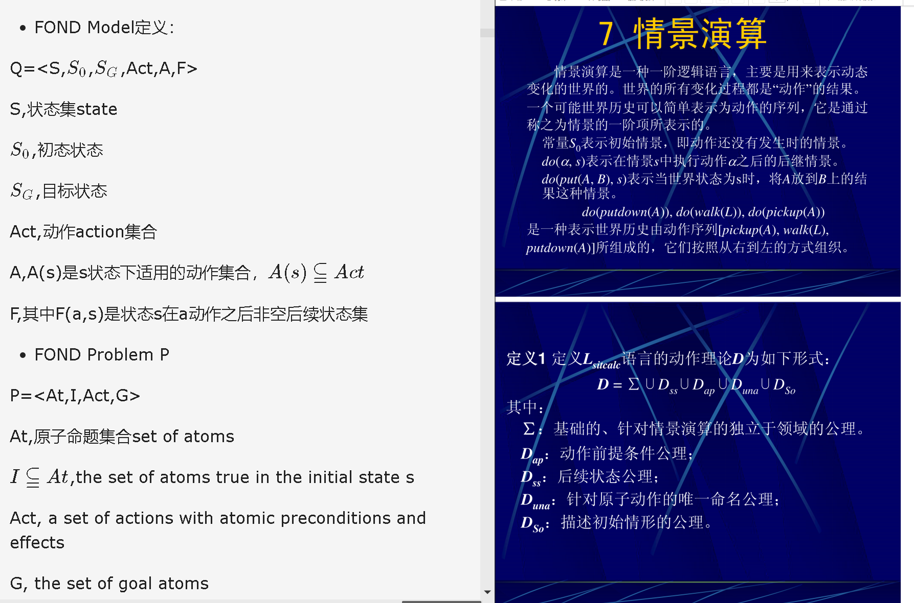
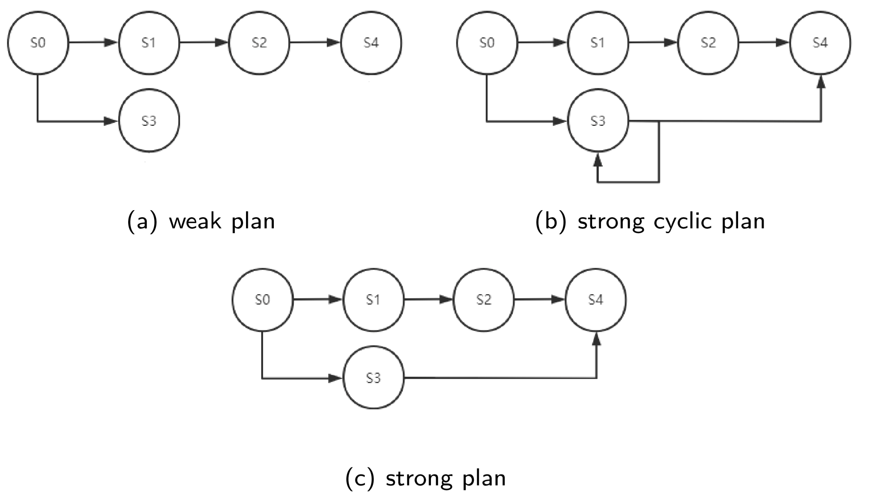
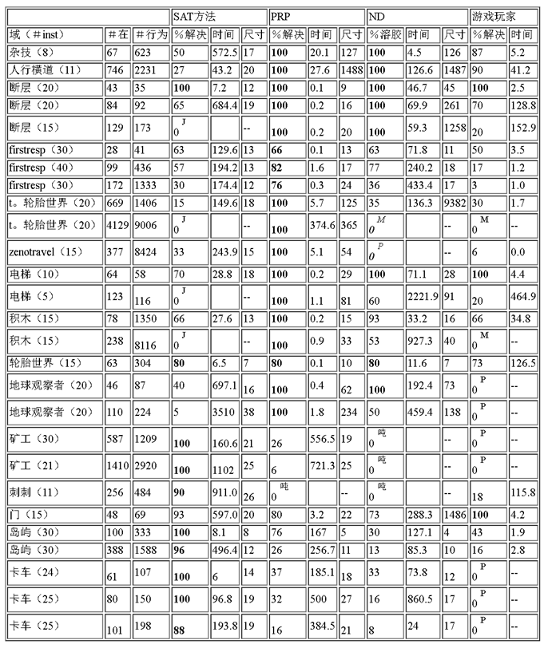
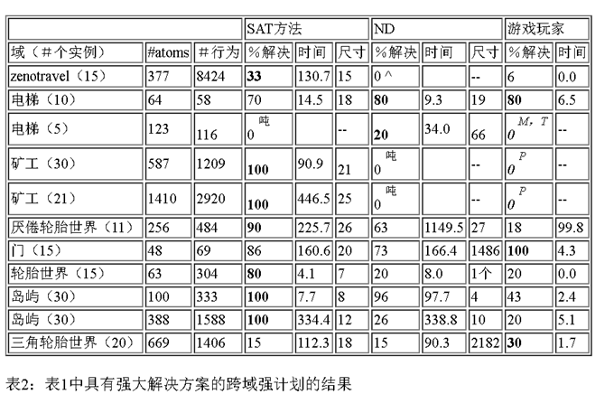

[TOC]

# begin

[paperswithcode代码](https://paperswithcode.com/paper/compact-policies-for-fully-observable-non#)

[在线版本](https://www.groundai.com/project/compact-policies-for-fully-observable-non-deterministic-planning-as-sat/1)

完全可观测的非确定性（FOND）计划作为一种计算概率性计划，LTL计划中的扩展时间计划和总体计划通用化计划中的适当策略的方法，变得越来越重要。
在这项工作中，引入了用于FOND规划的SAT编码，该编码紧凑并且可以产生紧凑的Strong Cyclic Policy。还引入了编码的简单变化，以用于Strong Plan以及所谓的dual FOND Plan，在这种计划中，某些不确定性行为被认为是fair（例如，概率性的），而其他不确定性的行为被认为是unfair（例如，对抗性的）。结果，FOND-SAT solver与现有solvers进行比较,以更全面地了解当前FOND规划人员和拟议的SAT方法的优势和局限性。

通用规划问题：初始状态待定不确定，寻找到达目标的动作序列 
<X变量集合,L文字,I初态文字集合,G目标态,O动作>

->量化规划问题

->定性数值规划问题QNP（可判定问题）

例子：

int格点爬行 

$\epsilon$增量爬行

扫雪算法

QNP $\Leftrightarrow$ FOND

*1Qualitative Numeric Planning Reductions and Complexity*

# FOND

定义：

Q=<F,I,O,G>

F：set of propositional variables. F是命题变量集合

I： set of F-literals representing the initial situation代表初态的F-文字 集合

O：a set of actions动作 α with preconditions前提条件/状态 Pre(α) and non-deterministic effects非确定性影响（用F文字表出） Eff1(α) | · · · | Effn(α) given by sets of F-literals.

G ：a set of F-literals representing the goal situation.目标状态

* 命题变量和其否定称文字

------------------------

---------

* FOND Model定义：

Q=<S,$S_0$,$S_G$,Act,A,F>

S,状态集state 

$S_0$,初态状态

$S_G$,目标状态

Act,动作action集合

A,A(s)是s状态下适用的动作集合，$A(s)\subseteqq Act$

F,其中F(a,s)是状态s在a动作之后非空后续状态集

* FOND Problem P

P=<At,I,Act,G>

At,原子命题集合set of atoms

$I\subseteqq At$,the set of atoms true in the initial state s

Act, a set of actions with atomic preconditions and effects

G, the set of goal atoms

**strong cyclic solution**

 A policy $\pi$ is a strong solution for P if the complete state trajectories induced by $\pi$ are all goal reaching, and it is a strong cyclic solution for P if the complete state trajectories induced by $\pi$ that are **fair** are all goal reaching. 
 
 Strong and strong cyclic solutions are also called strong and strong cyclic policies for P respectively.

# QNP
models S(Q):

S(Q)=<S状态,$S_o$初态 ,Act动作 ,A,F,$S_G$目标态>

A(s)指pre(a)在S状态中为真，在状态s时可应用动作A集

转移函数F,其中F(a,s)是状态s在a动作之后非空后续状态集

Q = ⟨F, V, I, O, G⟩ where 

⋄ F is a set of propositional variables. 

⋄ V is a set of non-negative numerical variables. 

⋄ I is a set of F-literals and V-literals representing the initial situation. 

⋄ G is a set of F-literals and V-literals representing the goal situation.

⋄ O is a set of actions α with preconditions Pre(α), propositional effects Eff(α) and numerical effects N(α).

⋄ Pre(α) is a set of F-literals and V-literals; Eff(α) is a set of F-literals; N(α) only contains special atoms of Inc(x) and Dec(x) for x ∈ V.

Q =⟨F，V，I，O，G⟩其中⟩F是一组命题变量。 

⋄V是一组非负数值变量。 

⋄I是代表初始情况的F文字和V文字的集合。 

⋄G是代表目标情况的F文字和V文字的集合。 

⋄O是具有前提条件Pre（α），命题效应Eff（α）和数值效应N（α）的一组动作α。 

⋄Pre（α）是F字和V字的集合； Eff（α）是一组F素体；
对于x∈V，N（α）仅包含Inc（x）和Dec（x）的特殊原子。

# FOND求解
定义：

Q=<F,I,O,G>

F：set of propositional variables. F是命题变量集合

I： set of F-literals representing the initial situation代表初态的F-文字 集合

O：a set of actions动作 α with preconditions前提条件/状态 Pre(α) and non-deterministic effects非确定性影响 Eff1(α) | · · · | Effn(α) given by sets of F-literals.

G ：a set of F-literals representing the goal situation.目标状态

FOND求解方法
The methods for computing strong and strong cyclic solutions to FOND problems have been mostly based on::

> OBDDs (Cimatti et al. 2003; Kissmann and Edelkamp 2009), 
> 
>explicit forms of AND/OR search (Mattmuller et al. 2010; Ramirez and Sardina 2014), 
>
>and classical planners (Kuter et al. 2008; Fu et al. 2011; Muise, Mcllraith, and Beck 2012).

Some of the planners compute **compact policies** in the sense that the size of the policies, measured by their representation, can be exponentially smaller than the number of states reachable with the policy. This is crucial in some benchmark domains where the number of states reachable in the solution is exponential in the problem size.

FOND求解器There are some good FOND planners available, including ：
>PRP (Muise, Mcllraith, & Beck, 2012), based on classical planners, 

>MyND (Bercher & Mattmiiller, 2009), based on heuristic AND/OR search, 

>**FOND-SAT** (Geffner & Geffner, 2018), based on a reduction to SAT.

FOND 规约$\rightarrow$ SAT(miniSAT,Z3 Solver)

>O：a set of actions动作 α with preconditions前提条件/状态 Pre(α) and non-deterministic effects非确定性影响 Eff1(α) | · · · | Effn(α) given by sets of F-literals.
基于一种等效转换：

a non-deterministic action a with effect oneof(E1,...,En) can be regarded as a set of deterministic actions b1, ..., bn with effects E1, ..., En respectively, written as a = {b1,...,bn}, all sharing the same preconditions of a.

The application of a results in the application of one of the actions bi chosen non-
deterministically.

进而先解释deterministic relaxation:

>The (all-outcome) deterministic relaxation of a FOND problem P is obtained by replacing each non-deterministic action a = {b1,...,bn} by the set of deterministic actions
bi ∈ a.

等效的：Any strong cyclic plan for P can be expressed as a partial mapping of
states into plans for the relaxation.

## Classical Replanning for FOND Planning

For a given FOND problem P,complete classical replanners yield strong cyclic policies that solve P by 
computing a partial function p mapping non-goal states s into classical plans p(s) for the **deterministic relaxation** of P with initial state s. 

给定 FOND problem P, 解决P的 “完整的经典强规划策略 ”是通过计算:问题P的确定性松弛问题的初态s条件下，非目标状态s $\mapsto$ 经典规划p(s) partial function p

We write p(s) = b,p to denote a plan for s in the relaxation that starts with the action b followed by the action sequence p.用p(s) = b,p 表示松弛问题下，状态s施加动作b的后续动作序列P 的一个plan

### 确保strong cyclic policy的条件
The following conditions ensure that the partial function ρ encodes a strong cyclic policy for P (Geffner and
Bonet 2013):

1. Init: ρ(s0) = ⊥, 
2. Consistency: If ρ(s)= b, ρ and s = f(b, s), ρ(s)= ρ,
3. Closure: If ρ(s)= b, ρ, ∀ s ∈ F(b, s), ρ(s) = ⊥.

In these conditions, f(b, s) denotes the single next state for actions b in the relaxation, while F(b, s) denotes the set of possible successor states for actions in the original prob-
lem P, with F(b, s) thus set to F(a, s) when b ∈ a.小f表示单一确定后续状态，大F表示可能后续状态集

A policy is closed if it returns an action for every non-goal state a policy reaches and a state s is said to be reachable by a policy if there is a chance that following the policy leads the agent to s. When the agent executes an action the effect is randomly chosen, so a closed policy must handle every possible outcome of an action it returns. There are three types of plans for a FOND problem (Daniele, Traverso, and Vardi 2000): weak, strong, and strong cyclic. 如果策略为每个到达策略的非目标状态返回一个动作，并且如果有可能遵循该策略将代理引导至s，则状态s被策略可到达，则该策略将被关闭。
当代理执行动作时，效果是随机选择的，因此封闭策略必须处理其返回的动作的所有可能结果。 
FOND问题有三种计划（Daniele，Traverso和Vardi 2000）：弱循环，强循环和强循环。

- Definition 1 (Weak Plan). A weak plan is a policy that achieves the goal with non-zero probability. A weak plan may be as simple as a sequence of actions that achieves the goal with assumed non-deterministic action outcomes. The policy for a weak plan need not be closed. 弱计划是一种以非零概率实现目标的策略。薄弱的计划可能与一系列行动一样简单，这些行动以假定的不确定性行动结果来实现目标。计划薄弱的政策不必关闭。
- Definition 2 (Strong Plan). A strong plan is a closed policy that achieves the goal and never visits the same state twice. A strong plan provides a guarantee on the maximum number of steps to achieve the goal but is often too restrictive. 强有力的计划是一项封闭的政策，可以实现目标，并且永远不会两次访问同一州。强有力的计划可以保证达到目标的最大步骤数，但往往过于严格。
- Definition 3 (Strong Cyclic Plan). A strong cyclic plan is a closed policy that achieves the goal and every reachable state can reach the goal using the policy. A strong cyclic plan guarantees that the agent eventually reaches the goal, but does not guarantee the agent can do so in a fixed number of steps. 强大的循环计划是一种封闭的策略，可以实现目标，并且每个可达到的状态都可以使用该策略达到目标。强有力的周期性计划可以确保代理最终达到目标，但不能保证代理可以按照固定的步骤进行操作。

## 解决过程中PRP典型例子
- 没deadend 状态时，过程单调结束或者根据迭代数值边界终止 策略
 In a problem with no deadend states, the process finishes monotonically in a number of iterations and classical planner calls that is bounded by the number of states that are reachable with the policy.
 
 PRP uses **regression** to reduce this number, resulting in policies that map partial states into actions and may have an exponentially smaller size. 
 这里regression回归 方法不太懂具体指什么，PRP,导致samller size。同时PRP还使用inferring and generalizing在一观察后就排除特定cases中一些weak plan
 
 - 有deadend时，类似回溯，搜索进程restart匹配更多“动作-状态对”，排除之前每次失败的p(觉得是关闭那个失败的映射方式，比如bi)
 In the presence of deadends, the computation in PRP is similar but the process is restarted from scratch with more action-state pairs excluded each time that the classical planner fails to
find a plan and close the function ρ. 

## Challenges in FOND
**Problem Size.** The size of the state space *M (P)* for a FOND problem *P* is exponential in the number of problem atoms.

**Policy Size.** Many FOND problems have solutions of exponential size.

**Robust Non-Determinism.** 
There is indeed no need to take non-determinism into account when reasoning about the “future” in complete replanners when the failure to do
so translates into a small number ofbacktracks

不需要考虑不确定性,因为只会导致少量回溯。

实际上时间花销最大的是“回溯的次数太多”

忽略后时间花销有界，The computational cost of reasoning about the future while ignoring non-determinism can be bounded. 

let $L_π(P)$ refer to the length of the shortest possible execution that reaches the goal of P from its initial state following a policy π that solves P, 可行解，这里shortest不是指最优解，指的是cyclic是不转圈的最短值

and let $L_m(P)$ be the mini-mum $L_π(P)$ over all such policies π.最优解$L_m(P)$其实就是下界

任何比$L_m(P)$ 还要小的路径都要检索后抛弃，这种称为“misleading plans”误导性规划

对比“non-classical approches”“flat method”来说
>classical replanners will tend to break on problems that have an exponential number of misleading plans

经典方法回溯必备花销就在这些误导性规划

我们将处理指数级误导性规划的问题的能力称为robust nondeterminism。
鉴于PRP这样的经典重新规划者具有传播和泛化死胡同的能力，因此它们并不一定要逐一生成和丢弃每个误导性较弱的规划。
但是，就PRP而言，此组件的详细信息还不够详细(估计是作者没彻底搞定PRP源码什么的)，并且从观察到的行为（请参见下文）中，这很可能是一种启发式且有限的方式。
不依赖于经典规划器，而是利用从确定性松弛中获得的启发式方法的方法可能会面临类似的局限性。

# 本文方法：SAT Approach to FOND Planning

We provide a SAT approach to FOND planning that is based on CNF encodings that are polynomial in the number of atoms and actions.

It borrows elements from both

>the SAT approach to classical planning (Kautz and Selman 1996) 
>
>and
>
>previous SAT approaches to FOND and Goal POMDPs (Baral, Eiter, and Zhao 2005; Chatterjee, Chmelik, and Davies 2016) that have CNF encodings that are polynomial in the number of states and hence exponential in the number of atoms. 

Our approach, on the other hand, relies on compact, polynomial encodings, and may result in compact policies too,

i.e., policy representations that are polynomial while reaching an exponential number of states.

While the SAT approach to classical planning relies on atoms and actions that are indexed by time,对比经典规划中SAT方法依赖“时间索引的原子命题和动作” bounded by a given horizon给定范围为界, the proposed SAT approach to FOND planning relies on atoms and actions indexed by controller states or nodes n, 本文提出的“SAT approach to FOND planning ”依赖于“控制节点索引的原子命题和动作”whose number is bounded by a given parameter k that is increased until a solution is found.其中控制节点的数字受到给定参数k限制，k被增加知道找到问题解。

Each controller node n stands for a partial state,每个控制节点n代表部分状态 and there are two special nodes: the initial node n0 where executions start, and the goal node nG where executions end.初态和终态特殊 

The encoding only features deterministic actions b因为仅支持确定性编码, so that non-deterministic actions a ={b1,...,bn} are encoded through the determinis-tic siblings bi.转换为同级结点

The atoms (n, b) express that b is one of the (deterministic) actions to be applied in the controller node n, 
原子命题（n,b）表示b是a={b1,b2,...,bn}中一个确定性动作应用到结点n

and constraints (n, b) → (n, b') and (n, b) →¬(n, b'') express that all and only siblings b' of b apply in n when b applies. 

约束 (n, b) → (n, b') and (n, b) →¬(n, b'') 表示：当b应用时，所有且仅有b的同级结点b'应用到控制节点n上。

If b is a deterministic action in the problem, it has no siblings. 当b本身确定性动作，没有同级结点。

The atoms (n, b, n') express that b is applied in node n and the control passes to node n'. 原子命题(n, b, n')表示b应用到控制结点n并且 控制权 移交控制节点n'

Below we will see how to get a strong cyclic policy from these atoms.

For obtaining compact policies in this STRIPS nondeterministic<!-- STRIPS 编程语言？-->setting where goals and action precondition are positive atoms (no negation), we propagate negative information forward and positive information backwards. 为了在目标和行动前提是正原子（无否定）的这种STRIPS编程语言非确定性环境中获得紧凑型策略，我们前向传播负信息后向传播正信息

So, for example, the encoding doesn’t force p to be true in n' when p is added by action b and (n, b, n') is true. 当p通过动作b和（n,b,b'）赋值真的时候，编码不把n'中p强制赋值为真

Yet if there are executions from n' where p is relevant and required, p will be forced to be true in n'. 
当执行p相关且required的n'被执行时，n'中的p强制赋值为真

On the other hand, if q is false in n and not added by b, q(n') is forced to be false.
若n中q为假且没被动作b加入，q(n')赋值为假。

## 基础编码

把“FOND 问题P的原子命题及其子句”和正整数参数k，写成：C(P,k)。k提供除$n_0$ and $n_G$ 外控制节点的数字边界。

We present first the atoms and clauses of the 合取范式 CNF formula C(P, k) for a FOND problem P and a positive integer parameter k that provides the bound on the number of controller nodes (different than n0 and nG). Non-deterministic actions a = {b1,...,bn} in P are encoded through the siblings bi. 
非确定性动作 a = {b1,...,bn} 编码为同级结点确定性动作$b_i$,
For deterministic actions a in P, a = {b1}. 

The atoms in C(P, k) are:合取范式中的原子命题包括；

*  p(n): atom p true in controller state n, 
*  (n, b): deterministic action b applied in controller state n, 
* (n, b, n'): n' is next after applying b in n, 
* ReachI(n): there is path from $n_0$ to n in policy,
* ReachG(n, j): ∃ path from n to $n_G$ with at most j steps.

The number of atoms is quadratic in the number of controller states原子命题数是控制状态数的平方; this is different than the number of atoms in the SAT encoding of classical planning that is linear in the horizon. 不同于经典规划中SAT编码的线性水平

The clauses in C(P, k) are given by the following formulas以下公式是生成子句的公式：

其中通过这些东西来限定当前要解决的问题P：原子命题集合，s0初态真值的原子命题，前提状态+非确定性影响$\mapsto$动作集合、目标集where P is given by a set of atoms, the set of atoms true in the initial state s0, a set of actions with preconditions and
non-deterministic effects, and the set of goals G:

1. ¬p(n0) if p $\notin$ s0 ; negative info in s0 
2. p(nG) if p ∈ G ; goal 
3. (n, b) → p(n) if p ∈ prec(b); preconditions 
4. (n, b) → (n, b') if b and b' are siblings 
5. (n, b) →¬(n, b') if b and b' not siblings
6. (n, b) ⇐⇒$\bigvee_{n'}$(n, b, n'); some next controller state
7. (n, b, n') ∧¬p(n) →¬p(n') if p $\notin$ add(b); fwd prop. 
8. (n, b, n') →¬p(n') if p∈del(b); fwd prop. neg. info
9. $ReachI(n_0)$; reachability from $n_0$
10. (n, b, n') ∧ $ReachI(n)$→ $ReachI(n')$
11. ReachG(nG,j), j =0,...,k, reach $n_G$ in ≤ j steps 
12. ¬ReachG(n, 0) for all $n \neq n_G$
13. ReachG(n, j+1) ⇐⇒$\bigvee_{b,n'}$b,n' [(n, b, n')∧ReachG(n',j)]
14. ReachG(n, j) → ReachG(n, j+1)
15. ReachI(n) → ReachG(n, k):if $n_0$ reaches n, n reaches $n_G$.

The control nodes `n` form a labeled graph where the labels are the deterministic actions b, b ∈ a, for a in P. 
控制节点n形成带标签的图，其中标签是P中a的确定性动作b，b∈a。

A control node n represents a partial state comprised of the true atoms p(n).控制节点n表示由真实原子p（n）组成的部分状态。

Goals are true in $n_G$ and preconditions of actions applied in n are true in n. 目标在nG中是正确的，在n中应用动作的前提在n中是正确的。

Negative information flows forward along the edges, while positive information flows backward, so that multiple system states will be associated with the same controller node in an execution.负信息沿边缘向前流动，而正信息向后流动，因此在执行过程中，多个系统状态将与同一控制器节点关联。 

The ReachI clauses capture reachability from n0, while ReachG clauses capture reachability to $n_G$ in a bounded number of steps. 
ReachI子句从n0捕获可达性，而ReachG子句以有限的步数捕获到nG的可达性。

The last clause states that any controller state n reachable from n0, must reach the goal node $n_G$.
最后一个子句指出，从n0可到达的任何控制器状态n必须到达目标节点nG。

**Formula 13 is key for strong cyclic planning**: it says that the goal is reachable from n in at most j +1 steps iff the goal is reachable in at most j steps from one of its successors n'.
公式13是进行强有力的周期性规划的关键：它说，如果目标可以从其继任者n的最多j步之内达到，则目标最多可以在j +1步之内达到。

For strong planning, we will change this formula so that the goal is reachable from n in at most j +1 steps iff the goal is reachable in at most j steps from all successors n'. 
我们将更改此公式，以使目标最多可以在n个j +1步之内从n达到，前提是该目标可以从所有后继n'进行的最大j步之内可以实现。

**For computing policies for a FOND problem P,a SAT-solver is called over C(P, k) where k stands for the number of controller nodes n.**

Starting with k =1 this bound is increased by 1 until the formula is satisfiable. 参数k初值1步长1增加

**A solution policy can then be obtained from the satisfying truth assignment as indicated below.** 从SAT问题中满足赋值方式中找到强循环解决方法

If the formula C(P, k) is unsatisfiable for k = |S|, then P has no strong cyclic solution.合取公式C(P,K)如果对于“ k = |S|”是不可满足的,那么FOND问题没有强循环解

## 策略
A satisfying assignment σ of the formula C(P, k) defines a policy πσ that is a function from controller states n into actions of P.
公式C（P，k）的可满足的赋值σ定义了策略$π_σ$，它是从控制器状态n映射到P的动作的函数。

If the atom (n, b, n') is true in σ, $π_σ$(n)= b if b is a deterministic action in P and $π_σ$(n)= a if b ∈ a for a non-deterministic action a in P. 如果原子命题（n，b，n'）在σ中为真，则如果b是P中的确定性行为，则$π_σ$（n）= b，如果b∈a是P中的不确定性动作a，则$π_σ$（n）= a 

For applying the compact policy πσ, however, it is necessary to keep track of the controller state.记录控制器状态的轨迹

For this, it is convenient to consider a second policy π'σ determined by σ,this one being a standard mapping of states into actions over an extended FOND $P_σ$ that denotes a FOND model Mσ.考虑σ确定的第二种策略π'σ, 这策略在扩展FOND $P_σ$标准状态映射为动作.

In this (cross-product) model, the states are pairs<n, s> of controller and system states, the initial state is<n0,s0>, the goal states are $n_G$,s  for s ∈ S, and the set $A_σ$(<n, s>) of actions applicable in<n, s> is restricted to the singleton set containing the action a = $π_σ$(n) for the compact policy $π_σ$ above. 在此（叉积）模型中，状态为控制器状态和系统状态对，初始状态为，目标状态为$ n_G $，s∈S，并且
对于上述紧缩策略$π_σ$，适用于的动作的集合$A_σ$（）限于包含动作a = $π_σ$（n）的单例集。

The transition function Fσ(a,<n, s>) results in the pairs<n',s'> where s∈ F(a, s) and n' is the unique controller state for which 

a) the atom (n, a, n') is true in σ when a is deterministic, 

or b) the atom (n, b, n') is true in σ for b ∈ a with s' being the unique successor of b in s otherwise.

In the extended FOND Pσ there is a just one policy, denoted as $π'_σ$ that over the reachable pairs<n, s>selects the noted as πonly applicable action $π_σ$(n)

We say that the compact policy $π_σ$ is a strong cyclic (resp. strong) policy for P iff  π is a strong cyclic (resp. strong) policy for $P_σ$.
我们说紧凑策略$π_σ$是对P的强循环（相对强）策略，当且仅当,π对于$P_σ$是对循环的强（相对强）策略。

## 性质
文中分别证明

1. 健壮可靠性sound。If σ is a satisfying assignment for C(P, k), the compact policy π σ is a strongly cyclic solution for P.如果σ是C（P，k）的满意分配，紧致策略$π_σ$是P的强循环解

2. 完全性completeness。Let π be a strong cyclic policy for P and let $N_π(P)$ represent the number of different π reduced states. Then if k ≥ $N_π(P)$, there is an assignment σ that satisfies C(P, k) and $π_σ$ is a compact strong cyclic policy for P.令π为P的强循环策略，令$N_π（P）$表示不同的π规约的状态的数量。
然后，如果k≥$N_π（P）$，则存在一个满足C（P，k）的赋值σ，而$π_σ$是P的紧凑型强循环策略。

3. 紧性(Compactness).The size of the policy $π_σ$ for a truth assignment σ satisfying C(P, k) can be exponentially smaller than the number of states reachable by $π_σ$.
满足C（P，k）的真值分配σ的策略$π_σ$的大小可指数级小于$π_σ$可达的状态数。

## Optimizations

We introduced simple extensions and modifications to the SAT encoding to make it more efficient and scalable while maintaining its formal properties.我们对SAT编码进行了简单的扩展和修改，以使其在保持其正式属性的同时更加有效和可扩展。

The actual encodings used in the experiments feature extra variables (n, n') that are true iff (n, b, n') is true for some action b. 实际上实验中使用的实际编码的特征是：额外变量（n，n'）为真，当且仅当，（n，b，n'）对于某些动作b为真。

Also, since the number of variables (n, b, n') grows quadratically with the number of control nodes, we substitute them by variables (n,B, n') where B is the action name for action b without the arguments. 同样，由于变量（n，b，n'）的数量与控制节点的数量成平方增长，因此我们用变量（n，B，n'）代替它们，其中B是不带参数的动作b的动作名称。

It is assumed that siblings b and b' of non-deterministic actions a get different action names by the parser. 假定非确定性动作a的同级结点b和b'通过解析器获得不同的动作名称。

As a result, the conjunction (n,B, n')∧(n, b) can be used in substitution of (n, b, n'). 结果，可以使用合取式（n，B，n'）∧（n，b）代替（n，b，n'）。

Similarly, add lists of actions tend to be short, resulting in a huge number of clauses of type 7 for capturing forward propagation of negative information. 类似地，动作的添加列表往往很短，导致大量类型为7的子句用于捕获负信息的正向传播。
这些子句被替换为These clauses are replaced by这些子句被替换：

7’. (n, n') ∧¬p(n) →¬p(n') ∨ $\bigvee$ b:p∈add(b)(n, b)
7”. (n,B, n') ∧ (n, b) ∧¬p(n) →¬p(n'),

the last clause only for actions b that do not add p but have siblings that do. 最后一个子句仅适用于不加p但具有同级的b的动作b。

Finally, extra formulas are added for breaking symmetries that result from exchanges in the names (numbers) associated with different control nodes, other than n0 and nG, that result in equivalent controllers.最后，添加了额外的公式来打破对称性，这种对称性是由与不同控制节点（n0和nG除外）相关联的名称（数字）的交换所导致的，从而导致等效的控制器。

# 实验
软件获取地址：

The version of `PRP` is from 8/2017, from https://bitbucket.org/haz/deadend-and-strengthening. 

`MyND` was obtained from https://bitbucket.org/robertmattmueller/mynd, while we obtained `Gamer` from the authors of MyND.

将基于SAT的FOND求解器与现有的一些最佳规划器进行了比较。即PRP，MyND和Gamer。使用的SAT求解器是MiniSAT（Een和Sorensson 2004）。使用了以前出版物中提供的FOND域和实例，并添加了自己的新Domain。我们在下面简要解释它们。

Tireword Spiky: A modification of triangle tireworld.

Tireworld Truck: A modification ofTireworld Spiky where there are a few spiky segments. 

Islands. Two grid-like islands of size n × n each are connected by a bridge. 

Doors: Arow of n rooms one after the other connected through doors.

Miner. An agent has to retrieve a number of items that can be found in two regions.

...

表1.Results for strong cyclic planning.将涉及大小差异很大的许多实例的域划分为多行，并以百分比表示覆盖率，因为不同的行涉及不同数量的实例。每行的最佳覆盖范围以粗体显示。

总体而言，PRP做得最好，但是，为了了解各种规划者的优势和局限性，考虑问题的大小，策略的大小和不确定性的类型以及问题是新的还是旧的都是有用的。

实际上，事实证明，PRP在现有domain中是最好的，其中大多数例子早于PR出现P。

另一方面，对于新写的domain，SAT方法是最好的。

实际上，PRP可以处理非常大的问题（以原子和动作的数量来衡量），并且还可以生产具有数百甚至数千个部分或完整状态的大型控制器。在某种程度上，MyND对问题和控制器的大小增量的挑战来说，robust性强，但不能实现每次求解都是相同的结果。

另一方面，SAT方法很难扩展到需要解决具有多于30多个状态的控制器的问题，特别是如果问题规模也很大时。在经典规划中，SAT方法对于长序列规划具有类似的局限性。在我们针对FOND的SAT方法中，由于CNF编码在控制器状态的数量上是二次方的，这一限制更加复杂。

另一方面，该表显示，对于许多misleading plan的问题，SAT方法是最健壮的，例如在几个新写的domain中，在对未来进行推理时，未考虑不确定性会使“optimistic”乐天派的搜索规划在计算上不可行。

表2.Results for strong planning over domains with strong solutions in Table 

在这种情况下，现有域中的结果是混合的，其中SAT方法在其中一个域中表现最佳，而MyND和Gamer在其他两个域中表现最佳。SAT方法是新的domain最好的方法，只有一个例外，除了Doors问题中Gamer做得更好的。

# dual FOND planning
展望进一步研究方向，改进方法
A feature of the SAT approach that is not shared by either classical replanners, OBDD-planners, or explicit AND/OR search approaches like MyND and Grendel, is that in SAT, it is very simple to reason with a combination of actions that can be assumed to be fair, with actions that cannot, leading to a form of planning that is neither strong nor strong cyclic. We call this Dual FOND planning. 传统的重新规划者，OBDD-规划者或诸如MyND和Grendel之类的显式AND / OR搜索方法所不具有的SAT方法的一个特征是，在SAT中，很容易通过组合可以假定是公平的，采取了无法采取的行动，从而导致规划的形式既不强也不强。我们称此为对偶FOND规划。

Dual FOND planing is planning with a FOND problem P where some of the actions are tagged as fair, and the others unfair. For example, consider a problem featuring a planning agent and an adversary, one in front of the other in the middle row of a 3 × 2 grid (two columns): the agent on the left, the adversary on the right, and the agent must reach a position on the right. The agent can move up and down non-deterministically, moving 0, 1, or 2 cells, without ever leaving the grid, he can also wait, or he can move to the opposing cell on the right if that position is empty. Every turn however, the adversary moves 0 or 1 cells, up or down. The solution to the problem is for the agent to keep moving up and down until he is at vertical distance of 2 to the opponent, then moving right. This strategy is not a strong or a strong cyclic policy, but a dual policy. 双重FOND规划正在针对FOND问题P进行规划，其中某些动作被标记为公平，而其他动作则被标记为不公平。
例如，考虑一个具有规划代理人和对手的问题，一个问题位于一个3×2网格（两列）的中间行中，另一个在前面：左边的代理人，右边的对手，以及代理人必须到达右边的位置。
代理可以不确定地上下移动，移动0、1或2个像元，而不必离开网格，他也可以等待，或者如果该位置为空，则可以移动到右侧的相对像元。
但是，对手每回合都会向上或向下移动0或1个像元。
解决该问题的方法是使代理继续上下移动，直到他与对手的垂直距离为2，然后再向右移动。
此策略不是强力或强力的周期性策略，而是双重策略。

A state trajectory τ is fair for a Dual FOND problem P and a policy π when infinite occurrences of a state s in τ, where a = π(s) is a fair action, implies infinite occurrences of transitions s, s in τ for each successor s ∈ F(a, s). A solution to a Dual FOND problem P is a policy π such that all the fair trajectories induced by π are goal reaching. Strong cyclic and strong planning are special cases of Dual FOND planning when all or none of the actions are fair. A sound and complete SAT formulation of Dual FOND planning is obtained by introducing the atoms (n, fair) that are true if the action chosen in n is fair,当τ中状态s的无限出现时，其中a =π（s）是一个公平动作，则状态轨迹τ对偶FOND问题P和策略π是公平的，这意味着对于每个后继者s∈F（a，s）。对偶FOND问题P的解决方案是策略π，使得π引起的所有公平轨道都达到目标。
当所有动作或所有动作都不公平时，强有力的周期性规划和强有力的规划是Dual FOND规划的特例。
如果在n中选择的动作是公平的，则通过引入正确的原子（n，公平），可以获得对双重FOND规划的合理完整的SAT公式，

16.(n, fair) ⇐⇒$\bigvee_b$(n, b), b among fair action

17. ¬(n, fair) ⇐⇒$\bigvee_b$(n, b), b among unfair actions

and replacing 13 and 13’ by: 

13”. [(n, fair) → 13] ∧ [¬(n, fair) → 13’]

where 13 and 13’ are the formulas above for strong cylic and strong planning. The above encoding captures dual FOND planning in the same way that the first encoding captures strong cyclic planning. 上面的编码捕获双重FOND规划的方式与第一种编码捕获强循环规划的方式相同。

We have run some experiments for dual planning, using the example above where the two agents move over a n × 2 grid. We tried values of n up to 10, and the resulting dual policy is the one mentioned above, where the agent keeps moving up and down until leaving the adversary behind. Notice that strong, strong cyclic, and dual FOND planning result from simple changes in the clauses. This flexibility is a strength of the SAT approach that is not available in other approaches that require different algorithms in each case.我们使用上面的示例运行了一些双重规划实验，其中两个代理在n×2网格上移动。
我们尝试将n的值提高到10，结果是双重策略就是上面提到的策略，在该策略中，代理不断上下移动，直到将对手抛在后面。
注意，强，强循环和双重FOND规划是由子句中的简单更改导致的。
这种灵活性是SAT方法的优势，而在其他方法下，每种情况下都需要使用不同算法的方法中，SAT方法不需要。

# 全文结论

We have introduced the first SAT formulation for FOND planning that is compact and can produce compact policies. Small changes in the formulation account for strong, strong cyclic, and a combined form of strong and strong cyclic planning, that we call dual FOND planning, where some actions are assumed fair and the others unfair. From a computational point of view, the SAT approach performs well in problems that are not too large and that do not require large controllers, where it is not affected by the presence of a large number of misleading plans. Classical replanners like PRP and explicit AND/OR search planners like MyND can scale up to larger problems or problems with larger controllers respectively, but do not appear to be as robust to non-determinism.

我们为FOND规划引入了第一个SAT公式，该公式紧凑并且可以产生紧凑的策略。
公式的微小变化说明了强有力的循环规划以及强有力的循环规划的组合形式，我们将其称为Dual FOND规划，其中某些行动被认为是fair，而其他行动则被认为是unfair。
从计算的角度来看，SAT方法在不太大且不需要大型控制器的问题中表现良好，并且不受大量误导性规划的影响。
诸如PRP之类的经典重新规划器和诸如MyND之类的显式AND / OR搜索规划器可以分别扩展到更大的问题或更大的控制器的问题，但似乎对不确定性不那么稳健。
