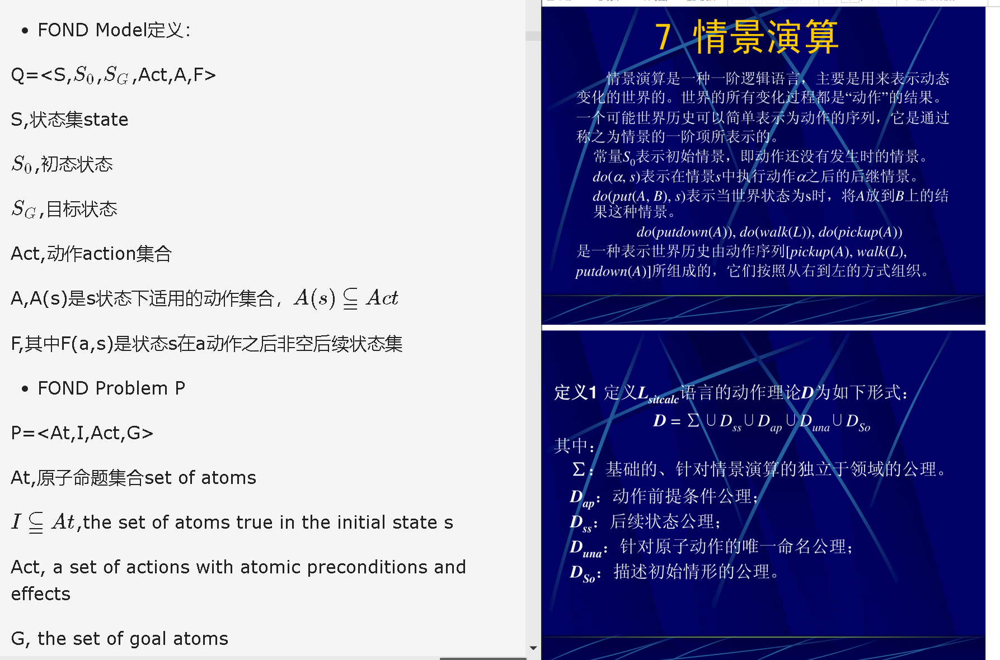
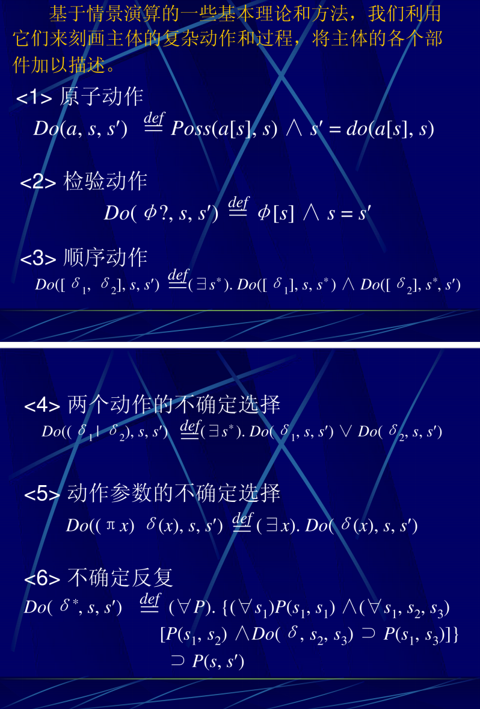
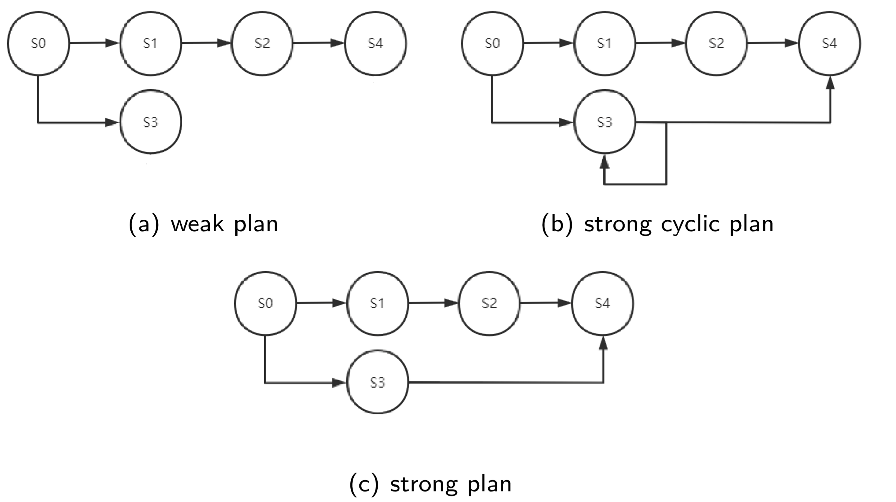
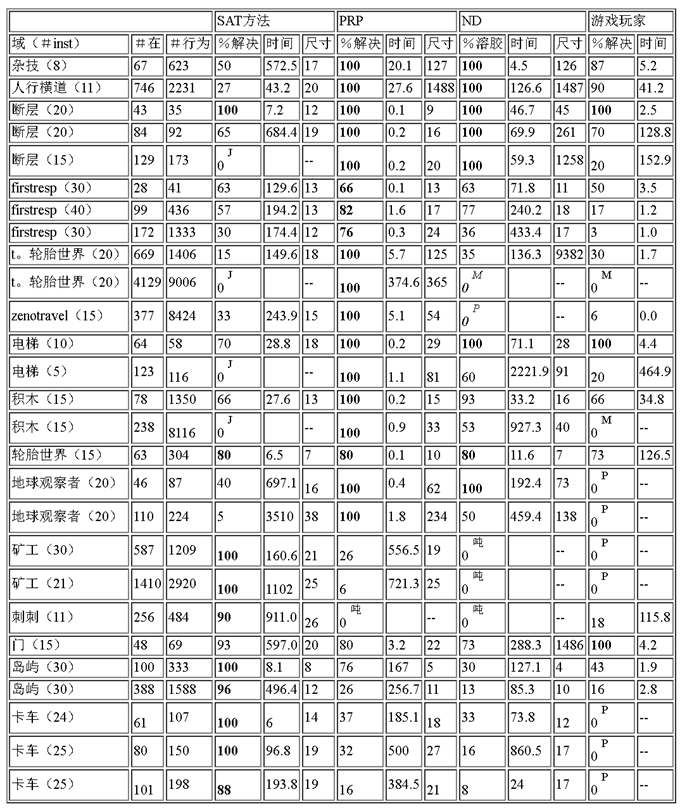
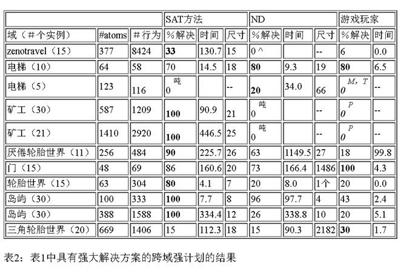

[TOC]

# FOND
## begin

[paperswithcode代码](https://paperswithcode.com/paper/compact-policies-for-fully-observable-non#)

[在线版本](https://www.groundai.com/project/compact-policies-for-fully-observable-non-deterministic-planning-as-sat/1)

完全可观测非确定性（FOND）规划作为一种计算概率性规划、LTL 规划中的扩展时间规划以及总体通用化规划中适当策略的方法，其重要性日益凸显。
本文引入了面向 FOND 规划的 SAT 编码方案，该方案不仅自身紧凑，而且能够生成紧凑的强循环策略（Strong Cyclic Policy）。此外，本文还引入了编码方案的简单变体，分别用于强规划（Strong Plan）以及所谓的对偶 FOND 规划（Dual FOND Plan），在后一种规划中，某些不确定性行为被认为是公平的（Fair，例如概率性行为），而其他不确定性行为则被认为是不公平的（Unfair，例如对抗性行为）。基于此，本文通过将 FOND-SAT 求解器与现有求解器进行全面比较，以更深入地理解当前 FOND 规划器与所提出的 SAT 方法各自的优势与局限性。

通用规划问题：初始状态不确定且待定，需寻找从任意初始状态出发均可到达目标的动作序列。
⟨X 变量集合, L 文字, I 初态文字集合, G 目标态, O 动作⟩

→ 量化规划问题

→ 定性数值规划问题 QNP（可判定问题）

例子：

int格点爬行 

$\epsilon$增量爬行

扫雪算法

QNP $\Leftrightarrow$ FOND

*1 Qualitative Numeric Planning Reductions and Complexity*

## FOND

定义：

Q = ⟨F, I, O, G⟩

F：一组命题变量（Propositional Variables）的集合

I：一组 F-文字（F-Literals）的集合，用于表示初始状态

O：一组动作 α，每个动作包含前提条件/状态 Pre(α) 和非确定性影响 Eff₁(α) | ... | Effₙ(α)，由 F-文字集合给出

G：一组 F-文字，用于表示目标状态

* 命题变量及其否定统称为文字（Literals）

------------------------

---------

* FOND 模型的形式化定义：

M = ⟨S, S₀, S_G, Act, A, F⟩

S：状态集（States）

S₀：初始状态

S_G：目标状态

Act：动作集合

A：A(s) 是在状态 s 下适用的动作集合，满足 A(s) ⊆ Act

F：转移函数，F(a, s) 是状态 s 在执行动作 a 之后的非空后续状态集合

* FOND 问题 P

P = ⟨At, I, Act, G⟩

At：原子命题（Atoms）集合

I ⊆ At：在初始状态 s 中为真的原子命题集合

Act：一组具有原子前提条件和效果的动

G：目标原子命题集合

**强循环解（Strong Cyclic Solution）**

策略 π 是 P 的强解（Strong Solution），当且仅当 π 所诱导的所有完整状态轨迹均能到达目标；策略 π 是 P 的强循环解（Strong Cyclic Solution），当且仅当 π 所诱导的 **公平**（Fair）完整状态轨迹均能到达目标。

强解与强循环解也分别称为 P 的强策略与强循环策略。

## QNP
models S(Q):

S(Q)=<S状态,$S_o$初态 ,Act动作 ,A,F,$S_G$目标态>

A(s)指pre(a)在S状态中为真，在状态s时可应用动作A集

转移函数F,其中F(a,s)是状态s在a动作之后非空后续状态集

Q = ⟨F, V, I, O, G⟩ 其中

⋄ F 是一组命题变量（Propositional Variables）。

⋄ V 是一组非负数值变量（Non-negative Numerical Variables）。

⋄ I 是代表初始情形（Initial Situation）的 F-文字和 V-文字集合。

⋄ G 是代表目标情形（Goal Situation）的 F-文字和 V-文字集合。

⋄ O 是一组动作 α，每个动作包含前提条件 Pre(α)、命题效果 Eff(α) 和数值效果 N(α)。

⋄ Pre(α) 是 F-文字和 V-文字的集合；Eff(α) 是 F-文字的集合；N(α) 仅包含 Inc(x) 和 Dec(x) 这样的特殊原子，其中 x ∈ V。

Q = ⟨F, V, I, O, G⟩ 其中

⋄ F 是一组命题变量。

⋄ V 是一组非负数值变量。

⋄ I 是代表初始情形的 F-文字和 V-文字集合。

⋄ G 是代表目标情形的 F-文字和 V-文字集合。

⋄ O 是一组动作 α，每个动作包含前提条件 Pre(α)、命题效果 Eff(α) 和数值效果 N(α)。

⋄ Pre(α) 是 F-文字和 V-文字的集合；Eff(α) 是 F-文字的集合；
对于 x ∈ V，N(α) 仅包含 Inc(x) 和 Dec(x) 这样的特殊原子。

## FOND求解
定义：

Q=<F,I,O,G>

F：set of propositional variables. F是命题变量集合

I： set of F-literals representing the initial situation代表初态的F-文字 集合

O：a set of actions动作 α with preconditions前提条件/状态 Pre(α) and non-deterministic effects非确定性影响 Eff1(α) | · · · | Effn(α) given by sets of F-literals.

G ：a set of F-literals representing the goal situation.目标状态

FOND 求解方法

计算 FOND 问题的强解与强循环解的方法主要基于以下三类技术：

> OBDD 方法（Cimatti et al., 2003; Kissmann & Edelkamp, 2009）
> 
> 显式的 AND/OR 搜索方法（Mattmuller et al., 2010; Ramirez & Sardina, 2014）
>
> 经典规划器方法（Kuter et al., 2008; Fu et al., 2011; Muise, McIlraith, & Beck, 2012）

其中部分规划器能够计算**紧凑型策略（Compact Policies）**，其含义是：策略的规模（以其表示大小衡量）可以指数级地小于该策略所能到达的状态数量。这一特性在某些基准测试领域中至关重要，因为在这些领域中，解所能到达的状态数量随问题规模呈指数增长。

FOND求解器There are some good FOND planners available, including ：
>PRP (Muise, Mcllraith, & Beck, 2012), based on classical planners, 

>MyND (Bercher & Mattmiiller, 2009), based on heuristic AND/OR search, 

>**FOND-SAT** (Geffner & Geffner, 2018), based on a reduction to SAT.

FOND 规约$\rightarrow$ SAT(miniSAT,Z3 Solver)

>O：a set of actions动作 α with preconditions前提条件/状态 Pre(α) and non-deterministic effects非确定性影响 Eff1(α) | · · · | Effn(α) given by sets of F-literals.
基于一种等效转换：

a non-deterministic action a with effect oneof(E1,...,En) can be regarded as a set of deterministic actions b1, ..., bn with effects E1, ..., En respectively, written as a = {b1,...,bn}, all sharing the same preconditions of a.

The application of a results in the application of one of the actions bi chosen non-
deterministically.

进而先解释deterministic relaxation:

>The (all-outcome) deterministic relaxation of a FOND problem P is obtained by replacing each non-deterministic action a = {b1,...,bn} by the set of deterministic actions
bi ∈ a.

等效的：Any strong cyclic plan for P can be expressed as a partial mapping of
states into plans for the relaxation.

### Classical Replanning for FOND Planning

For a given FOND problem P,complete classical replanners yield strong cyclic policies that solve P by 
computing a partial function p mapping non-goal states s into classical plans p(s) for the **deterministic relaxation** of P with initial state s. 

给定 FOND problem P, 解决P的 “完整的经典强规划策略 ”是通过计算:问题P的确定性松弛问题的初态s条件下，非目标状态s $\mapsto$ 经典规划p(s) partial function p

We write p(s) = b,p to denote a plan for s in the relaxation that starts with the action b followed by the action sequence p.用p(s) = b,p 表示松弛问题下，状态s施加动作b的后续动作序列P 的一个plan

#### 确保strong cyclic policy的条件
The following conditions ensure that the partial function ρ encodes a strong cyclic policy for P (Geffner and
Bonet 2013):

1. Init: ρ(s0) = ⊥, 
2. Consistency: If ρ(s)= b, ρ and s = f(b, s), ρ(s)= ρ,
3. Closure: If ρ(s)= b, ρ, ∀ s ∈ F(b, s), ρ(s) = ⊥.

In these conditions, f(b, s) denotes the single next state for actions b in the relaxation, while F(b, s) denotes the set of possible successor states for actions in the original prob-
lem P, with F(b, s) thus set to F(a, s) when b ∈ a.小f表示单一确定后续状态，大F表示可能后续状态集

如果策略为每个所到达的非目标状态返回一个动作，则称该策略是封闭的（Closed）；如果存在遵循该策略将智能体引导至状态 s 的可能性，则称状态 s 是该策略可达的（Reachable）。当智能体执行某个动作时，其效果是随机选择的，因此封闭策略必须处理其所返回动作的所有可能结果。
FOND 问题存在三种规划类型（Daniele, Traverso, & Vardi, 2000）：弱规划（Weak）、强规划（Strong）和强循环规划（Strong Cyclic）。

- 定义 1（弱规划，Weak Plan）。弱规划是一种以非零概率实现目标的策略。弱规划可以简单到仅为一个动作序列，该序列在假定的非确定性动作结果下实现目标。弱规划的策略不必是封闭的。
- 定义 2（强规划，Strong Plan）。强规划是一种封闭的策略，它能够实现目标且不会重复访问同一状态。强规划提供了达成目标的最大步数保证，但往往限制过于严格。
- 定义 3（强循环规划，Strong Cyclic Plan）。强循环规划是一种封闭的策略，它能够实现目标，且每个可达状态均可通过该策略到达目标。强循环规划保证智能体最终能够到达目标，但并不保证智能体能够在固定的步数内完成。

### PRP 求解过程中的典型示例
- 无死端（Deadend）状态时，求解过程以单调方式在若干次迭代后终止，迭代次数受策略可达状态数量的上界约束。经典规划器的调用次数不超过策略可达的状态数量。

 PRP 利用**回归（Regression）**方法减少这一数量，从而生成将部分状态映射为动作的策略，其规模可指数级地缩小。

 - 存在死端状态时，PRP 的计算过程与无死端情形类似，但求解过程会从头重新启动，且每次经典规划器无法找到规划并封闭函数 ρ 时，会排除更多的”动作-状态对”。

### FOND 面临的主要挑战
**问题规模（Problem Size）。** FOND 问题 P 的状态空间 M(P) 的大小随问题原子命题数量呈指数级增长。

**策略规模（Policy Size）。** 许多 FOND 问题的解具有指数级的规模。

**鲁棒非确定性（Robust Non-Determinism）。** 
在完全重规划器（Complete Replanner）中，当忽略非确定性只会导致少量回溯时，实际上无需在对”未来”进行推理时考虑非确定性。

计算开销的最大来源实际上是”回溯次数过多”。

忽略非确定性后，时间开销是有界的：对未来的推理过程中忽略非确定性的计算代价可以被限定上界。

令 $L_π(P)$ 表示遵循策略 π 从初始状态到达目标 P 的最短可能执行路径长度（此处”最短”并非指数值最优，而是指在循环结构中不产生绕圈的最小步数）。

并令 $L_m(P)$ 为所有可行策略 π 上 $L_π(P)$ 的最小值（即理论下界）。

任何比 $L_m(P)$ 更短的路径都会被检索并抛弃，这类规划被称为”误导性规划（Misleading Plans）”。

对比”非经典方法（Non-classical Approaches）”和”平坦方法（Flat Methods）”：
> 经典重规划器在处理包含指数级数量误导性规划的问题时往往会失效。

经典方法回溯的固有开销就存在于这些误导性规划之中。

我们将处理指数级误导性规划问题的能力称为鲁棒非确定性（Robust Nondeterminism）。
鉴于 PRP 这类经典重规划器具有传播和泛化死端（Deadend）的能力，它们并不一定要逐一生成和丢弃每个误导性较弱的规划。
但是，就 PRP 而言，该组件的详细实现细节尚不明确，并且从观察到的行为来看，这很可能是一种启发式的、有限的方法。
不依赖于经典规划器、而是利用从确定性松弛中获得的启发式信息的方法，可能会面临类似的局限性。

## 本文方法：SAT Approach to FOND Planning

We provide a SAT approach to FOND planning that is based on CNF encodings that are polynomial in the number of atoms and actions.

It borrows elements from both

>the SAT approach to classical planning (Kautz and Selman 1996) 
>
>and
>
>previous SAT approaches to FOND and Goal POMDPs (Baral, Eiter, and Zhao 2005; Chatterjee, Chmelik, and Davies 2016) that have CNF encodings that are polynomial in the number of states and hence exponential in the number of atoms. 

Our approach, on the other hand, relies on compact, polynomial encodings, and may result in compact policies too,

i.e., policy representations that are polynomial while reaching an exponential number of states.

While the SAT approach to classical planning relies on atoms and actions that are indexed by time,对比经典规划中SAT方法依赖“时间索引的原子命题和动作” bounded by a given horizon给定范围为界, the proposed SAT approach to FOND planning relies on atoms and actions indexed by controller states or nodes n, 本文提出的“SAT approach to FOND planning ”依赖于“控制节点索引的原子命题和动作”whose number is bounded by a given parameter k that is increased until a solution is found.其中控制节点的数字受到给定参数k限制，k被增加知道找到问题解。

每个控制节点 n 代表一个部分状态（Partial State），其中存在两个特殊节点：初始节点 n₀（执行起点）和目标节点 n_G（执行终点）。

该编码仅支持确定性动作 b，因此非确定性动作 a = {b₁, ..., bₙ} 通过其确定性同级动作 bᵢ 进行编码。

The atoms (n, b) express that b is one of the (deterministic) actions to be applied in the controller node n, 
原子命题（n,b）表示b是a={b1,b2,...,bn}中一个确定性动作应用到结点n

and constraints (n, b) → (n, b') and (n, b) →¬(n, b'') express that all and only siblings b' of b apply in n when b applies. 

约束 (n, b) → (n, b') and (n, b) →¬(n, b'') 表示：当b应用时，所有且仅有b的同级结点b'应用到控制节点n上。

If b is a deterministic action in the problem, it has no siblings. 当b本身确定性动作，没有同级结点。

The atoms (n, b, n') express that b is applied in node n and the control passes to node n'. 原子命题(n, b, n')表示b应用到控制结点n并且 控制权 移交控制节点n'

Below we will see how to get a strong cyclic policy from these atoms.

For obtaining compact policies in this STRIPS nondeterministic<!-- STRIPS 编程语言？-->setting where goals and action precondition are positive atoms (no negation), we propagate negative information forward and positive information backwards. 为了在目标和行动前提是正原子（无否定）的这种STRIPS编程语言非确定性环境中获得紧凑型策略，我们前向传播负信息后向传播正信息

So, for example, the encoding doesn’t force p to be true in n' when p is added by action b and (n, b, n') is true. 当p通过动作b和（n,b,b'）赋值真的时候，编码不把n'中p强制赋值为真

Yet if there are executions from n' where p is relevant and required, p will be forced to be true in n'. 
当执行p相关且required的n'被执行时，n'中的p强制赋值为真

On the other hand, if q is false in n and not added by b, q(n') is forced to be false.
若n中q为假且没被动作b加入，q(n')赋值为假。

### 基础编码

把“FOND 问题P的原子命题及其子句”和正整数参数k，写成：C(P,k)。k提供除$n_0$ and $n_G$ 外控制节点的数字边界。

We present first the atoms and clauses of the 合取范式 CNF formula C(P, k) for a FOND problem P and a positive integer parameter k that provides the bound on the number of controller nodes (different than n0 and nG). Non-deterministic actions a = {b1,...,bn} in P are encoded through the siblings bi. 
非确定性动作 a = {b1,...,bn} 编码为同级结点确定性动作$b_i$,
For deterministic actions a in P, a = {b1}. 

The atoms in C(P, k) are:合取范式中的原子命题包括；

*  p(n): atom p true in controller state n, 
*  (n, b): deterministic action b applied in controller state n, 
* (n, b, n'): n' is next after applying b in n, 
* ReachI(n): there is path from $n_0$ to n in policy,
* ReachG(n, j): ∃ path from n to $n_G$ with at most j steps.

The number of atoms is quadratic in the number of controller states原子命题数是控制状态数的平方; this is different than the number of atoms in the SAT encoding of classical planning that is linear in the horizon. 不同于经典规划中SAT编码的线性水平

The clauses in C(P, k) are given by the following formulas以下公式是生成子句的公式：

其中通过这些东西来限定当前要解决的问题P：原子命题集合，s0初态真值的原子命题，前提状态+非确定性影响$\mapsto$动作集合、目标集where P is given by a set of atoms, the set of atoms true in the initial state s0, a set of actions with preconditions and
non-deterministic effects, and the set of goals G:

1. ¬p(n0) if p $\notin$ s0 ; negative info in s0 
2. p(nG) if p ∈ G ; goal 
3. (n, b) → p(n) if p ∈ prec(b); preconditions 
4. (n, b) → (n, b') if b and b' are siblings 
5. (n, b) →¬(n, b') if b and b' not siblings
6. (n, b) ⇐⇒$\bigvee_{n'}$(n, b, n'); some next controller state
7. (n, b, n') ∧¬p(n) →¬p(n') if p $\notin$ add(b); fwd prop. 
8. (n, b, n') →¬p(n') if p∈del(b); fwd prop. neg. info
9. $ReachI(n_0)$; reachability from $n_0$
10. (n, b, n') ∧ $ReachI(n)$→ $ReachI(n')$
11. ReachG(nG,j), j =0,...,k, reach $n_G$ in ≤ j steps 
12. ¬ReachG(n, 0) for all $n \neq n_G$
13. ReachG(n, j+1) ⇐⇒$\bigvee_{b,n'}$b,n' [(n, b, n')∧ReachG(n',j)]
14. ReachG(n, j) → ReachG(n, j+1)
15. ReachI(n) → ReachG(n, k):if $n_0$ reaches n, n reaches $n_G$.

The control nodes `n` form a labeled graph where the labels are the deterministic actions b, b ∈ a, for a in P. 
控制节点n形成带标签的图，其中标签是P中a的确定性动作b，b∈a。

A control node n represents a partial state comprised of the true atoms p(n).控制节点n表示由真实原子p（n）组成的部分状态。

Goals are true in $n_G$ and preconditions of actions applied in n are true in n. 目标在nG中是正确的，在n中应用动作的前提在n中是正确的。

Negative information flows forward along the edges, while positive information flows backward, so that multiple system states will be associated with the same controller node in an execution.负信息沿边缘向前流动，而正信息向后流动，因此在执行过程中，多个系统状态将与同一控制器节点关联。 

The ReachI clauses capture reachability from n0, while ReachG clauses capture reachability to $n_G$ in a bounded number of steps. 
ReachI子句从n0捕获可达性，而ReachG子句以有限的步数捕获到nG的可达性。

The last clause states that any controller state n reachable from n0, must reach the goal node $n_G$.
最后一个子句指出，从n0可到达的任何控制器状态n必须到达目标节点nG。

**Formula 13 is key for strong cyclic planning**: it says that the goal is reachable from n in at most j +1 steps iff the goal is reachable in at most j steps from one of its successors n'.
公式13是进行强有力的周期性规划的关键：它说，如果目标可以从其继任者n的最多j步之内达到，则目标最多可以在j +1步之内达到。

For strong planning, we will change this formula so that the goal is reachable from n in at most j +1 steps iff the goal is reachable in at most j steps from all successors n'. 
我们将更改此公式，以使目标最多可以在n个j +1步之内从n达到，前提是该目标可以从所有后继n'进行的最大j步之内可以实现。

**For computing policies for a FOND problem P,a SAT-solver is called over C(P, k) where k stands for the number of controller nodes n.**

Starting with k =1 this bound is increased by 1 until the formula is satisfiable. 参数k初值1步长1增加

**A solution policy can then be obtained from the satisfying truth assignment as indicated below.** 从SAT问题中满足赋值方式中找到强循环解决方法

If the formula C(P, k) is unsatisfiable for k = |S|, then P has no strong cyclic solution.合取公式C(P,K)如果对于“ k = |S|”是不可满足的,那么FOND问题没有强循环解

### 策略
A satisfying assignment σ of the formula C(P, k) defines a policy πσ that is a function from controller states n into actions of P.
公式C（P，k）的可满足的赋值σ定义了策略$π_σ$，它是从控制器状态n映射到P的动作的函数。

If the atom (n, b, n') is true in σ, $π_σ$(n)= b if b is a deterministic action in P and $π_σ$(n)= a if b ∈ a for a non-deterministic action a in P. 如果原子命题（n，b，n'）在σ中为真，则如果b是P中的确定性行为，则$π_σ$（n）= b，如果b∈a是P中的不确定性动作a，则$π_σ$（n）= a 

然而，为了应用紧凑策略 π_σ，有必要记录控制器状态的轨迹信息。

为此，考虑由 σ 确定的第二种策略 π'_σ 是方便的，该策略是在扩展 FOND 问题 P_σ（即 FOND 模型 M_σ）上将标准状态映射为动作的函数。

In this (cross-product) model, the states are pairs<n, s> of controller and system states, the initial state is<n0,s0>, the goal states are $n_G$,s  for s ∈ S, and the set $A_σ$(<n, s>) of actions applicable in<n, s> is restricted to the singleton set containing the action a = $π_σ$(n) for the compact policy $π_σ$ above. 在此（叉积）模型中，状态为控制器状态和系统状态对，初始状态为，目标状态为$ n_G $，s∈S，并且
对于上述紧缩策略$π_σ$，适用于的动作的集合$A_σ$（）限于包含动作a = $π_σ$（n）的单例集。

The transition function Fσ(a,<n, s>) results in the pairs<n',s'> where s∈ F(a, s) and n' is the unique controller state for which 

a) the atom (n, a, n') is true in σ when a is deterministic, 

or b) the atom (n, b, n') is true in σ for b ∈ a with s' being the unique successor of b in s otherwise.

In the extended FOND Pσ there is a just one policy, denoted as $π'_σ$ that over the reachable pairs<n, s>selects the noted as πonly applicable action $π_σ$(n)

We say that the compact policy $π_σ$ is a strong cyclic (resp. strong) policy for P iff  π is a strong cyclic (resp. strong) policy for $P_σ$.
我们说紧凑策略$π_σ$是对P的强循环（相对强）策略，当且仅当,π对于$P_σ$是对循环的强（相对强）策略。

### 性质
文中分别证明

1. 健壮可靠性sound。If σ is a satisfying assignment for C(P, k), the compact policy π σ is a strongly cyclic solution for P.如果σ是C（P，k）的满意分配，紧致策略$π_σ$是P的强循环解

2. 完全性completeness。Let π be a strong cyclic policy for P and let $N_π(P)$ represent the number of different π reduced states. Then if k ≥ $N_π(P)$, there is an assignment σ that satisfies C(P, k) and $π_σ$ is a compact strong cyclic policy for P.令π为P的强循环策略，令$N_π（P）$表示不同的π规约的状态的数量。
然后，如果k≥$N_π（P）$，则存在一个满足C（P，k）的赋值σ，而$π_σ$是P的紧凑型强循环策略。

3. 紧性(Compactness).The size of the policy $π_σ$ for a truth assignment σ satisfying C(P, k) can be exponentially smaller than the number of states reachable by $π_σ$.
满足C（P，k）的真值分配σ的策略$π_σ$的大小可指数级小于$π_σ$可达的状态数。

### Optimizations

We introduced simple extensions and modifications to the SAT encoding to make it more efficient and scalable while maintaining its formal properties.我们对SAT编码进行了简单的扩展和修改，以使其在保持其正式属性的同时更加有效和可扩展。

The actual encodings used in the experiments feature extra variables (n, n') that are true iff (n, b, n') is true for some action b. 实际上实验中使用的实际编码的特征是：额外变量（n，n'）为真，当且仅当，（n，b，n'）对于某些动作b为真。

Also, since the number of variables (n, b, n') grows quadratically with the number of control nodes, we substitute them by variables (n,B, n') where B is the action name for action b without the arguments. 同样，由于变量（n，b，n'）的数量与控制节点的数量成平方增长，因此我们用变量（n，B，n'）代替它们，其中B是不带参数的动作b的动作名称。

It is assumed that siblings b and b' of non-deterministic actions a get different action names by the parser. 假定非确定性动作a的同级结点b和b'通过解析器获得不同的动作名称。

As a result, the conjunction (n,B, n')∧(n, b) can be used in substitution of (n, b, n'). 结果，可以使用合取式（n，B，n'）∧（n，b）代替（n，b，n'）。

Similarly, add lists of actions tend to be short, resulting in a huge number of clauses of type 7 for capturing forward propagation of negative information. 类似地，动作的添加列表往往很短，导致大量类型为7的子句用于捕获负信息的正向传播。
这些子句被替换为These clauses are replaced by这些子句被替换：

7’. (n, n') ∧¬p(n) →¬p(n') ∨ $\bigvee$ b:p∈add(b)(n, b)
7”. (n,B, n') ∧ (n, b) ∧¬p(n) →¬p(n'),

the last clause only for actions b that do not add p but have siblings that do. 最后一个子句仅适用于不加p但具有同级的b的动作b。

Finally, extra formulas are added for breaking symmetries that result from exchanges in the names (numbers) associated with different control nodes, other than n0 and nG, that result in equivalent controllers.最后，添加了额外的公式来打破对称性，这种对称性是由与不同控制节点（n0和nG除外）相关联的名称（数字）的交换所导致的，从而导致等效的控制器。

## 实验
软件获取地址：

The version of `PRP` is from 8/2017, from https://bitbucket.org/haz/deadend-and-strengthening. 

`MyND` was obtained from https://bitbucket.org/robertmattmueller/mynd, while we obtained `Gamer` from the authors of MyND.

将基于SAT的FOND求解器与现有的一些最佳规划器进行了比较。即PRP，MyND和Gamer。使用的SAT求解器是MiniSAT（Een和Sorensson 2004）。使用了以前出版物中提供的FOND域和实例，并添加了自己的新Domain。我们在下面简要解释它们。

Tireword Spiky: A modification of triangle tireworld.

Tireworld Truck: A modification ofTireworld Spiky where there are a few spiky segments. 

Islands. Two grid-like islands of size n × n each are connected by a bridge. 

Doors: Arow of n rooms one after the other connected through doors.

Miner. An agent has to retrieve a number of items that can be found in two regions.

...

表 1. 强循环规划（Strong Cyclic Planning）实验结果。将涉及规模差异较大的多个实例的领域划分为若干行，并以百分比形式表示覆盖率，因为不同行所涉及的实例数量不尽相同。每行的最优覆盖率以粗体标示。

总体而言，PRP 在既有领域中表现最佳。然而，为深入理解各类规划器的优势与局限性，有必要综合考虑问题规模、策略规模、非确定性类型以及领域的新旧程度等因素。

实验结果表明，PRP 在现有基准领域（其中大多数实例先于 PRP 出现）中表现最优。

另一方面，对于新构造的领域，SAT 方法则展现出最佳性能。

PRP 能够处理规模非常大的问题（以原子命题和动作的数量为度量），并且能够生成包含数百甚至数千个部分或完整状态的大型控制器。在某种程度上，MyND 在应对问题和控制器规模的增量挑战时表现出较强的鲁棒性，但其求解结果并非每次都能保持一致。

另一方面，SAT 方法在需要解决包含 30 个以上控制器状态的问题时难以有效扩展，尤其是当问题规模本身也较大时。在经典规划领域中，SAT 方法对于长序列规划同样存在类似的局限性。而在我们针对 FOND 的 SAT 方法中，由于 CNF 编码的规模与控制器状态数量呈二次方关系，这一限制变得更加突出。

此外，该表还显示，对于存在大量误导性规划（Misleading Plans）的问题，SAT 方法表现出最强的鲁棒性。例如，在几个新构造的领域中，如果在进行未来推理时未考虑非确定性，则"乐观主义"（Optimistic）搜索规划在计算上将变得不可行。

表 2. 在表 1 中具有强解的领域上进行强规划（Strong Planning）的实验结果 

在这种情况下，既有领域上的实验结果呈现混合态势：SAT 方法在其中某个领域中表现最佳，而 MyND 和 Gamer 在另外两个领域中表现最优。对于新构造的领域，SAT 方法是最优方法，但存在一个例外——在 Doors 问题中 Gamer 表现更优。

## Dual FOND 规划
研究展望与改进方向
经典重规划器、OBDD 规划器以及诸如 MyND 和 Grendel 之类的显式 AND/OR 搜索方法所不具备的 SAT 方法的一个核心特征是：在 SAT 框架中，可以非常简洁地对可假定为公平（Fair）与不可假定为公平的动作组合进行推理，从而产生一种既非强规划也非强循环规划的规划形式。我们将此称为对偶 FOND 规划（Dual FOND Planning）。

Dual FOND planing is planning with a FOND problem P where some of the actions are tagged as fair, and the others unfair. For example, consider a problem featuring a planning agent and an adversary, one in front of the other in the middle row of a 3 × 2 grid (two columns): the agent on the left, the adversary on the right, and the agent must reach a position on the right. The agent can move up and down non-deterministically, moving 0, 1, or 2 cells, without ever leaving the grid, he can also wait, or he can move to the opposing cell on the right if that position is empty. Every turn however, the adversary moves 0 or 1 cells, up or down. The solution to the problem is for the agent to keep moving up and down until he is at vertical distance of 2 to the opponent, then moving right. This strategy is not a strong or a strong cyclic policy, but a dual policy. 双重FOND规划正在针对FOND问题P进行规划，其中某些动作被标记为公平，而其他动作则被标记为不公平。
例如，考虑一个具有规划代理人和对手的问题，一个问题位于一个3×2网格（两列）的中间行中，另一个在前面：左边的代理人，右边的对手，以及代理人必须到达右边的位置。
代理可以不确定地上下移动，移动0、1或2个像元，而不必离开网格，他也可以等待，或者如果该位置为空，则可以移动到右侧的相对像元。
但是，对手每回合都会向上或向下移动0或1个像元。
解决该问题的方法是使代理继续上下移动，直到他与对手的垂直距离为2，然后再向右移动。
此策略不是强力或强力的周期性策略，而是双重策略。

A state trajectory τ is fair for a Dual FOND problem P and a policy π when infinite occurrences of a state s in τ, where a = π(s) is a fair action, implies infinite occurrences of transitions s, s in τ for each successor s ∈ F(a, s). A solution to a Dual FOND problem P is a policy π such that all the fair trajectories induced by π are goal reaching. Strong cyclic and strong planning are special cases of Dual FOND planning when all or none of the actions are fair. A sound and complete SAT formulation of Dual FOND planning is obtained by introducing the atoms (n, fair) that are true if the action chosen in n is fair,当τ中状态s的无限出现时，其中a =π（s）是一个公平动作，则状态轨迹τ对偶FOND问题P和策略π是公平的，这意味着对于每个后继者s∈F（a，s）。对偶FOND问题P的解决方案是策略π，使得π引起的所有公平轨道都达到目标。
当所有动作或所有动作都不公平时，强有力的周期性规划和强有力的规划是Dual FOND规划的特例。
如果在n中选择的动作是公平的，则通过引入正确的原子（n，公平），可以获得对双重FOND规划的合理完整的SAT公式，

16.(n, fair) ⇐⇒$\bigvee_b$(n, b), b among fair action

17. ¬(n, fair) ⇐⇒$\bigvee_b$(n, b), b among unfair actions

and replacing 13 and 13’ by: 

13”. [(n, fair) → 13] ∧ [¬(n, fair) → 13’]

where 13 and 13’ are the formulas above for strong cylic and strong planning. The above encoding captures dual FOND planning in the same way that the first encoding captures strong cyclic planning. 上面的编码捕获双重FOND规划的方式与第一种编码捕获强循环规划的方式相同。

We have run some experiments for dual planning, using the example above where the two agents move over a n × 2 grid. We tried values of n up to 10, and the resulting dual policy is the one mentioned above, where the agent keeps moving up and down until leaving the adversary behind. Notice that strong, strong cyclic, and dual FOND planning result from simple changes in the clauses. This flexibility is a strength of the SAT approach that is not available in other approaches that require different algorithms in each case.我们使用上面的示例运行了一些双重规划实验，其中两个代理在n×2网格上移动。
我们尝试将n的值提高到10，结果是双重策略就是上面提到的策略，在该策略中，代理不断上下移动，直到将对手抛在后面。
注意，强，强循环和双重FOND规划是由子句中的简单更改导致的。
这种灵活性是SAT方法的优势，而在其他方法下，每种情况下都需要使用不同算法的方法中，SAT方法不需要。

## 全文结论

本文首次提出了面向 FOND 规划的紧凑 SAT 公式化方法，该公式不仅自身紧凑，而且能够生成紧凑的策略。公式的微小变化即可适应强规划、强循环规划以及强规划与强循环规划的组合形式——我们将其称为对偶 FOND 规划（Dual FOND Planning），其中某些动作被假定为公平（Fair），而其他动作则被假定为不公平（Unfair）。

从计算角度来看，SAT 方法在规模适中且无需大型控制器的问题中表现良好，并且不受大量误导性规划的影响。
诸如 PRP 之类的经典重规划器和诸如 MyND 之类的显式 AND/OR 搜索规划器可以分别扩展到更大规模的问题或需要更大控制器的问题，但它们对非确定性的鲁棒性似乎不如 SAT 方法。
