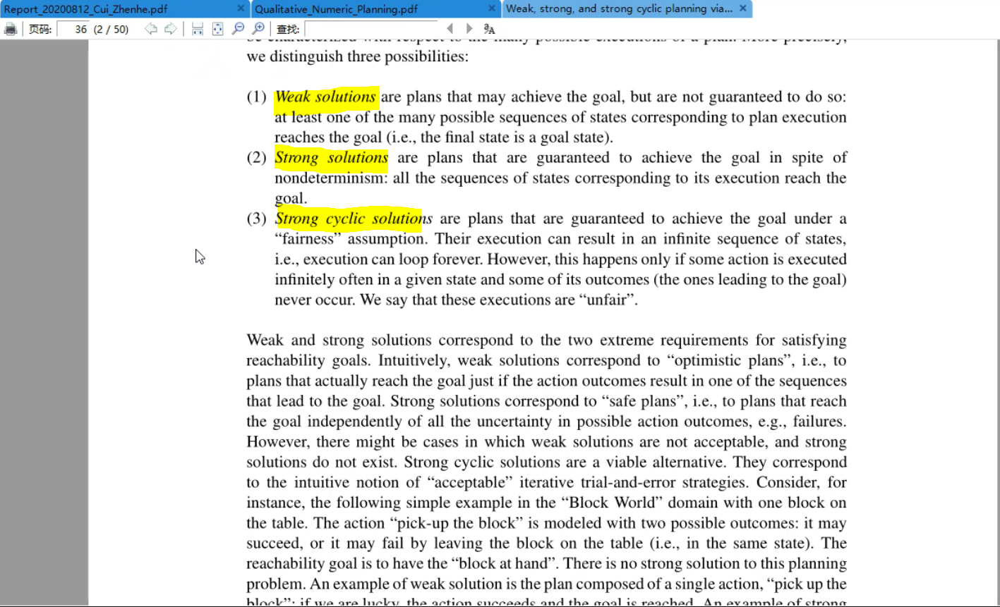
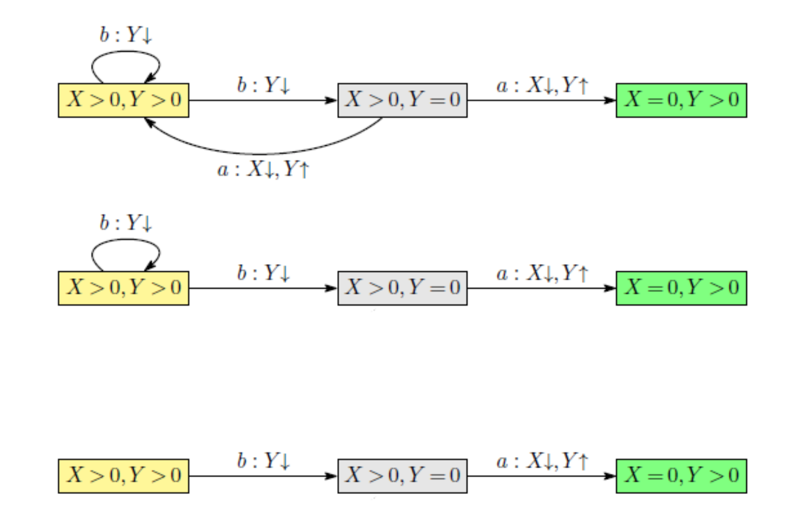
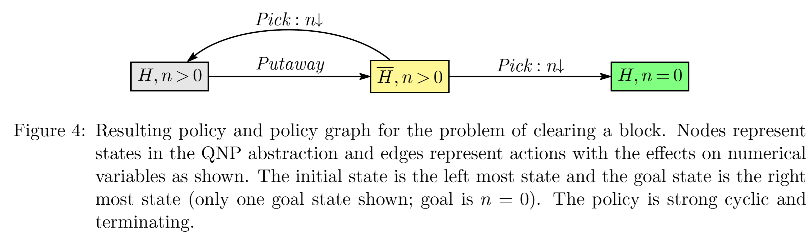
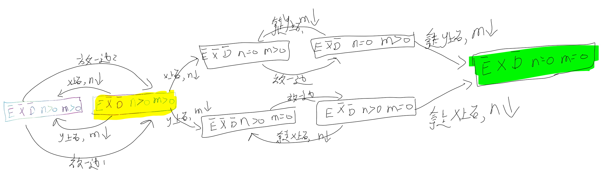
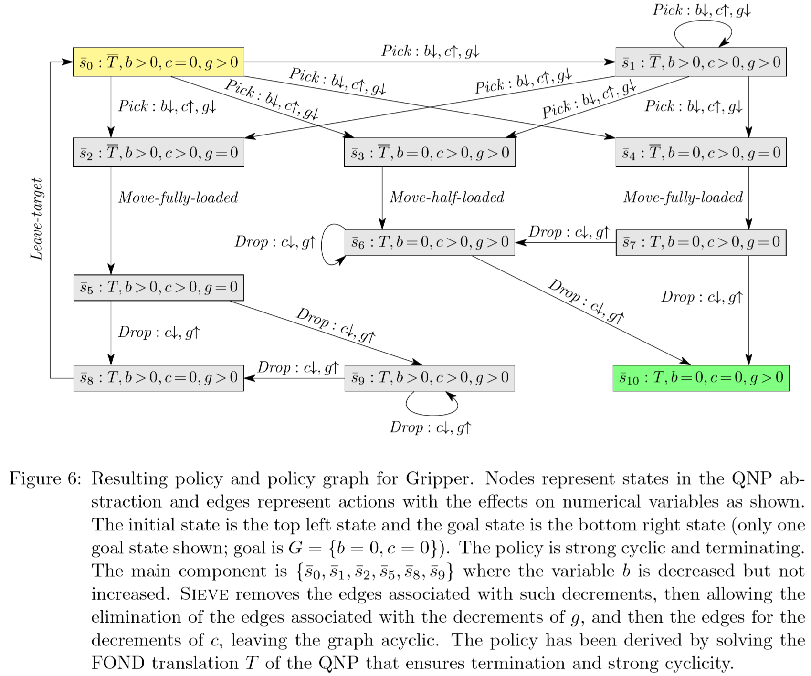

[TOC]

# QNP

相关资料：[Qualitative Numeric Planning Reductions and Complexity (groundai)](https://www.groundai.com/project/qualitative-numeric-planning-reductions-and-complexity/1)

## 原 QNP 问题 Q

```
grid
2 delta(X) 1 delta(Y) 1
2 delta(X) 1 delta(Y) 1
2 delta(X) 0 delta(Y) 0
2
Move-in-row
1 delta(X) 1
1 delta(X) 0
Move-in-column
1 delta(Y) 1
1 delta(Y) 0
```

## 首先 qnp2fond

The translator is invoked using

```
qnp2fond <qnp-file> <counter-capacity> <loop-nesting> <prefix>
```

where the first argument is the name of a .qnp file (see below), the two additional arguments are non-negative integers, typically small ones such as 0, 1 or 2, and the last argument is the prefix for the generated files (domain and problem files).

```
./qnp2fond ./grid.qnp 2 2 grid_output
```

## 然后 fond-sat

```
usage: main.py [-h] [-time_limit TIME_LIMIT] [-mem_limit MEM_LIMIT]
               [-name_temp NAME_TEMP] [-strong STRONG] [-inc INC]
               [-gen_info GEN_INFO] [-policy POLICY]
               path_domain path_instance
```

```
python main.py ../F-domains/islands/domain.pddl ../F-domains/islands/p03.pddl -strong 1 -inc 2 -policy 1
```

自动化求解过程：

```
python  main.py ../qnp2fond_examples/grid_output_d.pddl  ../qnp2fond_examples/grid_output_p.pddl -strong 1 -inc 2 -policy 1
```

在线资源：[Qualitative Numeric Planning Reductions and Complexity](https://www.groundai.com/project/qualitative-numeric-planning-reductions-and-complexity/)



基本上，共享一组相同动作和状态特征的规划实例集合通常可以表示为单个 QNP 问题 Q，其解决方案将状态特征映射为动作，从而解决 Q 中所有实例的规划问题（Bonet & Geffner, 2018）。

QNP 可以通过以下两个步骤进行求解（Srivastava 等, 2011）。

1. 首先，将 QNP 问题 Q 转换为标准的完全可观测非确定性（FOND）规划问题 P（Cimatti, Pistore, Roveri & Traverso, 2003）。
2. 然后，检验由现成 FOND 规划器所获得的解 P 是否**终止**。这最后一步的必要性源于如下理论观察：FOND 问题 P 中的不确定性本身是 unfair，但在条件意义上是 fair——若数值变量 X 的增加不超过有限次数，则 X 的无限定性减量最终必然使表达式 X=0 成立（Bonet, De Giacomo, Geffner & Rubin, 2017）。

那么，解决 P 且满足终止条件的策略即是解决 QNP 问题 Q 的有效策略（Srivastava 等, 2011）。

然而，采用这种生成-测试（Generate-and-Test）方法求解 QNP 存在两个关键的计算缺陷。

- 首先，修改 FOND 规划器以生成 FOND 问题的所有可能解决方案并非易事，原因在于 FOND 规划的输出并非简单的动作序列，而是具有闭环结构的策略表示。
- 其次，需要检验终止性的策略数量可能极为庞大：FOND 状态空间的大小随变量数量呈指数级增长，因而需要验证的策略数量亦随变量数量呈指数倍增。

经典的规划问题本质上是一个顺序决策问题（Sequential Decision Problem），其目标在于通过从给定初始状态开始执行具有确定性效果的动作序列来达到预期目标。这类问题通常以诸如 STRIPS（Fikes & Nilsson, 1971; Russell & Norvig, 2002）之类的规划语言，以紧凑的形式化方式表述。

一个（实例化的）STRIPS 规划问题（含否定文字）是一个元组 P = ⟨F, I, O, G⟩，其中 F 表示一组命题变量，I 和 G 是 F 的子集，分别代表初始状态和目标状态，O 是一组动作 a，其前提条件 Pre(a) 和效果 Eff(a) 由 F 文字集合给出。

问题 P = ⟨F, I, O, G⟩ 的状态模型 S(P) 是元组 S(P) = ⟨S, s₀, Act, A, f, S_g⟩，其中 S 是 F 文字上所有可能真值赋值的集合（称为状态），s₀ 是初始状态，Act = O，A(s) 表示前提条件在状态 s 下为真的可应用动作集合，f(a, s) 表示在状态 s 上执行动作 a 后的后继状态，而 S_g 是目标状态的集合。这里假设问题 P 在 s₀ 和 f 定义明确、且 S_g 非空的意义上是一致的。

经典问题 P 的解是一组动作序列。

由 FOND 问题 P = ⟨F, I, O, G⟩ 确定的状态模型 S(P) 是一个元组 S(P) = ⟨S, s₀, Act, A, F, S_G⟩，其中**状态转移函数 F** 是非确定性的，它将动作 a 和状态 s 映射到可能的后续状态的非空集合 F(a, s)。与经典情形类似，非确定性转移函数 F 以分解形式给出。具体而言，每一动作 a 由多个效果分支 Eff₁ | ... | Effₙ 构成（当 n=1 时为确定性动作），F(a, s) 中的每个可能结果状态 s' 对应于为 a 的每个非确定性效果选择一个 Effᵢ 的结果。

石头世界：

Q_clear = ⟨F, V, I, O, G⟩

F, {H}

V, {n(x)}

I, {¬H, n(x)>0}

O, {a, b},
a = ⟨¬H, n(x)>0; H, n(x)↓⟩,
b = ⟨H; ¬H⟩

G = {n(x)=0}

```mermaid
graph LR;
　　&#172H,n&gt0 -->|a动作n&#8595| H,N&#8595仍&gt0;
　　H,N&#8595仍&gt0 -->|b动作&#172H|&#172H,n&gt0;
　　H,N&#8595仍&gt0 -->|a动作n&#8595| n=0 ;
```

Q_nest = ⟨F, V, I, O, G⟩

F, {∅}

V, {X, Y}

I, {X>0, Y>0}

O, {a, b},
a = ⟨X>0, Y=0; X↓ Y↑⟩,
b = ⟨Y>0; Y↓⟩

G = {X=0}

```mermaid
graph LR;
　　X&gt0,Y&gt0 -->|b动作Y&#8595| X&gt0,Y&gt0;
　　X&gt0,Y&gt0 -->|b动作Y&#8595| X&gt0,Y=0;
　　X&gt0,Y=0 -->|a动作X&#8595Y&#8593| X&gt0,Y&gt0 ;
　　X&gt0,Y=0 -->|a动作X&#8595Y&#8593| X=0,Y&gt0 ;
```

需要保证公平性（Fairness）条件：在某些非确定性动作场景下，不能无限期地停留于单个循环之中而无法退出。本例中的动作是确定性的（Deterministic）。

Y 构成嵌套循环结构（Nested Loop），对应强循环解（Strong Cyclic Solutions）或无限循环；而 X 的单调递减性质保证了其在有限步内归零，从而确保了算法的可终止性。

就像《范畴学》的图

1. QNP 问题 Q = ⟨F, V, I, O, G⟩ 根据形式化定义直接翻译得到 FOND 问题 P = T_D(Q) = ⟨F', I', O', G'⟩

- F' = F ∪ {X = 0 : X ∈ V }, where X = 0 stands for a new propositional symbol pX = 0 and X > 0 stands for ¬pX = 0,
- I' = I but with X = 0 and X > 0 denoting pX = 0 and ¬pX = 0
- O' = O but with Inc(X) effects replaced by the deterministic propositional effects X > 0, and Dec(X) effects replaced by non-deterministic propositional effects X > 0 | X = 0,
- G' = G but with X = 0 and X > 0 denoting pX = 0 and ¬pX = 0

从该状态转移图出发进行分析：

```mermaid
graph LR;
　　X&gt0,Y&gt0 -->|b动作Y&#8595| X&gt0,Y&gt0;
　　X&gt0,Y&gt0 -->|b动作Y&#8595| X&gt0,Y=0;
　　X&gt0,Y=0 -->|a动作X&#8595Y&#8593| X&gt0,Y&gt0 ;
　　X&gt0,Y=0 -->|a动作X&#8595Y&#8593| X=0,Y&gt0 ;
```

转换步骤说明：

1. 文字 X=0 和 X>0 经由数值变量 X 的消去（Elimination）处理：X=0 表示为命题符号 P_X=0，而 X>0 表示为 ¬P_X=0。直观理解即为"非零即真"，此处将其视作一种标识 True，建模目标为令控制变量 X=0。
2. Inc(x) 代表确定性的后续命题效果 X>0，如上图中动作 b 的箭头指向所示，其后续均为 X>0。
3. Dec(x) 代表非确定性的后续命题效果 `X>0|X=0`，即 P_X=0 | ¬P_X=0。仍以上图为例，动作 a 的箭头有可能指向 X>0 或 X=0 两种可能结果。

关键在于以下观察：

2. FOND 亦可归约到 QNP，二者具有相同的计算复杂性。

Sieve 算法的基本流程如下：

首先通过深度优先搜索找出强连通分量（SCC）结点集合，即从某结点出发能够遍历所有相关结点并回到自身的结点集合。

然后去除从 SCC 结点出发的、标记为 Dec(x)（即非递增）的箭头。

最后检查剩余图是否为无环图（Acyclic），若是则算法终止（Terminate），否则继续循环处理。



## FOND 互相转换 QNP

跟着 Bonet 文章介绍的转

## Q_clear Block World

### 一个变量

积木世界



### 两个变量

积木世界接龙版


求解策略并不一定需要先清理完 X 上的 n 个积木，再清理 Y 上的 m 个积木。

也可能是先处理 Y 再处理 X，

更可能是像下面所示的那样，X 与 Y 混合交替进行：



## Gripper




## Related Work

QNPs have been introduced as a decidable planning model able to account for plans with loops [[Srivastava, Zilberstein, Immerman, GeffnerSrivastava et al.2011](https://www.groundai.com/project/qualitative-numeric-planning-reductions-and-complexity/1#bib.bibx45), [Srivastava, Zilberstein, Gupta, Abbeel, RussellSrivastava et al.2015](https://www.groundai.com/project/qualitative-numeric-planning-reductions-and-complexity/1#bib.bibx44)].
In addition, by defining the boolean and numerical variables of QNPs as suitable general boolean and numerical features over a given domain, it has been shown that QNPs can be used to express abstract models for generalized planning, in particular when the ground actions change from instance to instance [[Bonet GeffnerBonet Geffner2018](https://www.groundai.com/project/qualitative-numeric-planning-reductions-and-complexity/1#bib.bibx10)].
More recently, it has been shown that these QNP abstractions can be learned automatically from a given planning domain and sampled plans [[Bonet, Frances, GeffnerBonet et al.2019](https://www.groundai.com/project/qualitative-numeric-planning-reductions-and-complexity/1#bib.bibx8)].
QNPs thus provide a convenient language for a model-based approach for the computation of general plans where such plans are derived from a (QNP) planning model. If the model is sound, the general plans are guaranteed to be correct [[Bonet GeffnerBonet Geffner2018](https://www.groundai.com/project/qualitative-numeric-planning-reductions-and-complexity/1#bib.bibx10), [Bonet, Frances, GeffnerBonet et al.2019](https://www.groundai.com/project/qualitative-numeric-planning-reductions-and-complexity/1#bib.bibx8)].
This is contrast with the more common inductive or learning-based approaches where plans computed to solve a few sampled instances are assumed to generalize to other instances by virtue of the compact form of the plans [[KhardonKhardon1999](https://www.groundai.com/project/qualitative-numeric-planning-reductions-and-complexity/1#bib.bibx31), [Martin GeffnerMartin Geffner2004](https://www.groundai.com/project/qualitative-numeric-planning-reductions-and-complexity/1#bib.bibx34), [Fern, Yoon, GivanFern et al.2004](https://www.groundai.com/project/qualitative-numeric-planning-reductions-and-complexity/1#bib.bibx18)].
These learning approaches do not construct or solve a suitable abstraction of the problems as expressed by QNPs. Inductive approaches have been used recently to learn general plans in the form of finite-state controllers [[Bonet, Palacios, GeffnerBonet et al.2009](https://www.groundai.com/project/qualitative-numeric-planning-reductions-and-complexity/1#bib.bibx6), [Hu De GiacomoHu De Giacomo2013](https://www.groundai.com/project/qualitative-numeric-planning-reductions-and-complexity/1#bib.bibx26)], finite programs [[Aguas, Celorrio, , JonssonAguas et al.2016](https://www.groundai.com/project/qualitative-numeric-planning-reductions-and-complexity/1#bib.bibx1)], and deep neural nets learned in a supervised manner [[Toyer, Trevizan, Thiebaux, XieToyer et al.2018](https://www.groundai.com/project/qualitative-numeric-planning-reductions-and-complexity/1#bib.bibx48), [Bueno, de Barros, Maua, SannerBueno et al.2019](https://www.groundai.com/project/qualitative-numeric-planning-reductions-and-complexity/1#bib.bibx13), [Issakkimuthu, Fern, TadepalliIssakkimuthu et al.2018](https://www.groundai.com/project/qualitative-numeric-planning-reductions-and-complexity/1#bib.bibx29), [Bajpai, Garg, et al.Bajpai et al.2018](https://www.groundai.com/project/qualitative-numeric-planning-reductions-and-complexity/1#bib.bibx3)].
A key difference between learning-based and model-based approaches is that the correctness of the latter follows from the soundness of the model. Deep reinforcement learning methods have also been used recently for computing generalized plans with no supervision [[Groshev, Goldstein, Tamar, Srivastava, AbbeelGroshev et al.2018](https://www.groundai.com/project/qualitative-numeric-planning-reductions-and-complexity/1#bib.bibx24), [Sukhbaatar, Szlam, Synnaeve, Chintala, FergusSukhbaatar et al.2015](https://www.groundai.com/project/qualitative-numeric-planning-reductions-and-complexity/1#bib.bibx46)], yet by not using first-order symbolic representations, they have difficulties in dealing with relational domains that involve objects and relations [[Garnelo ShanahanGarnelo Shanahan2019](https://www.groundai.com/project/qualitative-numeric-planning-reductions-and-complexity/1#bib.bibx20)].
Forms of generalized planning have also been formulated using first-order logic [[Srivastava, Immerman, ZilbersteinSrivastava et al.2011](https://www.groundai.com/project/qualitative-numeric-planning-reductions-and-complexity/1#bib.bibx43), [Illanes McIlraithIllanes McIlraith2019](https://www.groundai.com/project/qualitative-numeric-planning-reductions-and-complexity/1#bib.bibx28)], and general plans over finite horizons have been derived using first-order regression as well [[Boutilier, Reiter, PriceBoutilier et al.2001](https://www.groundai.com/project/qualitative-numeric-planning-reductions-and-complexity/1#bib.bibx12), [Wang, Joshi, KhardonWang et al.2008](https://www.groundai.com/project/qualitative-numeric-planning-reductions-and-complexity/1#bib.bibx50), [Van OtterloVan Otterlo2012](https://www.groundai.com/project/qualitative-numeric-planning-reductions-and-complexity/1#bib.bibx49), [Sanner BoutilierSanner Boutilier2009](https://www.groundai.com/project/qualitative-numeric-planning-reductions-and-complexity/1#bib.bibx41)].
The use of QNPs for expressing (or learning) abstractions for generalized planning problems, combined with the compilation of QNPs into FOND problems, allows us to benefit from the performance of propositional off-the-shelf FOND planners like PRP [[Muise, McIlraith, BeckMuise et al.2012](https://www.groundai.com/project/qualitative-numeric-planning-reductions-and-complexity/1#bib.bibx35)], MyND [[Bercher MattmullerBercher Mattmuller2009](https://www.groundai.com/project/qualitative-numeric-planning-reductions-and-complexity/1#bib.bibx5)], or FOND-SAT [[Geffner GeffnerGeffner Geffner2018](https://www.groundai.com/project/qualitative-numeric-planning-reductions-and-complexity/1#bib.bibx22)] in order to find policies for generalized planning.

QNP planning problems can be easily translated into LTL planning problems with FOND domains, reachability goals, and a particular type of trajectory constraints that can be expressed as compact LTL formula [[Bonet, De Giacomo, Geffner, RubinBonet et al.2017](https://www.groundai.com/project/qualitative-numeric-planning-reductions-and-complexity/1#bib.bibx7)].
The trajectory constraints use a fragment of LTL [[PnueliPnueli1977](https://www.groundai.com/project/qualitative-numeric-planning-reductions-and-complexity/1#bib.bibx37)] to express the QNP fairness constraints; namely, that for each numerical variable X in a QNP, it is always the case that infinite decrements of X combined with finite increments of X must eventually drive the variable X to 0. As a result, QNP planning can be translated quite efficiently (linear time) into LTL synthesis. The translation, however, is not particularly useful computationally, as QNP planning, like FOND planning, is EXP-Complete, while LTL synthesis is 2EXP-Complete (doubly exponential in time) [[Pnueli RosnerPnueli Rosner1989](https://www.groundai.com/project/qualitative-numeric-planning-reductions-and-complexity/1#bib.bibx38)].
In LTL planning, i.e., FOND planning with LTL goals and trajectory constraints, the double exponential growth is in the number of variables that appear in such formulas [[Camacho, Bienvenu, McIlraithCamacho et al.2019](https://www.groundai.com/project/qualitative-numeric-planning-reductions-and-complexity/1#bib.bibx14), [Aminof, Giacomo, Murano, RubinAminof et al.2019](https://www.groundai.com/project/qualitative-numeric-planning-reductions-and-complexity/1#bib.bibx2)].

For the specific type of LTL trajectory constraints that QNPs convey, the general method of bonet:ijcai2017 bonet:ijcai2017 results in an EXPSPACE algorithm for the synthesis of a tree automaton that solves the given QNP (or to determine that such automaton does not exist). Indeed, the method first computes a deterministic parity word (DPW) automaton that accepts the models of an LTL formula that captures the QNP; this automaton may be of doubly exponential size and with an exponential number of priorities for general types of LTL trajectory constraints, but it is "only" of exponential size and with a bounded number of priorities for QNPs. Then, a deterministic parity tree automaton At, that accepts the policies for the QNP and is built from the DPW automaton, must be tested for non-emptiness. The tree automaton At has size that is polynomial in the size of the DPW automaton and with the same number of priorities. The non-emptiness test requires time that is polynomial in the size of At but exponential in the number of priorities. For QNPs, the number of priorities is bounded and thus this method can be implemented in exponential space since the DPW automaton must be *explicitly* built. Like the reduction from QNPs into FOND problems, this method does not solve the question posed above about the solvability of QNPs by memoryless policies since the automaton At captures all history-based policies for the input QNP, not only memoryless policies.
