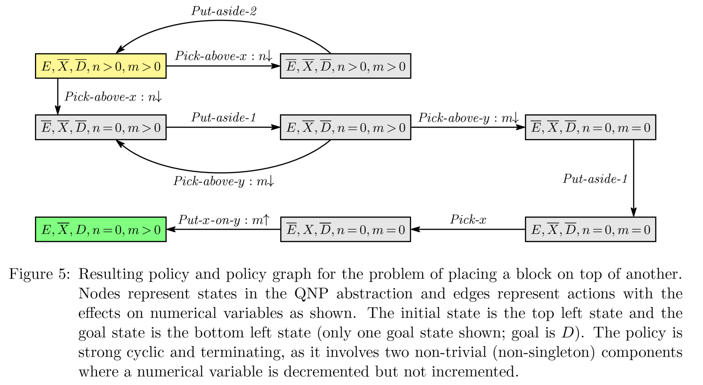
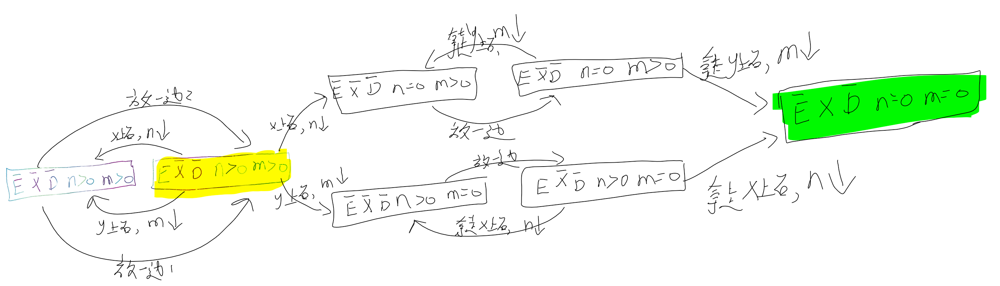

[TOC]

# QNP
groundai.com/project/qualitative-numeric-planning-reductions-and-complexity/1


原qnp问题Q

```
grid
2 delta(X) 1 delta(Y) 1
2 delta(X) 1 delta(Y) 1
2 delta(X) 0 delta(Y) 0
2
Move-in-row
1 delta(X) 1
1 delta(X) 0
Move-in-column
1 delta(Y) 1
1 delta(Y) 0

```


## 首先qnp2fond

The translator is invoked using

```
qnp2fond <qnp-file> <counter-capacity> <loop-nesting> <prefix>
```

where the first argument is the name of a .qnp file (see below), 
the two additional arguments are non-negative integers, typicall
small ones such as 0, 1 or 2, and the last argument is the prefix
for the generated files (domain and problem files).

```
./qnp2fond ./grid.qnp 2 2 grid_output
```


## 然后fond-sat

```
usage: main.py [-h] [-time_limit TIME_LIMIT] [-mem_limit MEM_LIMIT]
               [-name_temp NAME_TEMP] [-strong STRONG] [-inc INC]
               [-gen_info GEN_INFO] [-policy POLICY]
               path_domain path_instance
```

```
python main.py ../F-domains/islands/domain.pddl ../F-domains/islands/p03.pddl -strong 1 -inc 2 -policy 1
```

自动化求解过程：

```
python  main.py ../qnp2fond_examples/grid_output_d.pddl  ../qnp2fond_examples/grid_output_p.pddl -strong 1 -inc 2 -policy 1
```

https://www.groundai.com/project/qualitative-numeric-planning-reductions-and-complexity/


基本上，共享一组相同动作和状态特征的计划实例*P的*实例通常可以表示为单个QNP问题*Q，*其解决方案将状态特征映射为动作，然后解决Q中的所有问题（Bonet＆Geffner，2018）。

QNP可以通过两个步骤解决（Srivastava等，2011）。

1. 首先，将QNP Q转换为标准的完全可观察的非确定性（FOND）问题P（Cimatti，Pistore，Roveri和Traverso，2003年）。  

2. 然后，测试由现成的FOND规划器获得的P的解是否**终止**。这最后一步是必需的，因为FOND问题P中的不确定性是unfair，但在条件上是fair：如果X的增加不超过有限数，则数值变量X的无穷定性减量最终使表达式X = 0成立。 （Bonet，De Giacomo，Geffner和Rubin，2017年）。
 
 
那么，解决P 并终止的策略就是解决QNP Q 的策略（Srivastava et al。，2011）。

但是，遵循这种生成和测试方法解决QNP的计算缺点是两个。
- 首先，修改FOND计划者以生成FOND问题的所有解决方案并不容易，因为FOND计划不是行​​动序列而是闭环策略。
- 其次，需要测试终止的策略的数量可能非常庞大：FOND状态的数量呈指数形式，因此变量数量成倍增加。


经典的计划问题是一个顺序决策问题，在该问题中，要通过从给定初始状态执行具有确定性作用的动作来达到目标​​。这些问题通常以诸如STRIPS（Fikes和Nilsson，1971； Russell和Norvig，2002）之类的计划语言以紧凑的形式表达。


一个（扎根的）STRIPS计划问题（带有否定）是一个元组P = *{F，I，O，G）*  ，其中*F* 表示一组命题变量，*I* 和*G* 是*F的*集合，代表初始和目标情况， O是一组动作a，其前提条件和效果*是*由F字词集给定的Pre（a）和  *Eff（a）*

问题P = {F，I，O，G）的状态模型S（P ）是元组S（P ）= {S，s〇，Act，A，f，Sg ），

其中S 是可能的集合真估值在F文字，称为状态，š 〇是初始状态，ACT = O，A（s）表示在动作，其先决条件是在S，F（A，S）真表示状态s的动作的在GA的动作a in s之后的，而Sg是目标状态的集合。假设问题P在s〇和f定义明确且Sg不为空的意义上是一致的。

经典问题P的解决方案是动作序列


由FOND问题P = {F，I，O，G）确定的状态模型S（P）是一个元组S（P）= {S，s〇，Act，A，F，SG）**状态转移函数F**是不确定的，并且将动作a和状态s映射到可能的后续状态的非空集F（a，s）。像往常一样，不确定性转换函数F 以分解形式给出。也就是说，行动一由多种效果制成Eff x | •••| Eff n（可能是确定的，当n = 1时），F（a，s）中的每个结果s'为a的每个不确定性效应选择一个Effi的结果$^2$


石头世界：

$Q_{clear} =$ <F,V,I,O,G>


F,{H}

V,{n(x)}

I,{$\neg H$,n(x)>0}

O,{a,b},
a=< $\neg H$,n(x)>0;H,n(x)$\downarrow$>,
b=<H;$\neg H$>

G={n(x)=0}


```mermaid
graph LR;
　　&#172H,n&gt0 -->|a动作n&#8595| H,N&#8595仍&gt0;
　　H,N&#8595仍&gt0 -->|b动作&#172H|&#172H,n&gt0;
　　H,N&#8595仍&gt0 -->|a动作n&#8595| n=0 ;
```


$Q_{nest} =$ <F,V,I,O,G>


F,{$\oslash$}

V,{X,Y}

I,{X>0,Y>0;}

O,{a,b},
a=\<  X>0,Y=0;X$\downarrow$Y$\uparrow$ \>,
b=\<Y>0; Y$\downarrow$ \>

G={X=0}


```mermaid
graph LR;
　　X&gt0,Y&gt0 -->|b动作Y&#8595| X&gt0,Y&gt0;
　　X&gt0,Y&gt0 -->|b动作Y&#8595| X&gt0,Y=0;
　　X&gt0,Y=0 -->|a动作X&#8595Y&#8593| X&gt0,Y&gt0 ;
　　X&gt0,Y=0 -->|a动作X&#8595Y&#8593| X=0,Y&gt0 ;
```
要保证fair，有的不确定性动作情况下不能无限死磕一个循环不出来，这题确定性deterministic。

Y循环nest loop(strong cyclic solutions/infinite)，X的单调递减finite归零可证。

就像《范畴学》的图


1. QNP问题Q=\< F,V,I,O,G \>根据公式Definition直接翻译得到FOND问题P=$T_D(Q)$=\< F',I',O',G' \>

- F ′ = F ∪ {X = 0 : X ∈ V }, where X = 0 stands for a new propositional symbol pX = 0 and X > 0 stands for ¬pX = 0,
- I ′ = I but with X = 0 and X > 0 denoting pX = 0 and ¬pX = 0
- O′ = O but with Inc(X) effects replaced by the deterministic propositional effects X > 0, and Dec(X) effects replaced by non-deterministic propositional effects X > 0 | X = 0,
- G′ = G but with X = 0 and X > 0 denoting pX = 0 and ¬pX = 0


从这个图开始出发：

```mermaid
graph LR;
　　X&gt0,Y&gt0 -->|b动作Y&#8595| X&gt0,Y&gt0;
　　X&gt0,Y&gt0 -->|b动作Y&#8595| X&gt0,Y=0;
　　X&gt0,Y=0 -->|a动作X&#8595Y&#8593| X&gt0,Y&gt0 ;
　　X&gt0,Y=0 -->|a动作X&#8595Y&#8593| X=0,Y&gt0 ;
```

步骤：
1. 文字X=0和X>0写成数值变量X的eliminated,x=0表示$P_X$=0,而X>0表示$\neg P_X$=0,我理解是非零即真，这里当作一种标识True，认为建模目标令控制变量X=0
2. $In_c(x)$代表 确定性后续命题效果X>0,比如上图动作b箭头后续都是X>0;
3. $Dec(x)$代表 确定性后续命题效果`X>0|X=0` ,即$P_X=0 | \neg P_X=0$,还是上图,a为例子的话就是a箭头有可能指向X>0|X=0;


重点在于：


2. FOND也能归约到QNP,相同复杂性

Sieve算法

先深度优先找出SCC结点集合（第一个第二个，出发能遍历所有点回到自身的节点）

然后去除SCC结点出发,Dec(x)的箭头，Not increase的。

最后剩下的看是不是acyclic，是则terminate，否则循环


# FOND互相转换QNP


跟着文章介绍的转


## $Q_{clear}$ Block world 


### 一个变量

积木世界


### 两个变量

积木世界接龙版




感觉不一定清理完X上的n个积木，再请开y上的m个积木，


也可能是先y后x


更可能是像下面这样x，y混合着来：




## Gripper


## related work


QNPs have been introduced as a decidable planning model able to account for plans with loops \[[Srivastava, Zilberstein, Immerman,  GeffnerSrivastava et al.2011](https://www.groundai.com/project/qualitative-numeric-planning-reductions-and-complexity/1#bib.bibx45), [Srivastava, Zilberstein, Gupta, Abbeel,  RussellSrivastava et al.2015](https://www.groundai.com/project/qualitative-numeric-planning-reductions-and-complexity/1#bib.bibx44)\]. 
In addition, by defining the boolean and numerical variables of QNPs as suitable general boolean and numerical features over a given domain, it has been shown that QNPs can be used to express abstract models for generalized planning, in particular when the ground actions change from instance to instance \[[Bonet  GeffnerBonet  Geffner2018](https://www.groundai.com/project/qualitative-numeric-planning-reductions-and-complexity/1#bib.bibx10)\]. 
More recently, it has been shown that these QNP abstractions can be learned automatically from a given planning domain and sampled plans \[[Bonet, Francès,  GeffnerBonet et al.2019](https://www.groundai.com/project/qualitative-numeric-planning-reductions-and-complexity/1#bib.bibx8)\]. 
QNPs thus provide a convenient language for a model-based approach for the computation of general plans where such plans are derived from a (QNP) planning model. If the model is sound, the general plans are guaranteed to be correct \[[Bonet  GeffnerBonet  Geffner2018](https://www.groundai.com/project/qualitative-numeric-planning-reductions-and-complexity/1#bib.bibx10), [Bonet, Francès,  GeffnerBonet et al.2019](https://www.groundai.com/project/qualitative-numeric-planning-reductions-and-complexity/1#bib.bibx8)\]. 
This is contrast with the more common inductive or learning-based approaches where plans computed to solve a few sampled instances are assumed to generalize to other instances by virtue of the compact form of the plans \[[KhardonKhardon1999](https://www.groundai.com/project/qualitative-numeric-planning-reductions-and-complexity/1#bib.bibx31), [Martin  GeffnerMartin  Geffner2004](https://www.groundai.com/project/qualitative-numeric-planning-reductions-and-complexity/1#bib.bibx34), [Fern, Yoon,  GivanFern et al.2004](https://www.groundai.com/project/qualitative-numeric-planning-reductions-and-complexity/1#bib.bibx18)\]. 
These learning approaches do not construct or solve a suitable abstraction of the problems as expressed by QNPs. Inductive approaches have been used recently to learn general plans in the form of finite-state controllers \[[Bonet, Palacios,  GeffnerBonet et al.2009](https://www.groundai.com/project/qualitative-numeric-planning-reductions-and-complexity/1#bib.bibx6), [Hu  De GiacomoHu  De Giacomo2013](https://www.groundai.com/project/qualitative-numeric-planning-reductions-and-complexity/1#bib.bibx26)\], finite programs \[[Aguas, Celorrio, ,  JonssonAguas et al.2016](https://www.groundai.com/project/qualitative-numeric-planning-reductions-and-complexity/1#bib.bibx1)\], and deep neural nets learned in a supervised manner \[[Toyer, Trevizan, Thiébaux,  XieToyer et al.2018](https://www.groundai.com/project/qualitative-numeric-planning-reductions-and-complexity/1#bib.bibx48), [Bueno, de Barros, Mauá,  SannerBueno et al.2019](https://www.groundai.com/project/qualitative-numeric-planning-reductions-and-complexity/1#bib.bibx13), [Issakkimuthu, Fern,  TadepalliIssakkimuthu et al.2018](https://www.groundai.com/project/qualitative-numeric-planning-reductions-and-complexity/1#bib.bibx29), [Bajpai, Garg, et al.Bajpai et al.2018](https://www.groundai.com/project/qualitative-numeric-planning-reductions-and-complexity/1#bib.bibx3)\]. 
A key difference between learning-based and model-based approaches is that the correctness of the latter follows from the soundness of the model. Deep reinforcement learning methods have also been used recently for computing generalized plans with no supervision \[[Groshev, Goldstein, Tamar, Srivastava,  AbbeelGroshev et al.2018](https://www.groundai.com/project/qualitative-numeric-planning-reductions-and-complexity/1#bib.bibx24), [Sukhbaatar, Szlam, Synnaeve, Chintala,  FergusSukhbaatar et al.2015](https://www.groundai.com/project/qualitative-numeric-planning-reductions-and-complexity/1#bib.bibx46)\], yet by not using first-order symbolic representations, they have difficulties in dealing with relational domains that involve objects and relations \[[Garnelo  ShanahanGarnelo  Shanahan2019](https://www.groundai.com/project/qualitative-numeric-planning-reductions-and-complexity/1#bib.bibx20)\]. 
Forms of generalized planning have also been formulated using first-order logic \[[Srivastava, Immerman,  ZilbersteinSrivastava et al.2011](https://www.groundai.com/project/qualitative-numeric-planning-reductions-and-complexity/1#bib.bibx43), [Illanes  McIlraithIllanes  McIlraith2019](https://www.groundai.com/project/qualitative-numeric-planning-reductions-and-complexity/1#bib.bibx28)\], and general plans over finite horizons have been derived using first-order regression as well \[[Boutilier, Reiter,  PriceBoutilier et al.2001](https://www.groundai.com/project/qualitative-numeric-planning-reductions-and-complexity/1#bib.bibx12), [Wang, Joshi,  KhardonWang et al.2008](https://www.groundai.com/project/qualitative-numeric-planning-reductions-and-complexity/1#bib.bibx50), [Van OtterloVan Otterlo2012](https://www.groundai.com/project/qualitative-numeric-planning-reductions-and-complexity/1#bib.bibx49), [Sanner  BoutilierSanner  Boutilier2009](https://www.groundai.com/project/qualitative-numeric-planning-reductions-and-complexity/1#bib.bibx41)\]. 
The use of QNPs for expressing (or learning) abstractions for generalized planning problems, combined with the compilation of QNPs into FOND problems, allows us to benefit from the performance of propositional off-the-shelf FOND planners like PRP \[[Muise, McIlraith,  BeckMuise et al.2012](https://www.groundai.com/project/qualitative-numeric-planning-reductions-and-complexity/1#bib.bibx35)\], MyND \[[Bercher  MattmüllerBercher  Mattmüller2009](https://www.groundai.com/project/qualitative-numeric-planning-reductions-and-complexity/1#bib.bibx5)\], or FOND-SAT \[[Geffner  GeffnerGeffner  Geffner2018](https://www.groundai.com/project/qualitative-numeric-planning-reductions-and-complexity/1#bib.bibx22)\] in order to find policies for generalized planning.

QNP planning problems can be easily translated into LTL planning problems with FOND domains, reachability goals, and a particular type of trajectory constraints that can be expressed as compact LTL formula \[[Bonet, De Giacomo, Geffner,  RubinBonet et al.2017](https://www.groundai.com/project/qualitative-numeric-planning-reductions-and-complexity/1#bib.bibx7)\]. 
The trajectory constraints use a fragment of LTL \[[PnueliPnueli1977](https://www.groundai.com/project/qualitative-numeric-planning-reductions-and-complexity/1#bib.bibx37)\] to express the QNP fairness constraints; namely, that for each numerical variable X in a QNP, it is always the case that infinite decrements of X combined with finite increments of X must eventually drive the variable X to 0. As a result, QNP planning can be translated quite efficiently (linear time) into LTL synthesis. The translation, however, is not particularly useful computationally, as QNP planning, like FOND planning, is EXP-Complete, while LTL synthesis is 2EXP-Complete (doubly exponential in time) \[[Pnueli  RosnerPnueli  Rosner1989](https://www.groundai.com/project/qualitative-numeric-planning-reductions-and-complexity/1#bib.bibx38)\]. 
In LTL planning, i.e., FOND planning with LTL goals and trajectory constraints, the double exponential growth is in the number of variables that appear in such formulas \[[Camacho, Bienvenu,  McIlraithCamacho et al.2019](https://www.groundai.com/project/qualitative-numeric-planning-reductions-and-complexity/1#bib.bibx14), [Aminof, Giacomo, Murano,  RubinAminof et al.2019](https://www.groundai.com/project/qualitative-numeric-planning-reductions-and-complexity/1#bib.bibx2)\].


For the specific type of LTL trajectory constraints that QNPs convey, the general method of bonet:ijcai2017 bonet:ijcai2017 results in an EXPSPACE algorithm for the synthesis of a tree automaton that solves the given QNP (or to determine that such automaton does not exist). Indeed, the method first computes a deterministic parity word (DPW) automaton that accepts the models of an LTL formula that captures the QNP; this automaton may be of doubly exponential size and with an exponential number of priorities for general types of LTL trajectory constraints, but it is “only” of exponential size and with a bounded number of priorities for QNPs. Then, a deterministic parity tree automaton At, that accepts the policies for the QNP and is built from the DPW automaton, must be tested for non-emptiness. The tree automaton At has size that is polynomial in the size of the DPW automaton and with the same number of priorities. The non-emptiness test requires time that is polynomial in the size of At but exponential in the number of priorities. For QNPs, the number of priorities is bounded and thus this method can be implemented in exponential space since the DPW automaton must be *explicitly* built. Like the reduction from QNPs into FOND problems, this method does not solve the question posed above about the solvability of QNPs by memoryless policies since the automaton At captures all history-based policies for the input QNP, not only memoryless policies.


