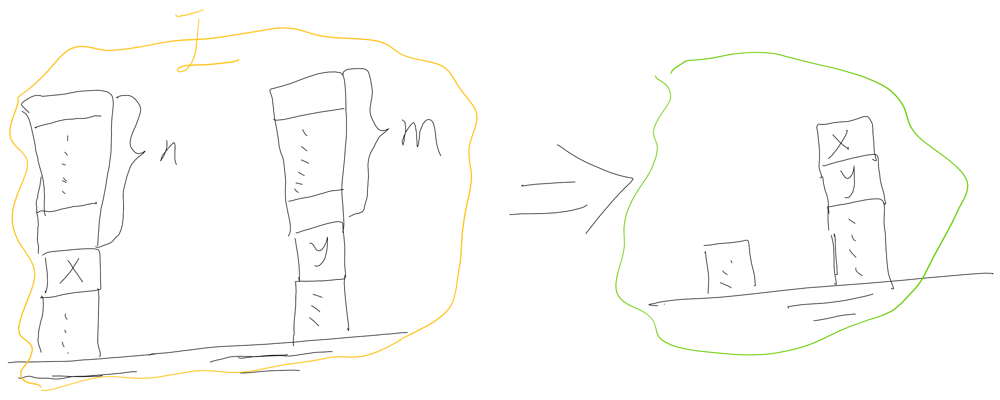
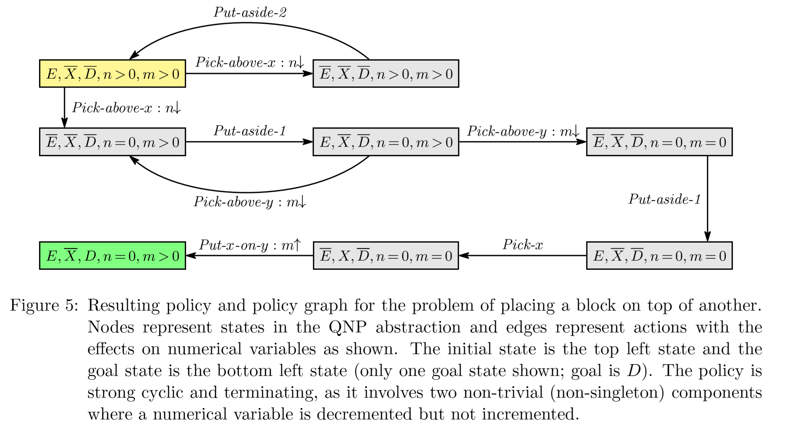
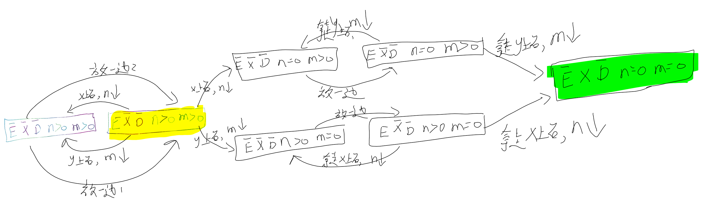
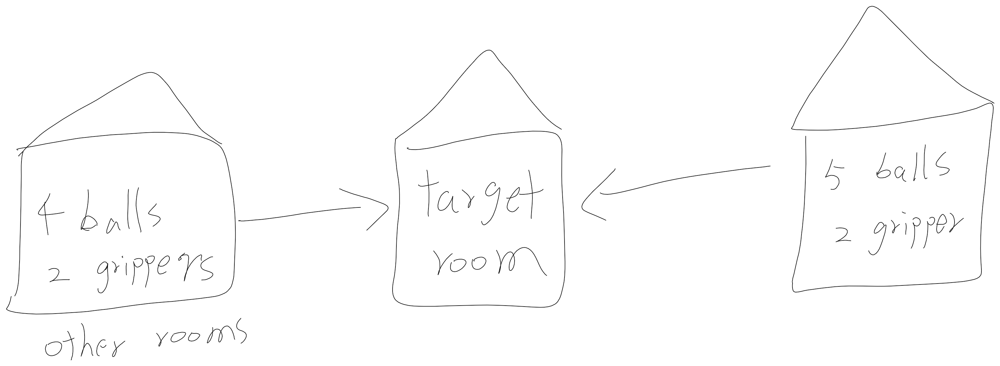
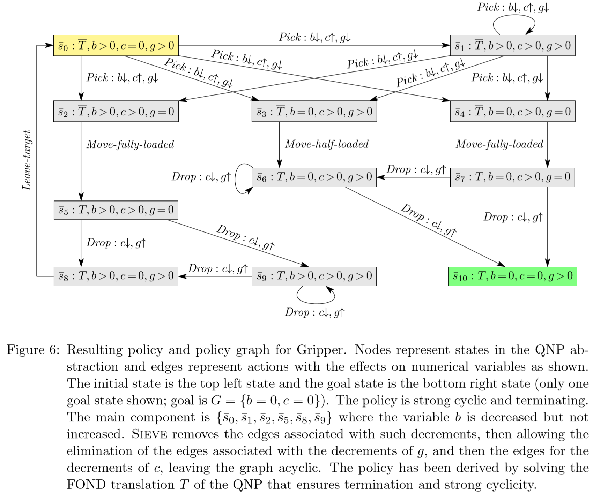
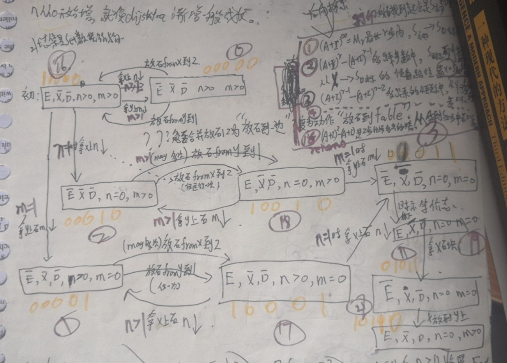
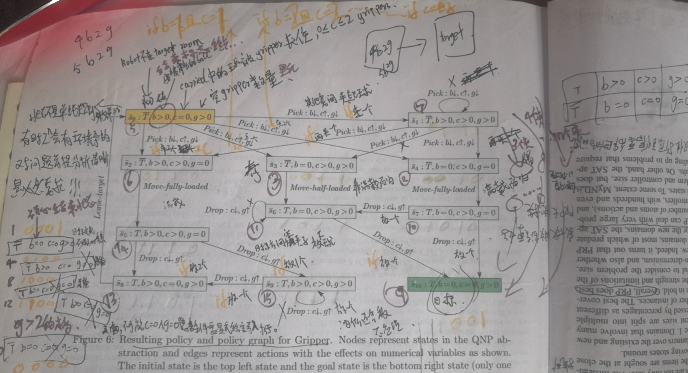
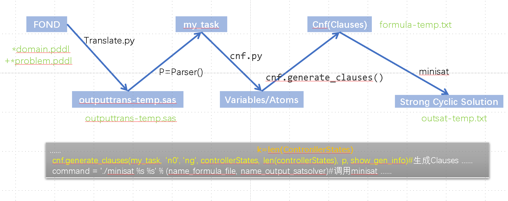

[TOC]


# 两个变量

积木世界接龙版






感觉不一定清理完X上的n个积木，再请开y上的m个积木，


也可能是先y后x


更可能是像下面这样x，y混合着来：




## Gripper







# QNP2SAT

# 试试编码符号化求解

整体的想法是:

先枚举空间内的原子命题F+数值变量V，
衍生子句cnf
求取sat，找到为真的那些 原子命题F+数值变量V
然后挑那些真的状态子句打印出来就是一个连续的步骤

**简单来说就是**

1. 所有actions中的状态都枚举喂进去生成“原子命题Variables们”，

action中缺省值全部当作变量，两个状态必须有的s0和sG.

2 states搜索的时候：s0,sG组合进去所有actions中缺省值，得到Variables。
同理，3 states走三步的时候，s0,sGs1组合进去所有actions中缺省值，得到Variables。


2. 然后生成需要同时满足的clause子句的合取cnf

假设到底的子句为真，用Actions形式化的符号公式来演算，生成“假如能到达目标，那么哪些句子是真的”的Clauses子句，然后写成合取式cnf


3. cnf喂进去minisat得到可满足的取值为真的原子命题,"值-公式映射表"翻译回来公式序列得到一个解，如果cnf添加上一条公式为假然后minsat循环得到多个解。


## 状态states

If we use the notation s[X = 0] to refer to s[X] = 0, then π(s) must depend solely on the truth-valuation over the F-literals p and the V -literals X = 0 that are determined by the state s. There is indeed a finite number of such truth valuations but an infinite number of states. We refer to such truth valuations as the boolean states of the QNP and denote the boolean state associated with a state s as $\overline{s}$ .


$\overline{s}$代表状态,F原子命题(101...01)+V(x,y,z),

感觉图中x>0实际上应该有x


就算原子命题相同，也是不同的。

n0、n1、...、n_inf步进行，然后

- S用(F布尔状态，V数值)来表示
- (S,b_i)
- (S,b_i,s')
- ? ReachI(s_i)
- ?ReachG(S_i,j)


### 输入--图解区别在于状态数量

repeat((repeat if ~ do 内层循环...)if ~判断结束的条件 do 外层循环...)


>对比图解QNP的方法中，其中的n>0,n=0可以看作单纯的文字命题，代表的意义是非零和零，同时不确定性动作不需要传递 if(n==1)走哪条路，因为这个走那条路默认让用户根据输出来自行判断，甚至n=n-1执行多少次我也不关心.
因为结果出来用户“自己判断到底什么时候到n=1临界数值标识状态”开始走非循环的那条路径（主要是因为“强联通分量的等效图实现的这个功能")

在这个QNP2SAT方法中，连```n,n-1,n-2,...,2,1```都要分不同状态来一以区分，

还有一个区别是：每个动作前提要输入**判断条件**

>S16 -->|当n==1拿x上石n&darr| S2 ;

这个动作为例：

```
{n=1}^S16 --> S2^{n=n-1};#QNP2SAT要写成这样的，如果一个很弱智的问题，但是n比较大，复杂度增加也会很大，这是因为方法不好。
```


QNP-SAT方法没有通过**强连通规约n>0 v.s n=0状态**，而需要枚举出n,n-1,...,3,2,1每一个状态，然后传action参数的时候需要判断


```
E,X,D#不管你用什么符号，F读取后，自动重命名存成布尔命题f1,f2,f3---1；非f1,-f2,-f3---0
n,m#建议使用v1,v2,v3,...命名。不管你用什么符号，V读取后，程序自动重命名存成v1,v2.约定v1>0,v2>0取值0；v1=0,v2=0取值1；
E,-S,-D,n>0,m>0#初始I，程序先替换为10000B=16D,只需要存一个Interger表示S_0
E,-S,D,n=0,m>0#初始G，程序先替换为10110B=22D,只需要存一个Interger表示S_G
a1:#action 1:Pick-above-x捡起来x上方积木:
　　if(n>1^m>1)(E,-X,-D,n>0,m>0), (-E,-X,-D,n>0,m>0);#代码中应该存成命名a1的二维矩阵？或者一维序列每个元素是元组(S16,S0)下同，写成这样
    if(n==1)S16(E,-X,-D,n>0,m>0), S2(-E,-X,-D,n=0,m>0) ;#(S,S)
　　if(n>1)S17(E,-X,-D,n>0,m=0), S1(-E,-X,-D,n>0,m=0);#(S,S)
　　if(n==1)S17(E,-X,-D,n>0,m=0), S3(-E,-X,-D,n=0,m=0);#(S,S)

a2：#Pick-above-y捡起来y上方积木:
　　if(n>1^m>1)S16(E,-X,-D,n>0,m>0), S0(-E,-X,-D,n>0,m>0);#(S,S)
　　if(m>1)S18(E,-X,-D,n=0,m>0),S2(-E,-X,-D,n=0,m>0);#(S,S)
　　if(m==1)S18(E,-X,-D,n=0,m>0) , S3(-E,-X,-D,n=0,m=0);#(S,S)
　　if(m==1)S16(E,-X,-D,n>0,m>0) ,S1(-E,-X,-D,n>0,m=0) ;#(S,S)

a3：#put-aside积木(不包括x，手持x放一边叫做put-x-aside是下面讨论的一个动作)放一边到桌面Table
#包括这个 Putaside-1 = h¬E,¬X,¬D,n=0;Ei to put aside (not above x or y) the block being held,
# 也包括这个 Putaside-2 = h¬E,¬X,¬D,n>0,m>0;Ei to put aside (not above x or y) the block being held,
　　S0(-E,-X,-D,n>0,m>0) ,S16(E,-X,-D,n>0,m>0);#(S,S)
　　S2(-E,-X,-D,n=0,m>0),S18(E,-X,-D,n=0,m>0);#(S,S)
　　S1(-E,-X,-D,n>0,m=0) , S17(E,-X,-D,n>0,m=0);#(S,S)
　　S3(-E,-X,-D,n=0,m=0) , S19(E,-X,-D,n=0,m=0);#(S,S)

#这里需要提一点：允许_缺省项
#比如放下石头，唯一的直观形式化表示<-E,E>,其实对应的状态有：
       S_(-E,_,_,_,_) -->|put-aside| S__(E,_,_,_,_);
#然后可以运用PC枚举遍历：
　　S12(-E,X,D,n>0,m>0) , S28(E,X,D,n>0,m>0);#(S,S)
　　S14(-E,X,D,n=0,m>0) ,S30(E,X,D,n=0,m>0);#(S,S)
　　S13(-E,X,D,n>0,m=0) ,S29(E,X,D,n>0,m=0);#(S,S)
　　S15(-E,X,D,n=0,m=0) ,S31(E,X,D,n=0,m=0);　#(S,S)
　　S8(-E,X,-D,n>0,m>0) ,S24(E,X,-D,n>0,m>0);#(S,S)
　　S10(-E,X,-D,n=0,m>0) ,S26(E,X,-D,n=0,m>0);#(S,S)
　　S9(-E,X,-D,n>0,m=0) ,S25(E,X,-D,n>0,m=0);#(S,S)
　　S11(-E,X,-D,n=0,m=0) ,S27(E,X,-D,n=0,m=0);#(S,S)
　　S4(-E,-X,D,n>0,m>0) , S20(E,-X,D,n>0,m>0);#(S,S)
　　S6(-E,-X,D,n=0,m>0) ,S22(E,-X,D,n=0,m>0);#(S,S)
　　S5(-E,-X,D,n>0,m=0) ,S21(E,-X,D,n>0,m=0);#(S,S)
　　S7(-E,-X,D,n=0,m=0) ,S23(E,-X,D,n=0,m=0);　#(S,S)
　　S0(-E,-X,-D,n>0,m>0),S16(E,-X,-D,n>0,m>0);#(S,S)
　　S2(-E,-X,-D,n=0,m>0) ,S18(E,-X,-D,n=0,m>0);#(S,S)
　　S1(-E,-X,-D,n>0,m=0) ,S17(E,-X,-D,n>0,m=0);#(S,S)
　　S3(-E,-X,-D,n=0,m=0) ,S19(E,-X,-D,n=0,m=0);#(S,S)
#多出来的可以通过ISM技术的“区域划分”去掉“无S0,SG无关的孤立图们”，结果就只剩下前面提到的这几个真正会用的“可达状态”：
　　S0(-E,-X,-D,n>0,m>0) ,S16(E,-X,-D,n>0,m>0);#(S,S)
　　S2(-E,-X,-D,n=0,m>0) ,S18(E,-X,-D,n=0,m>0);#(S,S)
　　S1(-E,-X,-D,n>0,m=0) ,S17(E,-X,-D,n>0,m=0);#(S,S)
　　S3(-E,-X,-D,n=0,m=0) ,S19(E,-X,-D,n=0,m=0);#(S,S)

#但是如果需要隐含条件推理的“不可能状态”需要人工输入的时候排除，因为PC不知道语义，只知道语法推导没毛病就行。或者需要另外定义一行可选项，用来输入不可能状态，在矩阵处理前去掉这个“不可能状态结点”。可选项怎么弄呢？

a4：#pick-x，拿起来x石头，**关键动作**，pre一对一映射effect的行为，
       S19(E,-X,-D,n=0,m=0) , S11(E,-X,-D,n=0,m=0);#(S,S)


a5：#put-x-on-y,把手中的x放在y上方：
　　S11(E,-X,-D,n=0,m=0) , S22(E,-X,D,n=0,m>0);#(S,S)

a6   #put-x-aside,建议别定义这动作，这是一个危险（毫无意义而且多余）的动作
　　S11(E,-X,-D,n=0,m=0) , S19(E,-X,-D,n=0,m=0);#(S,S)
```






注：其中$S_7=(\overline{T},b>0,c>0,g>0)$是没想明白，多定义出来，可有可无的操作，写上无所谓。

## 枚举基础原子命题
QNP-SAT方法没有通过**强连通规约n>0 v.s n=0状态**，而需要枚举出n,n-1,...,3,2,1每一个状态，然后传action参数的时候需要判断

编码空间

**ations=pre-->effect**中,preonditoin和effect可以看作变量，把可达状态，满足Actions定义的语义的各种情况，都枚举代入，就能生成原子命题Variables

比如：

当走一步路的时候，n0,nG里两个状态，代入actions中的“pre--effect”


当走两步路的时候，n0,n1,nG代入，其中比如Blockworlf中编码空间就是2\*2\*2\*n\*m个，列举出来(E,-X,-D,n>0,m>0)......其中两个状态n0,nG被占用，n1取值可以是（2\*2\*2\*n\*m-2）个。

这些命题都写出来，不是说“n1同时取值是（2\*2\*2\*n\*m-2）个”，而是这些Variables中有对有错，都列出来先，

后续根据“假设能抵达目标的生成式Clauses的合取cnf”求SAT可满足公式找到这对公式里的“一个解”


### 子句生成规则


改编FOND-SAT那个论文的这几个：

1. $¬p(S_i0)$ if p $\notin$ s0 ; negative info in s0 
2. $p(S_iG)$ if p ∈ G ; goal 
3. $(S_i, b) → p(S_i)$ if p ∈ prec(b); preconditions 
4. $(S_i, b) → (S_i, b')$ if b and b' are siblings 
5. $(S_i, b) →¬(S_i, b')$ if b and b' not siblings
6. $(S_i, b) ⇐⇒\bigvee_{S_i'}(S_i, b, S_i')$; some next controller state
7. $(S_i, b, S_i') ∧¬p(S_i) →¬p(S_i')$ if p $\notin$ add(b); fwd prop. 
8. $(S_i, b, S_i') →¬p(S_i')$ if p∈del(b); fwd prop. neg. info
9. $ReachI(S_0)$; reachability from $S_0$
10.$(S_i, b, S_i') ∧ ReachI(S_i)$→ $ReachI(S_i')$
11. $ReachG(S_G,j), j =0,...,k$, reach $S_G$ in ≤ j steps 
12. ¬$ReachG(S_i, 0)$ for all $S_i \neq S_G$
13. $ReachG(S_i, j+1) ⇐⇒ \bigvee_{b,S_i'}$b,S_i' [(S_i, b, S_i')∧ReachG(S_i',j)]
14. ReachG(S_i, j) → ReachG(S_i, j+1)
15. $ReachI(S_i) → ReachG(S_i, k)$:if $S_0$ reaches $S_i$, $S_i$ reaches $S_G$.


找出“当能抵达终点意味着的---最小递归步骤的公式”。

**特别的地方在于状态S包括（命题F+数值变量们V）的变动,而不仅仅是FOND问题的F集合中原子命题p**。


### SAT找出对应的数据编码空间内哪些“原子命题为真？”


为真的原子命题就是解，然后打印出来S们就是一条找到的求解路径规划序列.

如果sat添加上次求解的答案到cnf中，排除得到的答案就是“第二个解”，循环到内存溢出或者Unsatified无解，就说明差不多够了。


### 重点是代码怎么写？


参考FOND-SAT的核心代码：



problem.qnp文本文件，写个Parser存成特定数据结构，传进去python进行处理.


```
solver_time = []
for i in range(1000):
    cnf = CNF(name_formula_file, name_formula_file_extra, fair, strong)#文件formula-temp.txt这时候是空白的，formula-extra-temp此时空白，仅仅是传入地址方便最终结果存入数据
    ......
    cnf.reset()
    start_g = timer()
    cnf.generate_clauses(my_task, 'n0', 'ng', controllerStates, len(controllerStates), p, show_gen_info)#生成子句Clauses和写入cnf文件合取范式的核心代码!!!
传入字符'n0', 终态'ng'
>>> print(controllerStates)
['n0', 'n1', 'ng']这个是3格的情况，2格的时候是['n0','ng']
>>> len(controllerStates)
3
>>> print(show_gen_info)
False懒得显示这部分，因为和我要关心的重点没关系
这里的p是Parser实例，可能用里面的方法，因为基本看着都是私有变量
    ......
    command = './minisat %s %s' % (name_formula_file, name_output_satsolver)#调用minisat
    ......
    result = cnf.parseOutput(name_output_satsolver, controllerStates, p, print_policy)#读取文件name_output_satsolver : outsat-temp.txt输出结果
    ......
```


