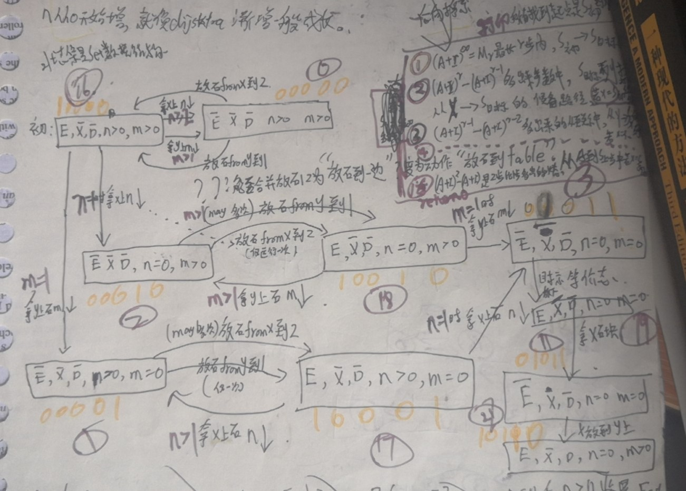
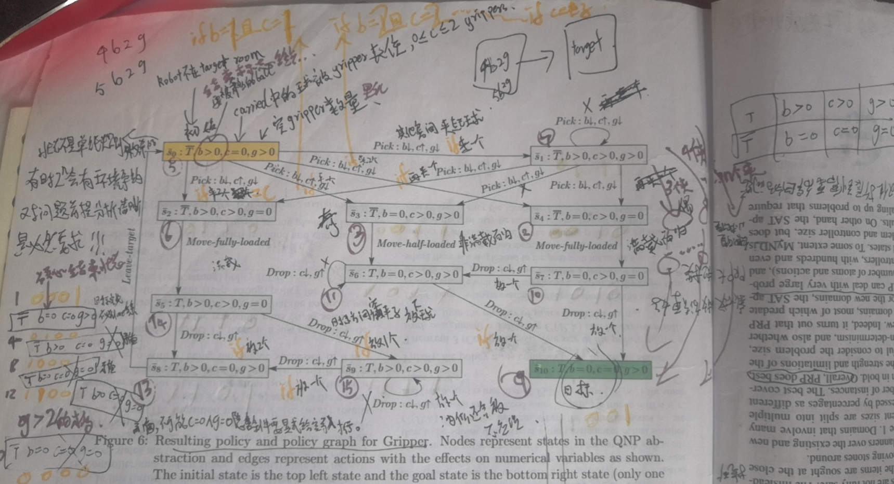
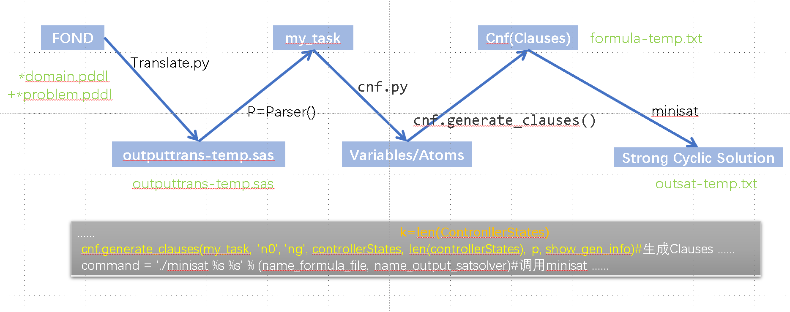

[TOC]

# QNP2SAT

## 两个变量

积木世界接龙版


感觉不一定清理完 X 上的 n 个积木，再请开 y 上的 m 个积木，

也可能是先 y 后 x

更可能是像下面这样 x, y 混合着来：


## Gripper


## 符号化编码求解方法

整体思路如下：

首先枚举状态空间内的所有原子命题 F 和数值变量 V，基于此衍生生成合取范式（CNF）子句，调用 SAT 求解器求解，找出所有为真的原子命题 F 和数值变量 V，最后筛选出那些为真的状态子句并打印，即构成一个连续的求解步骤序列。

**简要概述如下：**

1. 将所有动作（Actions）中涉及的状态全部枚举并馈入系统，生成"原子命题变量"。

动作中的缺省值全部视为变量，其中两个特殊状态 s₀（初始状态）和 s_G（目标状态）是必须存在的。

在 2 个状态的搜索空间下：s₀、s_G 与所有动作中的缺省值组合，得到变量集合。类似地，在 3 个状态的搜索空间下：s₀、s_G、s₁ 与所有动作中的缺省值组合，得到变量集合。

2. 然后生成需要同时满足的子句（Clause）的合取式 CNF。

在假设底层子句为真的前提下，利用动作的形式化符号公式进行推演，生成"若能到达目标，则哪些子句为真"的 Clauses 集合，并最终写为合取范式 CNF。

3. 将 CNF 馈入 MiniSAT 求解器，得到可满足的、取值为真的原子命题集合。通过"值-公式映射表"将结果翻译回公式序列，从而获得一个解。若在 CNF 中添加一条新公式为假，然后再次调用 MiniSAT 循环求解，则可逐步获取多个解。

## 状态 States

If we use the notation s[X = 0] to refer to s[X] = 0, then π(s) must depend solely on the truth-valuation over the F-literals p and the V -literals X = 0 that are determined by the state s. There is indeed a finite number of such truth valuations but an infinite number of states. We refer to such truth valuations as the boolean states of the QNP and denote the boolean state associated with a state s as $\overline{s}$ .

$\overline{s}$ 代表状态, F 原子命题 (101...01) + V(x,y,z),

值得注意的是，图中标注 x>0 的情形实际上应当包含 x 的具体数值信息。

即便原子命题的赋值相同，但由于所处的状态空间位置不同，它们所代表的具体系统状态也是不同的。

状态序列 n₀、n₁、...、n_∞ 逐次推进，然后

- S 用 (F 布尔状态, V 数值) 来表示
- (S, b_i)
- (S, b_i, s')
- ? ReachI(s_i)
- ? ReachG(S_i, j)

### 输入差异——图解区别在于状态数量

repeat((repeat if ~ do 内层循环 ...) if ~判断结束条件 do 外层循环 ...)

> 对比图解 QNP 的方法，其中 n>0 和 n=0 可以视为单纯的文字命题，分别代表"非零"和"零"两种含义。同时，非确定性动作无需传递 if(n==1) 这样的分支条件来决定走哪条路径，因为路径选择默认交由用户根据输出来自行判断，甚至 n=n-1 的具体执行次数也无须关心。
> 原因在于，求解结果会输出给用户，由用户"自行判断何时到达 n=1 这一临界数值标识状态"并开始执行非循环的那条路径（这主要得益于强连通分量等效图所实现的功能）。

而在 QNP2SAT 方法中，连 `n, n-1, n-2, ..., 2, 1` 这样的数值递减序列都需要区分不同的状态来逐一标识。

另一个关键区别在于：每个动作的前提条件需要显式输入**判断条件**。

> S16 -->|当 n==1 拿 x 上石 n↓| S2 ;

这个动作为例：

```
{n=1}^S16 --> S2^{n=n-1};#QNP2SAT要写成这样的，如果一个很弱智的问题，但是n比较大，复杂度增加也会很大，这是因为方法不好。
```

QNP-SAT 方法并未采用**强连通规约（n>0 vs. n=0 状态）**，而是需要逐一枚举出 n, n-1, ..., 3, 2, 1 每一个数值状态，然后在传递动作参数时进行相应的条件判断。

```
E,X,D # 无论用户使用何种符号，F 读取后将自动重命名并存储为布尔命题 f₁, f₂, f₃，取值为 1 表示真，非 f₁, -f₂, -f₃ 表示假（0）
n,m # 建议使用 v₁, v₂, v₃, ... 命名。无论用户使用何种符号，V 读取后程序自动重命名并存储为 v₁, v₂。约定 v₁>0, v₂>0 取值为 0；v₁=0, v₂=0 取值为 1
E,-S,-D,n>0,m>0 # 初始状态 I，程序先替换为 10000B=16D，只需存储一个 Integer 表示 S₀
E,-S,D,n=0,m>0 # 目标状态 G，程序先替换为 10110B=22D，只需存储一个 Integer 表示 S_G
a1: # action 1: Pick-above-x——拾取 x 上方的积木
　　if(n>1^m>1)(E,-X,-D,n>0,m>0), (-E,-X,-D,n>0,m>0);#代码中应该存成命名a1的二维矩阵？或者一维序列每个元素是元组(S16,S0)下同，写成这样
    if(n==1)S16(E,-X,-D,n>0,m>0), S2(-E,-X,-D,n=0,m>0) ;#(S,S)
　　if(n>1)S17(E,-X,-D,n>0,m=0), S1(-E,-X,-D,n>0,m=0);#(S,S)
　　if(n==1)S17(E,-X,-D,n>0,m=0), S3(-E,-X,-D,n=0,m=0);#(S,S)

a2: # Pick-above-y——拾取 y 上方的积木
　　if(n>1^m>1)S16(E,-X,-D,n>0,m>0), S0(-E,-X,-D,n>0,m>0);#(S,S)
　　if(m>1)S18(E,-X,-D,n=0,m>0),S2(-E,-X,-D,n=0,m>0);#(S,S)
　　if(m==1)S18(E,-X,-D,n=0,m>0) , S3(-E,-X,-D,n=0,m=0);#(S,S)
　　if(m==1)S16(E,-X,-D,n>0,m>0) ,S1(-E,-X,-D,n>0,m=0) ;#(S,S)

a3: # put-aside——将积木放置一旁到桌面 Table（不包括 x；手持 x 放至一旁的动作称为 put-x-aside，将在下文讨论）
# 包括此操作 Putaside-1 = ⟨¬E, ¬X, ¬D, n=0; E⟩ 用于将手中积木放置一旁（不在 x 或 y 上方）
# 也包括此操作 Putaside-2 = ⟨¬E, ¬X, ¬D, n>0, m>0; E⟩ 用于将手中积木放置一旁（不在 x 或 y 上方）
　　S0(-E,-X,-D,n>0,m>0) ,S16(E,-X,-D,n>0,m>0);#(S,S)
　　S2(-E,-X,-D,n=0,m>0),S18(E,-X,-D,n=0,m>0);#(S,S)
　　S1(-E,-X,-D,n>0,m=0) , S17(E,-X,-D,n>0,m=0);#(S,S)
　　S3(-E,-X,-D,n=0,m=0) , S19(E,-X,-D,n=0,m=0);#(S,S)

# 这里需要指出一点：允许缺省项（默认值）
# 例如放下石头的操作，唯一的直观形式化表示为 <-E, E>，实际上对应的状态有：
       S_(-E,_,_,_,_) -->|put-aside| S__(E,_,_,_,_);
# 然后可以运用命题演算（PC）进行枚举遍历：
　　S12(-E,X,D,n>0,m>0) , S28(E,X,D,n>0,m>0);#(S,S)
　　S14(-E,X,D,n=0,m>0) ,S30(E,X,D,n=0,m>0);#(S,S)
　　S13(-E,X,D,n>0,m=0) ,S29(E,X,D,n>0,m=0);#(S,S)
　　S15(-E,X,D,n=0,m=0) ,S31(E,X,D,n=0,m=0);　#(S,S)
　　S8(-E,X,-D,n>0,m>0) ,S24(E,X,-D,n>0,m>0);#(S,S)
　　S10(-E,X,-D,n=0,m>0) ,S26(E,X,-D,n=0,m>0);#(S,S)
　　S9(-E,X,-D,n>0,m=0) ,S25(E,X,-D,n>0,m=0);#(S,S)
　　S11(-E,X,-D,n=0,m=0) ,S27(E,X,-D,n=0,m=0);#(S,S)
　　S4(-E,-X,D,n>0,m>0) , S20(E,-X,D,n>0,m>0);#(S,S)
　　S6(-E,-X,D,n=0,m>0) ,S22(E,-X,D,n=0,m>0);#(S,S)
　　S5(-E,-X,D,n>0,m=0) ,S21(E,-X,D,n>0,m=0);#(S,S)
　　S7(-E,-X,D,n=0,m=0) ,S23(E,-X,D,n=0,m=0);　#(S,S)
　　S0(-E,-X,-D,n>0,m>0),S16(E,-X,-D,n>0,m>0);#(S,S)
　　S2(-E,-X,-D,n=0,m>0) ,S18(E,-X,-D,n=0,m>0);#(S,S)
　　S1(-E,-X,-D,n>0,m=0) ,S17(E,-X,-D,n>0,m=0);#(S,S)
　　S3(-E,-X,-D,n=0,m=0) ,S19(E,-X,-D,n=0,m=0);#(S,S)
# 多余的状态可以通过 ISM 技术的"区域划分"机制去除那些"与 S₀、S_G 无关的孤立子图"，最终只剩下前面提到的这些真正可用的"可达状态"：
　　S0(-E,-X,-D,n>0,m>0) ,S16(E,-X,-D,n>0,m>0);#(S,S)
　　S2(-E,-X,-D,n=0,m>0) ,S18(E,-X,-D,n=0,m>0);#(S,S)
　　S1(-E,-X,-D,n>0,m=0) ,S17(E,-X,-D,n>0,m=0);#(S,S)
　　S3(-E,-X,-D,n=0,m=0) ,S19(E,-X,-D,n=0,m=0);#(S,S)

# 但如果需要通过隐含条件推理来排除"不可能状态"，则需人工输入排除规则。原因在于命题演算（PC）不理解语义，仅能确保语法推导无矛盾。相应的解决方案是另行定义一行可选项，用于输入不可能状态，在矩阵处理前去除这些"不可能状态结点"。这种可选项机制应当如何设计呢？

a4: # pick-x——拾取 x 石头，**关键动作**，前提条件与效果之间存在一一对应映射关系
       S19(E,-X,-D,n=0,m=0) , S11(E,-X,-D,n=0,m=0);#(S,S)

a5: # put-x-on-y——将手中的 x 放置在 y 上方
　　S11(E,-X,-D,n=0,m=0) , S22(E,-X,D,n=0,m>0);#(S,S)

a6: # put-x-aside——建议不要定义此动作，这是一个存在风险（既无意义且多余）的操作
　　S11(E,-X,-D,n=0,m=0) , S19(E,-X,-D,n=0,m=0);#(S,S)
```





注：其中 $S_7=(\overline{T}, b>0, c>0, g>0)$ 这一状态的语义尚未完全明确，属于额外定义的状态，为可有可无的操作，记录于此以备参考。

## 枚举基础原子命题

QNP-SAT 方法并未采用**强连通规约（n>0 vs. n=0 状态）**，而是需要逐一枚举出 n, n-1, ..., 3, 2, 1 每一个数值状态，然后在传递动作参数时进行相应的条件判断。

编码空间

**actions = pre → effect** 中，前提条件（Precondition）和效果（Effect）均可视为变量。将可达状态中满足 Actions 定义语义的各种情形逐一枚举代入，即可生成原子命题 Variables。

例如：

当仅需一步求解时，利用 n₀、n_G 两个状态，代入 actions 中的 "pre → effect" 映射。

当需要两步求解时，利用 n₀、n₁、n_G 三个状态代入。以 BlockWorld 为例，其编码空间大小为 2 × 2 × 2 × n × m 个，可列举出 (E, -X, -D, n>0, m>0) ...... 其中两个状态 n₀、n_G 已被占用，n₁ 的取值可以是 (2 × 2 × 2 × n × m - 2) 个。

这些命题全部列举输出，并不意味着 "n₁ 同时可以取 (2 × 2 × 2 × n × m - 2) 个值"，而是指这些 Variables 中有真有假，全部列出作为候选。

后续根据 "假设能抵达目标" 的生成式 Clauses 的合取 CNF，通过 SAT 求解可满足公式，从而从这些候选命题中找到 "一个解"。

### 子句生成规则

改编自 FOND-SAT 论文中的以下子句生成规则：

1. $¬p(S_i0)$ if p $\notin$ s0 ; negative info in s0
2. $p(S_iG)$ if p ∈ G ; goal
3. $(S_i, b) → p(S_i)$ if p ∈ prec(b); preconditions
4. $(S_i, b) → (S_i, b')$ if b and b' are siblings
5. $(S_i, b) →¬(S_i, b')$ if b and b' not siblings
6. $(S_i, b) ⇐⇒\bigvee_{S_i'}(S_i, b, S_i')$; some next controller state
7. $(S_i, b, S_i') ∧¬p(S_i) →¬p(S_i')$ if p $\notin$ add(b); fwd prop.
8. $(S_i, b, S_i') →¬p(S_i')$ if p∈del(b); fwd prop. neg. info
9. $ReachI(S_0)$; reachability from $S_0$
10. $(S_i, b, S_i') ∧ ReachI(S_i)$→ $ReachI(S_i')$
11. $ReachG(S_G,j), j =0,...,k$, reach $S_G$ in ≤ j steps
12. ¬$ReachG(S_i, 0)$ for all $S_i \neq S_G$
13. $ReachG(S_i, j+1) ⇐⇒ \bigvee_{b,S_i'}$ b,S_i' [(S_i, b, S_i')∧ReachG(S_i',j)]
14. ReachG(S_i, j) → ReachG(S_i, j+1)
15. $ReachI(S_i) → ReachG(S_i, k)$:if $S_0$ reaches $S_i$, $S_i$ reaches $S_G$.

找出"当能抵达目标状态时所对应的最小递归步骤公式"。

**特别之处在于，状态 S 包含（命题 F + 数值变量 V）的整体变动，而不仅仅是 FOND 问题中 F 集合内的原子命题 p**。

### SAT 求解：找出数据编码空间内哪些"原子命题为真"

取值为真的原子命题即为所求的解，将它们打印输出后得到的 S 序列即构成一条求解路径的规划序列。

若在 SAT 求解后，将本次求得的答案以取反形式添加至 CNF 中（即排除当前解），则下一次求解得到的结果便是"第二个解"。如此循环迭代，直至内存溢出或返回 Unsatisfied（不可满足），即说明已求得全部所需解。

### 代码实现的关键要点

参考 FOND-SAT 的核心代码架构：



problem.qnp 文本文件，写个 Parser 存成特定数据结构，传进去 python 进行处理。

```
solver_time = []
for i in range(1000):
    cnf = CNF(name_formula_file, name_formula_file_extra, fair, strong)#文件formula-temp.txt这时候是空白的，formula-extra-temp此时空白，仅仅是传入地址方便最终结果存入数据
    ......
    cnf.reset()
    start_g = timer()
    cnf.generate_clauses(my_task, 'n0', 'ng', controllerStates, len(controllerStates), p, show_gen_info)#生成子句Clauses和写入cnf文件合取范式的核心代码!!!
传入字符'n0', 终态'ng'
>>> print(controllerStates)
['n0', 'n1', 'ng']这个是3格的情况，2格的时候是['n0','ng']
>>> len(controllerStates)
3
>>> print(show_gen_info)
False懒得显示这部分，因为和我要关心的重点没关系
这里的p是Parser实例，可能用里面的方法，因为基本看着都是私有变量
    ......
    command = './minisat %s %s' % (name_formula_file, name_output_satsolver)#调用minisat
    ......
    result = cnf.parseOutput(name_output_satsolver, controllerStates, p, print_policy)#读取文件name_output_satsolver : outsat-temp.txt输出结果
    ......
```
