[TOC]

# QNP 图解

## 一个变量

积木世界


### 两个变量

积木世界接龙版

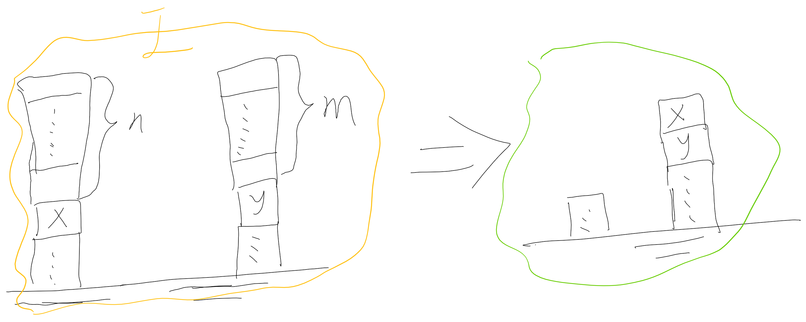

文中所示的解法图示，笔者认为并不完全妥当：

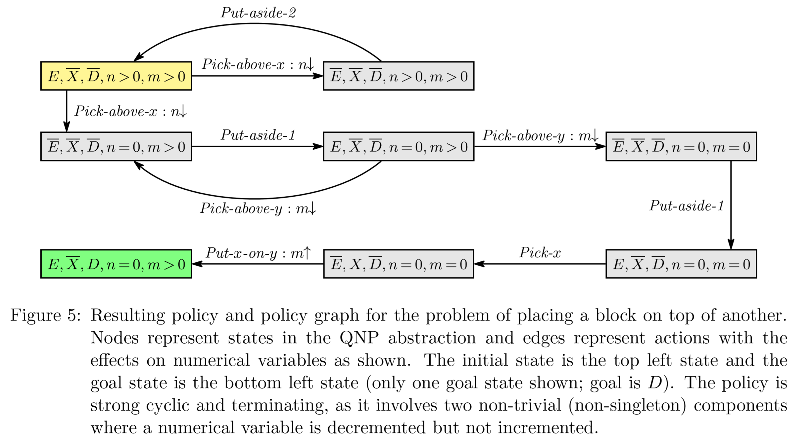

直观而言，清理完 $X$ 上方的 $n$ 块积木后再清理 $Y$ 上方的 $m$ 块积木，绝非唯一可行的策略，

亦可能先处理 $Y$ 而后处理 $X$。

**更有可能的求解图**应当如下所示，即 $X$ 与 $Y$ 的清理工作交替进行：


## QNP 问题形式化

QNP 问题可形式化定义为：$Q = \langle F, V, I, O, G \rangle$

$F = \{ E\ \text{空手}, X\ \text{手持积木}'x', D\ \text{达成目标积木}'x'\ \text{放在积木}'y'\ \text{上方} \}$

$V = \{ \text{积木}'x'\ \text{上方有}\ n\ \text{块积木},\ \text{积木}'y'\ \text{上方有非负整数}\ m\ \text{块积木} \}$

注：笔者认为，即便涉及小数 $n, m$（例如晶圆堆叠制造），只要属于可定义单位数量的离散事件，均可通过求取 $\gcd(n, m)$ 并令 $n' = n / \gcd,\ m' = m / \gcd$ 转化为整数单位。因此，本文仅考虑整数 $n, m$ 的情形。

## States

$\text{Init} = S_{16}: (E, \overline{X}, \overline{D}, n > 0, m > 0)$

$\text{Goal} = S_{22}: (E, \overline{X}, D, n = 0, m > 0)$

每个状态均由 $S = F + V = f_1, f_2, \ldots, f_f + v_1, v_2, \ldots, v_v$ 组成。

为便于状态的枚举过程做到不重不漏，并简化后续图示，约定一种"状态 $s$ → 整数 $\in \{0, 1, 2, \ldots, 2^{f+v} - 1\}$"的映射方式，即状态码。

若直接进行全局枚举，则将存在 $2^n \times 2^n$ 阶的状态关系可达矩阵 $M$。需设计一种算法：当状态节点 $S_i$ 的行与列均为全零时，该节点为孤立节点（或孤立子图），可予以删减。

| 空手 | 手持 X | Goal | X 上 n | Y 上 m | 状态编码 |
| ---- | ---- | ---- | ---- | ---- | ------- |
| E | X | D | n=0 | m=0 | $11111_B = 31_H$ |
| $\overline{E}$ | $\overline{X}$ | $\overline{D}$ | n>0 | m>0 | $00000_B = 0_H$ |

## Actions

- Pick-above-x = $h E, \neg X, \neg D, n > 0, m > 0; \neg E, n \downarrow i$ to pick the topmost block that is above x,

- $a_1$, Pick-above-x（捡起 $x$ 上方积木）：

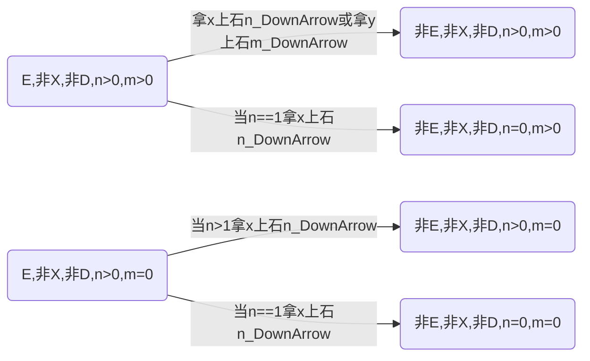
```mermaid
graph LR;
　　S16(E,非X,非D,n>0,m>0) -->|拿x上石n_DownArrow或拿y上石m_DownArrow| S0(非E,非X,非D,n>0,m>0);
　　S16(E,非X,非D,n>0,m>0) -->|当n==1拿x上石n_DownArrow| S2(非E,非X,非D,n=0,m>0) ;
　　S17(E,非X,非D,n>0,m=0) -->|当n>1拿x上石n_DownArrow| S1(非E,非X,非D,n>0,m=0);
　　S17(E,非X,非D,n>0,m=0) -->|当n==1拿x上石n_DownArrow| S3(非E,非X,非D,n=0,m=0);
```

- $a_2$, Pick-above-y（捡起 $y$ 上方积木）：

- Pick-above-y = $h E, \neg X, \neg D, n = 0, m > 0; \neg E, m \downarrow i$ to pick the topmost block that is above x,

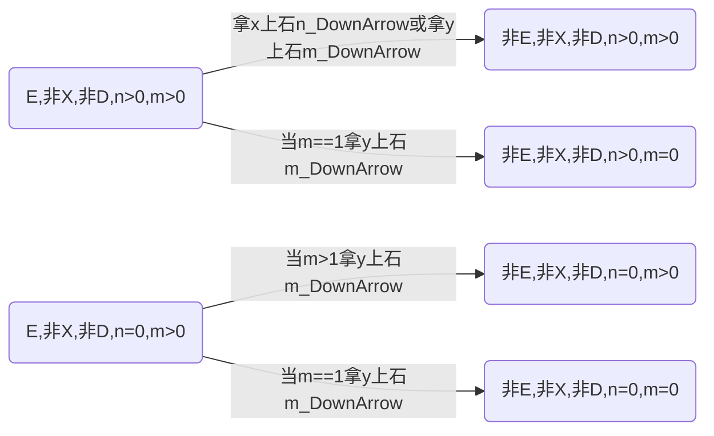
```mermaid
graph LR;
　　S16(E,非X,非D,n>0,m>0) -->|拿x上石n_DownArrow或拿y上石m_DownArrow| S0(非E,非X,非D,n>0,m>0);
　　S18(E,非X,非D,n=0,m>0) -->|当m>1拿y上石m_DownArrow| S2(非E,非X,非D,n=0,m>0);
　　S18(E,非X,非D,n=0,m>0) -->|当m==1拿y上石m_DownArrow| S3(非E,非X,非D,n=0,m=0);
　　S16(E,非X,非D,n>0,m>0) -->|当m==1拿y上石m_DownArrow| S1(非E,非X,非D,n>0,m=0) ;
```

- $a_3$, put-aside（将积木放到一边，不包括 $x$；手持 $x$ 放一边称为 put-x-aside，系下文讨论的动作）放至桌面 Table：
- Putaside-1 = $h \neg E, \neg X, \neg D, n = 0; E \uparrow i$ to put aside (not above x or y) the block being held,

- Putaside-2 = $h \neg E, \neg X, \neg D, n > 0, m > 0; E \uparrow i$ to put aside (not above x or y) the block being held,

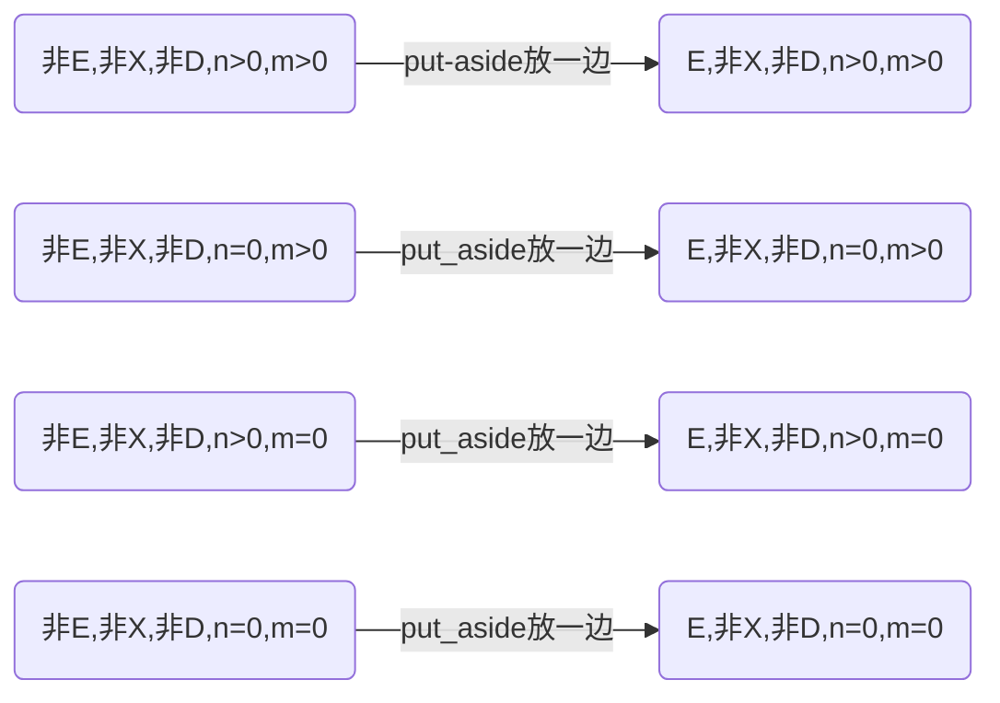
```mermaid
graph LR;
　　S0(非E,非X,非D,n>0,m>0) -->|put-aside放一边| S16(E,非X,非D,n>0,m>0);
　　S2(非E,非X,非D,n=0,m>0) -->|put_aside放一边| S18(E,非X,非D,n=0,m>0);
　　S1(非E,非X,非D,n>0,m=0) -->|put_aside放一边| S17(E,非X,非D,n>0,m=0);
　　S3(非E,非X,非D,n=0,m=0) -->|put_aside放一边| S19(E,非X,非D,n=0,m=0);
```

- $a_4$, pick-x（拿起 $x$ 石头），**关键动作**，其 precondition 与 effect 之间存在一对一映射关系。可将 $\boldsymbol{g^{\ldots}} \to \ldots \to g' \to G$ 状态链合并表示为 $g^{\ldots}$ 状态，即目标状态 $G$ 的"等价态 $s$"，从而减少状态数量，避免不必要的排序。
- Pick-x = $h E, \neg X, \neg D, n = 0, m = 0; \neg E, X \uparrow i$ to pick block x,

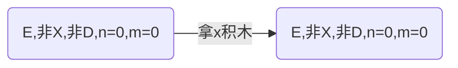
```mermaid
graph LR;
　　S19(E,非X,非D,n=0,m=0) -->|拿x积木| S11(E,非X,非D,n=0,m=0);
```

## **"单一状态链等效"——弃用**

算法原理：矩阵 $A$ 中某节点行列均仅有一个非零元素且不相等，可将其合并为一个节点。鉴于该操作会提高复杂度且并非必要，故最终决定舍弃此等效方案，不予采用。

同理，除终止等价态外，过程中亦可将一对一映射的单一状态链等价标识为 $S'_{\text{状态链中最早（左）的状态}}$。

例如：$S_3 \to S_{19} \to S_{11} \to S_{21}$

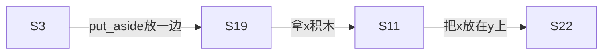
```mermaid
graph LR;
　　S3 -->|put_aside放一边| S19;
　　S19 -->|拿x积木| S11;
　　S11 -->|把x放在y上| S22;
```

标识为 $S_3'$

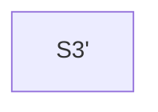
```mermaid
graph LR;
　　S3';
```

- $a_5$, put-x-on-y, 把手中的 $x$ 放在 $y$ 上方：
- Put-x-on-y = $h \neg E, X, \neg D, n = 0, m = 0; E, \neg X, D, m \uparrow i$ to put x on y.

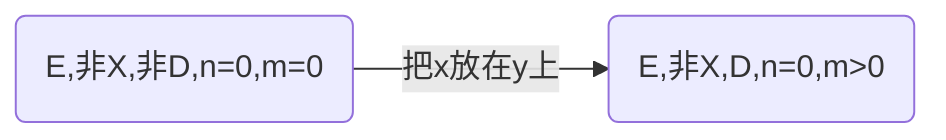
```mermaid
graph LR;
　　S11(E,非X,非D,n=0,m=0) -->|把x放在y上| S22(E,非X,D,n=0,m>0);
```

- $a_6$, put-x-aside。建议不定义此动作，这是一个危险且毫无意义的多余动作。由于未定义 pick-block-from-table，若将 $x$ 放置桌面后无法重新拾起，则任务宣告失败，此路径须予以剪枝。然而，在对问题分析不够透彻的情况下，仍有可能传入此类错误动作。
- Put-x-aside = $h \neg E, X, \neg D, n = 0, m > 0; E, \neg X \uparrow i$ to put block x aside (not above y), and

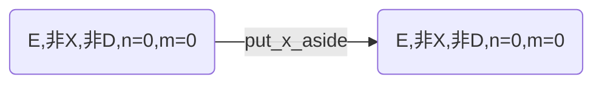
```mermaid
graph LR;
　　S11(E,非X,非D,n=0,m=0) -->|put_x_aside| S19(E,非X,非D,n=0,m=0);
```

（1）若不允许 put-x-aside 行为：


```mermaid
graph LR;
　　S3 -->|put_aside放一边| S19;
　　S19 -->|拿x积木| S11;
　　S11 -->|把x放在y上| S22;
```

或者将 pick-x 理解为"从 $x$ 所在 tower 取出 $x$"（机械臂定点于两个 tower 取件），而非"pick-x 可自动检索 table 中 $x$ 的位置，即便 $x$ 在 tower 上且 $x$ 上方无积木，仍能自动抓取 $x$"。后者将陷入 $a_6$ 放 $x$ 然后 $a_4$ 抓起 $x$ 的无意义循环。当然，若问题分析足够清晰，不定义此动作即可避免。

我们的期望是，即使问题分析不够清晰且定义了 $a_6$，求解时仍能避开导向 Error 的失败 Plan。

（2）若允许 put-x-aside 行为：

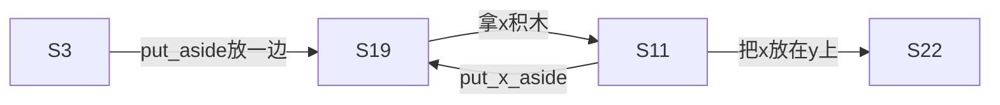
```mermaid
graph LR;
　　S3 -->|put_aside放一边| S19;
　　S19 -->|拿x积木| S11;
　　S11 -->|put_x_aside| S19;
　　S11 -->|把x放在y上| S22;
```

只要对问题有足够清晰的思考，输入时便不会出现 put-x-aside 的情况。问题在于，很多时候我们的 action 并不具备如下清晰的表达形式：

```
全局唯一标识状态码的 precondition --> 全局唯一标识状态码的 effect
```

因此存在以下几个问题：

1. 可能出现冗余的 action。对于复杂问题，难以在一开始就将问题描述得十分清晰，并确定所有可能达到的状态总数。例如，"放下石头"的唯一直观形式化表示为 $\langle \overline{E}, E \rangle$，其对应的实际状态为：

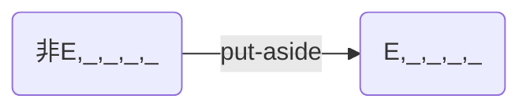
```mermaid
graph LR;
　　S_(非E,_,_,_,_) -->|put-aside| S__(E,_,_,_,_);
```

简而言之，缺省值正是 QNPSAT 方法中将 $r$ 步以内 "$S_0, S_G, S_1, \ldots, S_{r-2}$" 状态值全部枚举并输入生成"原子命题"的原因所在。

根据此表格，直接枚举的结果为：

| 空手 | 手持 X | Goal | X 上 n | Y 上 m | 状态编码 |
| ---- | ---- | ---- | ---- | ---- | ------- |
| E | X | D | n>0 | m>0 | $11111_B = 31_H$ |
| $\overline{E}$ | $\overline{X}$ | $\overline{D}$ | n=0 | m=0 | $00000_B = 0_H$ |

闭着眼睛枚举的话，

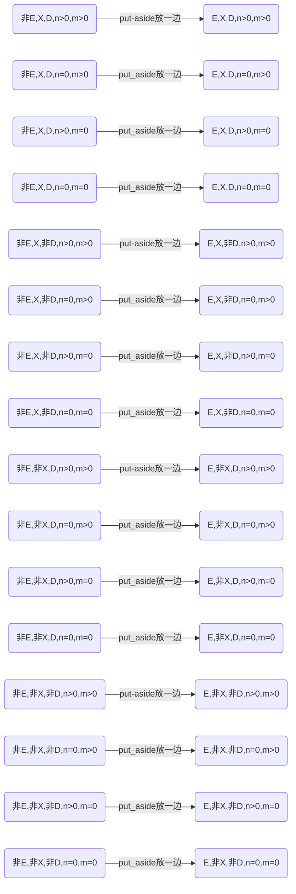
```mermaid
graph LR;
　　S12(非E,X,D,n>0,m>0) -->|put-aside放一边| S28(E,X,D,n>0,m>0);
　　S14(非E,X,D,n=0,m>0) -->|put_aside放一边| S30(E,X,D,n=0,m>0);
　　S13(非E,X,D,n>0,m=0) -->|put_aside放一边| S29(E,X,D,n>0,m=0);
　　S15(非E,X,D,n=0,m=0) -->|put_aside放一边| S31(E,X,D,n=0,m=0);　
　　S8(非E,X,非D,n>0,m>0) -->|put-aside放一边| S24(E,X,非D,n>0,m>0);
　　S10(非E,X,非D,n=0,m>0) -->|put_aside放一边| S26(E,X,非D,n=0,m>0);
　　S9(非E,X,非D,n>0,m=0) -->|put_aside放一边| S25(E,X,非D,n>0,m=0);
　　S11(非E,X,非D,n=0,m=0) -->|put_aside放一边| S27(E,X,非D,n=0,m=0);
　　S4(非E,非X,D,n>0,m>0) -->|put-aside放一边| S20(E,非X,D,n>0,m>0);
　　S6(非E,非X,D,n=0,m>0) -->|put_aside放一边| S22(E,非X,D,n=0,m>0);
　　S5(非E,非X,D,n>0,m=0) -->|put_aside放一边| S21(E,非X,D,n>0,m=0);
　　S7(非E,非X,D,n=0,m=0) -->|put_aside放一边| S23(E,非X,D,n=0,m=0);　
　　S0(非E,非X,非D,n>0,m>0) -->|put-aside放一边| S16(E,非X,非D,n>0,m>0);
　　S2(非E,非X,非D,n=0,m>0) -->|put_aside放一边| S18(E,非X,非D,n=0,m>0);
　　S1(非E,非X,非D,n>0,m=0) -->|put_aside放一边| S17(E,非X,非D,n>0,m=0);
　　S3(非E,非X,非D,n=0,m=0) -->|put_aside放一边| S19(E,非X,非D,n=0,m=0);
```

这样会多出若干孤立子图。需设计一种算法：当状态节点 $S_i$ 的行与列均为全零时，该节点即为孤立节点，可予以删减。

若这些冗余且不可达的状态不幸构成另一段节点数大于 1 的子图，则需运用（下文所述的）ISM 技术去除无关区域。


```mermaid
graph LR;
　　S0(非E,非X,非D,n>0,m>0) -->|put-aside放一边| S16(E,非X,非D,n>0,m>0);
　　S2(非E,非X,非D,n=0,m>0) -->|put_aside放一边| S18(E,非X,非D,n=0,m>0);
　　S1(非E,非X,非D,n>0,m=0) -->|put_aside放一边| S17(E,非X,非D,n>0,m=0);
　　S3(非E,非X,非D,n=0,m=0) -->|put_aside放一边| S19(E,非X,非D,n=0,m=0);
```

实际上，真正可能发生的只有上述四种情况。

## Solution 图解

整个问题的图解即"在下面这张图中找到一条路径"：


```mermaid
graph LR;
　　S16 -->|拿x上石n_DownArrow或拿y上石m_DownArrow| S0;
　　S0 -->|put-aside放一边| S16;
　　S16 -->|当n==1拿x上石n_DownArrow| S2 ;
　　S2 -->|put_aside放一边| S18;
　　S18 -->|当m>1拿y上石m_DownArrow| S2;
　　S18 -->|当m==1拿y上石m_DownArrow| S3;
　　S16 -->|当m==1拿y上石m_DownArrow| S1 ;
　　S1 -->|put_aside放一边| S17;
　　S17 -->|当n>1拿x上石n_DownArrow| S1;
　　S17 -->|当n==1拿x上石n_DownArrow| S3;
　　S3 -->|put_aside放一边| S19;
　　S19 -->|拿x积木| S11;
　　S11 -->|put_x_aside| S19;
　　S11 -->|把x放在y上| S22;
```

其中：

$S16(E,非X,非D,n>0,m>0), S0(非E,非X,非D,n>0,m>0)$
$S2(非E,非X,非D,n=0,m>0), S18(E,非X,非D,n=0,m>0)$
$S1(非E,非X,非D,n>0,m=0), S17(E,非X,非D,n>0,m=0)$
$S3(非E,非X,非D,n=0,m=0), S11(E,非X,非D,n=0,m=0)$
$S19(E,非X,非D,n=0,m=0), S22(E,非X,D,n=0,m>0)$

若换为状态详细的图示则为：

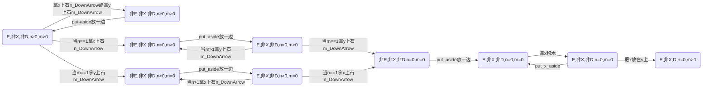
```mermaid
graph LR;
　　S16(E,非X,非D,n>0,m>0) -->|拿x上石n_DownArrow或拿y上石m_DownArrow| S0(非E,非X,非D,n>0,m>0);
　　S0(非E,非X,非D,n>0,m>0) -->|put-aside放一边| S16(E,非X,非D,n>0,m>0);
　　S16(E,非X,非D,n>0,m>0) -->|当n==1拿x上石n_DownArrow| S2(非E,非X,非D,n=0,m>0) ;
　　S2(非E,非X,非D,n=0,m>0) -->|put_aside放一边| S18(E,非X,非D,n=0,m>0);
　　S18(E,非X,非D,n=0,m>0) -->|当m>1拿y上石m_DownArrow| S2(非E,非X,非D,n=0,m>0);
　　S18(E,非X,非D,n=0,m>0) -->|当m==1拿y上石m_DownArrow| S3(非E,非X,非D,n=0,m=0);
　　S16(E,非X,非D,n>0,m>0) -->|当m==1拿y上石m_DownArrow| S1(非E,非X,非D,n>0,m=0) ;
　　S1(非E,非X,非D,n>0,m=0) -->|put_aside放一边| S17(E,非X,非D,n>0,m=0);
　　S17(E,非X,非D,n>0,m=0) -->|当n>1拿x上石n_DownArrow| S1(非E,非X,非D,n>0,m=0);
　　S17(E,非X,非D,n>0,m=0) -->|当n==1拿x上石n_DownArrow| S3(非E,非X,非D,n=0,m=0);
　　S3(非E,非X,非D,n=0,m=0) -->|put_aside放一边| S19(E,非X,非D,n=0,m=0);
　　S19(E,非X,非D,n=0,m=0) -->|拿x积木| S11(E,非X,非D,n=0,m=0);
　　S11(E,非X,非D,n=0,m=0) -->|put_x_aside| S19(E,非X,非D,n=0,m=0);
　　S11(E,非X,非D,n=0,m=0) -->|把x放在y上| S22(E,非X,D,n=0,m>0);
```

**现将求解步骤总结如下：**

1. 标注所有状态：根据动作全观察描述，将动作 precondition 与 effect 中涉及的所有 States 均以"状态编码"标注为节点 node；
2. 打印问题描述的网络图（上图）；
3. 在有向连通图 DG 中找到从 $S_{\text{初始}}$ 到 $S_{\text{目标}}$ 的某一条路径，即规划成功！

DG 有向图

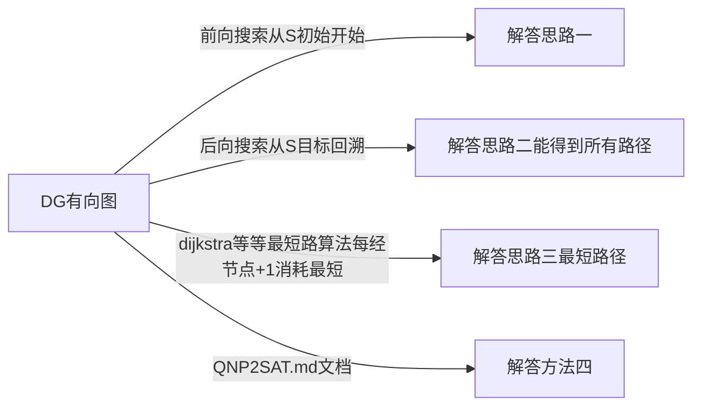
```mermaid
graph LR;
　　DG有向图 -->|前向搜索从S初始开始| 解答思路一;
　　DG有向图 -->|后向搜索从S目标回溯| 解答思路二能得到所有路径;
　　DG有向图 -->|dijkstra等等最短路算法每经节点+1消耗最短| 解答思路三最短路径;
　　DG有向图 -->|QNP2SAT.md文档| 解答方法四;
```

前向搜索从 $S_{\text{初始}}$ 开始，涵盖各种启发式方法、广度优先搜索及深度优先搜索等枚举策略。

后向搜索从 $S_{\text{目标}}$ 回溯，通过多个栈存储多个 action 序列，每个栈分支按照后进先出原则得到所有方案（可达矩阵 $M = (A + I)^r$，每步递增一步，多出的部分可通过 $(A + I)^r - (A + I)^{r-1}$ 从至表矩阵获取。检查上次节点对应的入度"列"中非零元素状态，当该状态不是 $S_{\text{初始}}$ 时予以标记，若是则结束该分支）。若仅需寻找一条路径，则逆向遍历时遇到的岔路相对较少。

1. 计算 $(A + I)^\infty = (A + I)^r$，即最长 $r$ 步的有向图可达矩阵 $M_r$。若 $M[\text{初}, \text{目标}] = 1$，说明有解；否则无解，退出程序。
2. 回溯 $(A + I)^r - (A + I)^{r-1} = A^r$，在第 $r$ 步新增可达矩阵中，寻找 $S_{\text{目标}}$ 状态节点所在列中（行 $\neq 0$ 的横坐标）的入度节点集合，判断其是否等于 $S_{\text{初}}$。若不等于 $S_{\text{初}}$，则全部入栈，将这些节点集标记为 $\text{ReachableG}(r)$，表示 $r$ 步内可达。若其中某节点等于 $S_{\text{初}}$，则说明找到其中一条路径。
3. 回溯 $(A + I)^{r-1} - (A + I)^{r-2} = A^{r-1}$，在第 $r-1$ 步新增可达矩阵中循环。
4. ...
5. 回溯至 $(A + I)^1 - (A + I)^0 = (A + I)^1 - I = A$。正常情况下，只要每次有 $S_{\text{初}}$ 的路径均找出并入栈，即可得到所有路径！若此前所有循环中均未找到 $S_{\text{初}}$，则一开始就不可能满足"$M[\text{初}, \text{目标}] = 1$ 说明有解"，说明输入错误或发生了某些程序错误，否则第一步就应退出程序。

### **矩阵对角元 1-1：强连通关系的等效节点——强连通等效**

此外，还存在一种简化图的求解思路，即"将 $n > 0, n = 0$ 视为非确定性（non-deterministic）"。

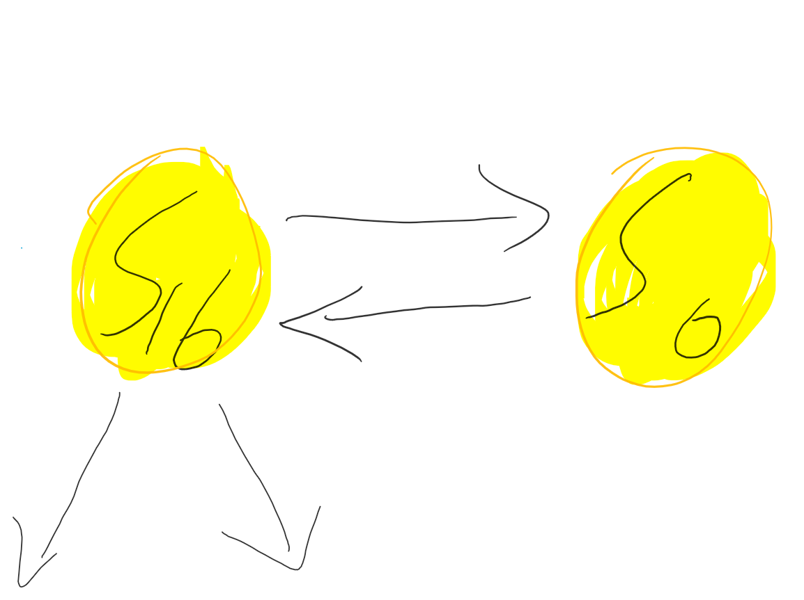

等效为下图：

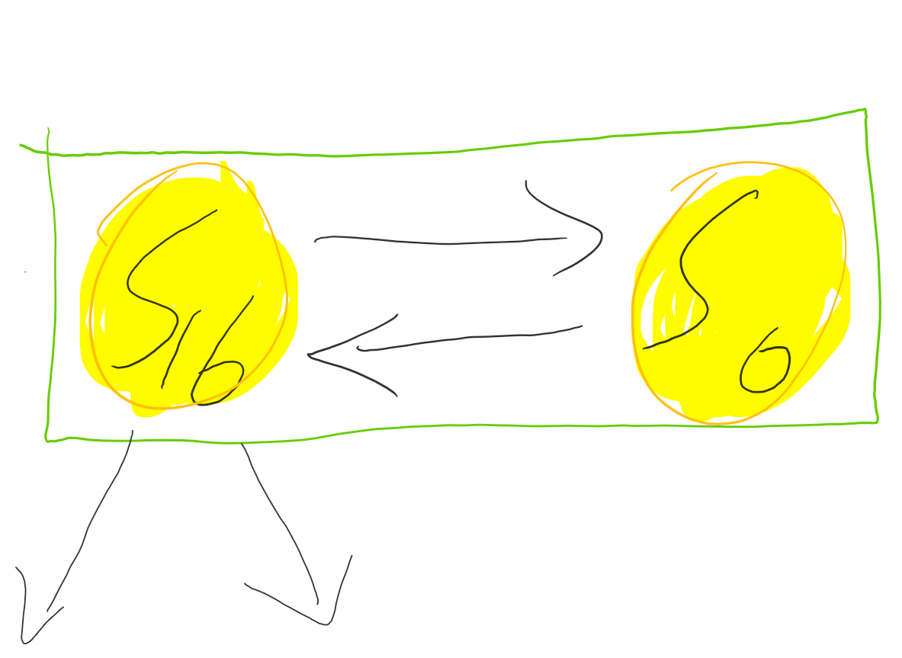

其中可能经历多次循环，但在求解 $S_{\text{初始}} \to S_{\text{目标}}$ 问题的过程中，我们并不关心循环的具体次数。因为具体问题中 $n, m$ 的数值无需保持一致，只需将其视为等效节点 $S_{16-0}$ 即可。这不仅有助于降低计算复杂度，亦能更好地把握问题求解的本质——即寻找一条 $S_{\text{初始}} \to S_{\text{目标}}$ 的路径。

于是原问题的图

A 邻接矩阵：

| 编号 | S16 | S0 | S2 | S18 | S1 | S17 | S3' |
| --- | --- | --- | --- | --- | --- | --- | --- |
| S16 | 0 | 1 | 0 | 0 | 0 | 0 | 0 |
| S0 | 1 | 0 | 1 | 1 | 0 | 0 | 0 |
| S2 | 0 | 0 | 0 | 0 | 1 | 0 | 0 |
| S18 | 0 | 0 | 0 | 0 | 0 | 1 | 0 |
| S1 | 0 | 0 | 1 | 0 | 0 | 0 | 1 |
| S17 | 0 | 0 | 0 | 1 | 0 | 0 | 1 |
| S3' | 0 | 0 | 1 | 0 | 0 | 0 | 0 |

一步内走完的 $M^1 = (A + I)^1$

| 编号 | S16 | S0 | S2 | S18 | S1 | S17 | S3' |
| --- | --- | --- | --- | --- | --- | --- | --- |
| S16 | 1 | 1 | 0 | 0 | 0 | 0 | 0 |
| S0 | 1 | 1 | 1 | 1 | 0 | 0 | 0 |
| S2 | 0 | 0 | 1 | 0 | 1 | 0 | 0 |
| S18 | 0 | 0 | 0 | 1 | 0 | 1 | 0 |
| S1 | 0 | 0 | 1 | 0 | 1 | 0 | 1 |
| S17 | 0 | 0 | 0 | 1 | 0 | 1 | 1 |
| S3' | 0 | 0 | 1 | 0 | 0 | 0 | 1 |

此矩阵中的 $S_3'$ 是：对 $S_{19}$ 和 $S_{11}$ 应用"强连通等效"之后，再应用"单一状态链等效"所得，如下图所示：

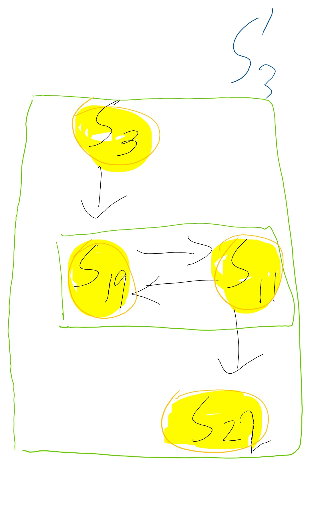

注意，在数据结构中需保存入度和出度的对应关系，形成二维表格。例如，对于"S19-11，S19 入度，S11 出度"，合并时需存储如下信息（以便还原求解路径）：

| | S19 | S11 |
| --- | --- | --- |
| 入度 | 1 | 0 |
| 出度 | 0 | 1 |

实际上，对于一张图，我们可以设置标记变量 $\text{changed} = 0/1$，对一张图反复循环应用两个等效：

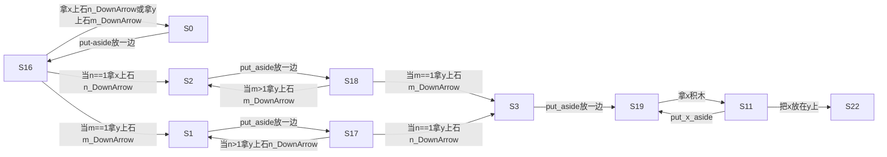
```mermaid
graph LR;
　　S16 -->|拿x上石n_DownArrow或拿y上石m_DownArrow| S0;
　　S0 -->|put-aside放一边| S16;
　　S16 -->|当n==1拿x上石n_DownArrow| S2 ;
　　S2 -->|put_aside放一边| S18;
　　S18 -->|当m>1拿y上石m_DownArrow| S2;
　　S18 -->|当m==1拿y上石m_DownArrow| S3;
　　S16 -->|当m==1拿y上石m_DownArrow| S1 ;
　　S1 -->|put_aside放一边| S17;
　　S17 -->|当n>1拿y上石n_DownArrow| S1;
　　S17 -->|当n==1拿y上石n_DownArrow| S3;
　　S3 -->|put_aside放一边| S19;
　　S19 -->|拿x积木| S11;
　　S11 -->|put_x_aside| S19;
　　S11 -->|把x放在y上| S22;
```

```python
do:
    changed = 0
    if 存在对角元素 1-1:
        强连通等效 + changed = 1
    if actions 的 pre-effect 中存在 1-1 映射的情况:
        单一状态链等效 + changed = 1
while changed != 0
```

变成新的图

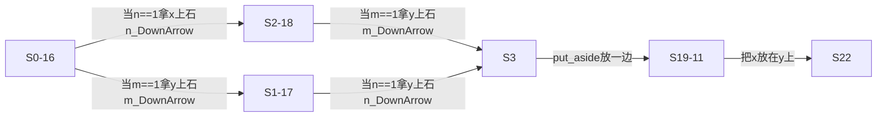
```mermaid
graph LR;
　　S0-16 -->|当n==1拿x上石n_DownArrow| S2-18 ;
　　S2-18 -->|当m==1拿y上石m_DownArrow| S3;
　　S0-16 -->|当m==1拿y上石m_DownArrow| S1-17 ;
　　S1-17 -->|当n==1拿y上石n_DownArrow| S3;
　　S3 -->|put_aside放一边| S19-11;
　　S19-11 -->|把x放在y上| S22;
```

A 邻接矩阵：

| 编号 | S0-16 | S2-18 | S1-17 | S3' |
| --- | --- | --- | --- | --- |
| S0-16 | 0 | 1 | 1 | 0 |
| S2-18 | 0 | 0 | 0 | 1 |
| S1-17 | 0 | 0 | 0 | 1 |
| S3' | 0 | 0 | 0 | 0 |

一步内走完的 $M^1 = (A + I)^1$

| 编号 | S0-16 | S2-18 | S1-17 | S3' |
| --- | --- | --- | --- | --- |
| S0-16 | 1 | 1 | 1 | 0 |
| S2-18 | 0 | 1 | 0 | 1 |
| S1-17 | 0 | 0 | 1 | 1 |
| S3' | 0 | 0 | 0 | 1 |

> 布尔代数法：
> $0 + 0 = 0$，$0 + 1 = 1$，$1 + 0 = 1$，$1 + 1 = 1$
> $0 \cdot 0 = 0$，$0 \cdot 1 = 0$，$1 \cdot 0 = 0$，$1 \cdot 1 = 1$

两步内走完的可达矩阵 $M^2 = (A + I)^2 = A^2 + (A + I)$

| 编号 | S0-16 | S2-18 | S1-17 | S3' |
| --- | --- | --- | --- | --- |
| S0-16 | 1 | 1 | 1 | 1 |
| S2-18 | 0 | 1 | 0 | 1 |
| S1-17 | 0 | 0 | 1 | 1 |
| S3' | 0 | 0 | 0 | 1 |

$A^2$ 矩阵：

| 编号 | S0-16 | S2-18 | S1-17 | S3' |
| --- | --- | --- | --- | --- |
| S0-16 | 0 | 1 | 1 | $1 = 0 \cdot 0 + 1 \cdot 1 + 1 \cdot 1 + 0 \cdot 0$ |
| S2-18 | 0 | 0 | 0 | 1 |
| S1-17 | 0 | 0 | 0 | 1 |
| S3' | 0 | 0 | 0 | 0 |

其中多出的可达关系可由 $M^2 - M^1 - A = A^2 - A$ 表示：

| 编号 | S0-16 | S2-18 | S1-17 | S3' |
| --- | --- | --- | --- | --- |
| S0-16 | 0 | 0 | 0 | 1 |
| S2-18 | 0 | 0 | 0 | 0 |
| S1-17 | 0 | 0 | 0 | 0 |
| S3' | 0 | 0 | 0 | 0 |

直接得到。

第......步

假设该有向图 DG 最多 $r$ 步以内从初始点可抵达目标坐标，则有：

$(A + I)^1 \neq (A + I)^2 \neq \ldots \neq (A + I)^r = (A + I)^{r+1} = \ldots = (A + I)^{\infty}$

因此，最后 $r$ 步内可达的图即可达矩阵 $M$，其意义为："$r$ 步（或无穷步）内，图中行节点 $i$ 连通列节点 $j$ 若为真，则可达矩阵对应 $M[i, j] = 1$，否则 $M[i, j] = 0$。"

本 demo 中 $r = 2$，对于更大的 $r$ 计算方式相同。最终得到 $r$ 步（或无穷步）内的可达矩阵：

| 编号 | S0-16 | S2-18 | S1-17 | S3' |
| --- | --- | --- | --- | --- |
| S0-16 | 1 | 1 | 1 | 1 |
| S2-18 | 0 | 1 | 0 | 1 |
| S1-17 | 0 | 0 | 1 | 1 |
| S3' | 0 | 0 | 0 | 1 |

入度列全为零，起始集 $B(S) = \{ \text{S0-16} \}$，可达集为 S0-16 行对应列为 1 的 $\{ \text{S0-16}, \text{S2-18}, \text{S1-17}, \text{S3'} \}$。当 $B(S)$ 中所有元素各自的可达集交集为空时，说明区域可分。此处 $B(s)$ 仅有一个元素，故区域不可分。

出度行全为零，终止集 $E(S) = \{ \text{S3'} \}$，同样可检查先行集有无交集（略），亦可判断区域不可分。

### ISM 法（Boolean-Matrix）

**亦可采用拓扑排序，以求得先后次序序列**

ISM 技术即递阶结构模型化技术（Interpretive Structural Modeling），最初由美国 J. N. 沃菲尔德教授于 1973 年提出，用于分析社会经济系统的结构性问题。

1. 区域划分
2. 级位划分
3. 提取骨架矩阵
4. 绘制多级递阶有向图 $D(A')$

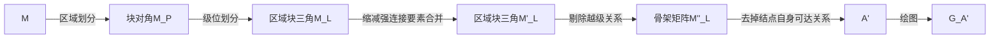
```mermaid
graph LR;
　　M -->|区域划分| 块对角M_P;
　　块对角M_P --> |级位划分| 区域块三角M_L;
　　区域块三角M_L --> |缩减强连接要素合并| 区域块三角M'_L;
　　区域块三角M'_L --> |剔除越级关系| 骨架矩阵M''_L;
　　骨架矩阵M''_L --> |去掉结点自身可达关系| A';
　　A' --> |绘图| G_A';
```

最终输出的结果是使计算机能够"理解"图中节点之间的先后次序、重要性层级与等级关系，从而显式地打印出该问题所对应图的层次化结构：

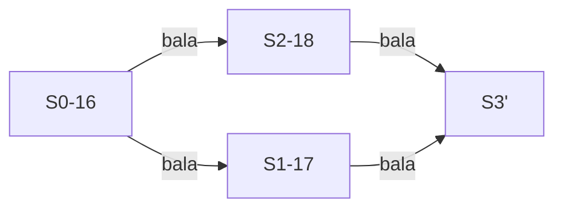
```mermaid
graph LR;
　　S0-16 -->|bala| S2-18 ;
　　S2-18 -->|bala| S3';
　　S0-16 -->|bala| S1-17 ;
　　S1-17 -->|bala| S3';
```

即

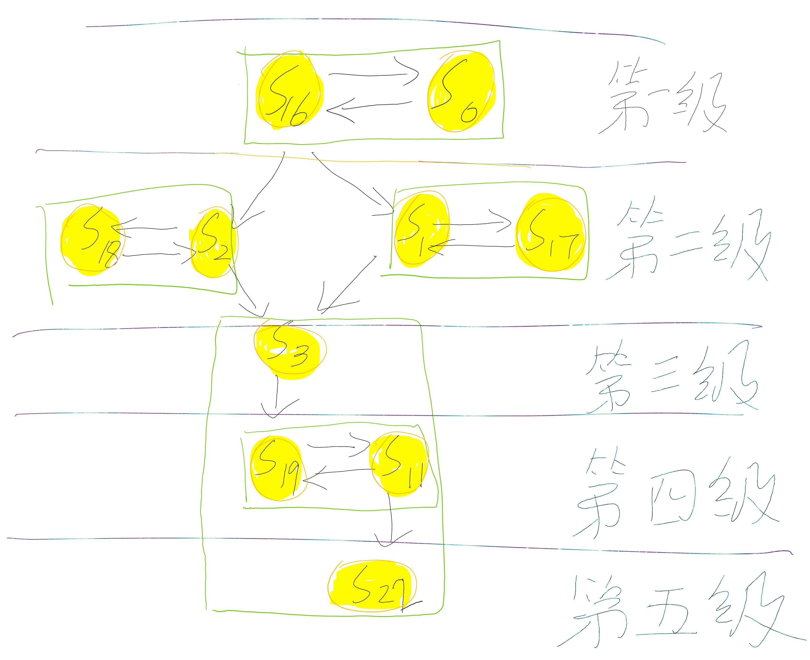

ISM 算法在本问题中优势不甚明显，原因在于问题本身过于简单。若存在大量路径，ISM 可揭示哪些元素是等效的，并可忽略或合并某些循环/一对一状态链，或等价地视为虚拟状态节点，从而显著节省计算成本。

可设计一个更加充分的 demo：

- 展示"剪枝"功能，去除无关子图。例如，给定过多 action，部分 actions 与求解 $S_{\text{初始}} \to S_{\text{目标}}$ 问题毫无关联。在状态生成阶段，需利用 ISM 算法中的"区域划分"去除无关的不连通子图。
- 若存在多条路径可求解 $S_{\text{初始}} \to S_{\text{目标}}$ 问题，ISM 方法能够实现分级、分距离处理，以最为清晰简明的方式提取复杂有向图的"骨架矩阵"，即最核心、最精炼的图结构！经此处理之后，保存、搜索路径及求解的效果均极为理想。

## Gripper

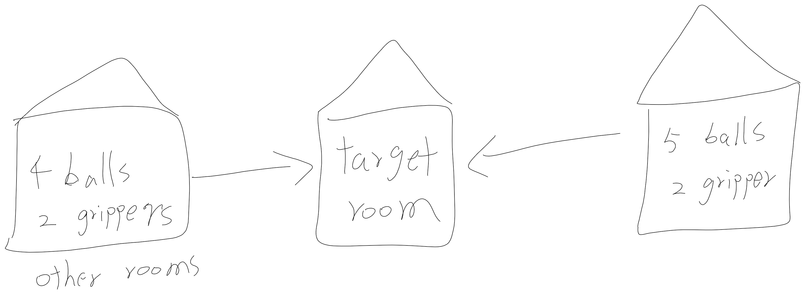


| 目标房间 | 要被移走的 ball | $0 \leq$ 搬运中的 $\leq 2$ | 空夹子数 | 状态编码 |
| ---- | ---- | ---- | ---- | ------- |
| T | b > 0 | c > 0 | g > 0 | $1111_B = 15_H$ |
| $\overline{T}$ | b = 0 | c >= 0 | g = 0 | $0000_B = 0_H$ |

图的节点即状态数量，需先确定共有多少状态：

- actions 中出现的、能够被完全表达且唯一确认的状态需先逐一列出；
- 对于带有缺省值的情况，例如上例中"放下积木"的 $\langle \overline{E}, \_, \_, \_, \_; E, \_, \_, \_, \_ \rangle$，需结合问题中的隐含约束，将状态表达清晰，确保确定的 precondition 状态对应确定的 effect 状态，方为"充分的问题描述"。

1. **不可能发生的矛盾状态**：隐含条件"$c = 0$（未夹持）且 $g = 0$（空夹子数量为零）"不可能同时成立。此问题需要形式化求解者自行理解清楚，在 action 中不应输入此类状态。否则计算机的自动化运算亦无法处理——计算机并不知晓实际语义是否允许这些矛盾状态，其仅负责语法层面的合理性推导！

$S_{\ldots}: (\_, \_, c = 0, g = 0)$

具体即以下四种：

$S_0: (\overline{T}, b = 0, c = 0, g = 0)$
$S_4: (\overline{T}, b > 0, c = 0, g = 0)$
$S_8: (T, b = 0, c = 0, g = 0)$
$S_{12}: (T, b > 0, c = 0, g = 0)$

2. **过程中不关心的无关状态**：

$S_1: (\overline{T}, b = 0, c = 0, g > 0)$

### **重点：有环有向图 → DAG 算法**

状态编码仅为方便处理一对一映射的唯一全局状态标识，故亦可定义为：$v_i > 0$ 取 $1$，$v_i = 0$ 取 $0$。标识方式本身无关紧要，但编写程序时需统一约定。例如，我们约定 $f_i$ 为真取 $1$，$\neg f_i$ 为真取 $0$；$v_i > 0$ 取 $1$，$v_i = 0$ 取 $0$。

此处故意采用与 Block World 不同的编码约定：

| 目标房间 | 剩下要移 ball | carried ball | 空 gripper 数 | 状态编码 |
| ---- | ---- | ---- | ---- | ------- |
| T | b > 0 | c > 0 | g > 0 | $1111_B = 15_H$ |
| $\overline{T}$ | b = 0 | c = 0 | g = 0 | $0000_B = 0_H$ |

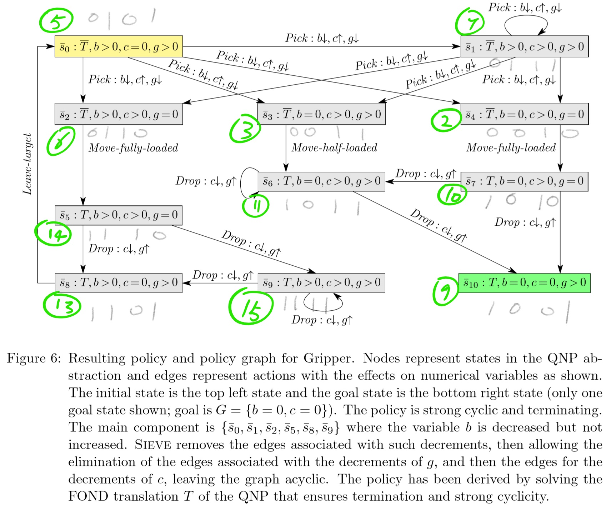

```mermaid
graph LR;
　　S5 -->|Pick1-2| S7;
　　S7 -->|Pick1| S6;
　　S7 -->|Pick1| S2;　　
　　S5 -->|Pick1-2| S6;
　　S6 -->|MoveFullyLoaded| S14;
　　S14 -->|Drop2| S13;
　　S14 -->|Drop1| S15;
　　S15 -->|Drop1| S13;
　　S13 -->|LeaveTargetRoom| S5;
　　S5 -->|b==1Pick1| S3;
　　S5 -->|b==2Pick2| S2;
　　S3 -->|MoveHalfLoaded| S11;
　　S11 -->|Drop1| S9;
　　S2 -->|MoveFullyLoaded| S10 ;
　　S10 -->|Drop2| S9;
　　S10 -->|Drop1| S11;
```

找出所有环，将环上节点合并为一个节点，直至图中不存在环为止。具体代码应如何实现？

识别"强连通分量"（Strongly Connected Components, SCC），然后等效替换强连通分量。

将有向图分解为强连通分量：

> 深度优先遍历的重要应用，SCC 算法，Strongly Connected Components(G)
> 参见《算法导论》第 P357 页

```mermaid
graph LR;
　　S5_6_7_13_14_15 -->|b==1Pick1| S3;
　　S5_6_7_13_14_15 -->|b==2Pick2或者Pick1| S2;
　　S3 -->|MoveHalfLoaded| S11;
　　S11 -->|Drop1| S9;
　　S2 -->|MoveFullyLoaded| S10 ;
　　S10 -->|Drop2| S9;
　　S10 -->|Drop1| S11;
```

此有向无环图 DAG 可使用 ISM 技术或拓扑排序进行处理。

## 设计 Design

## 输入

定义一个标准文本描述格式 FVIOGO.qnp，只需明确描述 $\langle F, V, I, G, O \rangle$ 即可。以 Block World 问题为例：

```
E,X,D#不管你用什么符号，F读取后，自动重命名存成布尔命题f1,f2,f3---1；-f1,-f2,-f3---0
n,m#建议使用v1,v2,v3,...命名。不管你用什么符号，V读取后，程序自动重命名存成v1,v2。约定v1>0,v2>0取值0；v1=0,v2=0取值1；
E,-S,-D,n>0,m>0#初始I，程序先替换为10000B=16D,只需要存一个Interger表示S_0
E,-S,D,n=0,m>0#初始G，程序先替换为10110B=22D,只需要存一个Interger表示S_G
a1:#action 1:Pick-above-x捡起来x上方积木:
　　(E,-X,-D,n>0,m>0), (-E,-X,-D,n>0,m>0);#代码中应该存成命名a1的二维矩阵？或者一维序列每个元素是元组(S16,S0)下同，写成这样
    S16(E,-X,-D,n>0,m>0), S2(-E,-X,-D,n=0,m>0) ;#(S,S)
　　S17(E,-X,-D,n>0,m=0), S1(-E,-X,-D,n>0,m=0);#(S,S)
　　S17(E,-X,-D,n>0,m=0), S3(-E,-X,-D,n=0,m=0);#(S,S)

a2：#Pick-above-y捡起来y上方积木:
　　S16(E,-X,-D,n>0,m>0), S0(-E,-X,-D,n>0,m>0);#(S,S)
　　S18(E,-X,-D,n=0,m>0),S2(-E,-X,-D,n=0,m>0);#(S,S)
　　S18(E,-X,-D,n=0,m>0) , S3(-E,-X,-D,n=0,m=0);#(S,S)
　　S16(E,-X,-D,n>0,m>0) ,S1(-E,-X,-D,n>0,m=0) ;#(S,S)

a3：#put-aside积木(不包括x，手持x放一边叫做put-x-aside是下面讨论的一个动作)放一边到桌面Table
#包括这个 Putaside-1 = h¬E,¬X,¬D,n=0;Ei to put aside (not above x or y) the block being held,
# 也包括这个 Putaside-2 = h¬E,¬X,¬D,n>0,m>0;Ei to put aside (not above x or y) the block being held,
　　S0(-E,-X,-D,n>0,m>0) ,S16(E,-X,-D,n>0,m>0);#(S,S)
　　S2(-E,-X,-D,n=0,m>0),S18(E,-X,-D,n=0,m>0);#(S,S)
　　S1(-E,-X,-D,n>0,m=0) , S17(E,-X,-D,n>0,m=0);#(S,S)
　　S3(-E,-X,-D,n=0,m=0) , S19(E,-X,-D,n=0,m=0);#(S,S)
#这里需要提一点：允许_缺省项
#比如放下石头，唯一的直观形式化表示<-E,E>,其实对应的状态有：
       S_(-E,_,_,_,_) -->|put-aside| S__(E,_,_,_,_);
#然后可以运用PC内部程序需要自动化地枚举遍历：
　　S12(-E,X,D,n>0,m>0) , S28(E,X,D,n>0,m>0);#(S,S)
　　S14(-E,X,D,n=0,m>0) ,S30(E,X,D,n=0,m>0);#(S,S)
　　S13(-E,X,D,n>0,m=0) ,S29(E,X,D,n>0,m=0);#(S,S)
　　S15(-E,X,D,n=0,m=0) ,S31(E,X,D,n=0,m=0);　#(S,S)
　　S8(-E,X,-D,n>0,m>0) ,S24(E,X,-D,n>0,m>0);#(S,S)
　　S10(-E,X,-D,n=0,m>0) ,S26(E,X,-D,n=0,m>0);#(S,S)
　　S9(-E,X,-D,n>0,m=0) ,S25(E,X,-D,n>0,m=0);#(S,S)
　　S11(-E,X,-D,n=0,m=0) ,S27(E,X,-D,n=0,m=0);#(S,S)
　　S4(-E,-X,D,n>0,m>0) , S20(E,-X,D,n>0,m>0);#(S,S)
　　S6(-E,-X,D,n=0,m>0) ,S22(E,-X,D,n=0,m>0);#(S,S)
　　S5(-E,-X,D,n>0,m=0) ,S21(E,-X,D,n>0,m=0);#(S,S)
　　S7(-E,-X,D,n=0,m=0) ,S23(E,-X,D,n=0,m=0);　#(S,S)
　　S0(-E,-X,-D,n>0,m>0),S16(E,-X,-D,n>0,m>0);#(S,S)
　　S2(-E,-X,-D,n=0,m>0) ,S18(E,-X,-D,n=0,m>0);#(S,S)
　　S1(-E,-X,-D,n>0,m=0) ,S17(E,-X,-D,n>0,m=0);#(S,S)
　　S3(-E,-X,-D,n=0,m=0) ,S19(E,-X,-D,n=0,m=0);#(S,S)
#多出来的可以通过ISM技术的"区域划分"去掉"无S0,SG无关的孤立图们"，结果就只剩下这几个真正会用的"可达状态"：
　　S0(-E,-X,-D,n>0,m>0) ,S16(E,-X,-D,n>0,m>0);#(S,S)
　　S2(-E,-X,-D,n=0,m>0) ,S18(E,-X,-D,n=0,m>0);#(S,S)
　　S1(-E,-X,-D,n>0,m=0) ,S17(E,-X,-D,n>0,m=0);#(S,S)
　　S3(-E,-X,-D,n=0,m=0) ,S19(E,-X,-D,n=0,m=0);#(S,S)

#但是如果需要隐含条件推理的"不可能状态"需要人工输入的时候排除，因为PC不知道语义，只知道语法推导没毛病就行。或者需要另外定义一行可选项，用来输入不可能状态，在矩阵处理前去掉这个"不可能状态结点"。可选项怎么弄呢？
a4：#pick-x，拿起来x石头，**关键动作**，pre一对一映射effect的行为，
       S19(E,-X,-D,n=0,m=0) , S11(E,-X,-D,n=0,m=0);#(S,S)

a5：#put-x-on-y,把手中的x放在y上方：
　　S11(E,-X,-D,n=0,m=0) , S22(E,-X,D,n=0,m>0);#(S,S)

a6   #put-x-aside,建议别定义这动作，这是一个危险（毫无意义而且多余）的动作
　　S11(E,-X,-D,n=0,m=0) , S19(E,-X,-D,n=0,m=0);#(S,S)
```

注：此处 $n > 0, n = 0$ 可视为单纯的文字命题，分别代表非零和零。同时，不确定性动作无需传递 if (n == 1) 应走哪条分支路径，因为路径的选择默认由用户根据输出自行判断，甚至 $n = n - 1$ 执行多少次亦无需关心。

这是因为结果输出后，用户"自行判断何时到达 $n = 1$ 临界数值标识状态"，从而开始走非循环的那条路径（此功能主要由"强连通分量的等效图"实现）。

区别于 QNP2SAT 方法中将 $n, n-1, n-2, \ldots, 2, 1$ 均区分为不同状态，每个动作前提需写为：

> S16 -->|当n==1拿x上石n_DownArrow| S2 ;

以此动作为例：

```
{n=1}^S16 --> S2^{n=n-1};#QNP2SAT要写成这样的，如果一个很弱智的问题，但是n比较大，复杂度增加也会很大，这是因为方法不好。
```

在"分量图中找到一条路径解"之后，**还原强连通分量**为"完整问题解路径"的过程中，代码还需处理一个细节：原始图 $G$ 中分量图的输入输出需还原回来。

例如，$S5\_6\_7\_13\_14\_15$ 中，哪些节点是出度节点？哪些是入度节点？

各自指向谁，均需**还原**到完整路径解中（亦即在原始图 $G$ 中读取这些信息，写入分量图补充完整，输出结果即为这样一张图 = Plan 规划方案）。

其实问题亦十分简单。通过观察规律，我们发现**最后找到的分量图中间解还原出来的是原始图 $G$ 中的子图**。换言之，从原始图 $G$ 的矩阵中，挑选出"仅包含分量图中间解所提及的所有节点坐标"，填入该节点集横纵坐标所对应的新邻接矩阵，即得子图的矩阵。

## 类图设计

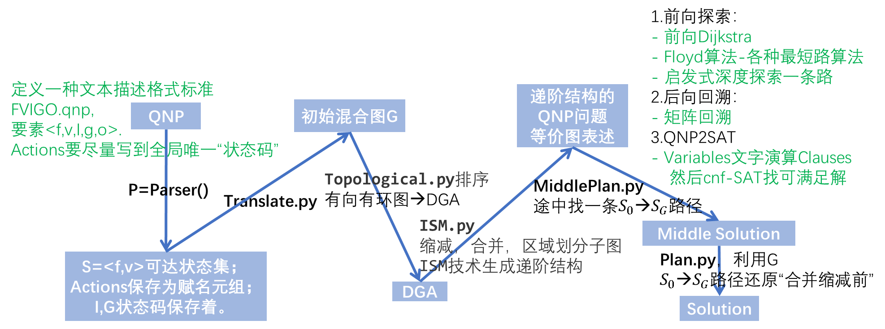

此处的"最短路"仅指拓扑意义上的路径最短，并不等同于实际的步数最短。由于强连通分量的循环次数已被合并缩减为一个节点，无从得知一个节点所对应的实际步数，除非引入加权机制，将每次循环 $(n-1)$ 次或 $(m-1)$ 次的路径均显式表示出来。然而，如此实现较为困难，因为序列中可能先不确定地执行若干次，而后到达关键节点才执行 $(n-1)$ 次。因此，本方法的不足之处在于无法找到绝对数值意义上路径最短的 Plan。

值得肯定的是，某些 Plan 只要能走通，其路径消耗长度是相同的。

示例如下：

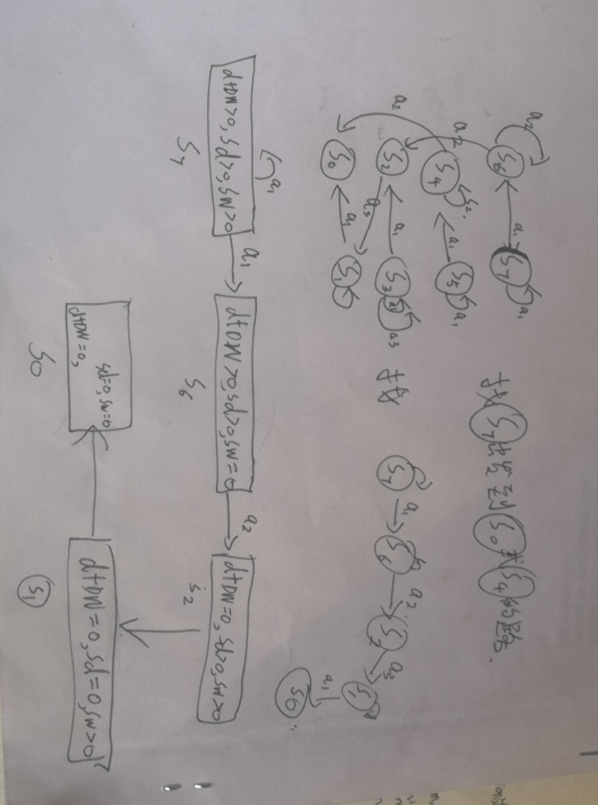

### 证明"程序终止性"

笔者接连使用了 Tarjan、ISM、Dijkstra 等现有图论算法，这些算法是否尚需单独证明？或许仅需证明非现成算法的部分——即"为每个强连通分量（环）寻找一条确定性路径"的算法。

对此算法的构想如下：采用节点封装后的"强连通分量子图"，从子图的入口节点 $S_i$ 出发，通过 Dijkstra/Floyd 算法找到一条抵达出口节点 $S_j$ 的路径。这些似乎均属于图论范畴内的既有方法……既然每个用到的现有图论算法均可保证终止，那么依次串联使用，是否必然能够保证"整体一定终止"？

## 输出

- 原始问题的图 $G$

例如：

```mermaid
graph LR;
　　S16 -->|拿x上石n_DownArrow或拿y上石m_DownArrow| S0;
　　S0 -->|put-aside放一边| S16;
　　S16 -->|当n==1拿x上石n_DownArrow| S2 ;
　　S2 -->|put_aside放一边| S18;
　　S18 -->|当m>1拿y上石m_DownArrow| S2;
　　S18 -->|当m==1拿y上石m_DownArrow| S3;
　　S16 -->|当m==1拿y上石m_DownArrow| S1 ;
　　S1 -->|put_aside放一边| S17;
　　S17 -->|当n>1拿x上石n_DownArrow| S1;
　　S17 -->|当n==1拿x上石n_DownArrow| S3;
　　S3 -->|put_aside放一边| S19;
　　S19 -->|拿x积木| S11;
　　S11 -->|put_x_aside| S19;
　　S11 -->|把x放在y上| S22;
```

- 缩减之后的图 DAG

例如：

```mermaid
graph LR;
　　S0-16 -->|bala| S2-18 ;
　　S2-18 -->|bala| S3;
　　S0-16 -->|bala| S1-17 ;
　　S1-17 -->|bala| S3;
　　S3 -->|put_aside放一边| S11-19;
　　S11-19 -->|把x放在y上| S22;　　
```

此处最好能自动绘制出 ISM 递阶等级的图。

- 一条缩减的路径解图

例如：

```mermaid
graph LR;
　　S0-16 -->|bala| S2-18 ;
　　S2-18 -->|bala| S3;
　　S3 -->|put_aside放一边| S11-19;
　　S11-19 -->|把x放在y上| S22;　　　　
```

- 一条未经缩减的路径解图

例如：

```mermaid
graph LR;
　　S16 -->|拿x上石n_DownArrow或拿y上石m_DownArrow| S0;
　　S0 -->|put-aside放一边| S16;
　　S16 -->|当n==1拿x上石n_DownArrow| S2 ;
　　S2 -->|put_aside放一边| S18;
　　S18 -->|当m>1拿y上石m_DownArrow| S2;
　　S18 -->|当m==1拿y上石m_DownArrow| S3;
　　S3 -->|put_aside放一边| S19;
　　S19 -->|拿x积木| S11;
　　S11 -->|put_x_aside| S19;
　　S11 -->|把x放在y上| S22;
```

---

```mermaid
graph LR;
　　S16 -->|拿x上石n_DownArrow或拿y上石m_DownArrow| S0;
　　S0 -->|put-aside放一边| S16;
　　S16 -->|当n==1拿x上石n_DownArrow| S2 ;
　　S2 -->|put_aside放一边| S18;
　　S18 -->|当m>1拿y上石m_DownArrow| S2;
　　S18 -->|当m==1拿y上石m_DownArrow| S3;
　　S16 -->|当m==1拿y上石m_DownArrow| S1 ;
　　S1 -->|put_aside放一边| S17;
　　S17 -->|当n>1拿x上石n_DownArrow| S1;
　　S17 -->|当n==1拿x上石n_DownArrow| S3;
　　S3 -->|put_aside放一边| S19;
　　S19 -->|拿x积木| S11;
　　S11 -->|put_x_aside| S19;
　　S11 -->|把x放在y上| S22;
```

---

```mermaid
graph LR;
　　S16 -->|拿x上石n_DownArrow或拿y上石m_DownArrow| S0;
　　S0 -->|put-aside放一边| S16;
　　S16 -->|当n==1拿x上石n_DownArrow| S2 ;
　　S16 -->|当m==1拿y上石m_DownArrow| S1 ;
　　S1 -->|put_aside放一边| S17;
　　S17 -->|当n>1拿x上石n_DownArrow| S1;
　　S17 -->|当n==1拿x上石n_DownArrow| S3;
　　S3 -->|put_aside放一边| S19;
　　S19 -->|拿x积木| S11;
　　S11 -->|put_x_aside| S19;
　　S11 -->|把x放在y上| S22;
```

---

```mermaid
graph LR;
　　S16 -->|拿x上石n_DownArrow或拿y上石m_DownArrow| S0;
　　S0 -->|put-aside放一边| S16;
　　S16 -->|当n==1拿x上石n_DownArrow| S2 ;
　　S2 -->|put_aside放一边| S18;
　　S18 -->|当m>1拿y上石m_DownArrow| S2;
　　S18 -->|当m==1拿y上石m_DownArrow| S3;
　　S3 -->|put_aside放一边| S19;
　　S19 -->|拿x积木| S11;
　　S11 -->|put_x_aside| S19;
　　S11 -->|把x放在y上| S22;
```

## 关键代码和实现 demo

Jupyter Notebook

## Demo 封装 Packages

Python Package

## 参考 2-SAT 问题求解算法

[2-SAT 问题求解算法 (百度文库)](https://wenku.baidu.com/view/0f96c3daa58da0116c1749bc.html)

[2-SAT 算法详解 (CSDN)](https://blog.csdn.net/JarjingX/article/details/8521690)
