[TOC]


# QNP图解


## 一个变量

积木世界

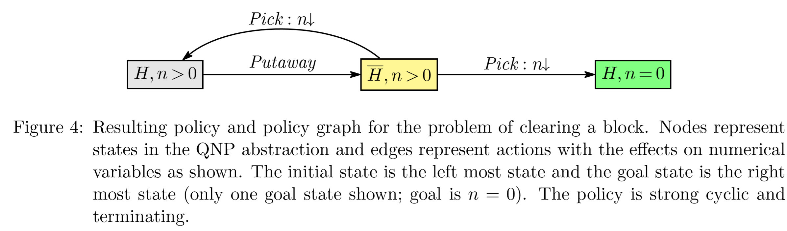

### 两个变量


积木世界接龙版

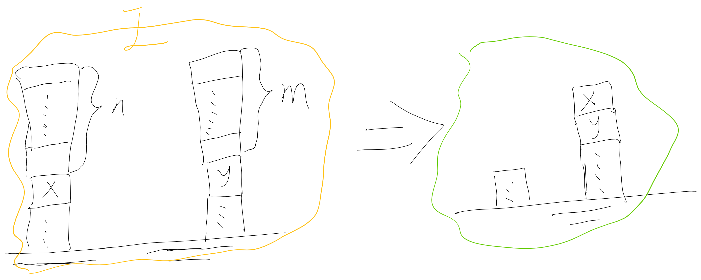


文中这样的解法的图我感觉是不合适的：


感觉不一定清理完X上的n个积木，再请开y上的m个积木，


也可能是先y后x


**更可能求解的图**应该是像下面这样x，y混合着来：


## QNP问题形式化


QNP问题形式化为：$Q = < F,V,I,O,G >$


$F = \{ E空手,X手持积木'x',D 达成目标积木'x'放在积木'y'上方\}$


$V = {积木'x'上方有n块积木,积木'y'上方有非负整数m块积木}$

注：我认为就算是小数n,m,比如晶圆堆叠制造，只要是可定义单位数量离散事件，就能够通过GCD(n,m)，然后把n'=n/GCD,m'=m/GCD变成整数单位，所以这里只考虑整数n,m。

## states

$Init = S_{16}:(E,\overline{X},\overline{D},n>0,m>0)$


$Goal = S_{22}(E,\overline{X},D,n=0,m>0)$

每个状态都$S=F+V=f_1,f_2,...,f_f+v_1,v_2,...,v_v$组成，

方便可用状态的枚举过程做到不重不漏，并且后续画图简便:

约定一种"状态s --> interger整数 $\in \{0,1,2, ... ,2^{f+v}-1\}$"的映射方式---状态码。


闭着眼睛枚举的话，有$2^n*2^n$状态关系可达矩阵M，其中，需要设计一个算法：当状态结点$S_i$的行列都全为零，这是孤立节点或者说是图，可以删减掉这些没有用的状态节点。


|   空手   |  手持X   |  Goal      |   X上n     |   Y上m     | 状态编码|
| ---- | ---- | ---- | ---- | ---- | ------- |
|E      |      X|      D| n=0| m=0| $11111_B = 31_H$|
|$\overline{E}$|$\overline{X}$|$\overline{D}$|n>0|m>0| $00000_B = 0_H$ |


## Actions:


- Pick-above-x = hE,¬X,¬D,n>0,m>0;¬E,n↓i to pick the topmost block that is above x,


- $a_1$,Pick-above-x捡起来x上方积木:


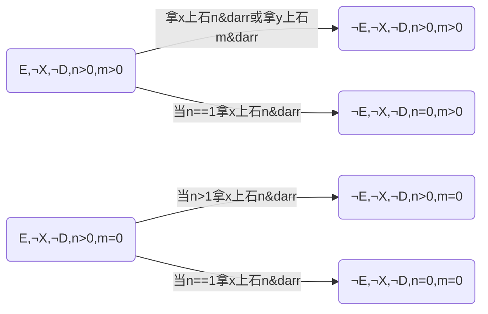


- $a_2$，Pick-above-y捡起来y上方积木:

- Pick-above-y = hE,¬X,¬D,n=0,m>0;¬E,m↓i to pick the topmost block that is above x,


- $a_3$，put-aside积木(不包括x，手持x放一边叫做put-x-aside是下面讨论的一个动作)放一边到桌面Table:
- Putaside-1 = h¬E,¬X,¬D,n=0;Ei to put aside (not above x or y) the block being held,


- Putaside-2 = h¬E,¬X,¬D,n>0,m>0;Ei to put aside (not above x or y) the block being held,


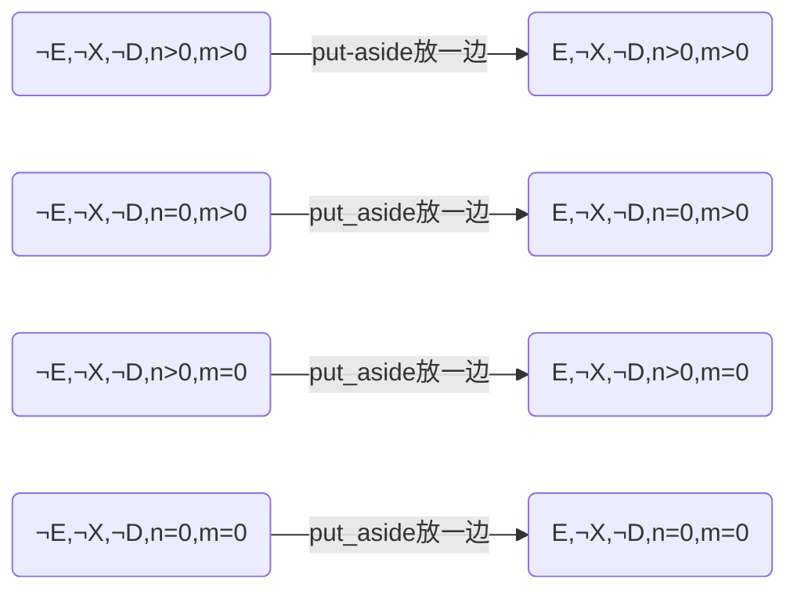


- $a_4$，pick-x，拿起来x石头，**关键动作**，pre一对一映射effect的行为，
可以合并 **$\bf{g^{...}}$ -->...-->g'-->G**状态链 表示为$g^{...}$状态,目标状态G的“等价态s”，减少状态数，方便不必要的排序。
- Pick-x = hE,¬X,¬D,n=0,m=0;¬E,Xi to pick block x,


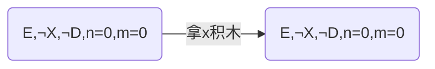


## **“单一状态链等效”---弃**

算法原理：矩阵A结点行列各只有一个且不相等，因为提高复杂度而且不去掉也行，在这最后合并为一个节点，递归深度，没必要太深的封装，最新更新，这是多余的想法。

**最后决定舍弃这个等效，不适用**

同理，不仅有终止等价态，过程中,也把一对一映射的单一状态链，等价标识为$S_{状态链中最早（左）的状态}'$


比如：$S_3 -->S_{19} --> S_{11} --> S_{21}$


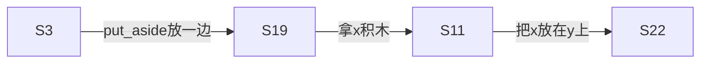


标识为$S_3'$


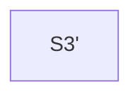


- $a_5$，put-x-on-y,把手中的x放在y上方：
- Put-x-on-y = h¬E,X,¬D,n=0,m=0;E,¬X,D,m↑i to put x on y.


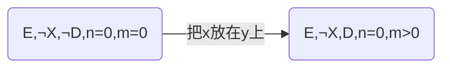


- $a_6$,put-x-aside,建议别定义这动作，这是一个危险（毫无意义而且多余）的动作，因为没有定义pick-block-from-table，如果x放桌面拿不起来任务失败，这是一个需要剪枝的失败路径。但是在对问题分析不够清楚的时候，有可能传进去这种错的。
- Put-x-aside = h¬E,X,¬D,n=0,m>0;E,¬Xi to put block x aside (not above y), and

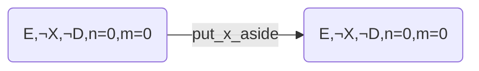


（1）如果不允许put-x-aside行为：


或者把pick-x不理解为“从x所在tower取出来x”(机械臂定点两个tower取件)，而是理解为“pick-x可以自动检索table中x的位置，哪怕x在tower上但是x上方没有积木，然后自动抓取x”。就会陷入一种$a_6$放x然后$a_4$抓起来x的无意义循环中，当然不定义这步不就行了吗（当问题分析足够清楚）？

我们希望当问题分析不清楚，假如定义了这步$a_6$，也能求解的时候避开 通往Error的失败Plan。

（2）如果允许put-x-aside行为：

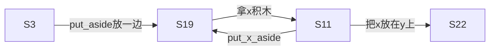


只要对问题思考足够清晰，喂进去的时候就不会出现有put-x-aside这个情况，问题是，很多时候，我们的action不是

```
全局唯一标识状态码的precondition-->全局唯一标识状态码的effect
```


这么清晰的，所以有几个问题：

1. 有可能出现冗余的action。对于复杂的问题，难以直接一开始输入就把问题描述很清晰，确定所有有可能达到的状态总数，比如放下石头，唯一的直观形式化表示<$\overline{E},E$>,其实对应的状态有：

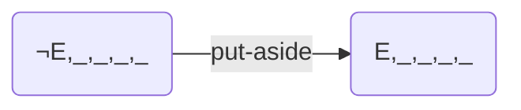

简单来说，_缺省值也是QNPSAT方法中，把在r步以内”$S_0,S_G,S_1,...,S_{r-2}$“状态值统统枚举，喂进去生成”原子命题“的原因。

根据这个表格，直接枚举的话：

|   空手   |  手持X   |  Goal      |   X上n     |   Y上m     | 状态编码|
| ---- | ---- | ---- | ---- | ---- | ------- |
|E      |      X|      D| n>0| m>0| $11111_B = 31_H$|
|$\overline{E}$|$\overline{X}$|$\overline{D}$|n=0|m=0| $00000_B = 0_H$ |


闭着眼睛枚举的话，


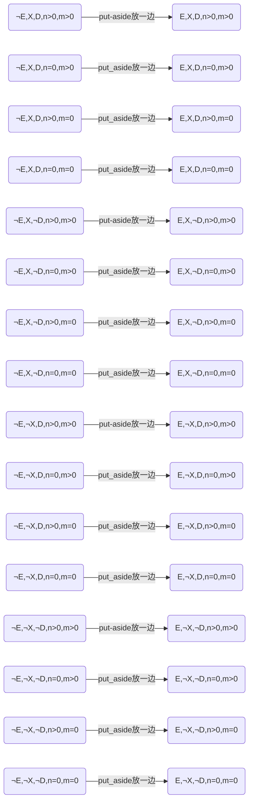


会多出来几个孤立的图，需要设计一个算法：当状态结点$S_i$的行列都全为零，这是孤立节点，可以删减掉这些没有用的状态节点。

如果这些冗余不可能抵达的状态还不幸形成另一小段结点数>1的图，那么就需要（下文的ISM技术后去掉区域无关的图）


实际上真正有可能的只有这四种情况：


##  solution图解

然后整个问题的图解就是“在下面这张图中找到一条路径”：

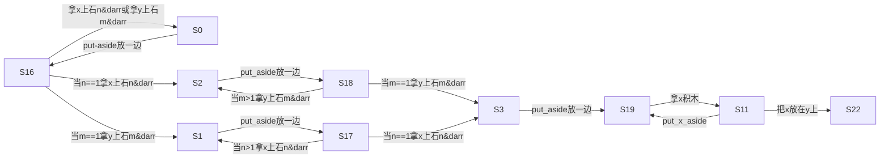

其中：


```mermaid
graph LR;
　　$S16(E,&notX,&notD,n>0,m>0),S0(&notE,&notX,&notD,n>0,m>0)$
　　$S2(&notE,&notX,&notD,n=0,m>0),S18(E,&notX,&notD,n=0,m>0)$
　　$S1(&notE,&notX,&notD,n>0,m=0),S17(E,&notX,&notD,n>0,m=0)$
　　$S3(&notE,&notX,&notD,n=0,m=0),S11(E,&notX,&notD,n=0,m=0),S19(E,&notX,&notD,n=0,m=0),S22(E,&notX,D,n=0,m>0)$
　　
```


如果换成状态详细的图就是：

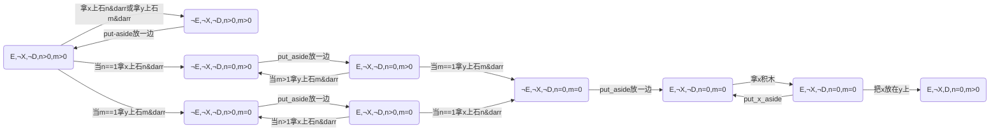


**总计一下求解的步骤**

1. 标注出所有状态：根据动作全观察描述，把动作中（precondition+effect）中涉及States都“状态编码”结点node；
2. 动作print问题描述的网络图.jpg(上图)；
3. 在DG有向连通图中找到从“$S_{初始}$”到"$S_{目标}$"的某一条路径，就等于规划成功！

DG有向图


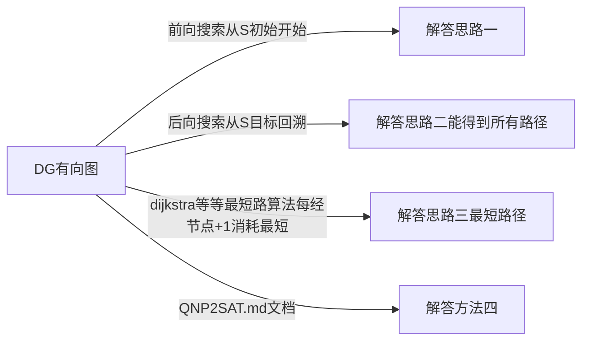


前向搜索从S初始开始包括各种启发式，广度优先，深度优先。枚举笨方法


后向搜索从S目标回溯多个栈存下来多个action序列然后每个栈分支，都后进先出得到所有方案（可达矩阵$M=(A+I）^r$，每次多走一步，多出来的可以通过(A+I)^r-(A+I)^{r-1}从至表矩阵中，上次的结点对应的入度的“列”中有多少个非零元素状态，当那个状态不是$S_{初始}$就mark下来，如果是，就结束这条分支），如果只需要找一条路径，倒着走迷宫，还是少很多岔路的。


1. 计算$(A+I)^\infty=(A+I)^r$是最长r步的有向图中可达矩阵$M_r$，S初-->S目标如果M[初，目标]==1说明有解，否则无解退出程序。
2. 回溯$(A+I)^r-(A+I)^{r - 1}=A^r$第r步新增可达矩阵中，找S目标状态结点所在列的（行$\neq 0$的横坐标）入度结点们，判断是否==S_初，如果不等于S初统统进栈，这些结点集标记为ReachableG(r),意思是r步内可达，如果里面有某个结点等于S初就说明找到其中一条路径。
3. 回溯$(A+I)^{r-1}-(A+I)^{r-2}=A^{r-1}$第r-1步新增可达矩阵,循环
4. ......回溯$(A+I)^2-(A+I)^{1}=A^2$ 2步以内新增可达矩阵值中，循环
5. 执行循环直到回溯$(A+I)^1-(A+I)^{0}=(A+I)^1-I=A$ ,正常来说，只要每次有S_初的路径都找出来栈里存起来，就能得到所有的路径！如果前面所有循环中一个S_初都还没找到，那一开始就不可能“M[初，目标]==1说明有解”，说明输入错误或者发生某些的程序错误，否则第一步就应该退出程序。


### **矩阵对角元1-1，强联通关系的等效结点-强连通等效**


还有一个等效方便图的思考求解过程则是“我们n>0,n=0作为non-deterministic”


等效为下图：


其中可能很多次循环，但是我们求解"$S_初始-->S_目标$"问题中过程中，不关心循环了多少次，因为具体问题的n,m具体数值不需要一样，我们只要当作等效的$S_{16-0}$结点即可。这样不但有助于降低计算复杂度，也能更好抓住问题求解的本质---找一条$S_初始-->S_目标$路径。


于是原来的问题的图


A邻接矩阵：

|编号|S16|S0|S2|S18|S1|S17|S3'|
| ---  | --- | --- | --- | --- | --- | --- | --- |
|S16 |  0   |   1  |   0  |  0  |   0  |   0   |  0   |
|S0   |   1  |  0   |  1   |  1   |   0  |   0  |  0   |
|S2   |   0  |  0   |   0  |   0  |   1  |   0  |  0   |
|S18 |   0  |   0  |   0  |   0  |   0  |   1  |  0   |
|S1   |   0  |   0  |   1  |   0  |   0  |    0 |   1  |
|S17 |  0   |   0  |   0  |    1 |    0 |    0 |   1  |
|S3'  |   0  |  0   |   1  |    0 |    0 |    0 |   0  |


一步内走完的$M^1=(A+I)^1$

|编号|S16|S0|S2|S18|S1|S17|S3'|
| ---  | --- | --- | --- | --- | --- | --- | --- |
|S16 |  1   |   1  |   0  |  0  |   0  |   0   |  0   |
|S0   |   1  |  1   |  1   |  1   |   0  |   0  |  0   |
|S2   |   0  |  0   |   1  |   0  |   1  |   0  |  0   |
|S18 |   0  |   0  |   0  |   1  |   0  |   1  |  0   |
|S1   |   0  |   0  |   1  |   0  |   1  |    0 |   1  |
|S17 |  0   |   0  |   0  |    1 |    0 |    1 |   1  |
|S3'  |   0  |  0   |   1  |    0 |    0 |    0 |   1  |


这矩阵中的$S_s'$是：对$s_{19}$和$S_{11}$应用“强连通等效”之后，再应用“单一状态链等效”得到$S_3'$如图所示：

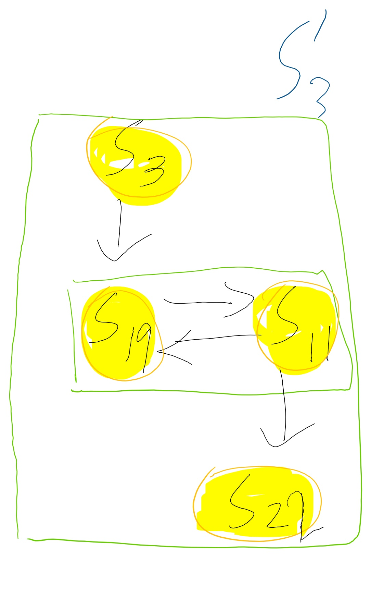

注意要数据结构中要保存到底是谁在入度和出度，保存成一个二维表格。比如"S19-11中，S19入度，S11出度"，在合并的时候要存下来这样的信息（方便还原求解路径）：

|   | S19 | S11|
| --- | ---  |  --- |
|入度|  1   |   0   |
|出度|  0   |   1   |


实际上一个图我们可以设置标记变量changed==0/1，对一张图反复循环应用两个等效：


```
do{
    changed=0;
    if(存在对角元素1-1) {"强连通等效+changed=1};
    if(actions的pre-effect中存在1-1映射的情况) {"单一状态链等效"+changed=1;
} Until (changed==0)

```


变成新的图


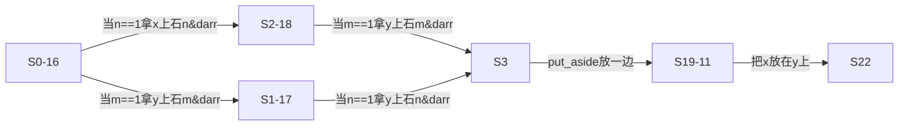


A邻接矩阵：

|编号    |S0-16|S2-18|S1-17|S3'  |
| ---     | ---  | --- | --- | --- |
|S0-16 |  0   |   1  |   1  |  0  |
|S2-18 |   0  |   0  |   0  |   1  |
|S1-17 |   0  |   0  |   0  |   1  |
|S3'      |   0  |  0   |   0  |    0 |


一步内走完的$M^1=(A+I)^1$


|编号    |S0-16|S2-18|S1-17|S3'  |
| ---     | ---  | --- | --- | --- |
|S0-16 |  1   |   1  |   1  |  0  |
|S2-18 |   0  |   1  |   0  |   1  |
|S1-17 |   0  |   0  |   1  |   1  |
|S3'      |   0  |  0   |   0  |    1 |


>布尔代数法：
>0+0=0，0+1=1，1+0=1，1+1=1
>0\*0=0，0\*1=0，1\*0=0,1\*1=1


两步内走完可达矩阵
$M^2=(A+I)^2=A^2+(A+I)$

|编号    |S0-16|S2-18|S1-17|S3'  |
| ---     | ---  | --- | --- | --- |
|S0-16 |  1   |   1  |   1  |  1  |
|S2-18 |   0  |   1  |   0  |   1  |
|S1-17 |   0  |   0  |   1  |   1  |
|S3'      |   0  |  0   |   0  |    1 |


$A^2$矩阵：

|编号    |S0-16|S2-18|S1-17|S3'  |
| ---     | ---  | --- | --- | --- |
|S0-16 |  0   |   1  |   1  |  1=0\*0+1\*1+1\*1+0\*0  |
|S2-18 |   0  |   0  |   0  |   1  |
|S1-17 |   0  |   0  |   0  |   1  |
|S3'      |   0  |  0   |   0  |    0 |


其中多出来的可达的地方可以用$M^2-M^1-A=A^2-A$

|编号    |S0-16|S2-18|S1-17|S3'  |
| ---     | ---  | --- | --- | --- |
|S0-16 |  0   |   0  |   0  |  1  |
|S2-18 |   0  |   0  |   0  |   0  |
|S1-17 |   0  |   0  |   0  |   0  |
|S3'      |   0  |  0   |   0  |    0 |


直接得到.


第......步


假设这个有向图DG最多r步以内从初始点能抵达目标坐标，那么我们有

$(A+I)^1 \neq (A+I)^2 \neq (A+I)^{...} \neq (A+I)^r =(A+I)^{r+1} = (A+I)^{...} =(A+I)^{\infty}$

所以最后r步内可达的图就是可达矩阵M,表示的意义就是“r步或者说无穷内，图中行节点i连通列节点j这件事如果为真，那么从至表（可达矩阵）对应m[i,j]=0,否则M[i,j]=0.”


这个demo的r=2,反正r更大也是一样滴算，最后知道r步或者说无穷步之内的可达矩阵：

|编号    |S0-16|S2-18|S1-17|S3'  |
| ---     | ---  | --- | --- | --- |
|S0-16 |  1   |   1  |   1  |  1  |
|S2-18 |   0  |   1  |   0  |   1  |
|S1-17 |   0  |   0  |   1  |   1  |
|S3'      |   0  |  0   |   0  |    1 |


入度列全为零,起始集B(S)={s0-16}，可达集S0-16行对应列为1的{S0-16，S2-18，S1-17，S3' }，当B(S)中所有元素各自的可达集 交集为空，说明区域可分。这里B(s)只有一个元素，区域不可分。

出度行全为零,终止集E(S)={S3'}，也能看先行集有没有交集，略，反正也能看出区域不可分。


### ISM法boolen-matrix

**或者拓朴排序找个先后次序序列**

ISM技术是递阶结构模型技术，最开始是美国J.N.沃菲尔德教授1973年提出的分析社会经济系统结构问题的方法。

1. 区域划分
2. 级位划分
3. 提取骨架矩阵
4. 绘制多级递阶有向图D(A')


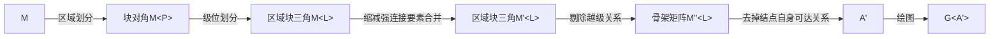


最后输出的结果是计算机能够“理解”图中先后次序，重要性和等级，显式打印出这个问题对应图的等级：


```mermaid
graph LR;
　　S0-16 -->|bala| S2-18 ;
　　S2-18 -->|bala| S3';
　　S0-16 -->|bala| S1-17 ;
　　S1-17 -->|bala| S3';
```


即
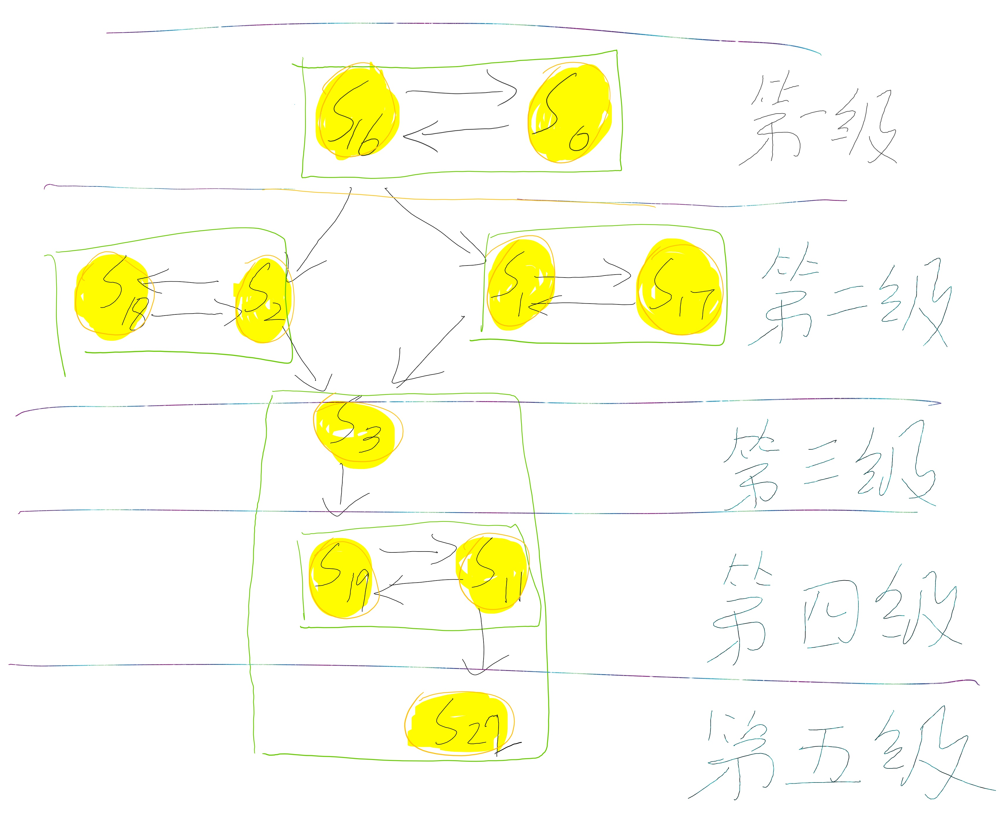


这个问题ISM算法优势不太明显是因为过分简单，如果有很多的路径，他能够告诉你，哪些元素是等效的，可以忽略合并某些循环/1-1状态链，或者等价看作虚拟状态节点节省计算成本。


可以设计一个更加充分的demo

- 显示“剪枝”去掉无关子图的功能，比如给的功能action过多，实际上有些actions对解决“S_初始-->S_目标” 问题毫无关系，在前面状态生成中，就需要这个算法中的“区域划分”去掉无关不连通的其他图。

- 如果有很多条路可解决“S_初始-->S_目标” 问题，实际上这个ISM方法的结果能够实现分级，分距离，最清晰简明的方法找到一张复杂有向图的“骨架矩阵对应最核心简明扼要的图”！这样处理后，保存，搜索一条路径和求解都是极好的。


## Gripper


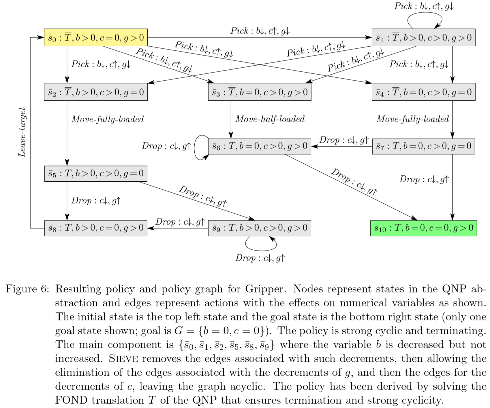


|   目标房间   |  要被移走的ball   |  0<=搬运中的<=2    |   空夹子数  | 状态编码|
| ---- | ---- | ---- | ---- | ------- |
|T     |     b>0 |    c>0   | g>0| $1111_B = 15_H$|
|$\overline{T}$|b=0 |    c>=0   | g=0| $0000_B = 0_H$ |


图的节点是状态数量，先要确定有多少状态：

- actions中$a_i$出现的能够完全表达唯一确认的状态先全部列出
- 然后对于有缺省值的，比如放下上一个例子中放下积木的<$\overline{E},\_,\_,\_,\_;E,\_,\_,\_,\_$>，因为问题中的隐含约束等限制，也要把状态表达清晰，确定的pre状态 --> 确定的effect状态，才是“足够的问题描述”

1. 不可能发生的矛盾状态：隐含条件"c=0没在夹持，g=0空夹子数量为零"，不可能同时发生。这个需要问题形式化的求解者自己想明白，在action别输入这种状态，否则计算机自动化运算也帮不了你，计算机不知道实际语义是否允许这几个矛盾状态，他只管语法推导的合理性！

$S_{...}:(\_,\_,c=0,g=0)$

具体就是这四种：

$S_{0}:(\overline{T},b=0,c=0,g=0)$
$S_{4}:(\overline{T},b>0,c=0,g=0)$
$S_{8}:(T,b=0,c=0,g=0)$
$S_{12}:(T,b>0,c=0,g=0)$


2. 过程中不关心的无关状态：

$S_{1}:(\overline{T},b=0,c=0,g>0)$

### **重点是有环的有向图-->DGA**算法：

状态码编码,只是为了方便处理1-1映射的唯一标识的全局状态，所以也可以定义：$v_i>0$取1，$v_i=0$取0。只是标识无所谓，而写成程序需要统一约定一个，比如我们约定$f_i$为真取1，$\neg f_i$为真取0;$v_i>0$取1，$v_i=0$取0。


比如这里我故意用和Block world不同的编码约定：

|   目标房间   |  剩下要移ball   |  carried ball      |  空gripper数    | 状态编码|
| ---- | ---- | ---- | ----| ------- |
|  T     |   b>0 | c>0| g>0| $1111_B = 15_H$|
|$\overline{T}$|$b=0|c=0|g=0| $0000_B = 0_H$ |

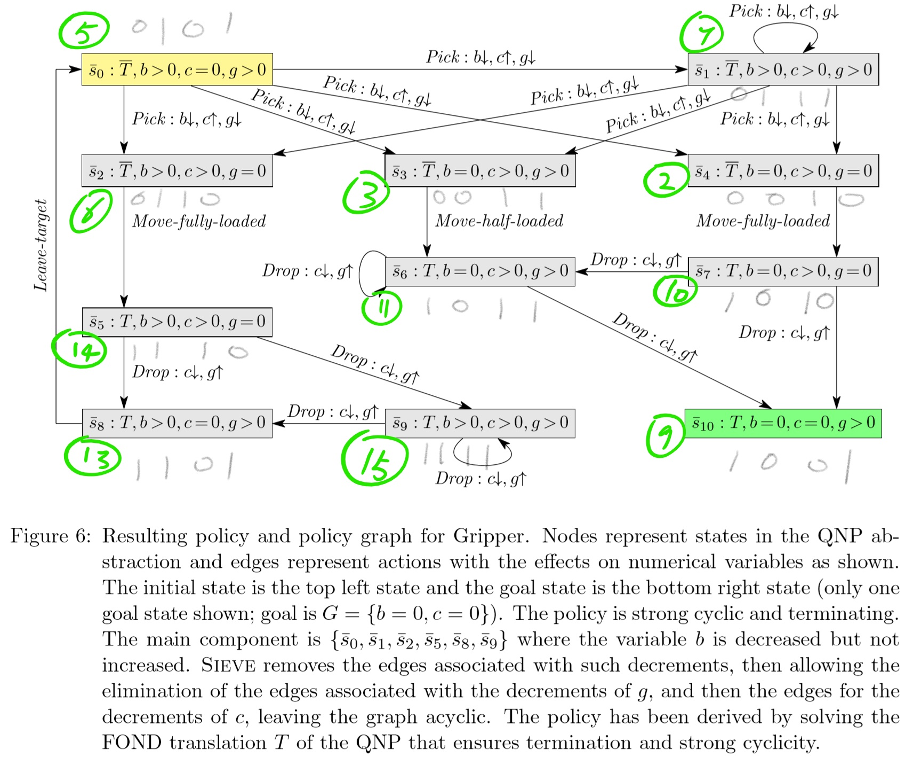


```mermaid
graph LR;
　　S5 -->|Pick1-2| S7;
　　S7 -->|Pick1| S6;
　　S7 -->|Pick1| S2;　　
　　S5 -->|Pick1-2| S6;
　　S6 -->|MoveFullyLoaded| S14;
　　S14 -->|Drop2| S13;
　　S14 -->|Drop1| S15;
　　S15 -->|Drop1| S13;
　　S13 -->|LeaveTargetRoom| S5;
　　S5 -->|b==1Pick1| S3;
　　S5 -->|b==2Pick2| S2;
　　S3 -->|MoveHalfLoaded| S11;
　　S11 -->|Drop1| S9;
　　S2 -->|MoveFullyLoaded| S10 ;
　　S10 -->|Drop2| S9;
　　S10 -->|Drop1| S11;
```


找出一个环，环上结点合并为一个节点，直至找不到环，具体操作要怎么写代码？


识别“强连通分量”，然后等效替换强连通分量

将有向图分解为强连通分量：

>深度优先遍历的应用，SCC算法，Strongly Y-connected-componentts(G)
>《算法导论》P357


```mermaid
graph LR;
　　S5_6_7_13_14_15 -->|b==1Pick1| S3;
　　S5_6_7_13_14_15 -->|b==2Pick2或者Pick1| S2;
　　S3 -->|MoveHalfLoaded| S11;
　　S11 -->|Drop1| S9;
　　S2 -->|MoveFullyLoaded| S10 ;
　　S10 -->|Drop2| S9;
　　S10 -->|Drop1| S11;
```


这个有向无环图DAG可以使用ISM技术，或者拓扑排序试试看。

# 设计deisgn


## 输入


定义一个标准文本描述FVIOGO.qnp格式标准，只要说清楚<f,v,i,g,o>即可，比如这个Block world问题


```
E,X,D#不管你用什么符号，F读取后，自动重命名存成布尔命题f1,f2,f3---1；-f1,-f2,-f3---0
n,m#建议使用v1,v2,v3,...命名。不管你用什么符号，V读取后，程序自动重命名存成v1,v2.约定v1>0,v2>0取值0；v1=0,v2=0取值1；
E,-S,-D,n>0,m>0#初始I，程序先替换为10000B=16D,只需要存一个Interger表示S_0
E,-S,D,n=0,m>0#初始G，程序先替换为10110B=22D,只需要存一个Interger表示S_G
a1:#action 1:Pick-above-x捡起来x上方积木:
　　(E,-X,-D,n>0,m>0), (-E,-X,-D,n>0,m>0);#代码中应该存成命名a1的二维矩阵？或者一维序列每个元素是元组(S16,S0)下同，写成这样
    S16(E,-X,-D,n>0,m>0), S2(-E,-X,-D,n=0,m>0) ;#(S,S)
　　S17(E,-X,-D,n>0,m=0), S1(-E,-X,-D,n>0,m=0);#(S,S)
　　S17(E,-X,-D,n>0,m=0), S3(-E,-X,-D,n=0,m=0);#(S,S)

a2：#Pick-above-y捡起来y上方积木:
　　S16(E,-X,-D,n>0,m>0), S0(-E,-X,-D,n>0,m>0);#(S,S)
　　S18(E,-X,-D,n=0,m>0),S2(-E,-X,-D,n=0,m>0);#(S,S)
　　S18(E,-X,-D,n=0,m>0) , S3(-E,-X,-D,n=0,m=0);#(S,S)
　　S16(E,-X,-D,n>0,m>0) ,S1(-E,-X,-D,n>0,m=0) ;#(S,S)

a3：#put-aside积木(不包括x，手持x放一边叫做put-x-aside是下面讨论的一个动作)放一边到桌面Table
#包括这个 Putaside-1 = h¬E,¬X,¬D,n=0;Ei to put aside (not above x or y) the block being held,
# 也包括这个 Putaside-2 = h¬E,¬X,¬D,n>0,m>0;Ei to put aside (not above x or y) the block being held,
　　S0(-E,-X,-D,n>0,m>0) ,S16(E,-X,-D,n>0,m>0);#(S,S)
　　S2(-E,-X,-D,n=0,m>0),S18(E,-X,-D,n=0,m>0);#(S,S)
　　S1(-E,-X,-D,n>0,m=0) , S17(E,-X,-D,n>0,m=0);#(S,S)
　　S3(-E,-X,-D,n=0,m=0) , S19(E,-X,-D,n=0,m=0);#(S,S)
#这里需要提一点：允许_缺省项
#比如放下石头，唯一的直观形式化表示<-E,E>,其实对应的状态有：
       S_(-E,_,_,_,_) -->|put-aside| S__(E,_,_,_,_);
#然后可以运用PC内部程序需要自动化地枚举遍历：
　　S12(-E,X,D,n>0,m>0) , S28(E,X,D,n>0,m>0);#(S,S)
　　S14(-E,X,D,n=0,m>0) ,S30(E,X,D,n=0,m>0);#(S,S)
　　S13(-E,X,D,n>0,m=0) ,S29(E,X,D,n>0,m=0);#(S,S)
　　S15(-E,X,D,n=0,m=0) ,S31(E,X,D,n=0,m=0);　#(S,S)
　　S8(-E,X,-D,n>0,m>0) ,S24(E,X,-D,n>0,m>0);#(S,S)
　　S10(-E,X,-D,n=0,m>0) ,S26(E,X,-D,n=0,m>0);#(S,S)
　　S9(-E,X,-D,n>0,m=0) ,S25(E,X,-D,n>0,m=0);#(S,S)
　　S11(-E,X,-D,n=0,m=0) ,S27(E,X,-D,n=0,m=0);#(S,S)
　　S4(-E,-X,D,n>0,m>0) , S20(E,-X,D,n>0,m>0);#(S,S)
　　S6(-E,-X,D,n=0,m>0) ,S22(E,-X,D,n=0,m>0);#(S,S)
　　S5(-E,-X,D,n>0,m=0) ,S21(E,-X,D,n>0,m=0);#(S,S)
　　S7(-E,-X,D,n=0,m=0) ,S23(E,-X,D,n=0,m=0);　#(S,S)
　　S0(-E,-X,-D,n>0,m>0),S16(E,-X,-D,n>0,m>0);#(S,S)
　　S2(-E,-X,-D,n=0,m>0) ,S18(E,-X,-D,n=0,m>0);#(S,S)
　　S1(-E,-X,-D,n>0,m=0) ,S17(E,-X,-D,n>0,m=0);#(S,S)
　　S3(-E,-X,-D,n=0,m=0) ,S19(E,-X,-D,n=0,m=0);#(S,S)
#多出来的可以通过ISM技术的“区域划分”去掉“无S0,SG无关的孤立图们”，结果就只剩下这几个真正会用的“可达状态”：
　　S0(-E,-X,-D,n>0,m>0) ,S16(E,-X,-D,n>0,m>0);#(S,S)
　　S2(-E,-X,-D,n=0,m>0) ,S18(E,-X,-D,n=0,m>0);#(S,S)
　　S1(-E,-X,-D,n>0,m=0) ,S17(E,-X,-D,n>0,m=0);#(S,S)
　　S3(-E,-X,-D,n=0,m=0) ,S19(E,-X,-D,n=0,m=0);#(S,S)

#但是如果需要隐含条件推理的“不可能状态”需要人工输入的时候排除，因为PC不知道语义，只知道语法推导没毛病就行。或者需要另外定义一行可选项，用来输入不可能状态，在矩阵处理前去掉这个“不可能状态结点”。可选项怎么弄呢？
a4：#pick-x，拿起来x石头，**关键动作**，pre一对一映射effect的行为，
       S19(E,-X,-D,n=0,m=0) , S11(E,-X,-D,n=0,m=0);#(S,S)


a5：#put-x-on-y,把手中的x放在y上方：
　　S11(E,-X,-D,n=0,m=0) , S22(E,-X,D,n=0,m>0);#(S,S)

a6   #put-x-aside,建议别定义这动作，这是一个危险（毫无意义而且多余）的动作
　　S11(E,-X,-D,n=0,m=0) , S19(E,-X,-D,n=0,m=0);#(S,S)
```


注：这里n>0,n=0可以看作单纯的文字命题，代表的意义是非零和零，同时不确定性动作不需要传递 if(n==1)走哪条路，因为这个走那条路默认让用户根据输出来自行判断，甚至n=n-1执行多少次我也不关心.

因为结果出来用户“自己判断到底什么时候到n=1临界数值标识状态”开始走非循环的那条路径（主要是因为“强联通分量的等效图实现的这个功能")

区分QNP2SAT方法中连```n,n-1,n-2,...,2,1```都要分不同状态来一以区分，每个动作前提要

>S16 -->|当n==1拿x上石n&darr| S2 ;

这个动作为例：

```
{n=1}^S16 --> S2^{n=n-1};#QNP2SAT要写成这样的，如果一个很弱智的问题，但是n比较大，复杂度增加也会很大，这是因为方法不好。
```

"分量图找到一条路径解"，在**还原强连通分量**成为“完整问题解路径”的过程中，代码还要处理一个细节，就是原始图G中分量图的输入输出要还原回来：


举例就是S5_6_7_13_14_15里，哪些是出度？哪些是入度？

分别指向谁都要**还原**到完整路径解中（或者说在原始图G中读出来这些信息，写进去分量图补充完整，输出结果就是这样一张图=Plan规划方案）


其实问题也很简单，，通过观察规律，我们发现**最后找到分量图中间解还原出来的是原始图G中子图**
，也就是说原始图G中的矩阵，我们挑出来“仅仅包含分量图中间解”提及的所有节点坐标，填出来这个结点集的横纵坐标新的邻接矩阵=子图的矩阵。


## 类图设计

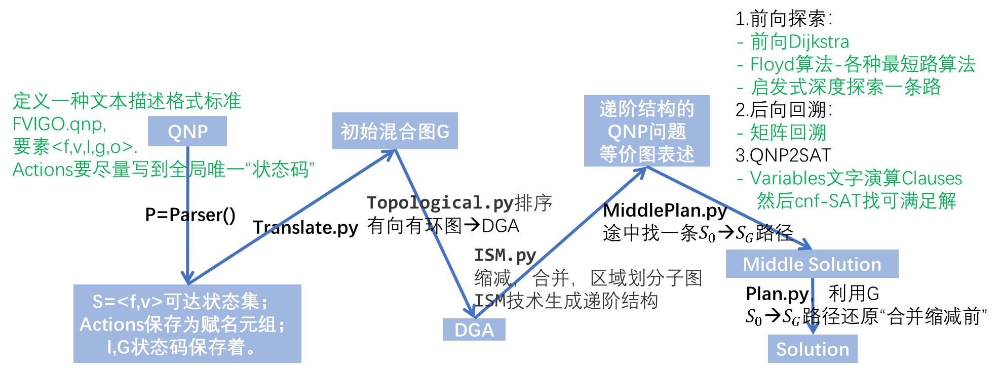

这里的“最短路只是拓扑意义的路径最短”，不等于实际的最短路，因为强连通的循环次数被我们合并缩减成一个节点，并不知道一个节点实际的多少，除非加权，每次循环(n-1)次或者(m-1)次的路径都表示出来，但是这样实现起来不容易，因为可能先序列中不确定地几次然后序列到关键节点才（n-1）次，所以说，缺点就是，这方法其实找不到绝对数值上路径最短的Plan。

好的是，有些plan只要能走通，路径消耗长度是一样的。


有找到一个例子：


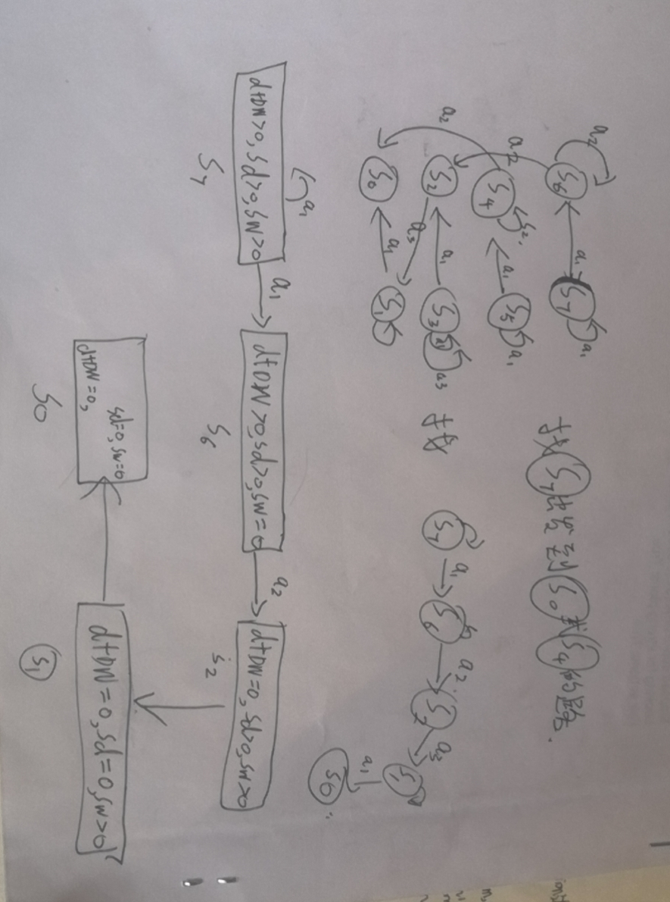


### 证明“程序终止性”
我接连用到Tarjan,ISM,dijkstra等最短路这些现有的图论算法需要证明吗？还是说只需要算法证明，不是现成算法的算法------“每一个强连通分量(环)都找一条确定性路径”那个算法。
这个算法我的想法是使用结点封装后的“强连通分量子图”，从子图的入口结点S_i出发dijkstra/Floyd找到一条抵达S_j出口结点的路。感觉，好像都是图论里面的方法......既然每个用到的现有图论算法都可终止，一个接着一个用，是不是就“一定终止”？


## 输出


- 原始问题的图G


比如像这样：


```mermaid
graph LR;
　　S16 -->|拿x上石n&darr或拿y上石m&darr| S0;
　　S0 -->|put-aside放一边| S16;
　　S16 -->|当n==1拿x上石n&darr| S2 ;
　　S2 -->|put_aside放一边| S18;
　　S18 -->|当m>1拿y上石m&darr| S2;
　　S18 -->|当m==1拿y上石m&darr| S3;
　　S16 -->|当m==1拿y上石m&darr| S1 ;
　　S1 -->|put_aside放一边| S17;
　　S17 -->|当n>1拿x上石n&darr| S1;
　　S17 -->|当n==1拿x上石n&darr| S3;
　　S3 -->|put_aside放一边| S19;
　　S19 -->|拿x积木| S11;
　　S11 -->|put_x_aside| S19;
　　S11 -->|把x放在y上| S22;
```


- 缩减之后的图DAG


比如像这样：

```mermaid
graph LR;
　　S0-16 -->|bala| S2-18 ;
　　S2-18 -->|bala| S3;
　　S0-16 -->|bala| S1-17 ;
　　S1-17 -->|bala| S3;
　　S3 -->|put_aside放一边| S11-19;
　　S11-19 -->|把x放在y上| S22;　　
```


这里，最好也自动画出来ISM递阶等级的图

- 一条缩减的路径解 图


比如像这样：

```mermaid
graph LR;
　　S0-16 -->|bala| S2-18 ;
　　S2-18 -->|bala| S3;
　　S3 -->|put_aside放一边| S11-19;
　　S11-19 -->|把x放在y上| S22;　　　　
```


- 一条没有所见的路径解 图


比如像这样：


```mermaid
graph LR;
　　S16 -->|拿x上石n&darr或拿y上石m&darr| S0;
　　S0 -->|put-aside放一边| S16;
　　S16 -->|当n==1拿x上石n&darr| S2 ;
　　S2 -->|put_aside放一边| S18;
　　S18 -->|当m>1拿y上石m&darr| S2;
　　S18 -->|当m==1拿y上石m&darr| S3;
　　S3 -->|put_aside放一边| S19;
　　S19 -->|拿x积木| S11;
　　S11 -->|put_x_aside| S19;
　　S11 -->|把x放在y上| S22;
```


-------------------------------------------------------------


```mermaid
graph LR;
　　S16 -->|拿x上石n&darr或拿y上石m&darr| S0;
　　S0 -->|put-aside放一边| S16;
　　S16 -->|当n==1拿x上石n&darr| S2 ;
　　S2 -->|put_aside放一边| S18;
　　S18 -->|当m>1拿y上石m&darr| S2;
　　S18 -->|当m==1拿y上石m&darr| S3;
　　S16 -->|当m==1拿y上石m&darr| S1 ;
　　S1 -->|put_aside放一边| S17;
　　S17 -->|当n>1拿x上石n&darr| S1;
　　S17 -->|当n==1拿x上石n&darr| S3;
　　S3 -->|put_aside放一边| S19;
　　S19 -->|拿x积木| S11;
　　S11 -->|put_x_aside| S19;
　　S11 -->|把x放在y上| S22;
```

-------------------------------------------


```mermaid
graph LR;
　　S16 -->|拿x上石n&darr或拿y上石m&darr| S0;
　　S0 -->|put-aside放一边| S16;
　　S16 -->|当n==1拿x上石n&darr| S2 ;
　　S16 -->|当m==1拿y上石m&darr| S1 ;
　　S1 -->|put_aside放一边| S17;
　　S17 -->|当n>1拿x上石n&darr| S1;
　　S17 -->|当n==1拿x上石n&darr| S3;
　　S3 -->|put_aside放一边| S19;
　　S19 -->|拿x积木| S11;
　　S11 -->|put_x_aside| S19;
　　S11 -->|把x放在y上| S22;
```

------------------------------------------


```mermaid
graph LR;
　　S16 -->|拿x上石n&darr或拿y上石m&darr| S0;
　　S0 -->|put-aside放一边| S16;
　　S16 -->|当n==1拿x上石n&darr| S2 ;
　　S2 -->|put_aside放一边| S18;
　　S18 -->|当m>1拿y上石m&darr| S2;
　　S18 -->|当m==1拿y上石m&darr| S3;
　　S3 -->|put_aside放一边| S19;
　　S19 -->|拿x积木| S11;
　　S11 -->|put_x_aside| S19;
　　S11 -->|把x放在y上| S22;
```


## 关键代码和实现demo

jupyter notebook

## demo封装Packages

python package


## 参考2-SAT问题求解算法

https://wenku.baidu.com/view/0f96c3daa58da0116c1749bc.html


https://blog.csdn.net/JarjingX/article/details/8521690


