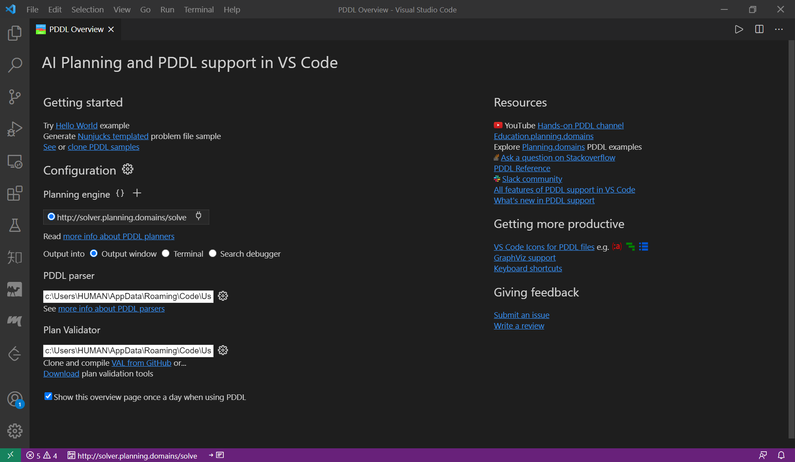

# VS Code 中 PDDL 开发环境配置

## 安装 PDDL 扩展

在 Visual Studio Code 中，推荐安装由 Jan Dolejsi 开发的 **PDDL 扩展**（可在扩展市场搜索 "PDDL" 获取，扩展 ID 为 `jan-dolejsi.pddl`）。该扩展为 PDDL 领域描述与规划问题求解提供了全面的集成开发支持。

## 主要功能

### 语法高亮

扩展自动识别 `.pddl` 文件，为领域定义、谓词、动作、对象及公式等元素提供语法高亮，提升代码可读性。

### 语法验证与错误提示

在编辑过程中实时检查 PDDL 语法错误，标记未定义谓词、类型不匹配等问题，并给出修正建议。

### 规划器集成

扩展内置对主流规划器（如 Fast Downward、LPG、Metric-FF 等）的调用支持。用户可直接在编辑器中执行规划任务，扩展自动调用规划器求解并将结果显示在输出面板中。

### 代码补全与悬停提示

提供上下文相关的代码补全功能，支持域类型、动作参数、谓词等元素的智能补全。鼠标悬停时显示类型与签名信息。

## 使用步骤

1. 在 VS Code 扩展市场搜索 "PDDL" 并安装扩展
2. 打开包含 `.pddl` 文件的目录
3. 编辑领域文件（domain.pddl）与问题文件（problem.pddl）
4. 通过命令面板（`Ctrl+Shift+P`）执行 "PDDL: Plan" 命令调用规划器进行求解
5. 在输出面板中查看规划结果

## 参考资源

- [VS Code 扩展市场 - PDDL](https://marketplace.visualstudio.com/items?itemName=jan-dolejsi.pddl)
- [PDDL 扩展源码仓库](https://github.com/jan-dolejsi/pddl-vscode)
