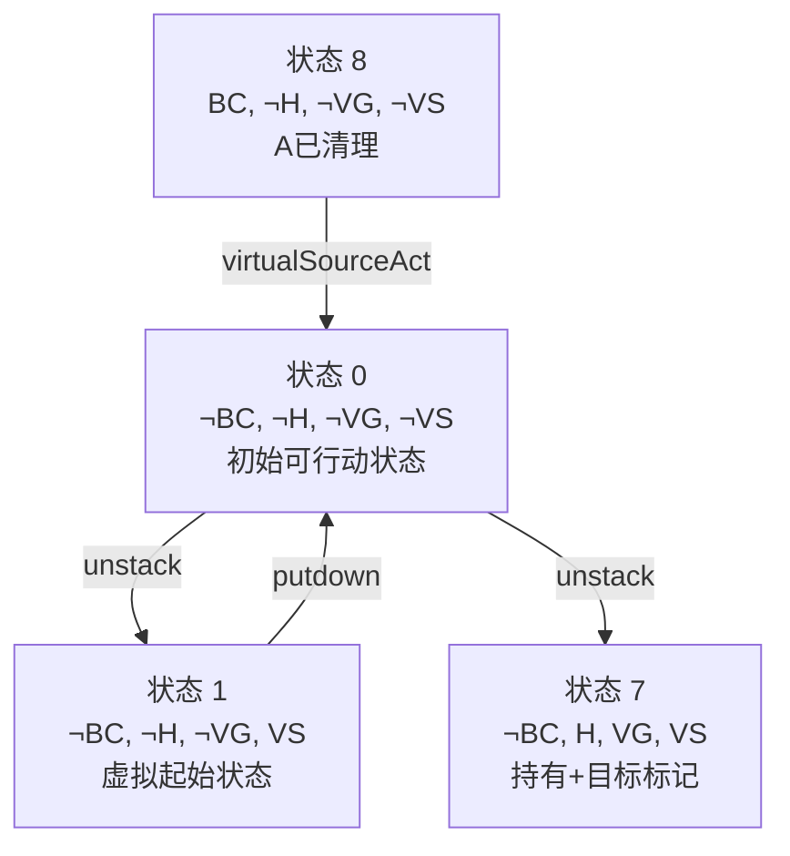
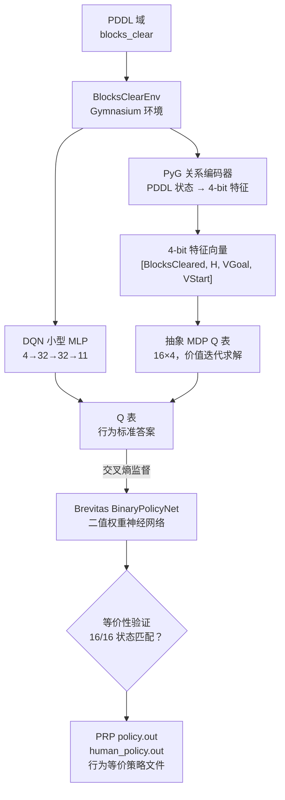

# 当二进制神经网络学会规划：从 PDDL 到 BNN 的端到端策略蒸馏

> **一条完整的技术链路：FOND 策略 → 深度强化学习 → 二进制神经网络 → 行为等价验证**

---

在人工智能规划（Automated Planning）的世界里，**PDDL**（Planning Domain Definition Language）是描述规划问题的标准语言，而 **FOND**（Fully Observable Non-Deterministic）规划则关注在动作效果不确定的情况下，如何找到一个稳健的策略。那么问题来了：**一个用二进制权重（Binary Neural Network, BNN）训练的微型神经网络，能不能完美"学会"一个符号化的规划策略？**

答案是：**可以，而且能达到 100% 的行为等价。**

本文将以 `blocks_clear` 域为例，带你走完一条从 PDDL 规划域到二进制神经网络策略蒸馏的完整技术链路。你将看到图神经网络（GNN）如何将 PDDL 状态编码为特征向量、深度 Q 网络（DQN）如何学习策略、价值迭代如何产生最优 Q 表，以及最关键的——Brevitas 二进制神经网络如何被训练为 Q 表的"行为克隆体"，最终在全部 16 个状态上实现 **16/16 的完美匹配**。

---

## 1. 一切从搬积木开始：blocks_clear 域

想象一个简单的桌面世界：有三块积木——`A`、`x`、`y`，以及一只机械臂。初始状态下，`y` 在 `x` 上面，`x` 在 `A` 上面，机械臂空空如也。我们的目标是让积木 `A` 上方没有任何遮挡（`clear A`）。

这个场景被定义在两个 PDDL 文件中，位于 `src/domains/blocks_clear/`：

**域定义** `low_blocks_clear_d.pddl` 声明了世界的基本规则：

- **谓词**：`arm_empty`（机械臂为空）、`clear ?x`（积木上方无遮挡）、`on_table ?x`（在桌面上）、`holding ?x`（机械臂正抓着）、`on ?x ?y`（堆叠关系）
- **派生谓词**：`BlocksCleared` ≡ `clear(A)`、`H` ≡ `∃x. holding(x)`——这两个派生谓词将用于特征抽象
- **动作**：
  - `putdown(?x)`：将手中抓着的积木放到桌面上
  - `unstack(?x, ?y)`：从 `?y` 上方取下 `?x`

**问题实例** `low_blocks_clear_p1.pddl` 描述了初始状态和目标：

```
初始：on_table(A), arm_empty, on(x, A), on(y, x), clear(y)
目标：clear(A)
```

这是一个典型的"倒积木塔"问题——需要先将 `y` 取下放到桌上，再将 `x` 取下放到桌上，最终露出 `A`。

---

## 2. 从 PDDL 到四维特征空间的抽象

`src/src/blocks_clear_env.py` 将这个 PDDL 世界封装为一个标准的 **Gymnasium 环境**。每次 `reset()` 将环境恢复到初始状态，每次 `step(action)` 执行一个动作并返回新的观测。

关键在于观测的设计——不是原始的 PDDL 状态集合，而是一个紧凑的 **4 维布尔向量**：

```
[BlocksCleared, H, VGoal, VStart]
```

| 特征 | 含义 | 判定条件 |
|------|------|----------|
| `BlocksCleared` | A 是否已被清理 | `clear(A)` 为真 |
| `H` | 机械臂是否正抓着某物 | `∃x. holding(x)` |
| `VGoal` | 是否已达到目标 | 等同于 `BlocksCleared` |
| `VStart` | 虚拟起始标记 | 仅 `reset()` 后第一步为真 |

这 4 个比特恰好构成 \(2^4 = 16\) 种抽象状态，形成了一个 **16 状态的马尔可夫决策过程（MDP）**。动作空间也被抽象为 4 种**抽象动作**（而非原始的 11 个 ground 动作）：

| 索引 | 抽象动作 | 含义 |
|------|----------|------|
| 0 | `virtual_source_act` | 虚拟起始动作（仅在 VStart 状态下合法） |
| 1 | `goal` | 终止（当 VGoal 满足时） |
| 2 | `putdown` | 执行任意合法的 putdown 动作 |
| 3 | `unstack` | 执行任意合法的 unstack 动作 |

这种抽象的设计非常精妙：它将底层的多个具体 STRIPS 动作折叠为语义等价的高层操作，使得策略可以专注于"该做什么"而非"怎么做"。

---

## 3. 第一个神经网络：用图神经网络编码 PDDL 状态

在进入 BNN 之前，我们需要一个将原始 PDDL 状态转化为 4 维特征向量的编码器。`src/src/feature_extractor.py` 使用 **PyTorch Geometric** 的 **GIN（Graph Isomorphism Network）** 来实现这一目标。

PDDL 状态天然具有图结构——**对象是节点，谓词既是节点特征也是边**：

- 每个对象（`A`、`x`、`y`）是一个节点，节点特征为 `[on_table, clear, holding]` 三个 0/1 值
- `on(x, y)` 关系作为从 `x` 到 `y` 的有向边
- 全局特征 `arm_empty` 和 `vstart` 在读出阶段拼接

经过三层 GIN 消息传递和全局池化，编码器将状态图映射为一个 4 维 logit 向量，通过 sigmoid 阈值化为 0/1 向量。训练数据来自可达状态枚举（`src/src/state_enumerator.py`），监督目标就是前面定义的 4 维特征向量。

这完成了从**符号化的 PDDL 世界 → 连续向量表示**的第一步桥梁。

---

## 4. 第二个神经网络：DQN 探索策略

`src/src/dqn.py` 实现了一个小型 MLP 结构的深度 Q 网络（DQN）：

```
4 → 32 → 32 → 11
```

输入是 4 维特征向量，输出是 11 个 ground 动作的 Q 值。经过 500 个 episode 的训练，DQN 学会了一条通往目标的路径。不过 DQN 的作用更多是**验证强化学习的可行性**——真正产生"标准答案"的是下一步。

---

## 5. 价值迭代：产生标准答案的 Q 表

`src/src/mdp_solver.py` 在抽象的 16×4 MDP 上运行经典的**价值迭代（Value Iteration）**算法。通过枚举所有可达的底层 PDDL 状态并"提升"到特征空间，它构建了一个精确的状态转移矩阵 \(T(s, a)\)，然后迭代求解贝尔曼最优方程。

最终产出的是一张 **16×4 的 Q 表**——这就是我们的"标准答案"（ground truth）。对每个 4-bit 状态，取 argmax Q 值就得到了该状态下的最优抽象动作：

```
(VStart ∧ ¬BlocksCleared ∧ ¬H ∧ ¬VGoal)  →  unstack    （开始拆积木）
(¬VStart ∧ ¬BlocksCleared ∧ H ∧ ¬VGoal) →  putdown    （把抓着的放下）
(VGoal)                                   →  goal       （目标达成，终止）
...
```

这个 Q 表就是 BNN 的"老师"。

---

## 6. 重头戏：二进制神经网络的行为蒸馏

现在到了整条链路最精彩的部分。`src/src/bnn.py` 使用 **Brevitas** 框架构建了一个**量化感知的二进制神经网络** `BinaryPolicyNet`：

```
架构：QuantLinear(4→32, weight=1bit) → QuantIdentity → 
      QuantLinear(32→64, weight=1bit) → QuantIdentity → 
      QuantLinear(64→32, weight=1bit) → QuantIdentity → 
      QuantLinear(32→4, weight=1bit)
```

这个网络的每一层权重都被量化为只有 **+1 和 -1** 两种取值（即 1-bit 权重），激活值同样被二值化。这与传统的 32-bit 浮点神经网络形成鲜明对比——BNN 的存储和计算开销极低，甚至可以直接在 FPGA 等硬件上高效部署。

训练过程异常简洁：输入是全部 16 个 4-bit 状态向量，监督目标是 Q 表的 argmax（交叉熵损失）。经过 600 个 epoch 的全批量梯度下降，BNN 学会了模仿 Q 表的决策。

---

## 7. 16/16 完美等价验证

`src/src/equivalence.py` 的执行流程直截了当——枚举全部 16 个二进制状态，对每个状态比较 Q 表的 argmax 和 BNN 的 argmax：

```
bits=(0,0,0,0)  q=unstack   bnn=unstack   ✓
bits=(0,0,0,1)  q=vsource   bnn=vsource   ✓
bits=(0,0,1,0)  q=goal      bnn=goal      ✓
...（全部 16 个状态）
结果：16/16 匹配！
```

在默认配置下（交叉熵损失、600 epoch、隐藏层 [32,64,32]），**8 个随机种子全部达到 100% 等价**。这意味着——从行为角度看，这个二值权重的小网络与完整的 Q 表**完全不可区分**。

---

## 8. 策略导出：从 BNN 决策表到 PRP 格式

`src/src/policy_exporter.py` 将等价验证通过的策略导出为两种 PRP 兼容格式：

- **`fond_blocks_clear_policy.out`**：使用 PRP 变量编码（`var0:1 var1:1 var2:1 var3:1`）的紧凑规则集
- **`fond_blocks_clear_human_policy.out`**：使用自然谓词语义（`not(blockscleared())/not(h())/not(vgoal())/not(vstart())`）的人类可读规则集

每个文件包含 16 条规则，每条规则对应一个 4-bit 状态组合及其执行动作。这种格式可以直接被 PRP 规划器读取和使用。

---

## 9. 策略图的可视化：fond_blocks_clear.dot

`src/policies/block_clear/fond_blocks_clear.dot` 描述了 FOND 策略的非确定性有向无环图（DAG）。将其转换为 Mermaid 格式，可以直观地看到抽象状态之间的转移关系：



> **注意**：FOND 策略图中的节点编号对应 PRP 规划器内部的策略节点 ID，而非 4-bit 状态索引。`unstack` 动作展示了 FOND 的非确定性——在同一个状态下执行 `unstack` 可能产生两种不同的结果（取决于具体 unstack 了哪块积木），策略图通过不同的后继节点来覆盖这些分支。

策略的核心循环是：
1. 从虚拟起始状态出发（节点 8 → 节点 0）
2. 在可行动状态下执行 `unstack`（节点 0 → 节点 1 或节点 7）
3. 如果需要放下积木，执行 `putdown` 回到可行动状态（节点 1 → 节点 0）
4. 循环直到目标达成

---

## 10. 人类可读策略的含义

`src/policies/block_clear/fond_blocks_clear_human_policy.out` 是整个策略的"翻译版"。它的开头是**变量映射表**：

```
var0:0  <->   blockscleared()          （A 已被清理）
var0:1  <->   not(blockscleared())     （A 尚未清理）
var1:0  <->   h()                       （机械臂正抓着积木）
var1:1  <->   not(h())                 （机械臂为空）
var2:0  <->   vgoal()                  （已达到目标状态）
var2:1  <->   not(vgoal())             （尚未达到目标）
var3:0  <->   vstart()                 （处于虚拟起始状态）
var3:1  <->   not(vstart())            （非虚拟起始状态）
```

随后是 16 条 `If holds: ... Execute: ...` 规则，每一条都精确描述了在特定特征组合下应该执行的操作。例如：

```
If holds: not(blockscleared())/not(h())/not(vgoal())/not(vstart())
Execute: 0_unstack_1_7  / SC / d=1
```

这条规则的含义是：**当 A 还未被清理、机械臂为空、未达目标、且不在虚拟起始状态时——执行 unstack 动作**。这正是策略的核心逻辑：只要还有积木挡在 A 上面且手是空的，就去拆。

而另一条典型规则：

```
If holds: not(blockscleared())/h/not(vgoal())/not(vstart())
Execute: 1_putdown_0  / SC / d=1
```

则表明：**当手里抓着积木时，把它放到桌面上**。`SC` 标记表示强循环（Strong Cyclic）规划，`d` 表示距离目标的步数估计。

---

## 11. 核心洞察：BNN 与神经网络的深层关联

这个项目最根本的意义在于揭示了一个深刻的事实：**二进制神经网络可以成为符号化规划策略的紧致、可验证、硬件友好的表示形式**。具体而言：

### 11.1 从连续性到离散性的桥梁

传统神经网络使用 32-bit 浮点权重，虽然表达能力强，但难以在资源受限的硬件上部署，也难以进行形式化验证。BNN 通过将权重二值化（+1/-1），在保持策略等效性的前提下，将模型压缩到极致。

### 11.2 "学到的"与"计算出的"之间的等价

价值迭代产生的 Q 表是纯符号计算的结果——它不涉及任何"学习"过程。而 BNN 通过监督学习"模仿"了这张 Q 表，最终在行为上与之完全一致。这意味着：

> **神经网络的学习过程可以被理解为一种"策略蒸馏"——从符号化的最优策略中提取知识，并将其编码为可微分的神经网络权重。**

### 11.3 可解释性的回归

与大型深度神经网络的黑箱特性不同，这里的 BNN 只有 16 个输入组合、4 个输出类别。我们可以**穷举验证**它在每一种可能输入下的行为——不存在"未测试的角落案例"。这种完备的验证能力，在安全攸关的规划场景中至关重要。

### 11.4 端到端的可扩展性

`main.py` 编排的 8 阶段流水线展示了整个流程的模块化设计：

```
阶段1: 构建 Gym 环境        → BlocksClearEnv
阶段2: 训练关系编码器       → PyG GIN (PDDL → 4-bit)
阶段3: 训练 DQN             → MLP (4→32→32→11)
阶段4: 求解抽象 MDP         → 价值迭代 → 16×4 Q 表
阶段5: 训练 BNN             → Brevitas BinaryPolicyNet
阶段6: 等价性验证           → 16/16 状态匹配确认
阶段7: 导出 PRP 策略文件    → policy.out / human_policy.out
阶段8: 持久化摘要           → artifacts/summary.json
```

这个流水线可以扩展到任何具有已知 ground 动作空间的 FOND 域——只需实现对应的环境类、定义抽象 MDP、运行价值迭代、训练 BNN、验证等价即可。

---

## 12. 完整流程图



---

## 13. 快速体验

如果你也想亲手验证这一流程，只需在项目根目录下运行：

```bash
# 安装依赖
uv venv
uv pip install -e .

# 运行完整流水线（约 20 秒）
uv run python main.py

# 查看生成的策略文件
cat policies/block_clear/fond_blocks_clear_human_policy.out
cat policies/block_clear/fond_blocks_clear_policy.out

# 运行测试
uv run python tests/test_pipeline.py
```

---

## 14. 小结

Policy4FONDRL2BNN 项目以一种优雅而严谨的方式，展示了**符号化 AI 规划与神经网络之间的深层联系**。在 blocks_clear 这个看似简单的域中，我们看到了：

- **PDDL** 如何形式化地描述一个规划问题
- **图神经网络** 如何将符号化的关系结构编码为连续向量
- **价值迭代** 如何计算出最优策略的"标准答案"
- **二进制神经网络** 如何被蒸馏为行为完全等价的紧凑模型
- **穷举验证** 如何为 BNN 的正确性提供无可辩驳的保证

对于那些既关注 AI 规划的理论基础、又对神经网络的可解释性与硬件部署感兴趣的研究者和工程师来说，这条技术链路提供了一个难得的研究范本——**它足够小到可以完全理解，又足够完整到可以推广到更大的领域**。

---

## 参考资料

- PRP 规划器：[PRP planner for relevant policies](https://github.com/QuMuLab/PRP_planner-for-relevant-policies)
- Brevitas 量化训练框架：[Xilinx/brevitas](https://github.com/Xilinx/brevitas)
- PyTorch Geometric：[pytorch-geometric](https://pytorch-geometric.readthedocs.io/)
- Gymnasium：[gymnasium.farama.org](https://gymnasium.farama.org/)
